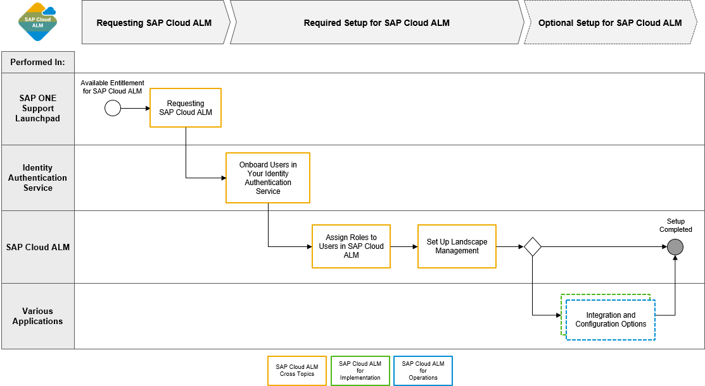

<!-- loio80b2c30a8d194ae8aff496bcff057cf0 -->

# Required Setup for SAP Cloud ALM

After you've requested SAP Cloud ALM, there are additional mandatory configuration steps that are required to set up SAP Cloud ALM for productive use.

> ### Caution:  
> Please note that the onboarding of users consists of two steps that take place in **two different applications**:
> 
> 
> <table>
> <tr>
> <th valign="top">
> 
> Step
> 
> 
> 
> </th>
> <th valign="top">
> 
> Application
> 
> 
> 
> </th>
> <th valign="top">
> 
> Purpose
> 
> 
> 
> </th>
> </tr>
> <tr>
> <td valign="top">
> 
>  [Step 1: Onboard Users in Your Identity Authentication Service](step-1-onboard-users-in-your-identity-authentication-service-f2a8a8c.md) 
> 
> 
> 
> </td>
> <td valign="top">
> 
> Identity Authentication service \(IAS\), *User Management*
> 
> 
> 
> </td>
> <td valign="top">
> 
> Create or import users in your Identity Authentication tenant
> 
> 
> 
> </td>
> </tr>
> <tr>
> <td valign="top">
> 
>  [Step 2: Assign Roles to Users in SAP Cloud ALM](step-2-assign-roles-to-users-in-sap-cloud-alm-7304b17.md) 
> 
> 
> 
> </td>
> <td valign="top">
> 
> SAP Cloud ALM, *User Management*
> 
> 
> 
> </td>
> <td valign="top">
> 
> Add users maintained in your Identity Authentication tenant to SAP Cloud ALM and assign roles to them
> 
> 
> 
> </td>
> </tr>
> </table>

<a name="loio80b2c30a8d194ae8aff496bcff057cf0__section_hjw_gmt_r5b"/>

## Procedure

On this image, you can see all mandatory setup steps for SAP Cloud ALM at a glance:

For more detailed background information and general explanations of SAP BTP concepts, refer to [Basic Platform Concepts](https://help.sap.com/viewer/df50977d8bfa4c9a8a063ddb37113c43/Cloud/en-US/38ecf59cdda64150a102cfaa62d5faab.html).

-   **[Step 1: Onboard Users in Your Identity Authentication Service](step-1-onboard-users-in-your-identity-authentication-service-f2a8a8c.md "Before you can use SAP Cloud ALM, you need to create or import users in the Identity
		Authentication tenant.")**  
Before you can use SAP Cloud ALM, you need to create or import users in the Identity Authentication tenant.
-   **[Step 2: Assign Roles to Users in SAP Cloud ALM](step-2-assign-roles-to-users-in-sap-cloud-alm-7304b17.md "After onboarding your users to the Identity Authentication tenant, you need to add them
		to SAP Cloud ALM and assign roles to them.")**  
After onboarding your users to the Identity Authentication tenant, you need to add them to SAP Cloud ALM and assign roles to them.
-   **[Step 3: Set Up Landscape Management](step-3-set-up-landscape-management-23f1c49.md "As the last step of the required setup, services and systems (technical systems) need to
		be set up in the Landscape Management app in SAP Cloud
		ALM.")**  
As the last step of the required setup, services and systems \(technical systems\) need to be set up in the *Landscape Management* app in SAP Cloud ALM.

