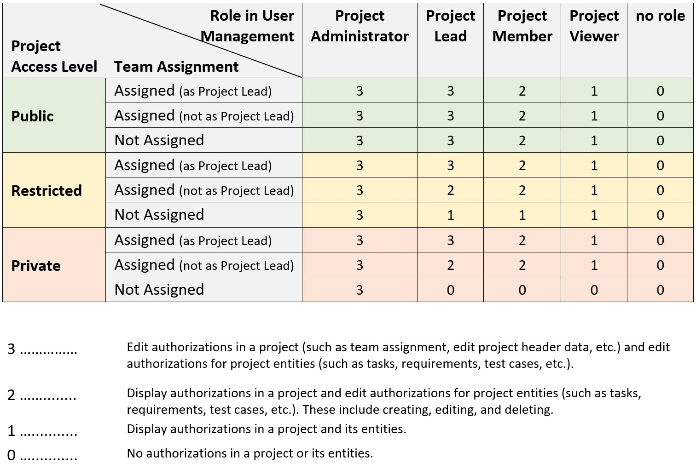

<!-- loioa2c0029b94784563898f797138068f0b -->

# Configuring Project User Permissions

Project user authorizations are defined by the project access levels, the roles users are assigned to in the user management, and the roles users are assigned to in project management.

In the *Projects and Setup* app, three access levels can be determined in a project:

-   *Public*: This project is publicly accessible by all users with project management authorizations.

-   *Restricted*: This project is restricted and only project members can make changes within the project \(display for non-project-members allowed\).

-   *Private*: This project is private and can only be accessed by project members \(display for non-project-members not allowed\).

> ### Note:  
> When a project is created, the access level is set to *Restricted* by default. This can be changed later.

Within each access level, the combination of role assignments in *User Management* and the team assignment in a project defines the project permissions for a user.

In *User Management*, the following roles are available:

-   *Project Administrator*: Manage projects, deployment plans, tasks, scopes, requirements, features, notes, test cases, defects, and tags

-   *Project Lead*: Manage projects, deployment plans, tasks, scopes, requirements, features, notes, test cases, and defects

-   *Project Member*: View projects and deployment plans. Manage tasks, scopes, requirements, features \([with restrictions](https://support.sap.com/en/alm/sap-cloud-alm/implementation/sap-cloud-alm-implementation-expert-portal/feature-delivery.html)\), notes, test cases, and defects

-   *Project Viewer*: View projects, deployment plans, tasks, scopes, requirements, features, notes, test cases, and defects

In the *Projects and Setup* app, users can be assigned to teams based on numerous roles, such as Project Lead, Analytics Expert, Business Process Expert. As soon as a user is assigned, a request is triggered in *User Management* to assign the user to the respective role collection.

Please refer to the below table to get detailed information.

The first column of the table shows the three access levels that can be determined during project setup in the *Projects and Setup* app. The second column shows the team assignment type. The rest of the columns shows the different roles a user can be assigned to in the *User Management* app. In the table legend, the different authorizations are defined that result from the user assignments and project access level settings in the different apps.

When you set the access level for a project to *Public*, user authorizations are only affected by the roles that are assigned in *User Management*. This is not the case for the access levels *Restricted* and *Private*. Here, user authorizations are both affected by the roles that are assigned in *User Management* and the team assignments made in the *Projects and Setup* app.

> ### Note:  
> Any authorization changes to projects or assignments to projects or teams only apply to the individual users after they have logged out of SAP Cloud ALM.

