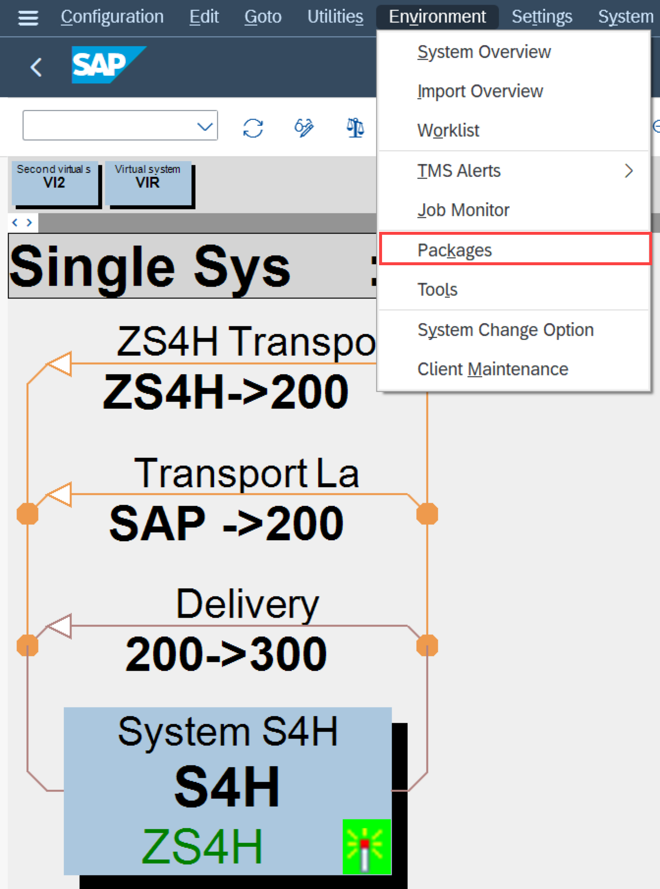

<!-- loioa9ae2e3deb5148829e2381666c27ac0a -->

# Configuring your Transport Management System \(TMS\) on the Managed Systems

Learn how to configure your Transport Management System \(TMS\) on the Managed System.

<a name="loioa9ae2e3deb5148829e2381666c27ac0a__section_ckq_zpb_ybc"/>

## Context

The *Features* app reads important information about the system landscape such as the systems included in the transport track, consolidation, and delivery transport routes from the system acting as domain controller.

In most cases, you're using the SAP Cloud ALM Deployment Management scenario to manage changes in the following system landscapes: *DEV:100* \> *QUA:200* \> *\(PRE:XXX\)* \> *PRD:300*.

For additional information, see [Change and Transport System](https://help.sap.com/docs/SAP_NETWEAVER_740/4a368c163b08418890a406d413933ba7/48c4300fca5d581ce10000000a42189c.html?locale=en-US) and [Configuring Transport Routes](https://help.sap.com/docs/SAP_NETWEAVER_740/4a368c163b08418890a406d413933ba7/44b4a1df7acc11d1899e0000e829fbbd-239.html?locale=en-US).

## Configuration of Your Test or Productive Landscape

For creating a test landscape, you can use SAP S/4HANA 2021 Cloud Private Edition, where you have clients 100, 200, and 300. You can also create the test landscape with SAP Solution Manager by creating clients 100, 200, and 300.

For this test landscape, an S/4HANA Cloud Private Edition internal system with SID S4H with clients 100, 200, 300 is used.

S4H:100 is going to represent the Development system, S4H:200 the first target system, Quality system, and S4H:300 the Production system, S4H system is also the domain controller.

For creating a productive landscape, simply use your productive systems.

First, make sure that you've set the correct parameters in the ABAP system at TMS level. For this, use transaction `/nSTMS`, then choose *Overview* \> *Systems*. Select your system and then go to the *Transport Tool* tab. You should have the following settings:

> ### Note:  
> If you would like to import into different systems and clients other than the export system and client you need to activate the Extended Transport Control, which means that `CTC`=1. For more information about this, see [Extended Transport Control](https://help.sap.com/docs/SAP_NETWEAVER_740/4a368c163b08418890a406d413933ba7/1b9dc2d6e59911d184810000e8a57770.html).

> ### Tip:  
> We strongly recommend using always client-dependent transport routes \(TMS option `CTC`\) from the very beginning. By using client-dependent transport routes, you can always enhance your landscape with additional clients. Turning on client-dependent transport routes at a later point in time is a complete landscape change that isn't supported while there are still transports open.
> 
> We strongly recommend using a transport target group as a consolidation target. By using the transport target group, you can always change your consolidation systems by just changing the systems within the consolidation target group while technically the consolidation target \(which is the consolation target group\) stays stable.
> 
> 

> ### Note:  
> If released transport requests pointing to a target system without a client, as `CTC` was not set to 1, and then you add `CTC`=1 afterwards and rebuild your transport track using clients in the feature for the transport request, the target tenant will be empty and the deployment could not be triggered.
> 
> Unfortunately, the target tenant for the transport requests released before the TMS configuration change can't be derived on SAP Cloud ALM end.
> 
> In this case, the only option is to export the list of all features from the Features Overview. In the Transports column you can select all transports and filter for them in the target system import queue.
> 
> You should only import released transport requests through `STMS`.
> 
> It is only recommended to change the TMS configuration in case the features are already deployed or transports are still modifiable.

Finally, create a package for the changes of the workbench objects. For this, in `/nSTMS`, select *Display Transport Routes*. Next, choose *Environment* \> *Packages*.

Choose *Create* and enter the required information.

In SCC4, assign the following settings to the clients for your system landscape.

Continue with the setup with the [Binding Credentials of the SAP Cloud ALM API Service Instance](binding-credentials-of-the-sap-cloud-alm-api-service-instance-6c734bd.md).

