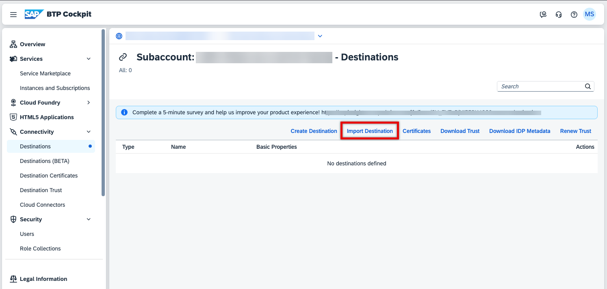
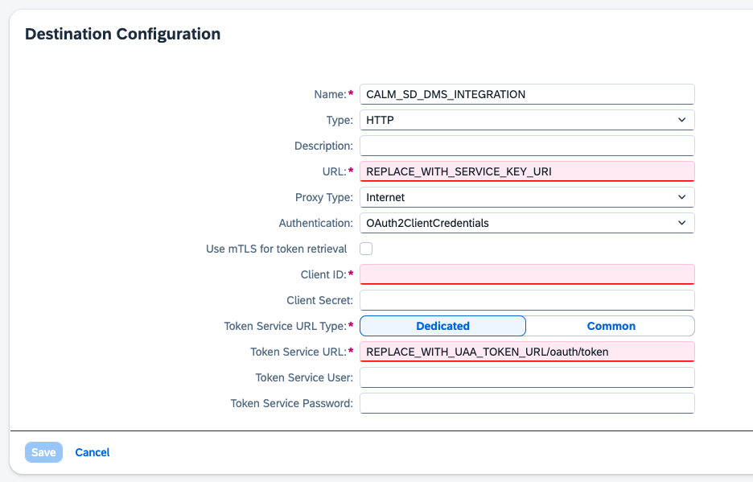
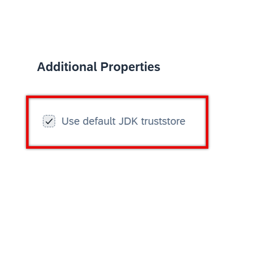
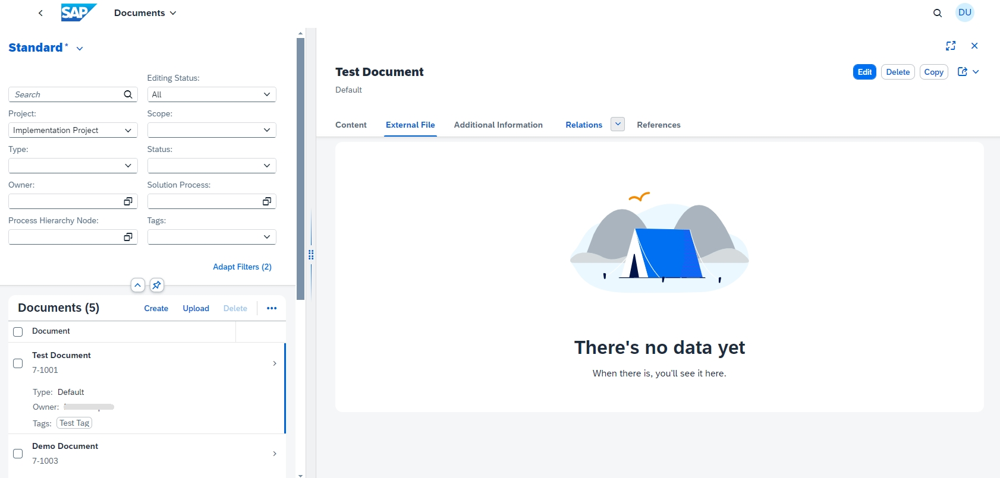

<!-- loiob788f20e1d71444eb5568b3c2153087b -->

# Connecting SAP Document Management Service

You can integrate and activate the SAP Document Management service for document storage in SAP Cloud ALM.

If you want to upload [External Files](https://help.sap.com/docs/cloud-alm/applicationhelp/external-files) in the *Documents* app of SAP Cloud ALM, first establish a connection between your SAP Document Management service \(SAP BTP DMS\) and your SAP Cloud ALM tenant.

> ### Caution:  
> Choose your DMS instance carefully beforehand. It is not possible to change it afterward. Also, the automatic creation of a repository is a one-time action that can't be reversed.
> 
> Please use only this automatically created repository. It is currently not possible to use your external repository.
> 
> For more information, see [Repository Handling](https://help.sap.com/docs/cloud-alm/setup-administration/connecting-sap-document-management-service#repository-handling).

> ### Note:  
> Make sure you have an entitlement for both the [SAP Document Management Service, Repository Option](https://help.sap.com/docs/document-management-service/sap-document-management-service/document-management-service-repository-option) and the [SAP Document Management Service, Integration Option](https://help.sap.com/docs/document-management-service/sap-document-management-service/initial-setup-for-document-management-service-integration-option?version=Cloud).
> 
> You don't need to subscribe for the [SAP Document Management Service, Repository Option](https://help.sap.com/docs/document-management-service/sap-document-management-service/document-management-service-repository-option).

<a name="loiob788f20e1d71444eb5568b3c2153087b__section_cxr_43g_jdc"/>

## Prerequisites

-   You need to provide your own SAP Document Management service instance and establish a connection to SAP Cloud ALM. You can use an existing service instance for SAP Cloud ALM use. For more information, see [Initial Setup for Document Management Service, Integration Option](https://help.sap.com/docs/document-management-service/sap-document-management-service/initial-setup-for-document-management-service-integration-option?version=Cloud).

    > ### Note:  
    > Do not use your SAP Cloud ALM global account. Use your global account for SAP BTP DMS.

-   You've done the initial setup for the SAP Document Management integration option and you've obtained all the necessary login data.

-   You're familiar with the [SAP Business Technology Platform \(SAP BTP\)](https://help.sap.com/docs/btp?version=Cloud) cockpit, and the  [Account Administration](https://help.sap.com/docs/btp/sap-business-technology-platform/account-administration?version=Cloud) concepts.

-   You've got the role *Subaccount Administrator* for your SAP BTP subaccount of SAP Cloud ALM and SAP Document Management service.

<a name="loiob788f20e1d71444eb5568b3c2153087b__section_p1b_kqg_jdc"/>

## Procedure 

1.  Set up the HTTP destination.

    In the SAP BTP subaccount, **where your SAP Cloud ALM is hosted**, create a destination targeted at your SAP BTP DMS instance.

    -   You can download and use the following template to import a new SAP BTP destination: [https://help.sap.com/doc/sapcloudalmsolutiondocumentationdmsintegration](https://help.sap.com/doc/sapcloudalmsolutiondocumentationdmsintegration): It is a zipped TXT file that you need to unzip and import.

        

        It already contains some prefilled values for the destination settings for your convenience.

        After the import, you will see this screen:

        

        Please do not deselect the *Use default JDK truststore*:

        

    -   Afterward, proceed with the manual steps described below.

    > ### Note:  
    > If you have several SAP Cloud ALM tenants, you can onboard a separate SAP BTP DMS for each tenant. You can also reuse the same SAP BTP DMS for all your tenants. SAP Cloud ALM automatically creates a unique repository for each SAP Cloud ALM tenant to store the external files.
    > 
    > Here's what we recommend:
    > 
    > -   Only connect your productively used SAP BTP DMS instance to your productive SAP Cloud ALM instance.
    > 
    > -   Don't connect your productive SAP BTP DMS environment to SAP Cloud ALM instances for non-productive usage.
    > 
    > -   Only connect the demo and sandbox SAP BTP DMS instances to your test SAP Cloud ALM instance.

    1.  Go to your SAP BTP subaccount and choose *Connectivity* \> *Destinations* \> *Create Destination*.

    2.  Under *Destination Configuration*, fill in the required fields. Enter the following information:

        -   *Name*: `CALM_SD_DMS_INTEGRATION`

        -   *Type*: HTTP

        -   *Description* \(optional\): enter a description for your reference

        -   *URL*: value of `uri` from the service key of your SAP BTP DMS instance

        -   *Proxy Type*: Internet

        -   *Authentication*: `OAuth2ClientCredentials`

        -   *Client ID*: value of `clientid` \(`uaa` section\) from the service key of your SAP BTP DMS instance

        -   *Client Secret*: value of `clientsecret` \(`uaa` section\) from the service key of your SAP BTP DMS instance

        -   *Token Service URL*: value of `URL` \(`uaa` section\) from the service key of your SAP BTP DMS instance

            Append `/oauth/token` to the `URL` retrieved from the service key.

    You can choose *Check Connection*. When the check is successful, you can ignore the `401: Unauthorized` warning.

2.  When you've established the connection, it can take up to 5 minutes before you can start uploading external files with the *Documents* app in SAP Cloud ALM. Choose *External File* on the object page of a document, and you see the following:

    

You can now start to use the [External Files](https://help.sap.com/docs/cloud-alm/applicationhelp/external-files) feature in the *Documents* app of SAP Cloud ALM.

<a name="loiob788f20e1d71444eb5568b3c2153087b__section_fl1_gv1_qdc"/>

## Repository Handling

During the initial communication between SAP Cloud ALM and the SAP Document Management service, the *Documents* app automatically creates a new repository in the SAP Document Management service.

> ### Caution:  
> Do **not** change this repository or any other repositories created by the *Documents* app. As previously stated, the choice of a repository is irreversible. You might lose your documents if you decide to change the repository at a later point in time. The property external ID of a repository is always identical with the tenant ID of the tenant that created it. With this information, the user can always trace which repository belongs to which tenant.
> 
> Changes done in the repository directly aren't reflected in SAP Cloud ALM and they disrupt the integration.

The repository has the following characteristics, which you can't change:

-   External ID: SAP Cloud ALM tenant UUID \(unique\)

    The external ID is always identical to the tenant ID of the tenant that created it. With this information, you can always trace which repository belongs to which tenant.

-   Name: SAP Cloud ALM for Implementation
-   Description: Internal Repository for SAP Cloud ALM for Implementation
-   Encryption: enabled
-   Virus scan: enabled
-   Versioning: enabled
-   Thumbnail: disabled \(not possible with enabled encryption\)

Files in this repository are automatically managed as follows:

-   All files are stored in the `ROOT` folder. No new folders are created.
-   For the file name \(`cmis:name`\), a UUID from the SAP database table is used.
-   The `cmis:name` only contains a technical ID. The real file name is stored in the property `cmis:contentStreamFileName`.
-   SAP Cloud ALM doesn't replicate any additional metadata, for example, the extension field `sap:owner` and other extension fields aren't filled.
-   With every upload of an external file, SAP Cloud ALM creates a new major version in SAP BTP DMS: 1.0, 2.0, … X.0. No minor versions are created.
-   The maximum size for files to upload is 10 MB.
-   Which file types are supported, you can see in [External Files](https://help.sap.com/docs/cloud-alm/applicationhelp/external-files).

<a name="loiob788f20e1d71444eb5568b3c2153087b__section_tml_34s_pdc"/>

## Disabling the External File Feature

There's no process to discontinue the external file feature in the *Documents* app.

If you no longer want to use the feature, you need to manually delete the external files in the *Documents* app.

After that, you can delete the SAP BTP DMS repository and disconnect the configured destination.

