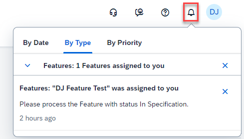

<!-- loiofbd50d1ee4694e4eb1e94e387a28ec7f -->

# Enabling Email Channel for In-App Notifications

You can enable the email channel for the in-app notifications that are sent by SAP Cloud ALM.

In detail, the following in-app notifications are created:

****

<table>
<tr>
<th valign="top">

App

</th>
<th valign="top">

Cause of the notification

</th>
</tr>
<tr>
<td valign="top">

*Projects* 

</td>
<td valign="top">

New Roadmap content updates exist.

</td>
</tr>
<tr>
<td valign="top" rowspan="2">

*Tasks* 

</td>
<td valign="top">

A task was assigned to you.

</td>
</tr>
<tr>
<td valign="top">

A new comment exists on a task assigned to you.

</td>
</tr>
<tr>
<td valign="top" rowspan="2">

*Requirements* 

</td>
<td valign="top">

A requirement was assigned to you.

</td>
</tr>
<tr>
<td valign="top">

A new comment exists on a requirement assigned to you.

</td>
</tr>
<tr>
<td valign="top" rowspan="2">

*Defects* 

</td>
<td valign="top">

A defect was assigned to you.

</td>
</tr>
<tr>
<td valign="top">

A new comment exists on a defect assigned to you.

</td>
</tr>
<tr>
<td valign="top">

*Features* 

</td>
<td valign="top">

A feature was assigned to you.

</td>
</tr>
<tr>
<td valign="top">

*User Management* 

</td>
<td valign="top">

Open authorization requests exist.

</td>
</tr>
</table>

> ### Note:  
> In SAP Cloud ALM for operations, email notifications are sent based on events using [Intelligent Event Processing](https://help.sap.com/docs/cloud-alm/applicationhelp/intelligent-event-processing) and [Notification Management](https://help.sap.com/docs/cloud-alm/applicationhelp/notification-management). These notifications are not the subject of this topic because they are not displayed in the in-app notifications.

<a name="loiofbd50d1ee4694e4eb1e94e387a28ec7f__section_ghz_fv4_fzb"/>

## Prerequisites

To enable email notifications, you need to maintain a destination in your SAP BTP subaccount for SAP Cloud ALM, as described in [Configuring an SMTP Mail Destination](https://help.sap.com/docs/build-work-zone-standard-edition/sap-build-work-zone-standard-edition/configuring-smtp-mail-destination).

> ### Caution:  
> For the configuration mentioned above you have to operate your own email server which is under your responsibility. Also, your email solution must support basic authentication.

<a name="loiofbd50d1ee4694e4eb1e94e387a28ec7f__section_fjv_nv4_fzb"/>

## Procedure

When the prerequisites are met, every user can configure for themselves in their profile settings in SAP Cloud ALM if and for which of these notification types they want to receive emails.

> ### Note:  
> Only those types are available for configuration that are relevant for the user, meaning where they've received notifications in the past. If you were never assigned to a task, for example, you won’t see that specific notification type in your settings and cannot check the email flag for this notification type. Whereas the in-app notification is active by default, the email works on an opt-in basis.

After the configuration, the user will receive the corresponding email notifications. The email contains all relevant information for the notification, and a link to the corresponding application in SAP Cloud ALM to process the issue.

