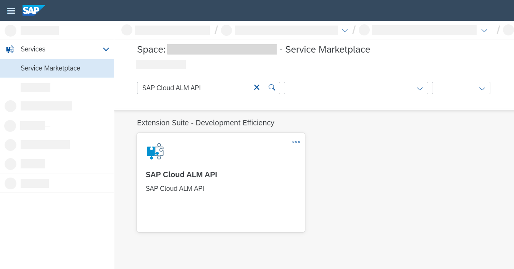
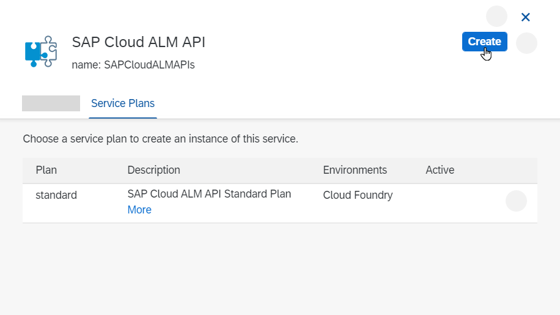
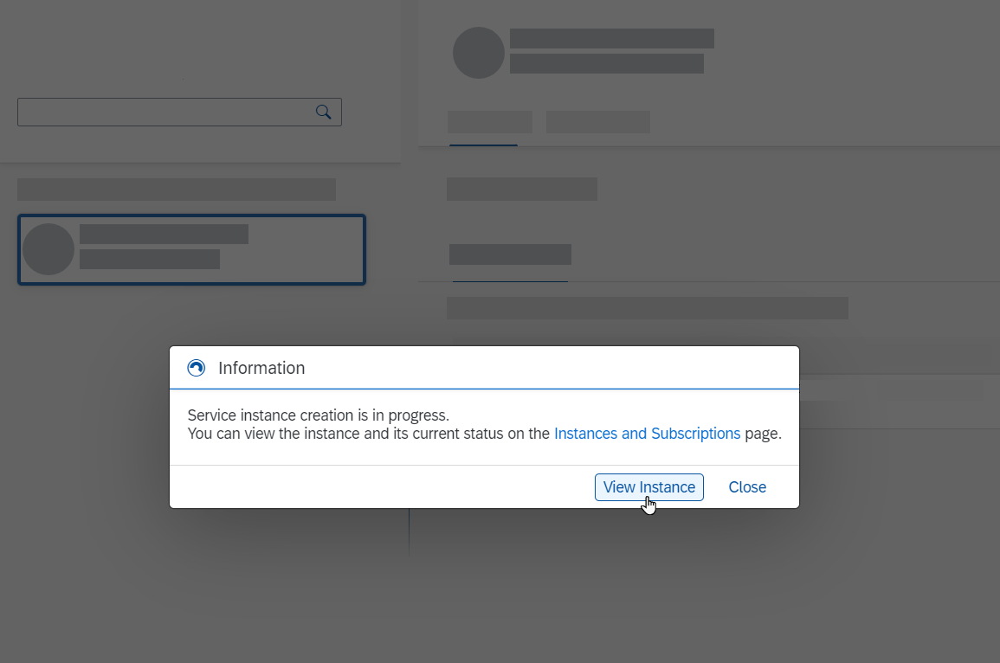

<!-- loio704b5dc854f549888a238f94015e1eac -->

<link rel="stylesheet" type="text/css" href="../css/sap-icons.css"/>

# Enabling SAP Cloud ALM API

To use the monitoring capabilities of some SAP Cloud ALM applications, you need to enable the monitoring of your cloud services. To do this, retrieve your service key as described below, and connect your SAP cloud services to your SAP Cloud ALM instance.

<a name="loio704b5dc854f549888a238f94015e1eac__section_wpy_rnj_jmb"/>

## Prerequisites

-   Your user has the role *Global Account Administrator* in the global account that was created when you requested SAP Cloud ALM, and is a member of the subaccount containing your SAP Cloud ALM subscription.

    You can verify that you have the necessary authorization by navigating to your global account and checking whether the *Security* menu is available. If you don't have this role, the global account administrator can assign it to you by following the steps described in [Add Members to Your Global Account](https://help.sap.com/viewer/65de2977205c403bbc107264b8eccf4b/LATEST/en-US/4a0491330a164f5a873fa630c7f45f06.html).

-   Your user has the role *Org Manager* in your Cloud Foundry organization.

    You can verify that you have the necessary authorization by navigating to your subaccount and choosing *Cloud Foundry* \> *Org Members*. If you don't have this role, the org manager can assign it to you by following the steps described in [Add Org Members Using the Cockpit](https://help.sap.com/viewer/65de2977205c403bbc107264b8eccf4b/LATEST/en-US/a4eeaf179ee646b99558f27c0bae7b3e.html). If *Cloud Foundry* is not available in the menu, you can enable it by following the steps described in [Create Orgs](https://help.sap.com/viewer/65de2977205c403bbc107264b8eccf4b/LATEST/en-US/a9b1f5445a17427f844a5a43ac53d378.html).

> ### Note:  
> If you've requested SAP Cloud ALM, your user has automatically received the required authorizations during the creation of the global account and the subaccount.

<a name="loio704b5dc854f549888a238f94015e1eac__section_lv5_hh4_xlb"/>

## Procedure

Carry out the following steps to enable SAP Cloud ALM API:

### Create a Space

1.  Open the [SAP BTP cockpit](https://cockpit.eu10.hana.ondemand.com/cockpit).

2.  Select the global account that contains your SAP Cloud ALM entitlement, which was created when you requested SAP Cloud ALM.

3.  Under *Subaccounts*, select the subaccount that contains your SAP Cloud ALM subscription.

4.  Choose *Cloud Foundry* \> *Spaces*.

5.  Choose *Create Space*.

      

6.  Enter a space name, such as ***sap\_cloud\_alm\_space***, and select the roles that you want to assign to your user for this space. To perform the following steps, your user needs at least *Space Developer* authorizations.

7.  Choose *Create*.

### Configure Entitlements

An entitlement is your right to provision and consume a resource.

1.  Choose *Entitlements* \> *Configure Entitlements*.

      

2.  Choose *Add Service Plans*.

3.  Add the required service plan as follows:

    1.  Select the entitlement *SAP Cloud ALM API*.

    2.  Under *Available Plans*, check the option *standard*.

    3.  Choose *Add 1 Service Plan*.

          

4.  Choose *Save*.

> ### Note:  
> You can increase your global quota, that is, your maximum allowed consumption of this service plan, in the control center.

### Create a New Instance

1.  Choose *Cloud Foundry* \> *Spaces*.

2.  Select the created space.

3.  Choose *Services* \> *Service Marketplace*.

4.  Select the service *SAP Cloud ALM API*.

      

5.  Choose *Create*.

      

6.  Under *Basic Info*, provide the following details:

    -   *Service*: ***SAP Cloud ALM API***

    -   *Plan*: ***standard***

    -   *Instance Name*: Enter a meaningful instance name, such as ***sap\_cloud\_alm\_api***.

          

7.  Choose *Create*.

8.  When your instance has been created, choose *View Instance* in the message popup.

      

### Create a Service Key

Service keys allow you to configure an external application so that it can connect to an SAP Cloud ALM API service instance.

1.  Choose  \(Actions\) and select *Create Service Key*.

      

2.  Enter a name for your service key, such as ***sap\_cloud\_alm\_key***.

3.  Choose *Create*.

4.  Next to your newly created service key, choose  \(Actions\) and select *View*.

      

5.  You can now see your service key in JSON format.

    It includes the following information:

    -   The application base URL \(`endpoints.Api`\)

    -   The `clientid` and `clientsecret` to access the service

    -   The oAuth URL to generate the oAuth token \(`uaa.url`\)

> ### Caution:  
> Outside of the SAP BTP cockpit, service keys must be stored securely. If you need a service key, create the service key directly in the SAP BTP cockpit, and access it from there whenever you need it.

<a name="loio704b5dc854f549888a238f94015e1eac__section_vn5_q42_3mb"/>

## Further Steps

You can use the created service key to set up the connection between the destination service of your managed system and individual SAP Cloud ALM applications as described in the *Details* sections in [Expert Portal](https://support.sap.com/en/alm/sap-cloud-alm/operations/expert-portal.html) on SAP Support Portal.

**Related Information**  

[Managing Spaces](http://help.sap.com/viewer/65de2977205c403bbc107264b8eccf4b/LATEST/en-US/5209d55d8dd84228897112b0655d999b.html)

[Entitlements and Quotas](https://help.sap.com/viewer/3504ec5ef16548778610c7e89cc0eac3/Cloud/en-US/00aa2c23479d42568b18882b1ca90d79.html)

