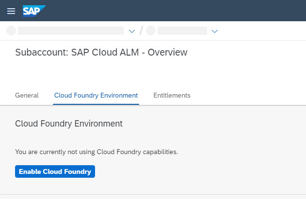
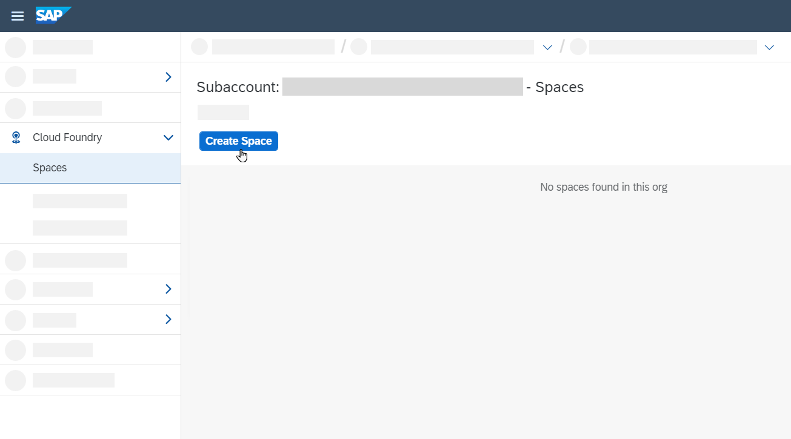
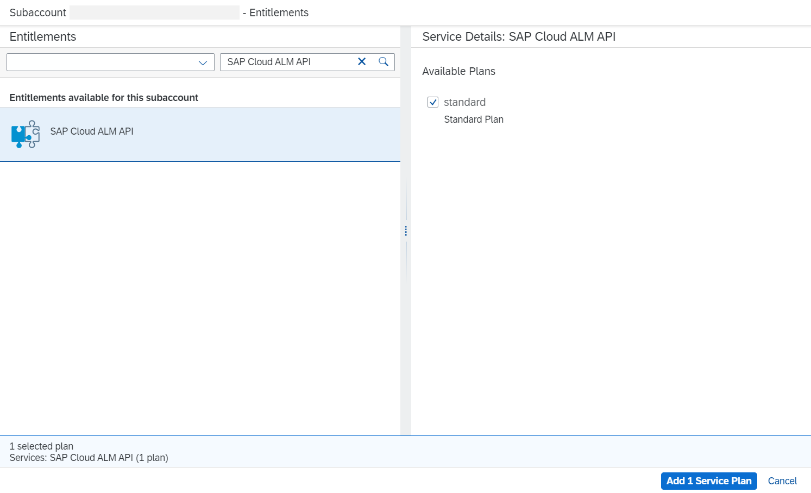
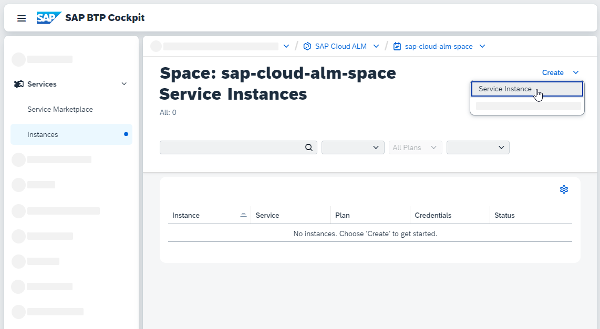
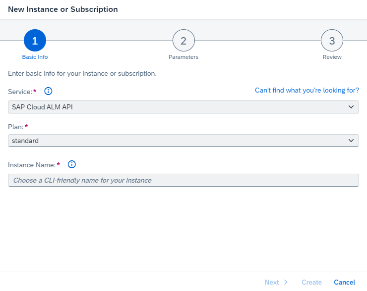
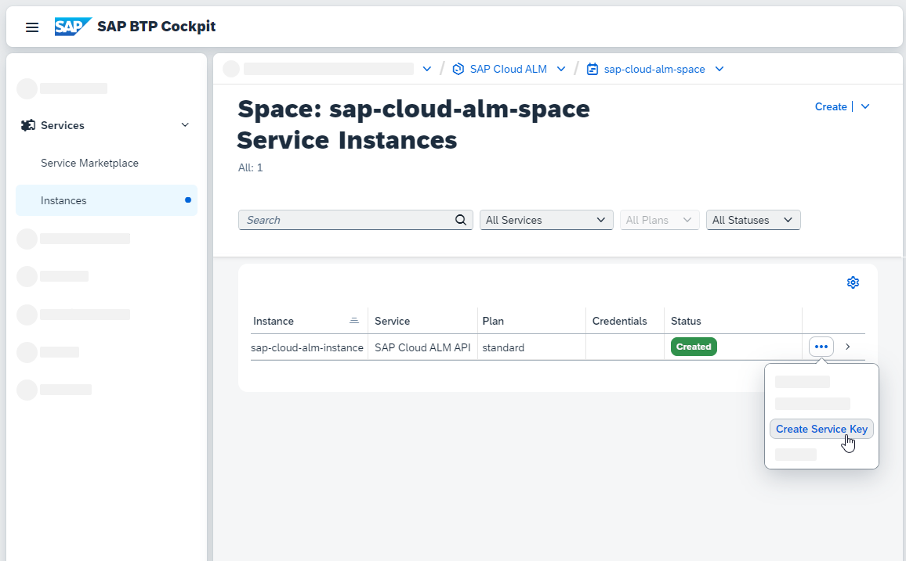
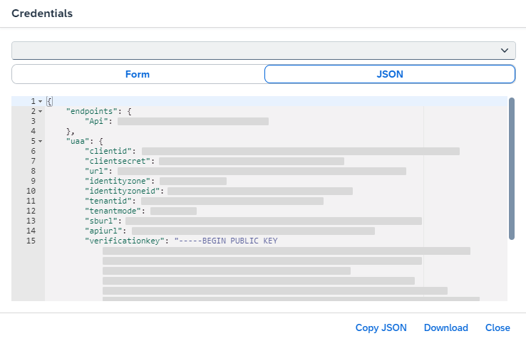

<!-- loio7d4c180c79744eb09c228007304a3a57 -->

<link rel="stylesheet" type="text/css" href="../css/sap-icons.css"/>

# Enabling SAP Cloud ALM API in Cloud Foundry

To set up the connection between SAP Cloud ALM and your managed systems and/or services, you need to create a service key from the SAP Cloud ALM API instance.

> ### Note:  
> This document describes how to retrieve service credentials in the Cloud Foundry environment. This is no longer the recommended approach.
> 
> If Cloud Foundry isn't enabled and no space exists in your SAP Cloud ALM subaccount \(as shown in the image below\), or if they exist but are not in use in the context of SAP Cloud ALM APIs, please follow [Enabling SAP Cloud ALM API](enabling-sap-cloud-alm-api-704b5dc.md) instead.
> 
> 


<a name="loio7d4c180c79744eb09c228007304a3a57__section_wpy_rnj_jmb"/>

## Prerequisites

-   Your SAP Cloud ALM tenant was provisioned before October 16, 2023.

    If your SAP Cloud ALM tenant was provisioned after this date, service credentials were generated automatically and you can skip these steps. For more information, refer to [Retrieving Service Credentials](retrieving-service-credentials-448f9f1.md).

-   Your user has the role *Global Account Administrator* in the global account that was created when you requested SAP Cloud ALM, and is a member of the subaccount containing your SAP Cloud ALM subscription.

    If you don't have this role, the global account administrator can assign it to you by following the steps described in [Add Members to Your Global Account](https://help.sap.com/viewer/65de2977205c403bbc107264b8eccf4b/LATEST/en-US/4a0491330a164f5a873fa630c7f45f06.html).

-   Your user has the role *Org Manager* in your Cloud Foundry environment.

    If you don't have this role, the org manager can assign it to you by following the steps described in [Add Org Members Using the Cockpit](https://help.sap.com/viewer/65de2977205c403bbc107264b8eccf4b/LATEST/en-US/a4eeaf179ee646b99558f27c0bae7b3e.html).


<a name="loio7d4c180c79744eb09c228007304a3a57__section_zsq_czb_zyb"/>

## Procedure


### Create a Space

In Cloud Foundry, your subaccount can further be subdivided by spaces, which is where application development, deployment, and maintenance take place.

1.  Open the [SAP BTP cockpit](https://cockpit.btp.cloud.sap/).

2.  Select the global account that contains your SAP Cloud ALM entitlement and go to the subaccount that contains your SAP Cloud ALM subscription.

3.  Choose *Cloud Foundry* \> *Spaces*.

4.  If you already have a space with the required authorizations, proceed to the **Configure Entitlements** section.

    If you don't have a space yet, choose *Create Space*.

    

5.  Enter a space name and select the roles that you want to assign to your user for this space. To perform the following steps, your user needs at least *Space Developer* authorizations.

6.  Choose *Create*.


### Configure Entitlements

An entitlement is your right to provision and consume a resource. In other words, entitlements are the service plans that you're entitled to use.

1.  In the menu, go to *Entitlements*.

2.  Choose *Edit* \> *Add Service Plans*.

3.  Add the required service plan as follows:

    1.  Select the entitlement *SAP Cloud ALM API*.

    2.  Under *Available Plans*, check the option *standard*.

    3.  Choose *Add 1 Service Plan*.

        


4.  Save.


### Create or Update an Instance

To consume the selected service plan, you need to create a service instance in your Cloud Foundry space.

1.  Choose *Cloud Foundry* \> *Spaces*.

2.  Select your space.

3.  Choose *Services* \> *Instances*.

4.  If you already have an instance, choose <span class="SAP-icons-V5"></span> \(Actions\) and select *Update*. Then proceed to step 6.

    If you don't have an instance yet, click on the *Create* dropdown and select *Service Instance*.

    

5.  Under *Basic Info*, provide the following details:

    -   *Service*: `SAP Cloud ALM API`

    -   *Plan*: `standard`

    -   *Instance Name*: Enter a meaningful instance name.

        The length of the instance name must not exceed 32 characters. Use only alphanumeric characters, numbers from 0 to 9, periods, and hyphens. Instead of spaces, use underscores.

        


6.  Choose *Next*.

7.  \(Optional\) If you want to use the service key to access APIs, you need to add the appropriate scopes to it. You can find an overview of all available scopes and their use cases under [API Scopes](https://help.sap.com/viewer/fe419bfabbdc46dfbddbfd78b21483d5/latest/en-US/a111fd3cdaef4f36801eb43fff23ef20.html "") :arrow_upper_right:.

    To add the scopes, insert the following JSON and replace the relevant parameters with your instance name and the required scopes, respectively.

    ```
    {
        "xs-security": {
            "xsappname": "<your-instance-name>",
            "authorities": [
    			"<Required Scope 1>",
    			"<Required Scope 2>"
            ]
        }
    }
    
    ```

8.  Choose *Create*.


### Create a Service Key

With service keys, you can manually generate service credentials to enable external applications to connect to an SAP Cloud ALM API service instance.

1.  When your instance has been created, choose <span class="SAP-icons-V5"></span> \(Actions\) next to it and select *Create Service Key*.

    

2.  Enter a name for your service key.

    > ### Caution:  
    > To avoid conflicts with automatically created service keys, use a name that differs from the naming convention `<system ID>_<client number>_<system number>`.

3.  Choose *Create*.

4.  Next to your newly created service key, choose <span class="SAP-icons-V5"></span> \(Actions\) and select *View*.


<a name="loio7d4c180c79744eb09c228007304a3a57__section_olm_s5b_kbc"/>

## Result and Next Steps

You can now see your service credentials in JSON format. They include the following information:

-   The application base URL \(`endpoints.Api`\)

-   The `clientid` and `clientsecret` to access the service

-   The oAuth URL to generate the oAuth token \(`uaa.url`\)




> ### Caution:  
> Outside of the SAP BTP cockpit, service credentials must be stored securely. If you need new ones, create them directly in the SAP BTP cockpit, and access it from there whenever you need it.

**Related Information**  


[Managing Spaces](http://help.sap.com/viewer/65de2977205c403bbc107264b8eccf4b/LATEST/en-US/5209d55d8dd84228897112b0655d999b.html)

[Entitlements and Quotas](https://help.sap.com/viewer/3504ec5ef16548778610c7e89cc0eac3/Cloud/en-US/00aa2c23479d42568b18882b1ca90d79.html)

[API Guide for SAP Cloud ALM](https://help.sap.com/docs/cloud-alm/apis/about)

