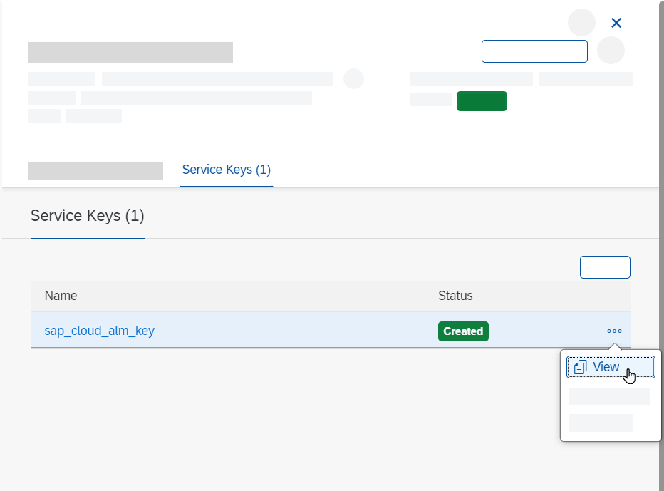

<!-- loio7d4c180c79744eb09c228007304a3a57 -->

<link rel="stylesheet" type="text/css" href="../css/sap-icons.css"/>

# Enabling SAP Cloud ALM API in Cloud Foundry

To set up the connection between your managed systems and individual SAP Cloud ALM applications, you need to retrieve a service key or service binding and connect your SAP services and systems to your SAP Cloud ALM instance.

Depending on the provisioning date of your SAP Cloud ALM tenant, some or all steps described in this document have already been automatically completed for you:


<table>
<tr>
<th valign="top">

Provisioning Date


</th>
<th valign="top">

Actions


</th>
</tr>
<tr>
<td valign="top">

On or after 2023-10-16


</td>
<td valign="top">

A service binding was generated automatically.

You can skip these steps altogether and access your service binding in the SAP BTP cockpit or in the *Landscape Management* app, as described in [Managing Your Service Key](managing-your-service-key-87b7851.md).


</td>
</tr>
<tr>
<td valign="top">

Between 2023-06-12 and 2023-10-16


</td>
<td valign="top">

A service key that can be used to connect managed services to SAP Cloud ALM for Operations monitoring applications was generated automatically.

You can access it in the SAP BTP cockpit or in the *Landscape Management* app, as described in [Managing Your Service Key](managing-your-service-key-87b7851.md).

You only need to carry out these steps if you want to set up transport management, but you can reuse the created space and no longer have to configure your entitlements.


</td>
</tr>
<tr>
<td valign="top">

Before 2023-06-12


</td>
<td valign="top">

No service key or service binding has been created as part of the initial provisioning. To create one manually, carry out the steps listed below.


</td>
</tr>
</table>

> ### Note:  
> This document describes how to retrieve a service key in the Cloud Foundry environment. This is no longer the recommended approach.
> 
> If a Cloud Foundry organization and space don't exist in your SAP Cloud ALM subaccount \(as shown in the image below\), or if they exist but are not in use in the context of SAP Cloud ALM APIs, please follow [Enabling SAP Cloud ALM API](enabling-sap-cloud-alm-api-704b5dc.md) instead.
> 
> 


<a name="loio7d4c180c79744eb09c228007304a3a57__section_wpy_rnj_jmb"/>

## Prerequisites

-   Your user has the role *Global Account Administrator* in the global account that was created when you requested SAP Cloud ALM, and is a member of the subaccount containing your SAP Cloud ALM subscription.

    If you don't have this role, the global account administrator can assign it to you by following the steps described in [Add Members to Your Global Account](https://help.sap.com/viewer/65de2977205c403bbc107264b8eccf4b/LATEST/en-US/4a0491330a164f5a873fa630c7f45f06.html).

-   Your user has the role *Org Manager* in your Cloud Foundry organization.

    If you don't have this role, the org manager can assign it to you by following the steps described in [Add Org Members Using the Cockpit](https://help.sap.com/viewer/65de2977205c403bbc107264b8eccf4b/LATEST/en-US/a4eeaf179ee646b99558f27c0bae7b3e.html).


<a name="loio7d4c180c79744eb09c228007304a3a57__section_zsq_czb_zyb"/>

## Procedure


### Create a Space

1.  Open the SAP BTP cockpit.

2.  Select the global account that contains your SAP Cloud ALM entitlement, which was created when you requested SAP Cloud ALM.

3.  Under *Subaccounts*, select the subaccount that contains your SAP Cloud ALM subscription.

4.  Choose *Cloud Foundry* \> *Spaces*.

5.  If you already have a space with the required authorizations, proceed to the **Configure Entitlements** section.

    If you don't have a space yet, choose *Create Space*.

    

6.  Enter a space name and select the roles that you want to assign to your user for this space. To perform the following steps, your user needs at least *Space Developer* authorizations.

7.  Choose *Create*.


### Configure Entitlements

An entitlement is your right to provision and consume a resource.

1.  Choose *Entitlements* \> *Configure Entitlements*.

    

2.  Choose *Add Service Plans*.

3.  Add the required service plan as follows:

    1.  Select the entitlement *SAP Cloud ALM API*.

    2.  Under *Available Plans*, check the option *standard*.

    3.  Choose *Add 1 Service Plan*.

        


4.  Save.


### Maintain an Instance

1.  Choose *Cloud Foundry* \> *Spaces*.

2.  Select your space.

3.  Choose *Services* \> *Instances*.

4.  If you already have an instance, choose <span class="SAP-icons"></span> \(Actions\) and select *Update*. Then proceed to step 6.

    If you don't have an instance yet, click on the *Create* dropdown and select *Service Instance*.

    

5.  Under *Basic Info*, provide the following details:

    -   *Service*: `SAP Cloud ALM API`

    -   *Plan*: `standard`

    -   *Instance Name*: Enter a meaningful instance name.

        The length of the instance name must not exceed 32 characters. Use only alphanumeric characters, numbers from 0 to 9, periods, and hyphens. Instead of spaces, use underscores.

        


6.  Choose *Next*.

7.  Paste the following JSON code into the text editor:

    ```
    {
        "xs-security": {
            "xsappname": "<your-instance-name>",
            "authorities": [
    			"$XSMASTERAPPNAME.imp-cdm-feature-display-ui",
    			"$XSMASTERAPPNAME.imp-cdm-feature-manage-ui"
            ]
        }
    }
    
    ```

8.  Replace `<your-instance-name>` with your instance name.

9.  Choose *Create*.

10. When your instance has been created or updated, click on it.


### Create a Service Key

Service keys allow you to configure an external application so that it can connect to an SAP Cloud ALM API service instance.

1.  In the top right corner, choose <span class="SAP-icons"></span> \(Actions\) and select *Create Service Key*.

    

2.  Enter a name for your service key.

3.  Choose *Create*.

4.  Next to your newly created service key, choose <span class="SAP-icons"></span> \(Actions\) and select *View*.

    

5.  You can now see your service key in JSON format.

    It includes the following information:

    -   The application base URL \(`endpoints.Api`\)

    -   The `clientid` and `clientsecret` to access the service

    -   The oAuth URL to generate the oAuth token \(`uaa.url`\)


    


> ### Caution:  
> Outside of the SAP BTP cockpit, service keys must be stored securely. If you need a service key, create the service key directly in the SAP BTP cockpit, and access it from there whenever you need it.

**Related Information**  


[Managing Spaces](http://help.sap.com/viewer/65de2977205c403bbc107264b8eccf4b/LATEST/en-US/5209d55d8dd84228897112b0655d999b.html)

[Entitlements and Quotas](https://help.sap.com/viewer/3504ec5ef16548778610c7e89cc0eac3/Cloud/en-US/00aa2c23479d42568b18882b1ca90d79.html)

[API Guide for SAP Cloud ALM](https://help.sap.com/docs/cloud-alm/apis/about)

