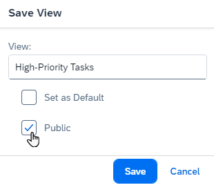

<!-- loioec0293ff2ffa44aa9aa7f38ea494a893 -->

# Enabling the Creation of Public Views

In many SAP Cloud ALM apps, users can save common filter and table settings as personal views. To allow them to also create public views, which can be used by all users within your SAP Cloud ALM tenant, you need to create a custom role collection and assign it to them.

> ### Note:  
> Currently, public views can only be created in SAP Cloud ALM for implementation and SAP Business Transformation Center apps.

<a name="loioec0293ff2ffa44aa9aa7f38ea494a893__section_xw4_b23_wbc"/>

## Prerequisites

Your user has the role *Subaccount Administrator* in the subaccount that contains your SAP Cloud ALM subscription.

<a name="loioec0293ff2ffa44aa9aa7f38ea494a893__section_vx1_h23_wbc"/>

## Procedure

1.  Open the [SAP BTP cockpit](https://cockpit.btp.cloud.sap/).

2.  In the global account that contains your SAP Cloud ALM entitlement, open the subaccount that contains your SAP Cloud ALM subscription.

3.  Choose *Security* \> *Role Collections*.

4.  Choose *Create*.

5.  Enter a unique name and description for the role collection, for example:

    -   *Name*: `Public View Editor`

    -   *Description*: `Create and edit public views, which are shared with all users in your SAP Cloud ALM tenant.`

6.  Open the created role collection and choose *Edit*.

7.  Under *Roles*, select the role `FlexPublicViewEditor` and choose *Add*.

    

8.  Under *Users*, select all users who should be able to create public views.

    For more information about the adding users to the role collection, see [Assigning Role Collections in the SAP BTP Cockpit](../01_required_setup/step-2-assign-roles-to-users-in-sap-cloud-alm-7304b17.md#loio7304b17f3aac4ebaa24c5c6a3a8e236e__section_amj_f5z_tqb).

9.  Save the role collection.

<a name="loioec0293ff2ffa44aa9aa7f38ea494a893__section_ssw_dg3_wbc"/>

## Result and Next Steps

All users with this role collection can now create public views, as described in [Creating Public Views](https://help.sap.com/docs/ui5-flexibility-for-key-users/ui5-flexibility-for-key-users/creating-public-views).

If you want to assign this role collection to further users, follow [Step 2: Assign Roles to Users in SAP Cloud ALM](../01_required_setup/step-2-assign-roles-to-users-in-sap-cloud-alm-7304b17.md).

**Related Information**  

[SAP Business Technology Platform – Working with Role Collections](https://help.sap.com/docs/btp/sap-business-technology-platform/working-with-role-collections)

