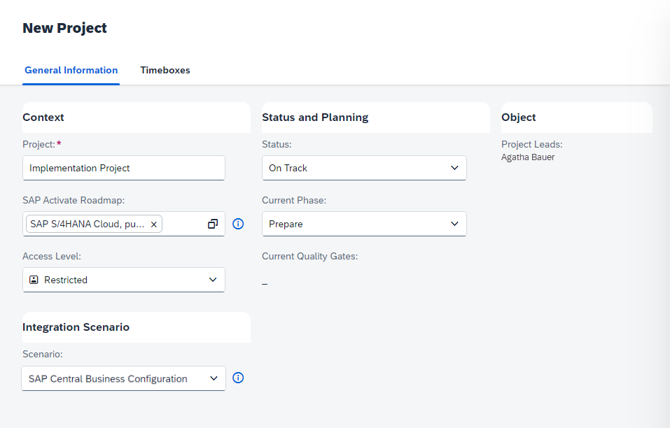

<!-- loioe21f91558ab145378c0c6de77516cec6 -->

<link rel="stylesheet" type="text/css" href="../css/sap-icons.css"/>

# Integrating SAP Central Business Configuration

By integrating SAP Central Business Configuration with SAP Cloud ALM, you can import roadmap content into the *Tasks* app. This helps you understand the order in which the tasks need to be executed, and allows you to navigate directly to SAP Central Business Configuration as needed.

SAP Central Business Configuration is a solution that supports the configuration of SAP S/4HANA Cloud.

While an SAP Cloud ALM project applies the SAP Activate methodology to provide end-to-end procedural guidance on how to start and execute an implementation project, an SAP Central Business Configuration project shows the project and configuration activities focused on your specific business configuration.

To use SAP Central Business Configuration in SAP Cloud ALM, you first need to carry out the following setup procedure.

<a name="loioe21f91558ab145378c0c6de77516cec6__section_qyd_jx4_nnb"/>

## Procedure

### Technical Setup

Create an endpoint for SAP Central Business Configuration by carrying out the following steps:

1.  In the SAP Cloud ALM launchpad, open the *Landscape Management* app.

2.  In the  *Select a Scope* dialog, make sure that the service *SAP Central Business Configuration* is selected.

3.  On the *Services & Systems* page, use the search or filter options to find your SAP Central Business Configuration service and open it.

4.  Under *Endpoints*, choose *Create Endpoint Automatically*.

Please note that you can maintain only one service and one endpoint for the integration of SAP Central Business Configuration.

### Integration During Project Creation

After you've completed the technical setup, select SAP Central Business Configuration as an integration scenario by carrying out the following steps:

1.  In the SAP Cloud ALM launchpad, open the *Projects and Setup* app.

2.  To create a new project, choose *Create*.

3.  Enter the following parameters:

    -   *Project*: Enter a project name of your choosing, such as `Implementation Project`.

    -   *SAP Activate Roadmap*: Select the desired roadmap.

    -   *Access Level*: Select an access level for your project.

    -   *Status*: Select `On Track`.

    -   *Current Phase*: Select `Prepare`.

    -   *Scenario*: Select `SAP Central Business Configuration`.

        

4.  Select the SAP Central Business Configuration project or projects that you want to connect to SAP Cloud ALM.

    You can unassign SAP Central Business Configuration projects from the corresponding SAP Cloud ALM project at any time.

5.  Save the new project.

After saving the new project, you can navigate to your SAP Central Business Configuration project with the direct links in the table or via the respective tasks.

**Related Information**  

[SAP Central Business Configuration – SAP Help Portal](https://help.sap.com/docs/CENTRAL_BUSINESS_CONFIGURATION)

[Integrating SAP Cloud ALM with SAP Central Business Configuration – SAP Community](https://blogs.sap.com/2021/01/29/integrating-sap-cloud-alm-with-sap-central-business-configuration/)

