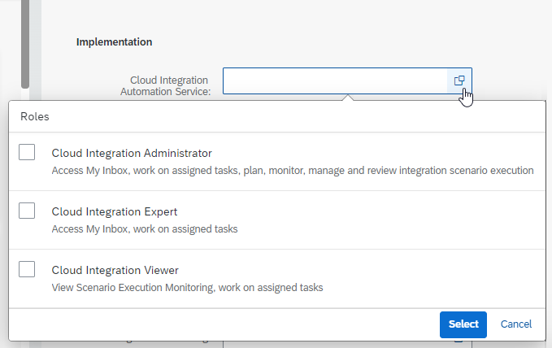

<!-- loioeafcc2fc483f4d6896dfeff7a6d26a84 -->

<link rel="stylesheet" type="text/css" href="../css/sap-icons.css"/>

# Integrating the Cloud Integration Automation Service

The Cloud Integration Automation service provides you with a guided workflow to integrate SAP cloud solutions to on-premise and other SAP cloud solutions. The guided workflow contains instructions for manual and automated tasks to enable an easy and quick integration configuration setup.

<a name="loioeafcc2fc483f4d6896dfeff7a6d26a84__section_ub4_zxm_y5b"/>

## Prerequisites

-   You have a subscription to the Cloud Integration Automation service.

    When your SAP Cloud ALM tenant was requested, a subscription to the Cloud Integration Automation service was automatically created in your SAP Cloud ALM subaccount.

-   Your user in SAP Cloud ALM has the role *Global Administrator* or *User Administrator*.

<a name="loioeafcc2fc483f4d6896dfeff7a6d26a84__section_yjz_zxm_y5b"/>

## Procedure

1.  From the SAP Cloud ALM launchpad, open the *User Management* app.

2.  To go to the user list, choose  \(Users\).

3.  Select the user to whom you want to assign the Cloud Integration Automation roles.

4.  Choose *Edit*.

5.  Under *Cloud Integration Automation Service*, select one of the following roles:

    -   *Cloud Integration Administrator*

    -   *Cloud Integration Expert*

    -   *Cloud Integration Viewer*

    

    For more information on the Cloud Integration Automation roles, their corresponding role collections, and their respective privileges, refer to the section **Pre-Defined Roles** in [Assigning Roles to the Users](https://help.sap.com/docs/Cloud%20Integration%20Automation%20Service/edfa11059aca499892c08168fd68d97d/9ad530a11cc7412e897552078908807d.html?locale=en-US).

    For more information on role assignments in SAP Cloud ALM, refer to [Step 2: Assign Roles to Users in SAP Cloud ALM](../01_required_setup/step-2-assign-roles-to-users-in-sap-cloud-alm-7304b17.md).

6.  Save your settings.

7.  Follow the steps described in the blog post [Start a scenario integration workflow with Cloud Integration Automation Service on Cloud Foundry \(BTP\)](https://blogs.sap.com/2021/08/24/start-a-scenario-integration-workflow-with-could-integration-automation-service-on-cloud-foundry-btp/).

8.  To configure the integration, access the application and execute the Cloud Integration Automation procedure.

**Related Information**  

[Cloud Integration Automation Service – SAP Help Portal](https://help.sap.com/docs/cloud-integration-automation)

