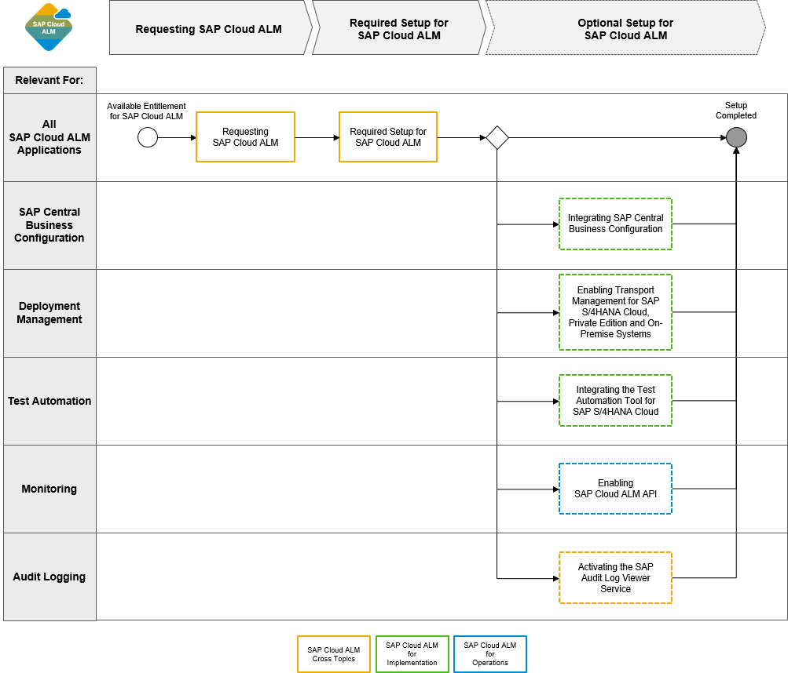

<!-- loioa4ea6faaf3bb44679325f4a008945dba -->

# Integration and Configuration Options

There are additional integration and configuration options that help you take advantage of the full set of capabilities of SAP Cloud ALM.

On this image, you can see all optional setup steps for SAP Cloud ALM at a glance.

-   [Requesting SAP Cloud ALM](../requesting-sap-cloud-alm-2ba35e6.md)
-   [Required Setup for SAP Cloud ALM](../01_required_setup/required-setup-for-sap-cloud-alm-80b2c30.md)
-   [Integrating SAP Central Business Configuration](integrating-sap-central-business-configuration-e21f915.md)
-   [Enabling Transport Management for SAP S/4HANA Cloud, Private Edition and On-Premise Systems](enabling-transport-management-for-sap-s-4hana-cloud-private-edition-and-on-premise-system-5aa24f0.md)
-   [Integrating the Test Automation Tool for SAP S/4HANA Cloud](integrating-the-test-automation-tool-for-sap-s-4hana-cloud-0712254.md)
-   [Enabling SAP Cloud ALM API](enabling-sap-cloud-alm-api-704b5dc.md)
-   [Activating the SAP Audit Log Viewer Service](activating-the-sap-audit-log-viewer-service-59fd2a4.md)

-   **[Integrating SAP Central Business Configuration](integrating-sap-central-business-configuration-e21f915.md "By integrating SAP Central Business Configuration with SAP Cloud ALM, you can import
		roadmap content into the Tasks app. This helps you understand the
		order in which the tasks need to be executed, and allows you to navigate directly to SAP
		Central Business Configuration as needed.")**  
By integrating SAP Central Business Configuration with SAP Cloud ALM, you can import roadmap content into the *Tasks* app. This helps you understand the order in which the tasks need to be executed, and allows you to navigate directly to SAP Central Business Configuration as needed.
-   **[Enabling Transport Management for SAP S/4HANA Cloud, Private Edition and On-Premise Systems](enabling-transport-management-for-sap-s-4hana-cloud-private-edition-and-on-premise-system-5aa24f0.md "By enabling the transport management for SAP S/4HANA Cloud, private edition, and SAP
		NetWeaver Application Server for ABAP on-premise, you can orchestrate the deployment of
		transport requests through your implementation landscape.")**  
By enabling the transport management for SAP S/4HANA Cloud, private edition, and SAP NetWeaver Application Server for ABAP on-premise, you can orchestrate the deployment of transport requests through your implementation landscape.
-   **[Integrating the Test Automation Tool for SAP S/4HANA Cloud](integrating-the-test-automation-tool-for-sap-s-4hana-cloud-0712254.md "In addition to manual test cases, you can also integrate automated test cases from the
		test automation tool for SAP S/4HANA Cloud for use in the Test
			Preparation and Test Execution apps.")**  
In addition to manual test cases, you can also integrate automated test cases from the test automation tool for SAP S/4HANA Cloud for use in the *Test Preparation* and *Test Execution* apps.
-   **[Enabling SAP Cloud ALM API](enabling-sap-cloud-alm-api-704b5dc.md "To use the monitoring capabilities of some SAP Cloud ALM applications, you need to
		enable the monitoring of your cloud services. To do this, retrieve your service key as
		described below, and connect your SAP cloud services to your SAP Cloud ALM
		instance.")**  
To use the monitoring capabilities of some SAP Cloud ALM applications, you need to enable the monitoring of your cloud services. To do this, retrieve your service key as described below, and connect your SAP cloud services to your SAP Cloud ALM instance.
-   **[Activating the SAP Audit Log Viewer Service](activating-the-sap-audit-log-viewer-service-59fd2a4.md "By integrating the SAP Audit Log Viewer service, you can view the audit logs for your
		Cloud Foundry account, produced by SAP applications and services you’ve subscribed
		to.")**  
By integrating the SAP Audit Log Viewer service, you can view the audit logs for your Cloud Foundry account, produced by SAP applications and services you’ve subscribed to.

