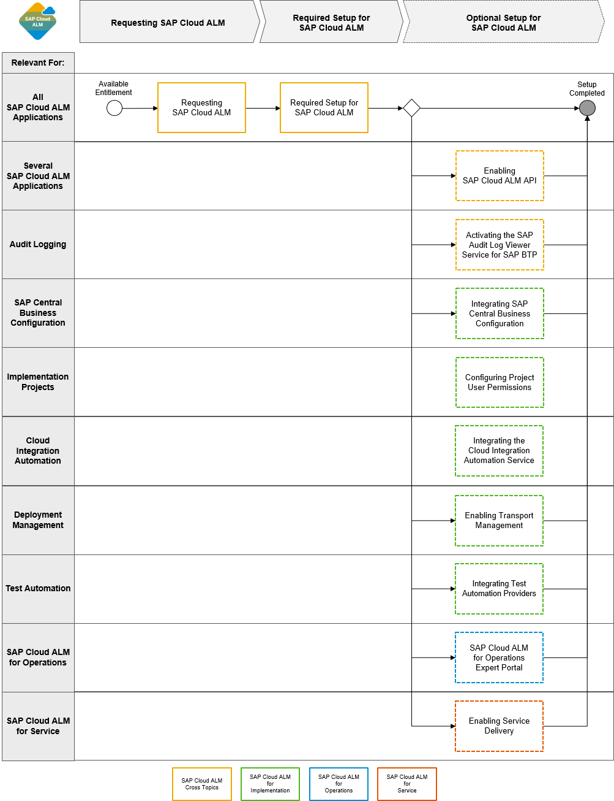

<!-- loioa4ea6faaf3bb44679325f4a008945dba -->

# Integration and Configuration Options

There are additional integration and configuration options that help you take advantage of the full set of capabilities of SAP Cloud ALM.

On this interactive image, you can see all optional setup steps for SAP Cloud ALM at a glance. For detailed guidance, click on the respective sections.

-   **[Retrieving Service Credentials](retrieving-service-credentials-448f9f1.md "The connection between individual SAP Cloud applications and your managed systems and/or
		services is handled via an SAP Cloud ALM API service instance in
		your SAP Cloud ALM subaccount.")**  
The connection between individual SAP Cloud applications and your managed systems and/or services is handled via an SAP Cloud ALM API service instance in your SAP Cloud ALM subaccount.
-   **[Activating the SAP Audit Log Viewer Service](activating-the-sap-audit-log-viewer-service-59fd2a4.md "By integrating the SAP Audit Log Viewer service for SAP BTP, you can view
		the audit logs for your SAP Cloud ALM tenant to track the end user activity in SAP Cloud
		ALM. Audit logs represent security-relevant chronological records that provide documentary
		evidence for an event or activity.")**  
By integrating the SAP Audit Log Viewer service for SAP BTP, you can view the audit logs for your SAP Cloud ALM tenant to track the end user activity in SAP Cloud ALM. Audit logs represent security-relevant chronological records that provide documentary evidence for an event or activity.
-   **[Enabling Email Channel for In-App Notifications](enabling-email-channel-for-in-app-notifications-fbd50d1.md "You can enable the email channel for the in-app notifications that are sent by SAP Cloud
		ALM.")**  
You can enable the email channel for the in-app notifications that are sent by SAP Cloud ALM.
-   **[Enabling the Creation of Public Views](enabling-the-creation-of-public-views-ec0293f.md "In many SAP Cloud ALM apps, users can save common filter and table settings as personal
		views. To allow them to also create public views, which can be used by all users within your
		SAP Cloud ALM tenant, you need to create a custom role collection and assign it to
		them.")**  
In many SAP Cloud ALM apps, users can save common filter and table settings as personal views. To allow them to also create public views, which can be used by all users within your SAP Cloud ALM tenant, you need to create a custom role collection and assign it to them.
-   **[Integrating SAP Central Business Configuration](integrating-sap-central-business-configuration-e21f915.md "By integrating SAP Central Business Configuration with SAP Cloud ALM, you can import
		roadmap content into the Tasks app. This helps you understand the
		order in which the tasks need to be executed, and lets you navigate directly to SAP Central
		Business Configuration as needed.")**  
By integrating SAP Central Business Configuration with SAP Cloud ALM, you can import roadmap content into the *Tasks* app. This helps you understand the order in which the tasks need to be executed, and lets you navigate directly to SAP Central Business Configuration as needed.
-   **[Configuring Project User Permissions](configuring-project-user-permissions-a2c0029.md "Project user authorizations are defined by the project access levels, the roles users
		are assigned to in the user management, and the roles users are assigned to in project
		management.")**  
Project user authorizations are defined by the project access levels, the roles users are assigned to in the user management, and the roles users are assigned to in project management.
-   **[Integrating the Cloud Integration Automation Service](integrating-the-cloud-integration-automation-service-eafcc2f.md "The Cloud Integration Automation service (CIAS) provides you with a
		guided workflow to integrate SAP cloud solutions to on-premise and other SAP cloud
		solutions. The guided workflow contains instructions for manual and automated tasks to
		enable an easy and quick integration configuration setup.")**  
The Cloud Integration Automation service \(CIAS\) provides you with a guided workflow to integrate SAP cloud solutions to on-premise and other SAP cloud solutions. The guided workflow contains instructions for manual and automated tasks to enable an easy and quick integration configuration setup.
-   **[Enabling Transport Management](enabling-transport-management-4b74b16.md "Learn how to enable the transport management of different transport environments for SAP
		Cloud ALM. ")**  
Learn how to enable the transport management of different transport environments for SAP Cloud ALM.
-   **[Integrating Test Automation Providers](integrating-test-automation-providers-82b04bb.md "In addition to manual testing, which is performed directly in SAP Cloud ALM, you can
		also integrate SAP and third-party test automation providers with SAP Cloud ALM.")**  
In addition to manual testing, which is performed directly in SAP Cloud ALM, you can also integrate SAP and third-party test automation providers with SAP Cloud ALM.
-   **[Activating Access Control](activating-access-control-4d0162b.md "With access control, you can give users authorization for accessing specific landscape
		objects (services, systems, and business services).")**  
With access control, you can give users authorization for accessing specific landscape objects \(services, systems, and business services\).
-   **[Enabling Service Delivery](enabling-service-delivery-a1b2494.md "An SAP service is usually delivered as part of a service contract like SAP MaxAttention,
		SAP ActiveAttention or SAP Enterprise Support.")**  
An SAP service is usually delivered as part of a service contract like SAP MaxAttention, SAP ActiveAttention or SAP Enterprise Support.

