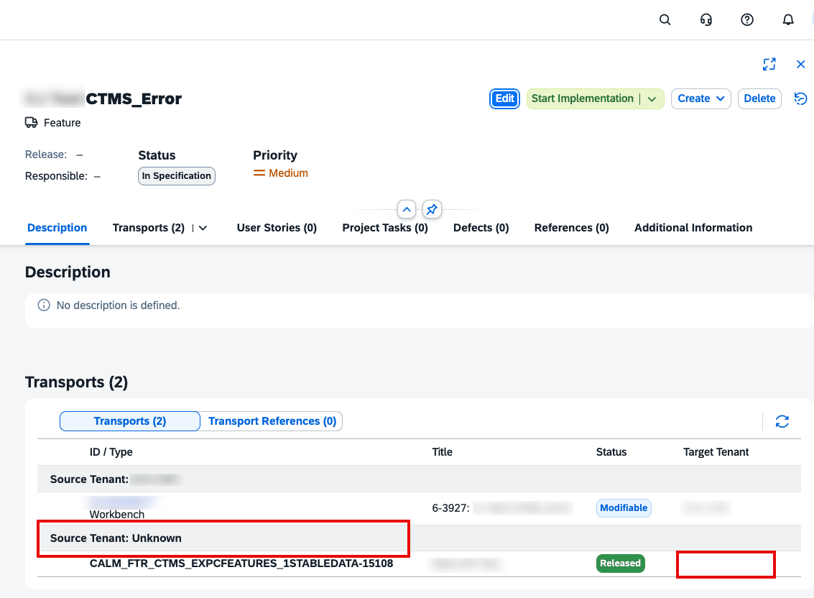

<!-- loio240043adc3d240629d37eea7ca8348ff -->

# Issues and Solutions

Here, you find answers to common issues for SAP Cloud Transport Management service.

<a name="loio240043adc3d240629d37eea7ca8348ff__section_ckw_dr1_vgc"/>

## No target tenant is displayed or source tenant is unknown

If your *Source* is unknown, this means that the source node has been deleted or renamed.

If your *Target* isn't displayed, this means that your target tenant has been deleted or renamed.

To solve this, unassign the transport and create a new transport in your CTMS node.

<a name="loio240043adc3d240629d37eea7ca8348ff__section_p4z_2ll_bdc"/>

## Transports aren't shown

If transports don't show up when you want to assign them to a feature, choose the *Refresh* button in the *Transports* section. If transports are still not shown, it indicates that the *Features* app hasn't received data from CTMS. In such a case, you get an error message explaining that there's a connection issue. To solve this, check if the CTMS destination is working. For more information, see [SAP Cloud Transport Management Service](sap-cloud-transport-management-service-8b4af2f.md).

Also, make sure that you meet the CTMS service landscape requirements. For both the export and upload use case, you need a dummy development system. For more information, see [SAP Cloud Transport Management Service Landscape Requirements](sap-cloud-transport-management-service-landscape-requirements-235276e.md).

<a name="loio240043adc3d240629d37eea7ca8348ff__section_wtx_b3b_y2c"/>

## Transports are deployed into multiple nodes with only a single track defined in Project Management

Target tenants include quality assurance, pre-production, and production systems from a system group, which are assigned to the project via the deployment plan. The deployment is performed using the landscape defined in TMS or CTMS, not the one defined in the system groups.

When a deployment plan is assigned to another project, all features created in the newly assigned project and the corresponding transports are considered immediately for deployment, potentially affecting multiple nodes.

