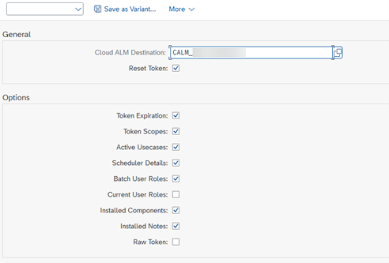
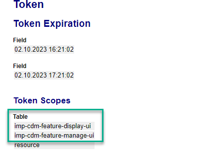
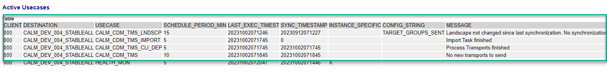
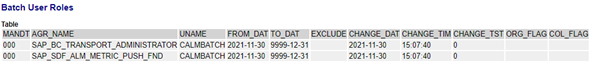
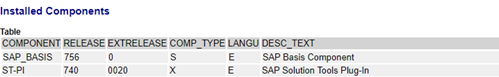
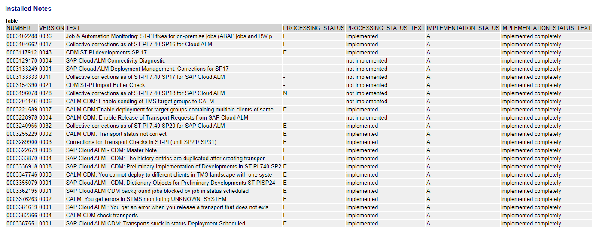
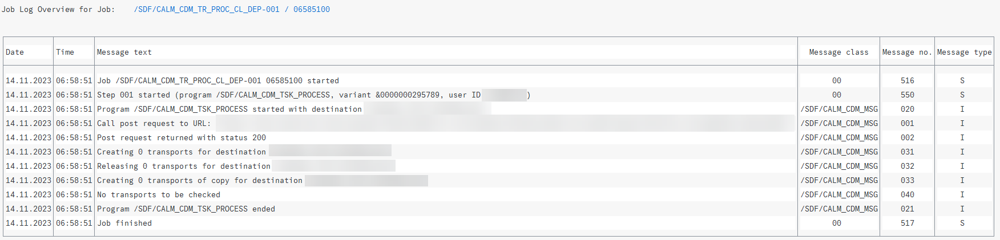

<!-- loiof32dc37d10fa475f84819f46b2720095 -->

# Issues and Solutions

<a name="loiof32dc37d10fa475f84819f46b2720095__section_svw_sxj_d1c"/>

## Issues and Solutions

In this document, you can find answers to some of the most common questions and issues that may arise during the setup of the transport management of SAP S/4HANA On-Premise, SAP S/4HANA Cloud, private edition, and SAP Business Suite or SAP NetWeaver Application Server for ABAP on-premise.

****

<table>
<tr>
<th valign="top">

Issue

</th>
<th valign="top">

Solution

</th>
</tr>
<tr>
<td valign="top">

I can't create transports

</td>
<td valign="top">

Go to the managed system:

1.  Check if the service key is missing the following`auth` scopes.

    -   `imp-cdm-feature-manage-ui`
    -   `imp-cdm-feature-display-ui`

    If it's missing, please follow the steps from step 4 \(Maintain HTTP Destination\) on in the *Procedure* section of the [SAP S/4HANA Cloud Private Edition and On-Premise Systems](https://help.sap.com/docs/cloud-alm/setup-administration/change-transport-system#procedure) guide.

2.  Check if the use case Transports: Create & Export \(client-specific\)

    is active in the source tenant \(working client shouldn't be 000\).

3.  Check if the job `/SDF/CALM_CDM_TR_PROC_CL_DEP-100` is released and is running frequently in the source tenant.

4.  Check if the job` /SDF/CALM_CDM_DIAGNOSTICS` is running in development system client 000.

In SAP Cloud ALM check the following:

Source tenant is in the system group and is assigned to the project through the deployment plan.

</td>
</tr>
<tr>
<td valign="top">

I can't release transports

</td>
<td valign="top">

Go to the managed system:

1.  Check if the service key is missing the auth scopes.

2.  Check if the use case Transports: Create & Export \(client-specific\) is active in the source tenant \(working client shouldn't be 000\).

3.  Check if the job `/SDF/CALM_CDM_TR_PROC_CL_DEP-100` is released and is running frequently in the source tenant.

4.  Check if the job `/SDF/CALM_CDM_DIAGNOSTICS` is running in development system client 000.

</td>
</tr>
<tr>
<td valign="top">

I can't create Transport of Copies

</td>
<td valign="top">

Go to the managed system:

1.  Check if the service key is missing auth scopes.

2.  Check if the use case Transports: Create & Export \(client-specific\) is active in the source tenant\(working client shouldn't be 000\).

3.  Check if the job `/SDF/CALM_CDM_TR_PROC_CL_DEP-100` is released / and is running frequently in the source tenant.

4.  Check if the job `/SDF/CALM_CDM_DIAGNOSTICS` is running in development system client 000.

</td>
</tr>
<tr>
<td valign="top">

I can't deploy features

</td>
<td valign="top">

Go to the managed system:

1.  Check if the service key is missing auth scopes.

2.  Check if the use case Transports: Import Transports

    is active in target system client 000.

3.  Check if the job `/SDF/CALM_CDM_IMPORT_TRANSPORTS` is released and running in `client 000`.

</td>
</tr>
<tr>
<td valign="top">

I can't assign transports

</td>
<td valign="top">

Go to the managed system:

1.  Check if the service key is missing auth scopes.

2.  Check if the use case Transports: Read Transports

    is active in development client 000.

</td>
</tr>
<tr>
<td valign="top">

My import jobs are stuck

</td>
<td valign="top">

Go to the managed system:

1.  The job `/SDF/CALM_CDM_IMPORT_TRANSPORTS` is released and running.

2.  The job log of `/SDF/CALM_CDM_IMPORT_TRANSPORTS` shows a component version mismatch. This job is only running when there is a request to deploy a transport from a feature. In case several features are deployed together, all the transports assigned are imported as an import subset. If one transport request of the subset leads to a component mismatch situation, the import of all transports is blocked.

To resolve the mismatch issue refer to the following SAP Note:[1688610](https://me.sap.com/notes/1688610) 

</td>
</tr>
</table>

<a name="loiof32dc37d10fa475f84819f46b2720095__section_b4q_qsn_fzb"/>

## How to Deal With Connection Issues

If you encounter connection issues during the setup of the transport management of SAP S/4HANA Cloud Private Edition or SAP NetWeaver Application Server for ABAP on-premise, you can perform the respective steps below to solve the connection issues.

### Troubleshooting Steps

1.  **Connection Check Report**

    1.  To check whether your connection is established properly, execute the program `/SDF/CALM_CDM_CONN_DIAGNOSTIC` in client 000 in all the systems included in the transport track you want to connect to SAP Cloud ALM.

        Additionally, you can use transaction `/SDF/ALM_DIAGNOSTIC` to execute the checks.

    2.  Here, you choose the SAP Cloud ALM destination used for the connection to your SAP Cloud ALM tenant. Then, you can execute the report with the defaulted options.

        

    3.  After you've performed the previous step, check the result.

    4.  The token was reset. This means that the latest configuration is applied.

        Token scopes must contain the following entries:

        -   `imp-cdm-feature-manage-ui` 
        -   `imp-cdm-feature-display-ui` 

        

        If that’s not the case, you need to update the SAP Cloud ALM API instance with the corresponding scope described here: [Enabling SAP Cloud ALM API](enabling-sap-cloud-alm-api-704b5dc.md)

    5.  The following use cases must be active:

        -   *Transports: Read Landscape*: `CALM_CDM_TMS_LNDSCP` to synchronize the transport landscape from TMS - in the domain controller client 000.
        -   *Transports: Read Transports*: `CALM_CDM_TMS` for managing transports \(mainly to assign existing transport requests\) - in the development system client 000.
        -   *Transports: Import Transports*: `CALM_CDM_TMS_IMPORT` for importing transports - in all target systems client 000.

            > ### Note:  
            > If development clients are supposed to be supplied with changes, you must activate the use case there as well.

        -   *Transports: Create & Export \(client-specific\)*:`CALM_CDM_TMS_CLI_DEP`to create and release transports and to create transport of copies. This is true for all development clients.

        > ### Note:  
        > A typical 3-tier looks like that:
        > 
        > -   Transport route: `O11.100` –\> `O12.100` –\> `O13.100`
        > -   Domain controller: `O11`
        > 
        > The following table shows the different use cases per client.
        > 
        > **Use Case Available per Client**
        > 
        > 
        > <table>
        > <tr>
        > <th valign="top">
        > 
        > Use Case / Client
        > 
        > </th>
        > <th valign="top">
        > 
        > `O11 .000`
        > 
        > </th>
        > <th valign="top">
        > 
        > `O11.100 (DEV)`
        > 
        > </th>
        > <th valign="top">
        > 
        > `O12.000 (TEST)`
        > 
        > </th>
        > <th valign="top">
        > 
        > `O13.000 (PROD)`
        > 
        > </th>
        > </tr>
        > <tr>
        > <td valign="top">
        > 
        > Transports: Create & Export \(client-specific\)
        > 
        > </td>
        > <td valign="top">
        > 
        >  
        > 
        > </td>
        > <td valign="top">
        > 
        > Active
        > 
        > </td>
        > <td valign="top">
        > 
        >  
        > 
        > </td>
        > <td valign="top">
        > 
        >  
        > 
        > </td>
        > </tr>
        > <tr>
        > <td valign="top">
        > 
        > Transports: Import Transports
        > 
        > </td>
        > <td valign="top">
        > 
        >  
        > 
        > </td>
        > <td valign="top">
        > 
        >  
        > 
        > </td>
        > <td valign="top">
        > 
        > Active
        > 
        > </td>
        > <td valign="top">
        > 
        > Active
        > 
        > </td>
        > </tr>
        > <tr>
        > <td valign="top">
        > 
        > Transports: Read Landscape
        > 
        > </td>
        > <td valign="top">
        > 
        > Active
        > 
        > </td>
        > <td valign="top">
        > 
        >  
        > 
        > </td>
        > <td valign="top">
        > 
        >  
        > 
        > </td>
        > <td valign="top">
        > 
        >  
        > 
        > </td>
        > </tr>
        > <tr>
        > <td valign="top">
        > 
        > Transports: Read Transports
        > 
        > </td>
        > <td valign="top">
        > 
        > Active
        > 
        > </td>
        > <td valign="top">
        > 
        >  
        > 
        > </td>
        > <td valign="top">
        > 
        >  
        > 
        > </td>
        > <td valign="top">
        > 
        >  
        > 
        > </td>
        > </tr>
        > </table>

    6.  The result of the connection check should provide a table of active use cases:

        

        The *Message* column provides information about the last execution. In case you find an error message, check the chapter application logs in this section of this guide for further investigation steps.

    7.  The batch user must have the following roles \(or copied ones with the same authorizations\):

        1.  `SAP_BC_TRANSPORT_ADMINISTRATOR`
        2.  `SAP_SDF_ALM_METRIC_PUSH_FND`

        

    8.  In the *Installed Components* table, you must check `SAP_BASIS` and `ST-PI` levels. The prerequisites are`SAP_BASIS`7.40 SP20 or higher \(accordingly 7.50 SP04\) and ST-PI 7.40 SP 18.

        

        > ### Note:  
        > You can find additional details about roles and other prerequisites at the beginning of this guide.

    9.  In addition, you get an overview of all installed notes related to the integration scenario:

        

    10. Please make sure that all manual steps included in the necessary notes were executed properly.

2.  **Applications Logs** 

    In case of issues showing up in the table of active use cases of the connection check result \(see column *Message*\) you can check the application log:

    1.  Go to transaction `SLG1` and execute a search for the following objects: Object:`/SDF/CALM`, Subobject: `BUILD_CDM`.

    2.  Check for errors to collect further information.

3.  **Relevant Jobs in Managed Systems**

    There are important jobs to be executed in the managed systems. The jobs mentioned below should be at least released but always check for scheduled and active jobs in case of issues.

    To create and release transports as well as creating transport of copies, for example in client 100 of the development system use the following transaction: `/SDF/CALM_CDM_TR_PROC_CL_DEP-100` 

    

    > ### Note:  
    > The job `/SDF/CALM_CDM_DIAGNOSTICS` pushes data about the available capabilities in the managed system `ST-PI` to SAP Cloud ALM.
    > 
    > This job is supposed to be released and executed once per day and only in `client 000`of the managed systems.
    > 
    > For the import of transports there is a job executed in each target system client `000`: `/SDF/CALM_CDM_IMPORT_TRANSPORTS`

    In case of import issues, you can have a look into the job log.

    To resolve this issue, please refer to the following documentation above [My import jobs are stuck](https://help.sap.com/docs/cloud-alm/setup-administration/issues-and-solutions-on-premise?locale=en-US&comment_id=22117817&show_comments=true#issues-and-solutions)

Please make sure that all manual steps included in the necessary notes were executed properly.

