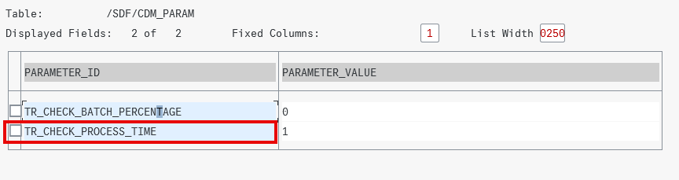
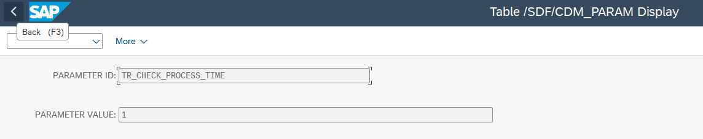
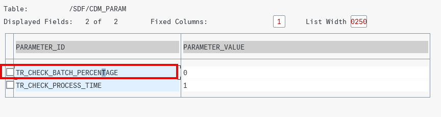
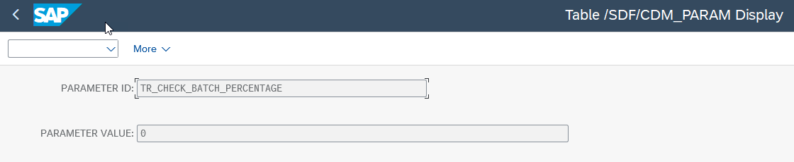

<!-- loiof32dc37d10fa475f84819f46b2720095 -->

# Issues and Solutions

<a name="loiof32dc37d10fa475f84819f46b2720095__section_svw_sxj_d1c"/>

## Issues and Solutions

In this document, you can find answers to some of the most common questions and issues that may arise during the setup of the transport management of SAP S/4HANA Cloud Private Edition, SAP S/4HANA and SAP Business Suite 7, and SAP NetWeaver Application Server for ABAP \(7.40 and higher\).

****

<table>
<tr>
<th valign="top">

Issue

</th>
<th valign="top">

Solution

</th>
</tr>
<tr>
<td valign="top">

I can't create transports

</td>
<td valign="top">

Go to the managed system:

1.  Check if the service key is missing the following auth scopes.

    -   `imp-cdm-feature-manage-ui`
    -   `imp-cdm-feature-display-ui`

    If it's missing, please follow the steps from step 4 \(Maintain HTTP Destination\) on in the *Procedure* section of the [SAP S/4HANA Cloud Private Edition and On-Premise Systems](https://help.sap.com/docs/cloud-alm/setup-administration/change-transport-system#procedure) guide.

2.  Check if the use case Transports: Create & Export \(client-specific\) is active in the source tenant \(working client shouldn't be 000\).

3.  Check if the job `/SDF/CALM_CDM_TR_PROC_CL_DEP-100` is released and is running frequently in the source tenant.

4.  Check if the job` /SDF/CALM_CDM_DIAGNOSTICS` is running in development system client 000.

In SAP Cloud ALM check the following:

Source tenant is in the system group and is assigned to the project through the deployment plan.

</td>
</tr>
<tr>
<td valign="top">

I can't release transports

</td>
<td valign="top">

Go to the managed system:

1.  Check if the service key is missing the auth scopes.

2.  Check if the use case Transports: Create & Export \(client-specific\) is active in the source tenant \(working client shouldn't be 000\).

3.  Check if the job `/SDF/CALM_CDM_TR_PROC_CL_DEP-100` is released and is running frequently in the source tenant.

4.  Check if the job `/SDF/CALM_CDM_DIAGNOSTICS` is running in development system client 000.

</td>
</tr>
<tr>
<td valign="top">

I can't create Transport of Copies

</td>
<td valign="top">

Go to the managed system:

1.  Check if the service key is missing auth scopes.

2.  Check if the use case Transports: Create & Export \(client-specific\) is active in the source tenant\(working client shouldn't be 000\).

3.  Check if the job `/SDF/CALM_CDM_TR_PROC_CL_DEP-100` is released / and is running frequently in the source tenant.

4.  Check if the job `/SDF/CALM_CDM_DIAGNOSTICS` is running in development system client 000.

</td>
</tr>
<tr>
<td valign="top">

I can't deploy features

</td>
<td valign="top">

Go to the managed system:

1.  Check if the service key is missing auth scopes.

2.  Check if the use case Transports: Import Transports

    is active in target system client 000.

3.  Check if the job `/SDF/CALM_CDM_IMPORT_TRANSPORTS` is released and running in `client 000`.

</td>
</tr>
<tr>
<td valign="top">

I can't assign transports

</td>
<td valign="top">

Go to the managed system:

1.  Check if the service key is missing auth scopes.

2.  Check if the use case Transports: Read Transports is active in development client 000.

</td>
</tr>
<tr>
<td valign="top">

Import jobs are stuck

</td>
<td valign="top">

Go to the managed system:

1.  The job `/SDF/CALM_CDM_IMPORT_TRANSPORTS` is released and running.

2.  The job log of `/SDF/CALM_CDM_IMPORT_TRANSPORTS` shows a component version mismatch. This job is only running when there is a request to deploy a transport from a feature. In case several features are deployed together, all the transports assigned are imported as an import subset. If one transport request of the subset leads to a component mismatch situation, the import of all transports is blocked.

To resolve the mismatch issue see SAP Note [1688610](https://me.sap.com/notes/1688610).

</td>
</tr>
<tr>
<td valign="top">

CTS transports are shown as imported successfully even though the imports failed

</td>
<td valign="top">

When CTS transport requests are imported, the *Features* app shows the imports as successful even though errors occurred.

To solve this, make sure you've installed ST-PI 740 SP31 and SAP Note [3623614](https://me.sap.com/notes/3623614).

</td>
</tr>
<tr>
<td valign="top">

Transport check job was canceled due to long running time

</td>
<td valign="top">

The default maximum running time of a transport check job is 10 hours. If a job runs for more than 10 hours, it’s automatically canceled.

You can customize the maximum running time in cross-client table `/SDF/CDM_PARAM` with parameter `TR_CHECK_PROCESS_TIME` via transaction SE16 in any of your clients.

The default unit of the parameter is hours. You can only enter numerical digits. Please avoid overly long running times.

</td>
</tr>
<tr>
<td valign="top">

Transport check job wasn't scheduled due to system resource shortage

</td>
<td valign="top">

By default, the `TR_CHECK_BATCH_PERCENTAGE` value is set to 0%.

This means that the job will always be scheduled. If no free work process is available, the job will start as soon as free work process is available again.

You can customize the minimum percentage in cross-client table `/SDF/CDM_PARAM` with parameter `TR_CHECK_BATCH_PERCENTAGE` via transaction SE16 in any of your clients.

For example, you set the minimum percentage to 50%. When you start a transport check, the current percentage of free work process is compared to the minimum percentage of 50%. Only if 50% or more free work process is available, the job is scheduled immeditaley. If there's less free work process available, the job will start as soon as free work process is available.

> ### Note:  
> In case of no free work process, the system performs 3 retires. The job is canceled if there's still no free work process after the retries.

</td>
</tr>
<tr>
<td valign="top">

Transports with already scheduled deployments to virtual systems

</td>
<td valign="top">

If you have transports with already scheduled deployments to virtual systems, do the following:

1.  Replace the virtual system by a physical system.

2.  Remove buffer entries of the transports managed by SAP Cloud ALM.

3.  Activate the use case task *Transports: Import*. As a result, all imports of the transports are shown as failed in CALM.

4.  Add the transports to the buffer again and import them manually through STMS.

5.  The import feedback job updates the status of the transports in SAP Cloud ALM.

</td>
</tr>
</table>

