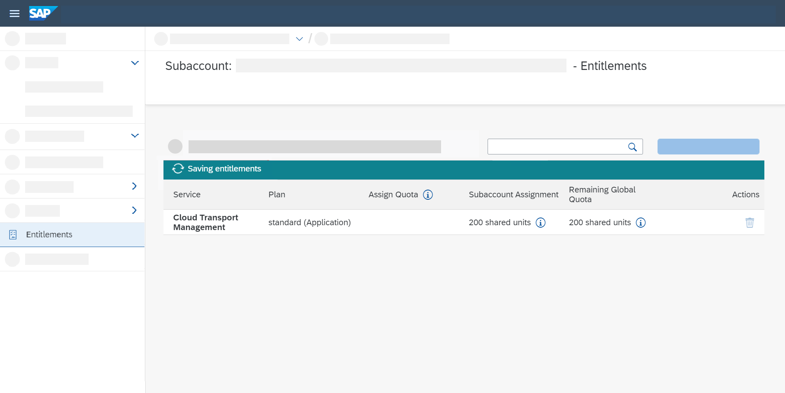
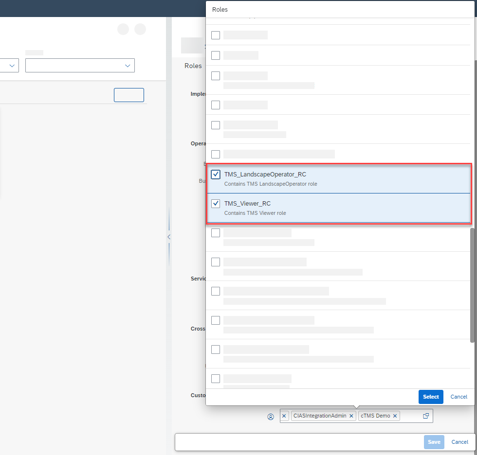

<!-- loio730ae36cc6ca419aae747012015cc686 -->

# SAP Cloud Transport Management Service

By enabling the transport management for the SAP Cloud Transport Management service, you can orchestrate the deployment of transport requests through your implementation landscape.

To use the transport capabilities of SAP Cloud ALM in conjunction with the SAP Cloud Transport Management service, you have to establish a connection between SAP Cloud ALM and the SAP Cloud Transport Management service.

> ### Note:  
> SAP Cloud ALM currently only supports linear deployment routes modeled in the SAP Cloud Transport Management service.
> 
> Before you can use the deployment functionality in SAP Cloud ALM, you have to configure the nodes in the SAP Cloud Transport Management service.

<a name="loio730ae36cc6ca419aae747012015cc686__section_rgk_qjh_nsb"/>

## Prerequisites

-   Set up the product \(for example, SAP Integration Suite\) with which you want to integrate the SAP Cloud Transport Management service for SAP Cloud ALM before you start with the following steps. For more information about the general setup, refer to [Initial Setup of SAP Cloud Integration in the Cloud Foundry Environment](https://help.sap.com/viewer/368c481cd6954bdfa5d0435479fd4eaf/IAT/en-US/302b47b11e1749c3aa9478f4123fc216.html).

-   To perform the steps described in this guide, familiarize yourself with how to use the [SAP Business Technology Platform \(SAP BTP\)](https://help.sap.com/viewer/product/BTP/Cloud/en-US?task=discover_task) cockpit. Especially the section [Account Administration](https://help.sap.com/products/BTP/65de2977205c403bbc107264b8eccf4b/5d62ec89de39442f8f31d527855cbced.html) is important.

**Subscribe to SAP Cloud Transport Management**

To use the SAP Cloud Transport Management service in SAP Cloud ALM, you have to subscribe to the service in your SAP BTP subaccount. Before you subscribe, check if you’re entitled to use the SAP Cloud Transport Management service.

1.  Go to your SAP BTP global account.

2.  Go to your subaccount.

3.  To check your entitlements, go to *Entitlements* and choose *Configure Entitlements*.

      

4.  Search for the *Cloud Transport Management* service in the search bar. If no results are shown in the service list, choose *Add Service Plans*.

      

5.  Check the checkbox *Standard \(Application\) Standard Plan* and choose *Add 1 Service Plan*.

      

6.  Now, the *Cloud Transport Management* service appears in the service list. Choose *Save*.

      

      

7.  Go to *Instances and Subscriptions* and select the *Cloud Transport Management* service.

8.  Choose *Create*.

      

9.  In the *New Instance or Subscription*, select the *Standard* plan in the *Plan* dropdown. Then choose *Create*.

10. You're now subscribed to the SAP Cloud Transport Management service.

11. Now, you can assign members of your team to roles. Usually, the two roles you need are `TMS_Viewer_RC` and `TMS_LandscapeOperator_RC`.

    You can assign the roles in the *User Management* app in SAP Cloud ALM.

      

    > ### Note:  
    > For more information, refer to [Assign Roles to Users in SAP Cloud ALM](https://help.sap.com/viewer/DRAFT/a003932b20284f3c8c457793a5169bc5/DEV/en-US/7304b17f3aac4ebaa24c5c6a3a8e236e.html).

12. Now, you can access the Cloud Transport Management service from within your subaccount in the SAP BTP cockpit by choosing *Go to Application*.

      

13. To create transport nodes, refer to [Create Transport Nodes](https://help.sap.com/docs/TRANSPORT_MANAGEMENT_SERVICE/7f7160ec0d8546c6b3eab72fb5ad6fd8/f71a4d5550cd453ea824d5b5c677969d.html?version=Cloud)

    > ### Note:  
    > You have to use auto forward and upload application content to dev node manually.

<a name="loio730ae36cc6ca419aae747012015cc686__section_i5k_rjh_nsb"/>

## Procedure

After you've subscribed to the SAP Cloud Transport Management service, perform the following steps:

1.  **Set up the Product**

    Set up the specific use case according to the respective documentation, for example [Enabling Content Transport, Cloud Foundry Environment](https://help.sap.com/docs/CLOUD_INTEGRATION/368c481cd6954bdfa5d0435479fd4eaf/452c677debfc4fda904310560ab03743.html?version=Cloud).

2.  **Set up an SAP Cloud ALM API Instance**

    Set up the SAP Cloud ALM API instance and the Change and Deployment display and the scope management.

    To do this, perform the steps described in [Enabling SAP Cloud ALM API](enabling-sap-cloud-alm-api-704b5dc.md).

3.  **Set up HTTP Destinations and Transport Routes with SAP Cloud ALM Pass-Through**

    The product requires a destination to the SAP Cloud Transport Management service.

    The following steps apply only to the SAP Integration Suite. For other integrations, refer to the relevant documentation.

    In the SAP BTP subaccount where your source product tenant is hosted, create a destination targeted at the SAP Cloud Transport Management service.

    For how to set up the HTTP destination, refer to the following documentation [Creating HTTP Destinations and Transport Route](https://help.sap.com/viewer/368c481cd6954bdfa5d0435479fd4eaf/IAT/en-US/270f353a5b69472696617d91ceb58c93.html). Choose the blue *Cloud Transport Management* tab.

    In the URL section for the endpoint, enter the URL of your SAP Cloud ALM API instance that follows a pattern like this: ***https://eu10.alm.cloud.sap/api/imp-cdm-transport-management-api/v1***. The first part of the URL until `/api` depends on your company account and is variable.

      

