<!-- loio8b4af2f9c2df4a1797dd812b814f36a5 -->

# SAP Cloud Transport Management Service

Enable the transport management for the SAP Cloud Transport Management service for SAP Cloud ALM.

Several SAP Cloud Products use SAP Cloud Transport Management as environment for transporting their development artifacts and application-specific content. The transport nodes of SAP Cloud Transport Management represent the landscape of those SAP Cloud Products. Connecting SAP Cloud Transport Management to SAP Cloud ALM makes that landscape and the respective transports visible for SAP Cloud ALM. Then, you can orchestrate the deployment of those transports in SAP Cloud ALM.

You can directly connect an SAP Cloud Transport Management service \(CTMS\) instance subscribed in your SAP BTP Global Account to SAP Cloud ALM.

> ### Note:  
> In case you've subscribed to several SAP Cloud Transport Management service instances, it's possible to connect all of them to the same SAP Cloud ALM.

To use the transport capabilities of SAP Cloud ALM with the SAP Cloud Transport Management service, you first have to establish a connection between them.

> ### Note:  
> SAP Cloud ALM supports the parallel delivery of several transport nodes at once.
> 
> Before you can use the deployment functionality in SAP Cloud ALM, you have to configure the transport nodes in the SAP Cloud Transport Management service.

> ### Note:  
> Currently, deleted CTMS transports can’t be removed from the *Features* app. However, you can unassign deleted transports from features.

> ### Note:  
> We recommend running SAP Cloud Transport Management service as shared service, by setting it up on a central administrative subaccount, to facilitate role management and allow strict access control.


<a name="loio8b4af2f9c2df4a1797dd812b814f36a5__section_rgk_qjh_nsb"/>

## Prerequisites

-   You've set up the product \(for example, SAP Integration Suite\) with which you want to integrate the SAP Cloud Transport Management service for SAP Cloud ALM.

    For more information about the general setup, refer to [Initial Setup of SAP Cloud Integration in the Cloud Foundry Environment](https://help.sap.com/docs/CLOUD_INTEGRATION/368c481cd6954bdfa5d0435479fd4eaf/302b47b11e1749c3aa9478f4123fc216.html).

-   You've subscribed to the SAP Cloud Transport Management service in the central administrative subaccount.

    > ### Note:  
    > It's not possible to do this in SAP Cloud ALM Global or subaccounts.

    For more information, see [Subscribing to Cloud Transport Management](https://help.sap.com/docs/cloud-transport-management/sap-cloud-transport-management/subscribing-to-cloud-transport-management?version=Cloud).

-   Your user has the required transport management roles *Transport Management Viewer* and *Transport Management Operator*.

    For more information on how to set up role collections in SAP Cloud Transport Management, see [Setting Up Role Collections](https://help.sap.com/docs/cloud-transport-management/sap-cloud-transport-management/setting-up-role-collections?version=Cloud).

-   You've created an instance of SAP Cloud Transport Management service in the central administrative subaccount.

    > ### Note:  
    > It's not possible to do this in SAP Cloud ALM Global or Sub accounts.

-   You've created a service key for SAP Cloud Transport Management service. For more information, see [Creating a Service Instance and a Service Key](https://help.sap.com/docs/cloud-transport-management/sap-cloud-transport-management/creating-service-instance-and-service-key?version=Cloud).

-   You've familiarized yourself with how to use the [SAP Business Technology Platform \(SAP BTP\)](https://help.sap.com/viewer/product/BTP/Cloud/en-US?task=discover_task) cockpit, in particular [Account Administration](https://help.sap.com/products/BTP/65de2977205c403bbc107264b8eccf4b/5d62ec89de39442f8f31d527855cbced.html) concepts.


<a name="loio8b4af2f9c2df4a1797dd812b814f36a5__section_mnz_nhd_3bc"/>

## Procedure

1.  Set Up HTTP destinations.

    SAP Cloud ALM requires a destination to the SAP Cloud Transport Management service. In the SAP BTP subaccount where your SAP Cloud ALM is hosted, create a destination targeted at the SAP Cloud Transport Management service.

    > ### Note:  
    > If you have multiple SAP Cloud ALM tenants, you need to have an SAP BTP destination pointing to the CTMS instance. Then, you need to decide which SAP Cloud ALM instance should point to the CTMS instance.
    > 
    > Here's what we recommend:
    > 
    > -   only connect your productively used SAP Cloud Transport Manage service instance to your productive SAP Cloud ALM instance
    > 
    > -   don't connect your productive environment to both SAP Cloud ALM instances
    > 
    > -   only connect demo and sandbox SAP Cloud Transport Management service instances to your test SAP Cloud ALM instance

    1.  Go to your SAP BTP subaccount of your SAP Cloud ALM instance, choose *Connectivity*, then *Destinations*, then *Create*.

        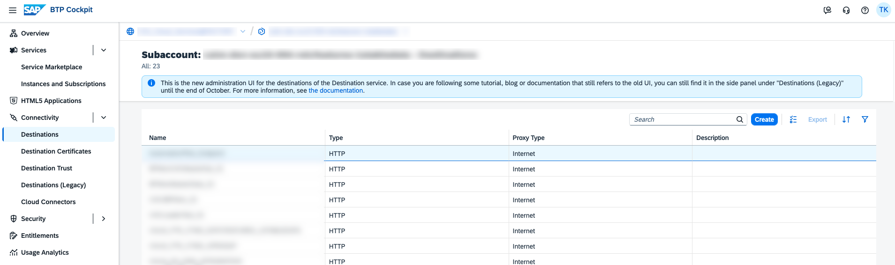

    2.  In the *Destination Configuration* section, enter the values in the respective fields based on the description that is provided in the table below.

        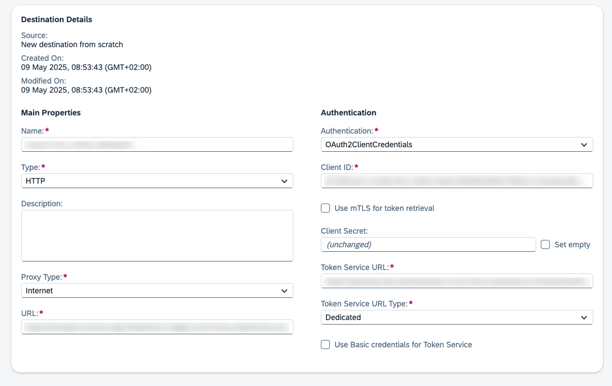

        **Destination Configuration Values**


        <table>
        <tr>
        <th valign="top">

        Field
        
        </th>
        <th valign="top">

        Description
        
        </th>
        </tr>
        <tr>
        <td valign="top">
        
        Name
        
        </td>
        <td valign="top">
        
        Here, use the prefix `CALM_FTR_CTMS_` and then add a meaningful suffix.

        Example: `CALM_FTR_CTMS_FEATURES` \(this value is case-sensitive\)
        
        </td>
        </tr>
        <tr>
        <td valign="top">
        
        Type
        
        </td>
        <td valign="top">
        
        HTTP
        
        </td>
        </tr>
        <tr>
        <td valign="top">
        
        Description \(optional\)
        
        </td>
        <td valign="top">
        
        You can provide a description for your reference.
        
        </td>
        </tr>
        <tr>
        <td valign="top">
        
        URL
        
        </td>
        <td valign="top">
        
        Value of `uri` from the service key of your SAP Cloud Transport Management service instance. For example: https://transport-service-app-backend.ts.cfapps.euXX.hana.ondemand.com
        
        </td>
        </tr>
        <tr>
        <td valign="top">
        
        Proxy Type
        
        </td>
        <td valign="top">
        
        Internet
        
        </td>
        </tr>
        <tr>
        <td valign="top">
        
        Authentication
        
        </td>
        <td valign="top">
        
        `OAuth2ClientCredentials` 
        
        </td>
        </tr>
        <tr>
        <td valign="top">
        
        Client ID
        
        </td>
        <td valign="top">
        
        Value of `clientid` from the service key of your SAP Cloud Transport Management service instance.
        
        </td>
        </tr>
        <tr>
        <td valign="top">
        
        Client Secret
        
        </td>
        <td valign="top">
        
        Value of `clientsecret` \(`uaa`\) section from the service key of your SAP Cloud Transport Management service instance.
        
        </td>
        </tr>
        <tr>
        <td valign="top">
        
        Token Service URL
        
        </td>
        <td valign="top">
        
        Value of `URL` \(`uaa` section\) from the service key of your SAP Cloud Transport Management service instance.

        Append `/oauth/token` to the `URL` retrieved from the service key. For example: https://YYY.authentication.euXX.hana.ondemand.com/oauth/token
        
        </td>
        </tr>
        </table>
        
        > ### Caution:  
        > Don't maintain two destinations to the same SAP Cloud Transport Management service instance because this leads to duplicate entries of transports in the transport assignment dialog. Even if you delete one destination, the transports that were already pushed to SAP Cloud ALM aren't deleted since existing data could still be relevant for audit purposes.


2.  After you've established the connection, it can take up to 5 minutes before the first transports appear in the *Features* app.

    In the *Features* app, the transports appear in the transport list with the destination as a prefix to the transport ID. See screenshot below.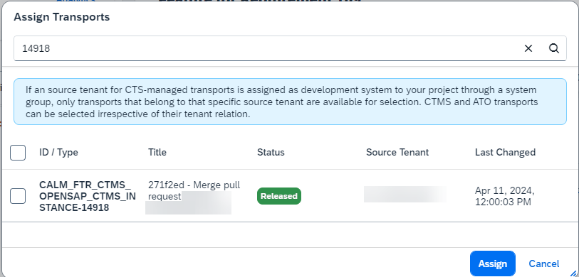


<a name="loio8b4af2f9c2df4a1797dd812b814f36a5__section_qx3_kby_3bc"/>

## Legacy Procedure for Subscription with SAP Cloud Transport Management in SAP Cloud ALM Subaccount.

A new integration is now available to connect SAP Cloud Transport Management service \(CTMS\) to SAP Cloud ALM. You can easily connect CTMS using an SAP BTP Destination in the SAP Cloud ALM subaccount, which points to your SAP Cloud Transport Management instance. This new method replaces the previous integration within the SAP BTP subaccount of the SAP Cloud ALM subscription, offering a platform that supports a wider range of content types. The updated integration resolves technical limitations related to SAP Analytics Cloud and SAP Datasphere, provides comprehensive documentation, and enables programmatic access through the CTMS instance service key.

We strongly advise you against using the existing integration within the SAP BTP subaccount of the SAP Cloud ALM subscription as we’ll no longer offer it in the future.

**Procedure**

1.  **Set Up the Product**

    Set up the specific use case according to the respective documentation, for example [Enabling Content Transport, Cloud Foundry Environment](https://help.sap.com/docs/CLOUD_INTEGRATION/368c481cd6954bdfa5d0435479fd4eaf/452c677debfc4fda904310560ab03743.html?version=Cloud).

2.  **Set Up an SAP Cloud ALM API Instance**

    Set up the SAP Cloud ALM API instance and the Change and Deployment display and the scope management by performing the steps described in [Enabling SAP Cloud ALM API](enabling-sap-cloud-alm-api-704b5dc.md).

3.  **Set Up HTTP Destinations and Transport Routes with SAP Cloud ALM Pass-Through**

    > ### Note:  
    > The following steps apply only to the SAP Integration Suite. For other integrations, refer to the relevant documentation.

    The product requires a destination to the SAP Cloud Transport Management service. In the SAP BTP subaccount where your source product tenant is hosted, create a destination targeted at the SAP Cloud Transport Management service.

    In the *Destination Configuration* section, enter the values in the respective fields based on the description that is provided in the following table:

    **Destination Configuration Values**


    <table>
    <tr>
    <th valign="top">

    Field
    
    </th>
    <th valign="top">

    Description
    
    </th>
    </tr>
    <tr>
    <td valign="top">
    
    Name
    
    </td>
    <td valign="top">
    
    `TransportManagementService` \(this value is case-sensitive\)
    
    </td>
    </tr>
    <tr>
    <td valign="top">
    
    Type
    
    </td>
    <td valign="top">
    
    HTTP
    
    </td>
    </tr>
    <tr>
    <td valign="top">
    
    Description \(optional\)
    
    </td>
    <td valign="top">
    
    You can provide a description for your reference.
    
    </td>
    </tr>
    <tr>
    <td valign="top">
    
    URL
    
    </td>
    <td valign="top">
    
    Enter the URL \(“Api”\) of the service key of your SAP Cloud ALM API instance and append `/imp-cdm-transport-management-api/v1`. That follows a pattern like this: https://eu10.alm.cloud.sap/api/imp-cdm-transport-management-api/v1
    
    </td>
    </tr>
    <tr>
    <td valign="top">
    
    Proxy Type
    
    </td>
    <td valign="top">
    
    Internet
    
    </td>
    </tr>
    <tr>
    <td valign="top">
    
    Authentication
    
    </td>
    <td valign="top">
    
    `OAuth2ClientCredentials` 
    
    </td>
    </tr>
    <tr>
    <td valign="top">
    
    Client ID
    
    </td>
    <td valign="top">
    
    `clientid` from the service key of your SAP Cloud ALM API instance.
    
    </td>
    </tr>
    <tr>
    <td valign="top">
    
    Client Secret
    
    </td>
    <td valign="top">
    
    `clientsecret` from the service key of your SAP Cloud ALM API instance.
    
    </td>
    </tr>
    <tr>
    <td valign="top">
    
    Token Service URL
    
    </td>
    <td valign="top">
    
    Enter the value of the url \(uaa section\) from the service key of your SAP Cloud ALM API instance. Append /oauth/token at the end of the URL fetched from the service key.
    
    </td>
    </tr>
    <tr>
    <td valign="top">
    
    Additional Properties
    
    </td>
    <td valign="top">
    
    Choose New Property.

    Enter `sourceSystemId` \(this value is case-sensitive\) as the key and provide a value of your choice. Reuse the same value as the name of the source transport node in a later step.
    
    </td>
    </tr>
    </table>
    
    For additional information on how to set up the HTTP destination, see [Creating HTTP Destinations and Transport Route](https://help.sap.com/docs/CLOUD_INTEGRATION/368c481cd6954bdfa5d0435479fd4eaf/270f353a5b69472696617d91ceb58c93.html) under the *Cloud Transport Management* tab.

    In the URL section for the endpoint, enter the URL of your SAP Cloud ALM API instance that follows the pattern `https://<tenant name>.<region>.alm.cloud.sap/api/imp-cdm-transport-management-api/v1`. The first part of the URL until `/api` depends on your company account and is variable.

    


**Special Setup Cases with SAP Build Work Zone**

If you want to use SAP Cloud ALM with SAP Build Work Zone, please follow the instructions both in this guide and the [**Integrate SAP Cloud Transport Management Service**](https://help.sap.com/docs/build-work-zone-standard-edition/sap-build-work-zone-standard-edition/integrate-sap-cloud-transport-management-service?locale=en-US) guide.

1.  Verify your access to your SAP Cloud ALM Cloud Transport Management environment by opening the app *Cloud Transport Management* on your SAP Cloud ALM launchpad.

    > ### Note:  
    > The URL follows a pattern like this: `https://{customer-tenant}.ts.cfapps.{region}.hana.ondemand.com/main/webapp/index.html`.

    -   To be able to design the landscape you need the role `Transport Management Operator` in the *User Management* app, under *Implementation* \> *Cloud Transport Management*.

    -   Design the landscape with one development node and as many target nodes as needed, for example like it's displayed here: 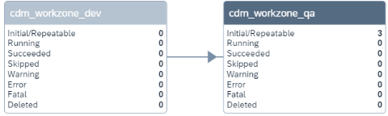


2.  Step 2 of the setup procedure instructions in the [**Integrate SAP Cloud Transport Management Service**](https://help.sap.com/docs/build-work-zone-standard-edition/sap-build-work-zone-standard-edition/integrate-sap-cloud-transport-management-service?locale=en-US) guide has to be replaced by the steps described in the following guide [**Enabling SAP Cloud ALM API**](https://help.sap.com/docs/cloud-alm/setup-administration/enabling-sap-cloud-alm-api?locale=en-US) to create an SAP Cloud ALM API service instance.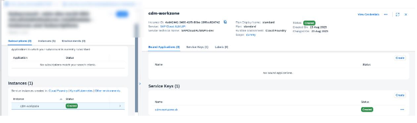
3.  Substitute the connection details in step 3 of the [**Integrate SAP Cloud Transport Management Service**](https://help.sap.com/docs/build-work-zone-standard-edition/sap-build-work-zone-standard-edition/integrate-sap-cloud-transport-management-service?locale=en-US) guide with the Cloud API service instance details of your `DEV` account destination, replacing the SAP Cloud Transport Management data in destination `ctms_destination`.

    You have to enter the API information in the following way:

    **Destination Configuration Values For SAP Work Zone**


    <table>
    <tr>
    <th valign="top">

    Field
    
    </th>
    <th valign="top">

    Description
    
    </th>
    </tr>
    <tr>
    <td valign="top">
    
    Name
    
    </td>
    <td valign="top">
    
    `TransportManagementService` \(this value is case-sensitive\)
    
    </td>
    </tr>
    <tr>
    <td valign="top">
    
    Type
    
    </td>
    <td valign="top">
    
    HTTP
    
    </td>
    </tr>
    <tr>
    <td valign="top">
    
    Description \(optional\)
    
    </td>
    <td valign="top">
    
    You can provide a description for your reference.
    
    </td>
    </tr>
    <tr>
    <td valign="top">
    
    URL
    
    </td>
    <td valign="top">
    
    Enter `endpoints.API and then append/imp-cdm-transport-management-api/v1`. That follows a pattern like this: `https://{region}.alm.cloud.sap/api/imp-cdm-transport-management-api/v1` 
    
    </td>
    </tr>
    <tr>
    <td valign="top">
    
    Proxy Type
    
    </td>
    <td valign="top">
    
    Internet
    
    </td>
    </tr>
    <tr>
    <td valign="top">
    
    Authentication
    
    </td>
    <td valign="top">
    
    `OAuth2ClientCredentials` 
    
    </td>
    </tr>
    <tr>
    <td valign="top">
    
    Client ID
    
    </td>
    <td valign="top">
    
    Use the entry under `uaa.clientid`.
    
    </td>
    </tr>
    <tr>
    <td valign="top">
    
    Client Secret
    
    </td>
    <td valign="top">
    
    Use `uaa.clientsecret` from the service key of your SAP Cloud ALM API instance.
    
    </td>
    </tr>
    <tr>
    <td valign="top">
    
    Token Service URL
    
    </td>
    <td valign="top">
    
    Use the `uaa.url` and then append `/oauth/token` at the end of the uaa.url, for example like: `https://{customer-tenant}.authentication.{region}.hana.ondemand.com/oauth/token`.
    
    </td>
    </tr>
    <tr>
    <td valign="top">
    
    Additional Properties
    
    </td>
    <td valign="top">
    
    Destination New Property

    Enter `sourceSystemId` \(this value is case-sensitive\) as the key and provide a value of your choice. Reuse the same value as the name of the source transport node in a later step.
    
    </td>
    </tr>
    </table>
    
    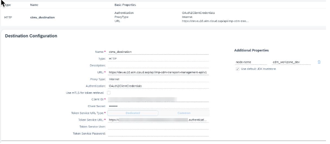

4.  Continue in the [Enabling SAP Cloud ALM API](https://help.sap.com/docs/cloud-alm/setup-administration/enabling-sap-cloud-alm-api?locale=en-US) guide by setting up the destination property *node-name*. For the destination, use the values that were used in your SAP Cloud ALM Cloud Transport Management environment. Then, proceed with the remaining steps of the [Integrate SAP Cloud Transport Management Service](https://help.sap.com/docs/build-work-zone-standard-edition/sap-build-work-zone-standard-edition/integrate-sap-cloud-transport-management-service?locale=en-US) guide.

5.  If everything is set up correctly, you can now export the site content by choosing *Transport Site* from the dropdown.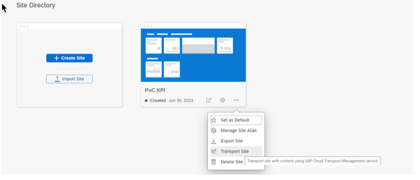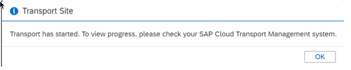
6.  After exporting the first content package, it shows up in the *SAP Cloud Transport Management* app. Then it can be assigned to a feature document in the *Features* app. For more information, consult the following guide [Assigning Transports, User Stories, and Project Tasks](https://help.sap.com/docs/cloud-alm/applicationhelp/assigning-transports?locale=en-US). If the content package doesn't show up immediately, you can use the refresh button of the *Transports* section to manually trigger a synchronization.

    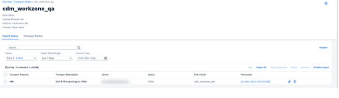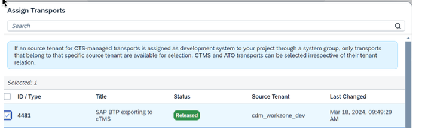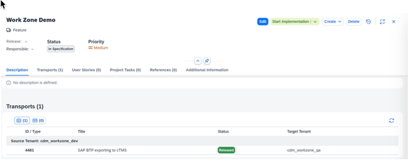


### Cloud Transport Management Service Setup for BTP ABAP Environment

When you set up the Cloud Transport Management service for a BTP ABAP environment, you have to configure export and import for Cloud Transport Management service.

For import configuration, follow the steps described in [Creating Destinations for Deployment of References of SAP BTP, ABAP Environment](https://help.sap.com/docs/cloud-transport-management/sap-cloud-transport-management/creating-destinations-for-deployment-of-references-of-sap-btp-abap-environment?version=Cloud).

For export configuration, follow these steps:

1.  Verify your access to your SAP Cloud ALM Cloud Transport Management environment by opening the app *Cloud Transport Management* on your SAP Cloud ALM launchpad.

    > ### Note:  
    > The URL follows a pattern like this: `https://{customer-tenant}.ts.cfapps.{region}.hana.ondemand.com/main/webapp/index.html`.

    -   To design the landscape, you need the role `Transport Management Operator` in the *User Management* app, under *Implementation* \> *Cloud Transport Management*.

    -   Design the landscape with one development node and as many target nodes as needed, for example like it's displayed here: 


2.  Create an SAP Cloud ALM API service instance [**Enabling SAP Cloud ALM API**](https://help.sap.com/docs/cloud-alm/setup-administration/enabling-sap-cloud-alm-api?locale=en-US).

3.  On the BTP ABAP Fiori launchpad, open the *Communication Arrangements* app. For more information about the app, see [Communication Arrangements](https://help.sap.com/docs/btp/sap-business-technology-platform/communication-arrangements?version=Cloud).

4.  Choose *New* and search for `SAP_COM_0599` communication scenario. Then, choose *Create*.

5.  Next, choose *New* to create a new communication system. Enter `CLOUD-ALM-CTMS` for the *System ID* and *System Name*.

    > ### Note:  
    > The *Host Name* is the API URL of the CALM API service key without `/api`. For example:
    > 
    > > ### Sample Code:  
    > > ```
    > > {
    > > 			"endpoints":{
    > > 				"Api": "https://tenant.xx10.alm.cloud.sap/api"
    > > ```
    > 
    > The exact *Host Name* depends on your country/region.

6.  In the *OAuth 2.0 Settings* in the *Token Endpoint* field, enter the authentication URL of your CALM API service key and add */oauth/token?grant\_type=client\_credentials* to the URL. For example: https://tmststest.authentication.sap.hana.ondemand.com/oauth/token?grant\_type=client\_credentials.

7.  In the *Users for Outbound Communication* section, choose *\+* and select *oAuth 2.0* from the authentication method dropdown to create a user for outbound communication.

    > ### Note:  
    > Use the `clientid` and `clientsecret` of your CALM API service key.

8.  Save your communication system.

9.  In the *Communication Arrangement*, go to the *Additional Properties* section and define a CTMS node name for the export. The selected transport node must allow uploads. You should use the name of an existing node in CTMS or create a node with the same name in CTMS. For more information, see [Create Transport Nodes](https://help.sap.com/docs/cloud-transport-management/sap-cloud-transport-management/create-transport-nodes?version=Cloud).

10. Go to the *Outbound Services* section and enter `/api/imp-cdm-transport-management-api/v1/` for the *Path*.

    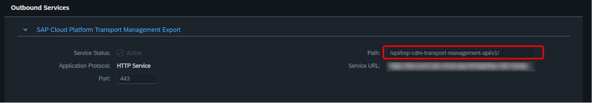

11. Save your entries.


-   **[SAP Cloud Transport Management Service and the CI/CD Use Case](sap-cloud-transport-management-service-and-the-ci-cd-use-case-235276e.md "SAP Cloud Transport Management Service and the CI/CD Use Case")**  
SAP Cloud Transport Management Service and the CI/CD Use Case

**Parent topic:**[Enabling Transport Management](enabling-transport-management-4b74b16.md "Learn how to enable the transport management of different transport environments for SAP Cloud ALM.")

**Related Information**  


[SAP S/4HANA Cloud Public Edition](sap-s-4hana-cloud-public-edition-a4238a9.md "Enable the transport management with Adaptation Transport Organizer.")

[SAP S/4HANA Cloud Private Edition and On-Premise Systems](sap-s-4hana-cloud-private-edition-and-on-premise-systems-5aa24f0.md "Learn how to configure your SAP Cloud ALM deployment scenario for CTS integration.")

[Tips and Troubleshooting for Your Setups](tips-and-troubleshooting-for-your-setups-0fb29d9.md "Find information on how to fix issues.")

