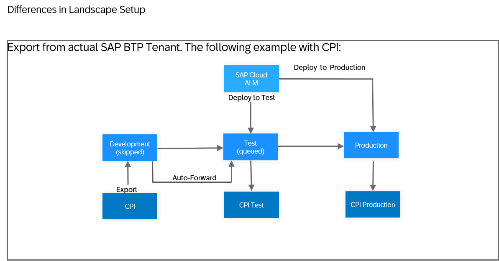
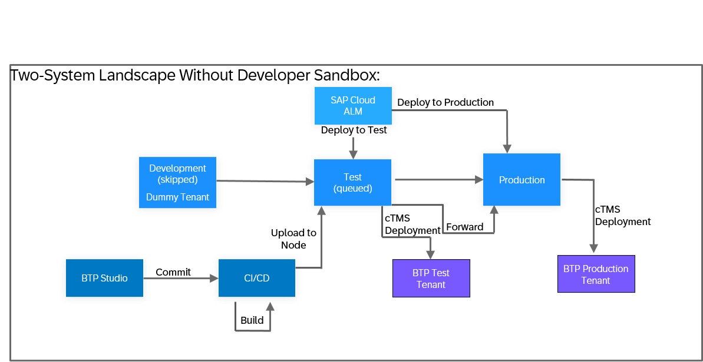

<!-- loio235276ecd95b4c0d9a361614a1304b38 -->

# SAP Cloud Transport Management Service and the CI/CD Use Case

SAP Cloud Transport Management Service and the CI/CD Use Case

**Special Use and Setup Cases with SAP Business Technology Platform \(SAP BTP\) and Continuous Integration and Delivery \(CI/CD\)**

1.  If you work with an SAP Business Technology Platform \(SAP BTP\) product \(for example CPI\), then just create a three system landscape in the Cloud Transport Management service \(cTMS\) as described in the standard documentation above. Your development is already available in the `DEVELOPMENT` system, so your transports are exported from the `DEVELOPMENT` system and imported into the buffer of the follow-up system `TEST`.

    

2.  For other developments outside of SAP BTP, like Business Application Studio, there's no dedicated cloud development system. In this case, the developments are performed in the Business Application Studio. Your developments are then uploaded with the `upload` command through the Continuous Integration and Delivery \(CI/CD\) service directly into the `TEST` system. In order to support this scenario, you need a dummy node before your test node. Your developments aren't deployed in this dummy `DEVELOPMENT` node, but this node is needed to support this scenario. You can still deploy, but then as a pure sandbox deployment through a pipeline directly without cTMS.

    

For the initial setup of SAP Continuous Integration and Delivery \(CI/CD\), see [Initial Setup](https://help.sap.com/docs/continuous-integration-and-delivery/sap-continuous-integration-and-delivery/initial-setup?version=Cloud)

To integrate CTMS into your CI/CD pipeline, see [Configure a Cloud Foundry Environment Job in Your Repository](https://help.sap.com/docs/continuous-integration-and-delivery/sap-continuous-integration-and-delivery/configure-sap-cloud-application-programming-model-job-in-your-repository?q=configure+sap+fiori+in+cloud+foundry+environment+job+in+your+repository&version=Cloud#release).

To create nodes in CTMS, see [Create Transport Nodes](https://help.sap.com/docs/cloud-transport-management/sap-cloud-transport-management/create-transport-nodes).

