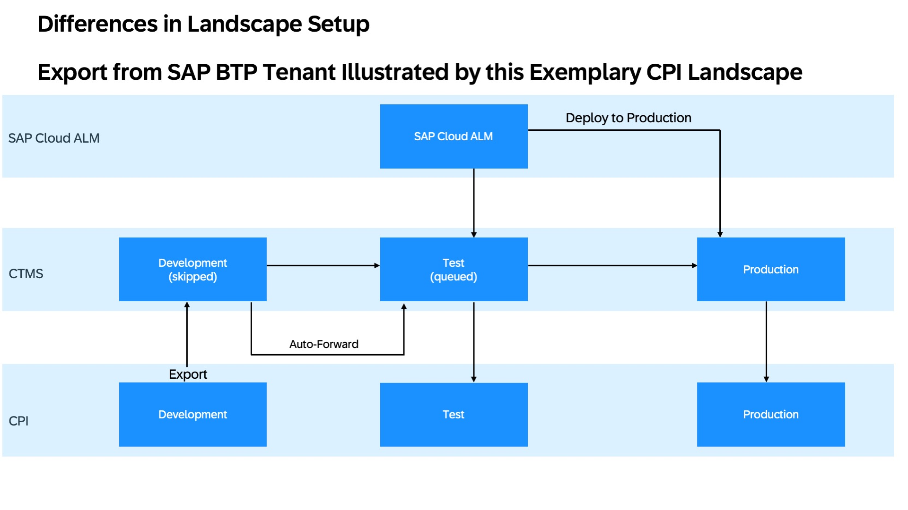

<!-- loio235276ecd95b4c0d9a361614a1304b38 -->

# SAP Cloud Transport Management Service Landscape Requirements

For setting up the SAP Cloud Transport Management Service, both the export use case, like CPI, and the upload use case, like CI/CD, are relevant. In each scenario, you need a dummy development system. The export and upload processes determine which node you should target with the configuration.

For the initial setup of SAP Continuous Integration and Delivery \(CI/CD\), see [Initial Setup](https://help.sap.com/docs/continuous-integration-and-delivery/sap-continuous-integration-and-delivery/initial-setup?version=Cloud).

To integrate CTMS into your CI/CD pipeline, see [Configure a Cloud Foundry Environment Job in Your Repository](https://help.sap.com/docs/continuous-integration-and-delivery/sap-continuous-integration-and-delivery/configure-sap-cloud-application-programming-model-job-in-your-repository?q=configure+sap+fiori+in+cloud+foundry+environment+job+in+your+repository&version=Cloud#release).

To create nodes in CTMS, see [Create Transport Nodes](https://help.sap.com/docs/cloud-transport-management/sap-cloud-transport-management/create-transport-nodes).

<a name="loio235276ecd95b4c0d9a361614a1304b38__section_hyw_bkm_bhc"/>

## Export

If you work with an SAP Business Technology Platform \(SAP BTP\) product \(for example CPI\), usually a two target landscape then results in a three system landscape, and is equivalent for larger landscapes \(n+1\). Your development is already available in the development system, so your transports are exported from the development system and imported into the buffer of the follow-up system test. A target dummy development system is required so that transport requests are forwarded automatically to the first target node.

<a name="loio235276ecd95b4c0d9a361614a1304b38__section_gwb_vjm_bhc"/>

## Upload

For other developments outside of SAP BTP, like Business Application Studio, there's no dedicated cloud development system. In this case, the developments are performed in the Business Application Studio. Your developments are then uploaded with the upload command through the Continuous Integration and Delivery \(CI/CD\) service directly into the test system. This targets the first deployment node and skips the development system. However, the development system is still required for SAP Cloud ALM to identify the order of the systems.

