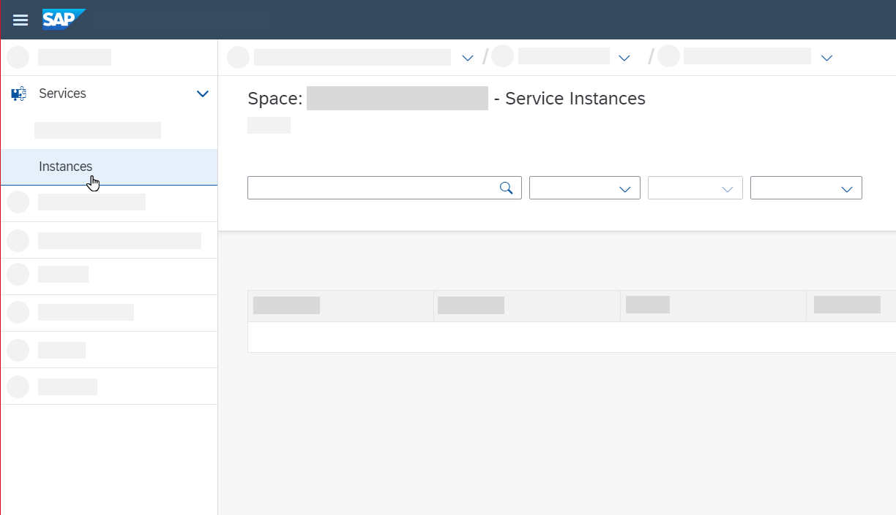
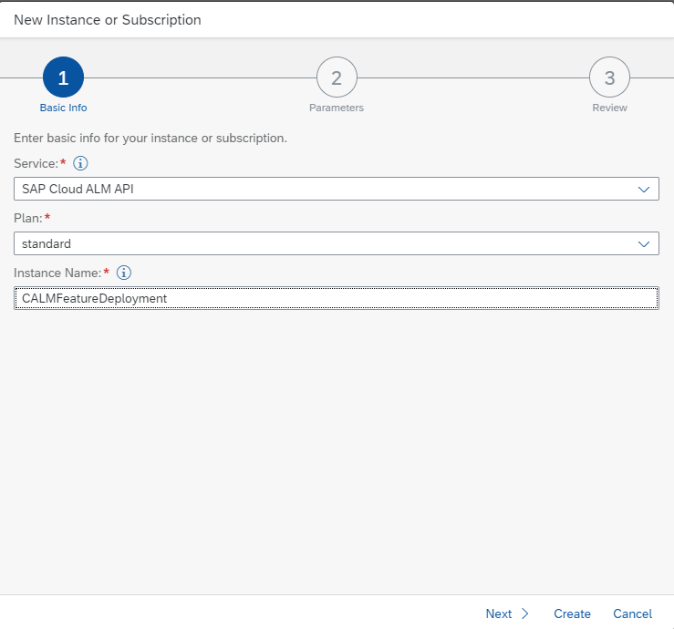

<!-- loio5aa24f076e3b4b47839f762baa7d089a -->

<link rel="stylesheet" type="text/css" href="../css/sap-icons.css"/>

# SAP S/4HANA Cloud, Private Edition and On-Premise Systems

By enabling the transport management for SAP S/4HANA Cloud, private edition, and SAP NetWeaver Application Server for ABAP on-premise, you can orchestrate the deployment of transport requests through your implementation landscape.

In order to use the `Change and Transport System (CTS)` for SAP S/4HANA Cloud, private edition, and SAP NetWeaver Application Server for ABAP on-premise in an SAP Cloud ALM environment, you have to establish a connection between SAP Cloud ALM and the `Change and Transport System (CTS)`. This guide explains all steps that are needed to setup this connection.

SAP Cloud ALM supports the integration of `Change and Transport System (CTS)` for SAP S/4HANA Cloud, private edition, and SAP NetWeaver Application Server for ABAP on-premise.

Please be aware that transport-related data will be pushed to SAP Cloud ALM from your managed systems by setting up the integration.


<a name="loio5aa24f076e3b4b47839f762baa7d089a__section_mx3_ds4_sqb"/>

## Technical Prerequisites for the ABAP System

Before you can start enabling the transport management for SAP S/4HANA Cloud, private edition or SAP NetWeaver Application Server for ABAP on-premise, you need to fulfill the following prerequisites:

-   Install SAP\_BASIS 7.40 SP20 or higher \(accordingly 7.50 SP04\).

-   Install ST-PI 7.40 SP17 or higher. Additionally, please install [3133333 - Collective corrections as of ST-PI 7.40 SP17 for SAP Cloud ALM.](https://launchpad.support.sap.com/#/notes/3133333).


-   Check that the profile parameter`icm/HTTPS/client_sni_enabled` is set to ***TRUE***. For more information, refer to SAP Note [510007](https://launchpad.support.sap.com/#/notes/510007).

    > ### Posting Instructions:  
    > For the profile parameter check you can use the transaction `RZ11` in the managed system.

-   Check that[DigiCert Global Root CA](https://support.sap.com/en/alm/sap-cloud-alm/operations/expert-portal/setup-managed-services/setup-abap/setup-strust.html) is imported in `STRUST` under `SSL Client (Anonymous)` and`SSL Client (Standard)`.


<a name="loio5aa24f076e3b4b47839f762baa7d089a__section_sdm_xx4_sqb"/>

## Required Authorizations

You need to consider two users in the managed ABAP system for the setup. Please note that the authorization steps are only needed for system client 000. For other clients these steps can't be performed.

-   To run transaction `/SDF/ALM_SETUP`, the user needs the PFCG role `SAP_SDF_ALM_SETUP`.

    > ### Note:  
    > In this role, you need to maintain the authorization field `S_BTCH_NAM > BTCUNAME` either with '\*' or with the user name of the user you plan to use as data collection background job user.

-   The user you specify as background user, requires the PFCG role `SAP_SDF_ALM_METRIC_PUSH_FND` and the role `SAP_BC_TRANSPORT_ADMINISTRATOR`.

    Download the latest version of the role `SAP_SDF_ALM_METRIC_PUSH_FND` from SAP Note [3104662](https://launchpad.support.sap.com/#/notes/3104662).


<a name="loio5aa24f076e3b4b47839f762baa7d089a__section_pws_sst_tqb"/>

## Procedure


### Create a Space and Configure Entitlements

As a first step, you need to create a space and configure your entitlements in the subaccount containing your SAP Cloud ALM subscription.

To do this, perform the steps described in [Enabling SAP Cloud ALM API](enabling-sap-cloud-alm-api-704b5dc.md) until you reach the section **Create a New Instance**. Then, carry out the following steps:

**Create a New Instance**:

1.  Choose *Cloud Foundry* \> *Spaces*.

2.  Select the created space. You now see the application list of your created space.

3.  Choose *Services* \> *Instances*.

      

4.  Choose the *Create* dropdown and click on *Service Instance*.

      

5.  Under *Basic Info* provide the following details:

    -   *Service*: SAP Cloud ALM API

    -   *Plan*: standard

    -   *Instance Name*: Enter a meaningful name, for example ***CALMFeatureDeployment***.

      

6.  Choose *Next*.

7.  When creating a service instance for feature deployment, the following configuration in json format is needed in order to assign the required scopes to the service instance.

    Paste the following json code into the text editor:

    > ### Source Code:  
    > ```
    > {
    >     "xs-security": {
    >         "xsappname": "CALMFeatureDeployment",
    >         "authorities": [
    >             "$XSMASTERAPPNAME.imp-cdm-feature-manage-ui"
    >         ]
    >     }
    > }
    > 
    > ```

    In the text editor it should look like this:

      

    -   You can choose your own ***xsappname***. Make sure it’s not already used in another service instance and doesn’t contain spaces or special characters.

    -   Authorities: Make sure to use exactly the string provided above.


8.  Choose *Create*.

9.  When your instance has been created, it's added to the instance list. To show the details of the instance click on the newly created instance.


In the next chapter, you will be guided through the steps for creating a service key, which is later needed to maintain the `HTTP` destination.


### Create a Service Key

The service key allows you to configure the transport management in the managed system so that it can connect to an SAP Cloud ALM API service instance.

1.  Choose <span class="SAP-icons"></span> \(Actions\) and select *Create Service Key*.

      

2.  Enter a name for your service key, such as ***sap\_cloud\_alm\_key***.

3.  Choose *Create*.

4.  Next to your newly created service key, choose <span class="SAP-icons"></span> \(Actions\) and select *View*.

      

5.  You can now see your service key in JSON format.

    The service key is structured in the following way:

    -   Endpoints: e.g.,`eu20.alm.cloud.sap`.

    -   OAuth URL: Service Key parameter.

    -   Client ID: Service key parameter `clientid`.

    -   Client secret: Service key parameter `clientsecret`.


Copy this newly created service key in JSON format to the clipboard because it's needed later in the **Maintain HTTP Destination** section of this guide.

> ### Caution:  
> Outside of the SAP BTP cockpit, service keys must be stored securely. If you need a service key, create the service key directly in the SAP BTP cockpit, and access it from there whenever you need it.


### Configuration of the PUSH Data Provider

The configuration of the Push Data Provider is needed to enable the processing of batch jobs. These batch jobs are then scheduled to send and receive data as well as tasks that are needed for the processing of transport jobs.

1.  Log on to `ABAP system client 000`.

    > ### Note:  
    > Step 1 has to be performed for each system that has to be connected.

2.  Start transaction`/n/SDF/ALM_SETUP`.

    If you start the transaction the first time, it will look like this:

      

    In transaction `/SDF/ALM_SETUP`, perform the following steps:

3.  Target SAP Cloud ALM Destination

    1.  To create a new `SAP Cloud ALM Destination`, enter a name \(e.g. SAP Cloud ALM\) and confirm your input with the [Enter\] key.

    2.  To change an existing SAP Cloud ALM destination, select one from the [F4\] input help and press [Enter\].

    3.  Press [Enter\]. The subsequent fields are filled out automatically.


4.  Maintain HTTP Destination

    1.  Choose *Update Destination*.

    2.  Copy the content of the JSON file you've created by following the steps in the **Create a Service Key** section of this guide. Choose *Paste Service Keys* and paste it into the text field popup.

        Alternatively, you can enter the required fields for SAP Cloud ALM manually:

        > ### Note:  
        > 1.  Token Endpoint: Enter the SAP Cloud ALM `OAuth URL`.
        > 
        >     > ### Note:  
        >     > Example for an OAuth URL: `url + /oauth/token`,e.g. `calm-tenant.authentication.eu10.hana.ondemand.com/oauth/token`
        > 
        > 2.  Client ID: Enter SAP Cloud ALM `client ID`.
        > 
        > 3.  Client Secret: Enter SAP Cloud ALM `client secret`.
        > 
        > 4.  `Proxy User` \(if necessary\)
        > 
        > 5.  `Proxy Password` \(if necessary\)
        > 
        > 6.  `Proxy Host` \(if required by your network infrastructure. For SAP S/4HANA Cloud, private edition, enter value: proxy\)
        > 
        > 7.  `Proxy Port` \(if required by your network infrastructure. For SAP S/4HANA Cloud, private edition, enter value: 3128\)

    3.  Choose *Continue*. The destination should now be updated.

    4.  Choose *Continue*. A success message appears that the connection was established.

5.  Enter Registration Target

    1.  If the *Target ALM Root URL* field is not already pre-filled due to the previous steps, enter the target SAP Cloud ALM root URL depending on your region, e.g. ***https://eu20.alm.cloud.sap.***

        This is the URL that is shown in the JSON file during the creation of the service key. The URL is shown under *endpoints.API* or *uaa.url* respectively. The SAP Cloud ALM root URL depends on the region of the SAP BTP the customer account was created under. Currently, this could be either `eu10.alm.cloud.sap` or `eu20.alm.cloud.sap`.

    2.  Enter the background user you created to perform the data collection.

    3.  Choose *Register* to call SAP Cloud ALM and register the system.

    4.  Choose *Continue*.

        If it’s successful, an `LMS ID` is retrieved and is displayed.

    5.  To unregister a system, choose *Unregister*.

        > ### Note:  
        > This stops all data collection and heartbeat measurements.


6.  Select the use cases you want to collect and push data for. The push mechanism supports the following use-cases:

    -   For development systems: `CALM_CDM_TMS`

    -   For a domain controller system: CALM\_CDM\_TMS\_LNDSCP

    -   All other systems \(test or production\): `CALM_CDM_TMS_IMPORT` 

        After you've selected the use case, choose *Continue*.


    > ### Note:  
    > Further information about activating use cases:
    > 
    > **`CALM_CDM_TMS_LNDSCP CDM TMS` Integration Transport Landscape**
    > 
    > -   Reports the `STMS` landscape configuration to SAP Cloud ALM.
    > 
    > -   Only necessary to set up on one system per domain \(that is the domain controller\). A domain controller is mandatory for the `TMS`. Using the same domain controller to connect to SAP Cloud ALM is optional.
    > 
    > -   Currently supported landscapes:
    > 
    >     -   Landscapes with at least two systems per route \(also virtual systems\)
    > 
    >     -   Landscapes with basic consolidation and/or delivery targets, e.g. TMS quality assurance or transport workflow. These are optional workflows. For more information about these workflows please refer to the following documentation:[TMS Quality Assurance and Transport Workflow](https://help.sap.com/doc/saphelp_qim100/1.0/en-US/9c/a544c6c57111d2b438006094b9ea64/frameset.htm).
    > 
    >     -   Landscapes with client-specific transport routes or by using the `Central Technical Configuration (CTC)`. Using CTC is optional.
    > 
    > 
    > 
    > **`CALM_CDM_TMS CDM TMS` Integration Transport Assignment:**
    > 
    > -   `CALM_CDM_TMS CDM TMS` Integration Transport Assignment reports transport requests to SAP Cloud ALM for assignment to features.
    > 
    > -   It’s only necessary to set up on source systems, specifically `DEV` systems.
    > 
    > 
    > **`CALM_CDM_TMS_IMPORT CDM TMS` Integration Import Task**
    > 
    > -   This task queries to-be-imported requests from SAP Cloud ALM and triggers the import job.
    > 
    > -   It's only necessary to set up on consolidation and target systems for import \(that is, `QA` and `PRD`\)

7.  If everything is set up correctly, it should look like this:

      


