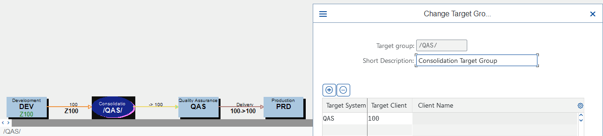
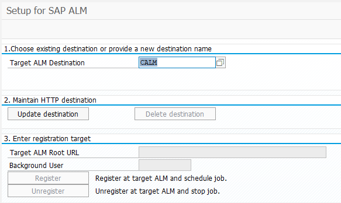
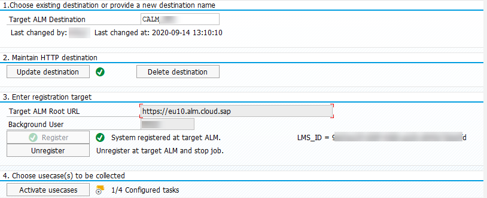
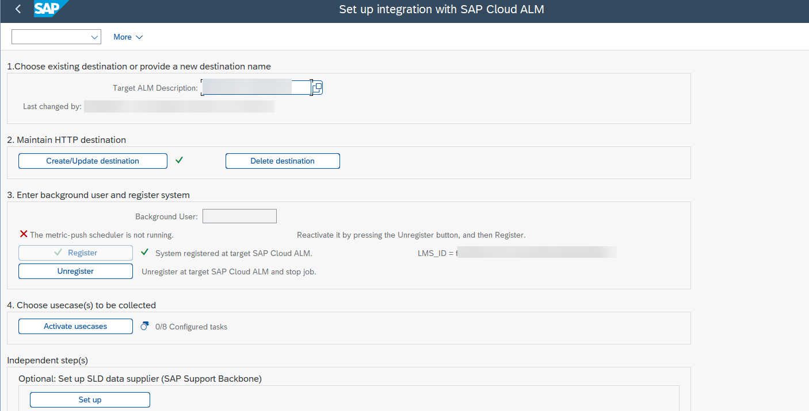
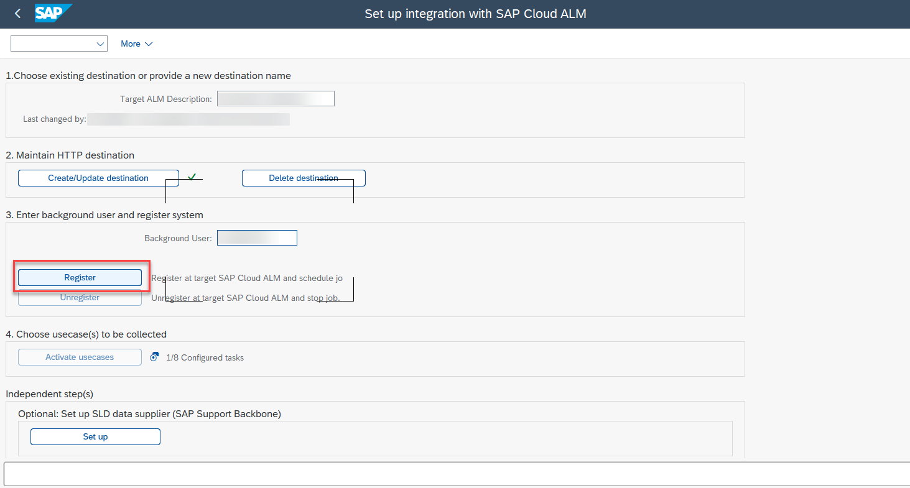
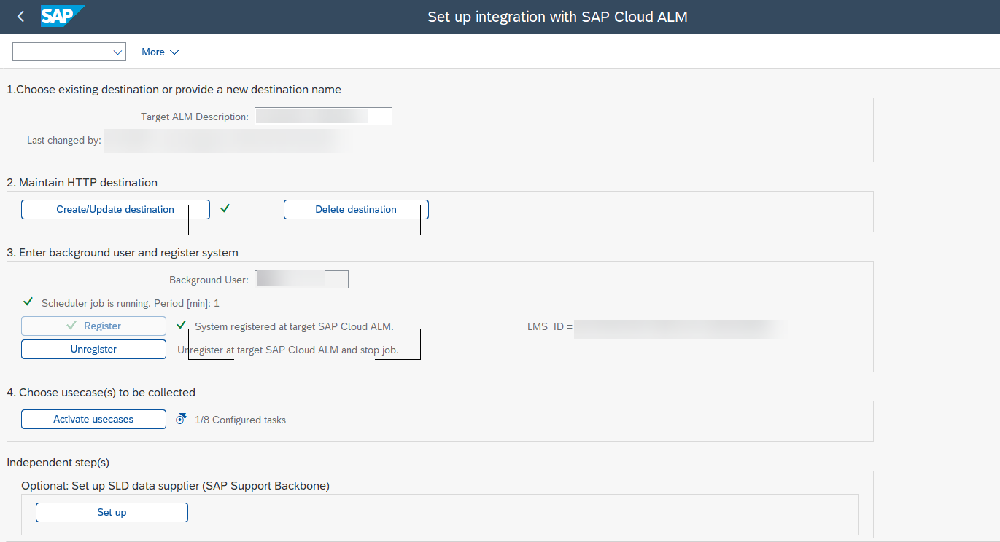

<!-- loio5aa24f076e3b4b47839f762baa7d089a -->

<link rel="stylesheet" type="text/css" href="../css/sap-icons.css"/>

# SAP S/4HANA Cloud, Private Edition and On-Premise Systems

By enabling the transport management for SAP S/4HANA Cloud, private edition, and SAP NetWeaver Application Server for ABAP on-premise, you can orchestrate the deployment of transport requests through your implementation landscape.

To use the `Change and Transport System (CTS)` for SAP S/4HANA Cloud, private edition, and SAP NetWeaver Application Server for ABAP on-premise in an SAP Cloud ALM environment, you've to establish a connection between SAP Cloud ALM and the `(CTS)`.

> ### Caution:  
> Transport-related data is pushed to SAP Cloud ALM from your managed systems by setting up the integration. This includes data of the transport owner.

<a name="loio5aa24f076e3b4b47839f762baa7d089a__section_tyl_m5p_rzb"/>

## Technical Prerequisites

### For the Transport Management System \(TMS\) Setup

Currently supported landscapes:

-   Any kind of consistent Transport Management System \(TMS\) landscape. The last system in a track will always be treated as a production system.

-   Client-specific transport routes \(TMS option CTC\) are strongly recommended.

-   TMS transport groups are supported.

> ### Caution:  
> If you want to implement landscape changes, please note the following information:
> 
> -   Adding new systems to a track is supported as long as no consolidation routes are changed. Mind, that you need to adjust the transport buffers manually.
> 
> -   Refreshing a \(test\) system is supported if the system ID stays the same. This still means, the transport buffers and imports need to be adjusted manually.
> 
> -   Changing delivery routes is partly supported. This means, the transport buffers need to be adjusted manually and removed systems are still reported on in the feature traceability.
> 
> -   Deleting a system from a track is partly supported. This means, the transport buffers need to be adjusted manually and the deleted system is still reported on in the feature traceability.
> 
> -   Changing or deleting export targets is not supported.
> 
> -   Switching on or off client specific transport routes is not supported.

If you need to perform unsupported changes of the transport configuration in the Transport Management System \(TMS\), make sure that all open features and transports are completed and deployed to the production system. Therefore, the transport buffers should be empty.

> ### Tip:  
> We strongly recommend using always client-dependent transport routes \(TMS option CTC\) from the very beginning. By using client-dependent transport routes, you can always enhance your landscape with additional clients. Turning on client-dependent transport routes at a later point in time is a complete landscape change that isn't supported while there are still transports open.
> 
> We strongly recommend using a transport target group as consolidation target. By using the transport target group, you can always change your consolidation systems by just changing the systems within the consolidation target group while technically the consolidation target \(which is the consolation target group\) stays stable.
> 
> 

### For the ABAP System

Before you can start enabling the transport management for SAP S/4HANA Cloud, private edition or SAP NetWeaver Application Server for ABAP on-premise, you need to fulfill the following prerequisites:

-   Install SAP\_BASIS 7.40 SP20 or higher \(accordingly 7.50 SP04\).

-   For ST-PI 740 after SP 25, install [3310406](https://me.sap.com/notes/3310406) and follow SAP Note [3425282](https://me.sap.com/notes/3425282) .

-   For ST-PI 740 SP 25, install [3310406](https://me.sap.com/notes/3310406) and follow SAP Note [3425282](https://me.sap.com/notes/3425282) .

-   For ST-PI 740 SP 23, install [3310406](https://me.sap.com/notes/3310406) and follow SAP Note [3425282](https://me.sap.com/notes/3425282) .

-   For ST-PI 740 SP 22, install [3310406](https://me.sap.com/notes/3310406) and follow SAP Note [3425282](https://me.sap.com/notes/3425282).

-   For ST-PI 740 SP 21, install corrections [3240966](https://me.sap.com/notes/3240966) and follow SAP Note [3425282](https://me.sap.com/notes/3425282).

-   For ST-PI 740 SP 20, install corrections [3240966](https://me.sap.com/notes/3240966) and follow SAP Note [3425282](https://me.sap.com/notes/3425282).

-   For ST-PI 740 SP 19, install corrections [3196078](https://me.sap.com/notes/3196078) and follow SAP Note [3425282](https://me.sap.com/notes/3425282).

-   For ST-PI 740 SP 18, install corrections [3196078](https://me.sap.com/notes/3196078) and follow SAP Note [3425282](https://me.sap.com/notes/3425282).

    It's recommended to install the current version of collective corrections.

-   Check that the profile parameter `icm/HTTPS/client_sni_enabled` is set to `TRUE`, as described in SAP Note [510007](https://me.sap.com/notes/510007).

    > ### Note:  
    > For the profile parameter check, you can use the transaction `RZ11` in the managed system.

-   Check that profile parameter `ssl/client_ciphersuites` is set according to section 7 of SAP Note [510007](https://me.sap.com/notes/510007).

-   Make sure that the following [certificates](https://support.sap.com/en/alm/sap-cloud-alm/operations/expert-portal/setup-managed-services/setup-abap/setup-strust.html) are imported in `STRUST` under *SSL Client \(Anonymous\)* and *SSL Client \(Standard\)*:

    -   DigiCertGlobalRootCA

    -   DigiCertGlobalRootG2

    -   DigiCertRSA4096RootG5

<a name="loio5aa24f076e3b4b47839f762baa7d089a__section_sdm_xx4_sqb"/>

## Required Authorizations

You need to consider two users in the managed ABAP system for the setup.

Note that the authorization steps are only needed for system client 000. For other clients, these steps can't be performed.

-   To run transaction `/SDF/ALM_SETUP`, the user needs the PFCG role `SAP_SDF_ALM_SETUP`.

    > ### Note:  
    > In this role, you need to maintain the authorization field `S_BTCH_NAM > BTCUNAME` either with '\*' or with the user name of the user that you plan to use for the data collection background job.

-   The user you specify as background user requires the PFCG role `SAP_SDF_ALM_METRIC_PUSH_FND` and the role `SAP_BC_TRANSPORT_ADMINISTRATOR`.

    > ### Note:  
    > Don't forget to activate role `SAP_BC_TRANSPORT_ADMINISTRATOR` before using it with the background user.

    Download the latest version of the role `SAP_SDF_ALM_METRIC_PUSH_FND` from SAP Note [3104662](https://me.sap.com/notes/3104662).

<a name="loio5aa24f076e3b4b47839f762baa7d089a__section_pws_sst_tqb"/>

## Procedure

### Create a Space and Configure Entitlements

### Configuration of the PUSH Data Provider

As a first step, retrieve *SAP Cloud ALM API* credentials as described in [Enabling SAP Cloud ALM API](enabling-sap-cloud-alm-api-704b5dc.md).

Depending on the provisioning date of your SAP Cloud ALM tenant, the creation and configuration of your entitlements in the subaccount containing your SAP Cloud ALM subscription is generated automatically or has to be adjusted manually:

-   On or after 2023-10-16: A service binding was generated automatically. You can skip the steps in the linked guide altogether and access your service binding in the SAP BTP cockpit or in the Landscape Management app, as described in [Managing Your Service Key](managing-your-service-key-87b7851.md)

-   Between 2023-06-12 and 2023-10-16: You only need to carry out the steps in the linked guide if you want to set up transport management, but you no longer have to configure your entitlements.

    > ### Note:  
    > If you've already set up an instance previously, it's recommended to set up a new instance with a new name including the respective scopes. If the new instance works and the old one isn't needed anymore, you can delete the old instance.
    > 
    > The procedure for deleting an instance is described here: [Deleting Service Instances](https://help.sap.com/docs/service-manager/sap-service-manager/deleting-service-instances).

-   Before 2023-06-12: No service binding has been created as part of initial provisioning. To create one manually, carry out the steps listed in [Enabling SAP Cloud ALM API](enabling-sap-cloud-alm-api-704b5dc.md).

The configuration of the push data provider is needed to enable the processing of batch jobs. These batch jobs are then scheduled to send and receive data as well as tasks that are needed for the processing of transport jobs.

1.  Log on to `ABAP system client 000`.

    > ### Note:  
    > Step 1 has to be performed for each system that has to be connected.

2.  Start transaction`/n/SDF/ALM_SETUP`.

    If you start the transaction for the first time, it looks like this:

    

3.  *Target ALM Destination*

    1.  To create a new `SAP Cloud ALM Destination`, enter a name \(for example SAP Cloud ALM\) and confirm your input with the [Enter\] key.

    2.  To change an existing SAP Cloud ALM destination, select one from the [F4\] input help and press [Enter\].

    3.  Press [Enter\]. The subsequent fields are filled out automatically.

4.  *Maintain HTTP Destination*

    1.  Choose *Update Destination*.

    2.  Copy the content of the JSON file you've created in the **Create a Service Key** section. Choose *Paste Service Keys* and paste it into the text field popup.

        > ### Note:  
        > Alternatively, you can enter the required fields for SAP Cloud ALM manually:
        > 
        > 1.  *Token Endpoint*: Enter the SAP Cloud ALM `OAuth URL`, following the pattern `url + /oauth/token`.
        > 
        >     Example: `calm-tenant.authentication.eu10.hana.ondemand.com/oauth/token`
        > 
        > 2.  *Client ID*: Enter SAP Cloud ALM `client ID`.
        > 
        > 3.  *Client Secret*: Enter SAP Cloud ALM `client secret`.
        > 
        > 4.  *Proxy User* \(if necessary\)
        > 
        > 5.  *Proxy Password* \(if necessary\)
        > 
        > 6.  *Proxy Host* \(if required by your network infrastructure. For SAP S/4HANA Cloud, private edition, enter value: proxy\)
        > 
        > 7.  *Proxy Port* \(if required by your network infrastructure. For SAP S/4HANA Cloud, private edition, enter value: 3128\)

    3.  Choose *Continue*. The destination is now updated.

    4.  Choose *Continue*. A success message appears if the connection was established.

5.  *Enter Registration Target*

    1.  If the *Target ALM Root URL* field isn't already prefilled, enter the target SAP Cloud ALM root URL depending on your region, for example `https://eu20.alm.cloud.sap`.

        This is the URL that is shown in the JSON file during the creation of the service key. The URL is shown under *endpoints.API* or *uaa.url* respectively. The SAP Cloud ALM root URL depends on the region of the customer account was created under, for example `eu10.alm.cloud.sap` or `eu20.alm.cloud.sap`.

    2.  Enter the background user that you created to perform the data collection.

    3.  Choose *Register* to call SAP Cloud ALM and register the system.

    4.  Choose *Continue*.

        An `LMS ID` is retrieved and displayed.

    > ### Note:  
    > To unregister a system, choose *Unregister*.
    > 
    > This stops all data collection and heartbeat measurements.

6.  Select the use cases that you want to collect and push data for. The push mechanism supports the following use cases:

    -   For development systems: `Feature Deployment: Manage Transports`

    -   For a domain controller system: `Feature Deployment: Read Landscape`

    -   All other systems \(test or production\): `Feature Deployment: Import Transports` 

    > ### Tip:  
    > Further information about activating use cases:
    > 
    > **Feature Deployment: Read Landscape**
    > 
    > -   Reports the `STMS` landscape configuration to SAP Cloud ALM.
    > 
    > -   It's only necessary to set up on one system per domain \(that is the domain controller\). A domain controller is mandatory for the TMS. Using the same domain controller to connect to SAP Cloud ALM is optional.
    > 
    > 
    > **Feature Deployment: Manage Transports**
    > 
    > -   Reports transport requests to SAP Cloud ALM for assignment to features.
    > 
    > -   It's only necessary to set up on source systems, specifically DEV systems.
    > 
    > 
    > **Feature Deployment: Import Transports**
    > 
    > -   Queries the requests that are to be imported from SAP Cloud ALM and triggers the import job.
    > 
    > -   Only needs to be set up on consolidation and target systems for import \(that is, QA and PRD systems\).

    > ### Note:  
    > Commonly, authorization-checks are performed in the system where a change happens. For *Features* app, this app takes over the authorization check for importing transports in the SAP Cloud ALM environment instead of the managed system. In the managed system, the user you specified as background user for the data collection performs the transport actions. Since this background user has transport authorization by definition, the distinct check whether a specific end user is allowed to perform a transport operation is done in SAP Cloud ALM.

7.  Choose *Continue*.

8.  If everything is set up correctly, it looks like this:

    

<a name="loio5aa24f076e3b4b47839f762baa7d089a__section_amq_jvv_k5b"/>

## Configuration of Client-Dependent Use Cases

The following client-dependent use cases are available to you:

-   Create transports

-   Delete empty transports

-   Release transports

-   Transport of copies

### Relevant Jobs in Managed Systems

There are important jobs to be executed in the managed systems. The jobs mentioned below should be at least released, but always check for scheduled and active jobs in case of issues.

To create and release transports as well as creating transport of copies, for example in client 100 of the development system use the following transaction:`/SDF/CALM_CDM_TR_PROC_CL_DEP-100`

> ### Note:  
> The job `/SDF/CALM_CDM_DIAGNOSTICS` pushes data about the available capabilities in the managed system `ST-PI`to SAP Cloud ALM.
> 
> This job is supposed to be released and executed once per day and client.
> 
> For the import of transports there is a job executed in each target system client `000`:`/SDF/CALM_CDM_IMPORT_TRANSPORTS`

To enable the use cases mentioned above within an SAP Cloud ALM feature, execute the following setup in each development client that you want to use:

> ### Note:  
> Before you start with the setup, please make sure that you've performed all the configuration steps in the **Technical Prerequisites for the ABAP System** section of this guide. Additionally, make sure that you've implemented the current version of the SAP Note. Currently it's [3322679](https://me.sap.com/notes/3322679).
> 
> Also make sure that setup for client 000 was already performed and that the use case **Feature Deployment: Manage Transports** was already activated.

1.  Log on to the respective ABAP system client and start transaction `/n/SDF/ALM_SETUP`.

2.  You can reuse the SAP Cloud ALM destination from your PUSH data configuration.

    At the start of the process, the transaction looks like this:

    

3.  Under *Maintain HTTP Destination*, choose *Update Destination* and paste the JSON file you've already created in the **Configuration of the PUSH Data Provider** section of this guide.

4.  Under *Enter Background User and Register System*, choose *Unregister*.

5.  Enter the background user you've created to perform the data collection.

6.  Choose *Register* to call SAP Cloud ALM and register the system. Confirm the scheduling of the respective jobs.

    

    If it’s successful, an `LMS ID` is retrieved and is displayed.

7.  Select the use case you want to activate:

    `Feature Deployment: Manage Transport per Client`

    -   Queries to-be-released transport requests from SAP Cloud ALM and triggers the release job.
    -   It's necessary to execute this setup on all development clients you use for customizing activities.

8.  If everything is set up correctly, it looks like this:

    

<a name="loio5aa24f076e3b4b47839f762baa7d089a__section_z4g_lfq_d1c"/>

## Configuration of the Transport Organizer Web UI

Before you can start using the navigation to the transport organizer for CTS managed transports by using the transport id in the *Features* app, you have to activate the web-service for transport organizer web ui.

Please follow the steps in the [Activating the Web Service for Transport Organizer Web UI](https://help.sap.com/docs/SAP_NETWEAVER_700/109ce05a6c531014b4e8fe6b0570a984/45ec35a90fdc3481e10000000a1553f6.html) documentation.

> ### Note:  
> If the transport organizer web ui is throwing exceptions, check the following:
> 
> -   Make sure that you've configured the start authorization according the following notes: [1413011](https://me.sap.com/notes/1413011) and/or [3064888](https://me.sap.com/notes/3064888) respectively.
> 
> -   Check the HTTP\_WHITELIST [0002578665](https://me.sap.com/notes/0002578665) and the UCON\_CHW allowlist [0003290787](https://me.sap.com/notes/0003290787).

<a name="loio5aa24f076e3b4b47839f762baa7d089a__section_zls_yfj_gvb"/>

## Reporting Incidents

If you encounter issues while using this app, open  \(Built-In Support\) to find helpful resources and context-sensitive information, and to chat with SAP experts. You can also book a live session with the [Schedule an Expert](https://me.sap.com/app/sae) function in SAP for Me.

Create incidents for the *Features* app in [SAP for Me](https://me.sap.com/app/casecreate), under component SV-CLM-IMP-FTR .

