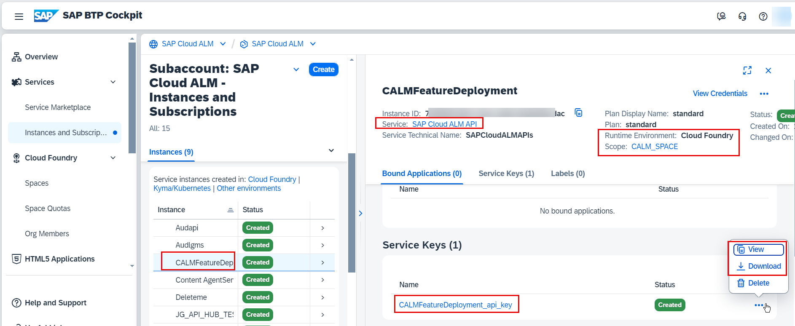
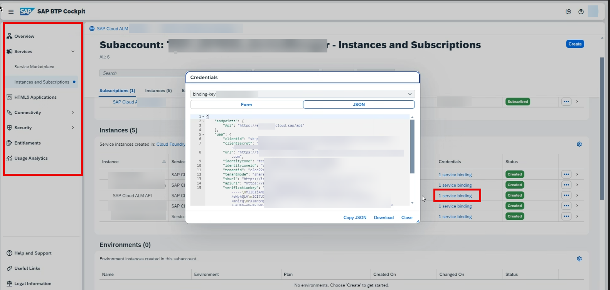
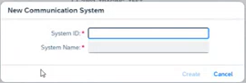
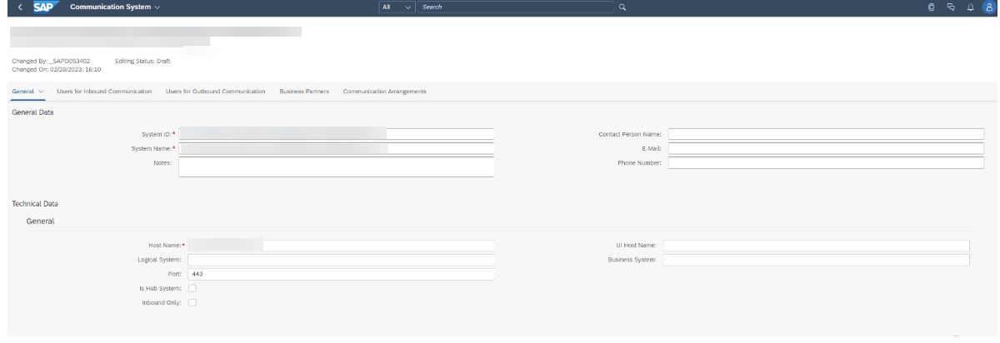
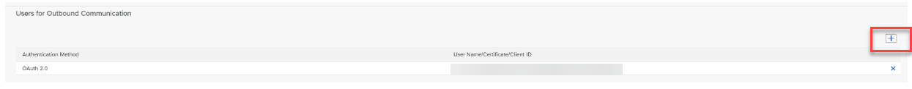
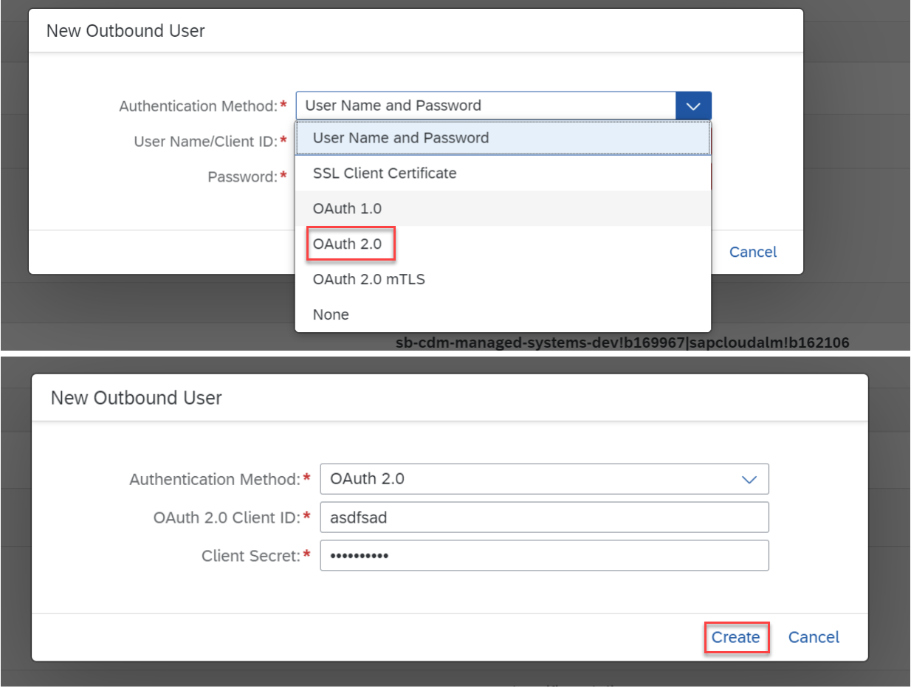
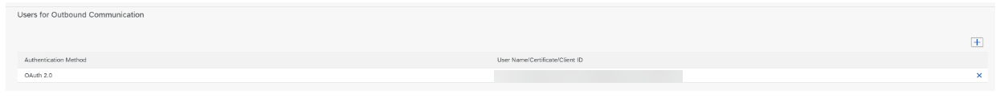
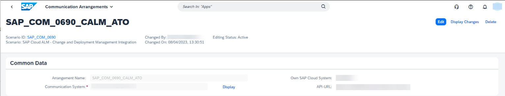
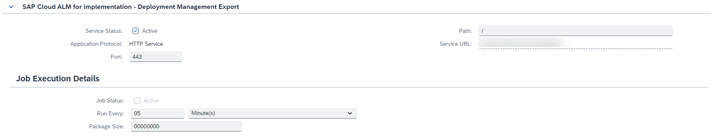

<!-- loioa4238a9e586046268a1de5ea03ec6930 -->

<link rel="stylesheet" type="text/css" href="../css/sap-icons.css"/>

# SAP S/4HANA Cloud Public Edition

Enable the transport management with Adaptation Transport Organizer.

By enabling the transport management for SAP S/4HANA Cloud Public Edition with the Adaptation Transport Organizer \(ATO\), you can keep track of the deployment of transport requests through your implementation landscape.

> ### Note:  
> Only released transports can be assigned to features. For more information, see [Integration of Deployment Tools](https://help.sap.com/docs/cloud-alm/applicationhelp/deployment-tool-integration).

To use the ATO for SAP S/4HANA Cloud Public Edition in an SAP Cloud ALM environment, you have to establish a connection between SAP Cloud ALM and the ATO.

> ### Note:  
> If you have multiple SAP Cloud ALM tenants, you should only connect your SAP S/4HANA Cloud Public Edition tenants to your productive SAP Cloud ALM tenant.


<a name="loioa4238a9e586046268a1de5ea03ec6930__section_iqv_ndc_ybc"/>

## Getting the Binding Credentials of the SAP Cloud ALM API Service Instance

Depending on when you requested the SAP Cloud ALM tenant provisioning, there are differences in receiving the SAP Cloud ALM API binding credentials.

The following sections show you what to do depending on when you requested SAP Cloud ALM. For more information, see also [Retrieving Service Credentials](retrieving-service-credentials-448f9f1.md).


### On or after October 16, 2023

The required service credentials have already been generated automatically as part of the provisioning of your SAP Cloud ALM tenant.

You can access your credentials in the SAP BTP cockpit or in the *Landscape Management* app, as described in [Managing Your Service Credentials](managing-your-service-credentials-87b7851.md).


### Between June 12, 2023 and October 16, 2023

You only need to create manually a new instance for the SAP Cloud ALM API if you want to use the Deployment scenario described here. For this, see section *Create or Update an Instance* in [Enabling SAP Cloud ALM API](enabling-sap-cloud-alm-api-704b5dc.md).

Make sure to paste the following JSON code into the text editor as:

```
{

    "xs-security": {

        "xsappname": "<your-instance-name>",

        "authorities": [

                                             "$XSMASTERAPPNAME.imp-cdm-feature-display-ui",

                                             "$XSMASTERAPPNAME.imp-cdm-feature-manage-ui"

        ]

    }

}


```


### Before June 12, 2023

If you haven't created the SAP Cloud ALM API service instance, follow the steps in [Enabling SAP Cloud ALM API](enabling-sap-cloud-alm-api-704b5dc.md) to get the binding credentials.

Example of the binding credential in the SAP BTP cockpit for SAP Cloud ALM subaccount:



Example for the binding credential in the SAP BTP cockpit for SAP Cloud ALM subbacount where the Cloud Foundry environment hasn't been activated yet:




<a name="loioa4238a9e586046268a1de5ea03ec6930__section_i1h_2n3_wwb"/>

## Procedure

> ### Caution:  
> To enable the assignment of SAP S/4HANA Cloud Public Edition transports, you have to establish a communication arrangement for your development tenants and test tenants with SAP Cloud ALM. This is important as transports exported from your development system or imported to your test system only show the correct transport status after you’ve established the communication arrangement for **both** your development and test tenant.
> 
> In case you provision a production tenant later, make sure to establish the communication arrangement before the first import to production. Otherwise, you loose the transport status. There is no option to resynchronize the data.

1.  **Create communication system**: Create a communication system using the *Communication System* app that represents the SAP Cloud ALM tenant you want to communicate with.

    For more information about communication systems in SAP S/4HANA Cloud context, see [Communication Management](https://help.sap.com/docs/SAP_S4HANA_CLOUD/0f69f8fb28ac4bf48d2b57b9637e81fa/2e84a10c430645a88bdbfaaa23ac9ff7.html?locale=en-US) 

    > ### Note:  
    > The following steps have to be performed for every tenant you want to establish.

    1.  In the *Communication Systems* app, set up a new communication system by choosing *New*.

        Set up a communication system using any ID in the *System ID* field and with a reasonable name \(for example the tenant name, you want to communicate with\) in the *System Name* field.

        

    2.  Choose *Create*.

    3.  In the next view, add the root URL from the SAP Cloud ALM API \(see step 1 of this guide\) in the*Host Name* field and the port \(443\) into the *Port* field in the *Technical Data - General* section.

        The relevant entry for the host name is the following: `{ “endpoints”: { “Api” . https://eu10.alm.cloud.sap/api }`. Enter the URL without the `/api` extension at the end.

        

    4.  Add a token URL based on the UAA url from your SAP Cloud ALM API instance in the *Token Endpoint* field and add `/oauth/token` at the end of the URL.

        The token URL in the binding credential JSON file looks like that:`"url": "https://tenant-name.authentication.eu10.hana.ondemand.com"`

        

    5.  To create a new outbound user, go to the *Users for Outbound Communication* section of the *Communication Systems* app and choose :heavy_plus_sign:.

        

    6.  Choose Oauth 2.0 in the *Authentication Method* dropdown and enter your credentials based on client ID and secret from your SAP Cloud ALM API instance in the *OAuth 2.0 Client ID* and *Client Secret* fields.

        You can find the client ID and secret in the UAA section of the binding credential JSON and has a structure like in the following examples:`"clientid": "instance-name!b123456|sapcloudalm!b456789"` and `"clientsecret": "asdfasdfasdfasdfasdfasdf"`.

        

    7.  Choose *Create*.

        The entry now looks like this:

        

    8.  Choose *Save*.


2.  **Create a communication arrangement**:

    1.  Create a communication arrangement in the *Communication Arrangement* app based on scenario SAP\_COM\_0690 and use the system that was created in step 2 of this guide.

        

    2.  Go to the *Outbound Services* section in the *Communication Arrangement* app. In this section you can find the following four outbound services.

        -   SAP Cloud ALM for implementation - Deployment Management Export

        -   SAP Cloud ALM for implementation - Deployment Management Import

        -   SAP Cloud ALM for implementation - Deployment Management Retry

        -   SAP Cloud ALM for implementation - Deployment Management Status Change


        In each of this outbound services, the same entries have to be filled out by you.

        

        Make sure that the *Service Status* is marked as *Active* and that the *Port* entry is filled out with 443.

        In the *Job Execution Details* section, the *Job Status* doesn't have to be checked as this will be scheduled automatically in the background.

    3.  In the *Run Every* field, enter 5 minutes.

        The *Package Size* entry can be ignored.

    4.  Choose *Save*.


<a name="loioa4238a9e586046268a1de5ea03ec6930__section_sfl_qyk_gxb"/>

## Information About Available Outbound Services

The following list contains the outbound services that are currently available:

-   Export: This outbound scenario reacts to exported ATO collection versions

-   Import: This service notifies SAP Cloud ALM about imports that were performed by ATO

-   Retry: Retries failed communication between ATO and SAP Cloud ALM

-   Status Change: This service reacts to ATO status changes and sends these changes to SAP Cloud ALM


> ### Note:  
> The collector jobs can only react to future events once they are activated. Past actions before the activation are not collected.


<a name="loioa4238a9e586046268a1de5ea03ec6930__section_zls_yfj_gvb"/>

## Reporting Incidents

If you encounter issues while using this app, open <span class="SAP-icons-V5"></span> \(Built-In Support\) to find helpful resources and context-sensitive information, and to chat with SAP experts. You can also book a live session with the [Schedule an Expert](https://me.sap.com/app/sae) function in SAP for Me.

Create incidents for the *Features* app in [SAP for Me](https://me.sap.com/app/casecreate), under component SV-CLM-IMP-FTR .

**Parent topic:**[Enabling Transport Management](enabling-transport-management-4b74b16.md "Learn how to enable the transport management of different transport environments for SAP Cloud ALM.")

**Related Information**  


[SAP S/4HANA Cloud Private Edition and On-Premise Systems](sap-s-4hana-cloud-private-edition-and-on-premise-systems-5aa24f0.md "Learn how to configure your SAP Cloud ALM deployment scenario for CTS integration.")

[SAP Cloud Transport Management Service](sap-cloud-transport-management-service-8b4af2f.md "Enable the transport management for the SAP Cloud Transport Management service for SAP Cloud ALM.")

[Tips and Troubleshooting for Your Setups](tips-and-troubleshooting-for-your-setups-0fb29d9.md "Find information on how to fix issues.")

