<!-- loioa4238a9e586046268a1de5ea03ec6930 -->

<link rel="stylesheet" type="text/css" href="../css/sap-icons.css"/>

# SAP S/4HANA Cloud Public Edition

Enable the transport management with Adaptation Transport Organizer.

By enabling the transport management for SAP S/4HANA Cloud Public Edition with the Adaptation Transport Organizer \(ATO\), you can keep track of the deployment of transport requests through your implementation landscape.

To use the ATO for SAP S/4HANA Cloud Public Edition in an SAP Cloud ALM environment, you have to establish a connection between SAP Cloud ALM and the ATO.

> ### Note:  
> If you have multiple SAP Cloud ALM tenants, you should only connect your SAP S/4HANA Cloud Public Edition tenants to your productive SAP Cloud ALM tenant.


<a name="loioa4238a9e586046268a1de5ea03ec6930__section_iqv_ndc_ybc"/>

## Getting the Binding Credentials of the SAP Cloud ALM API Service Instance

Depending on when you requested the SAP Cloud ALM tenant provisioning, there are differences in receiving the SAP Cloud ALM API binding credentials.

The following sections show you what to do depending on when you requested SAP Cloud ALM. For more information, see also [Retrieving Service Credentials](retrieving-service-credentials-448f9f1.md).


### On or after October 16, 2023

The required service credentials have already been generated automatically as part of the provisioning of your SAP Cloud ALM tenant.

You can access your credentials in the SAP BTP cockpit or in the *Landscape Management* app, as described in [Managing Your Service Credentials](managing-your-service-credentials-87b7851.md).


### Between June 12, 2023 and October 16, 2023

You only need to create manually a new instance for the SAP Cloud ALM API if you want to use the Deployment scenario described here. For this, see section *Create or Update an Instance* in [Enabling SAP Cloud ALM API](enabling-sap-cloud-alm-api-704b5dc.md).

Make sure to paste the following JSON code into the text editor as:

```
{

    "xs-security": {

        "xsappname": "<your-instance-name>",

        "authorities": [

                                             "$XSMASTERAPPNAME.imp-cdm-feature-display-ui",

                                             "$XSMASTERAPPNAME.imp-cdm-feature-manage-ui"

        ]

    }

}


```


### Before June 12, 2023

If you haven't created the SAP Cloud ALM API service instance, follow the steps in [Enabling SAP Cloud ALM API](enabling-sap-cloud-alm-api-704b5dc.md) to get the binding credentials.

Example of the binding credential in the SAP BTP cockpit for SAP Cloud ALM subaccount:

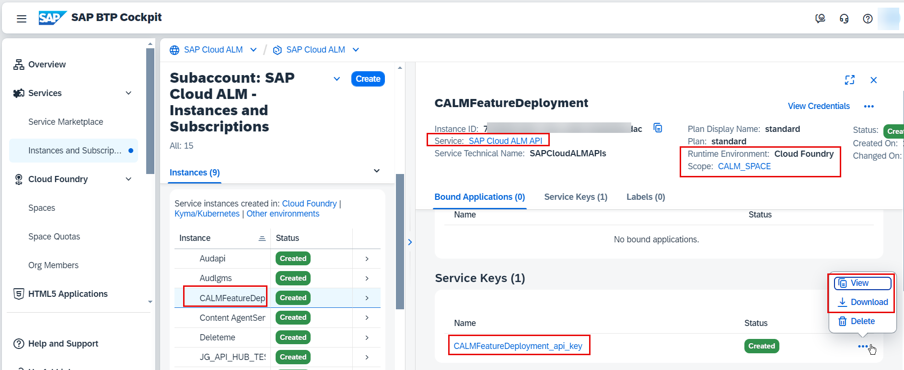

Example for the binding credential in the SAP BTP cockpit for SAP Cloud ALM subbacount where the Cloud Foundry environment hasn't been activated yet:

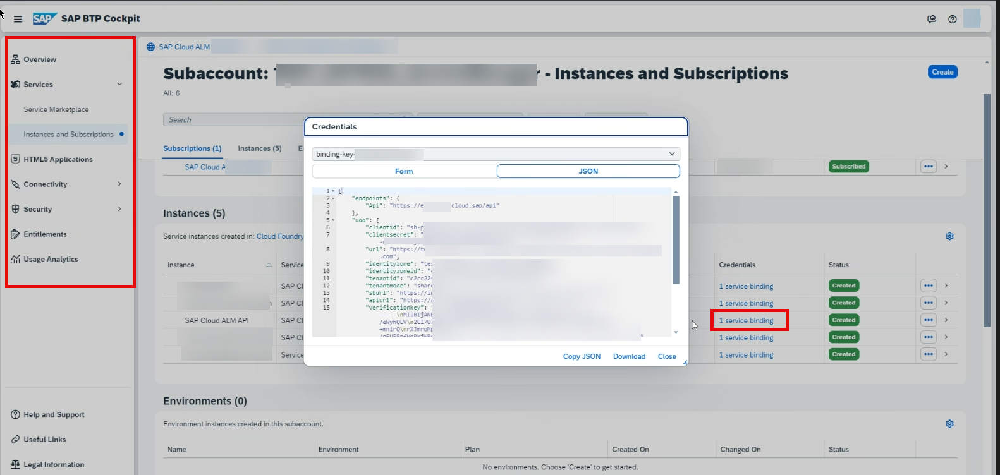


<a name="loioa4238a9e586046268a1de5ea03ec6930__section_i1h_2n3_wwb"/>

## Procedure

> ### Caution:  
> To enable the assignment of SAP S/4HANA Cloud Public Edition transports, you have to establish a communication arrangement for your development tenants and test tenants with SAP Cloud ALM. This is important as transports exported from your development system or imported to your test system only show the correct transport status after you’ve established the communication arrangement for **both** your development and test tenant.
> 
> In case you provision a production tenant later, make sure to establish the communication arrangement before the first import to production. Otherwise, you lose the transport status. There is no option to resynchronize the data.

1.  Create a service key/service binding for mTLS authentication in your SAP Cloud ALM subaccount in the SAP BTP Cockpit as described in [Create a Service Key for mTLS Authentication](https://help.sap.com/docs/cloud-alm/apis/creating-service-keys-mtls?ai=true). This creates the two certificate files you need create inbound and outbound users.

    > ### Note:  
    > We recommend to use an existing service instance with *SAP Cloud ALM API* as *Service* type to create your service keys.
    > 
    > In case you don't have an existing service instance, create the instance as described here [Enabling SAP Cloud ALM API](https://help.sap.com/docs/cloud-alm/apis/enabling-sap-cloud-alm-apis?ai=true).

2.  Create a communication system in the *Communication System* app that represents the SAP Cloud ALM tenant you want to communicate with.

    For more information about communication systems in SAP S/4HANA Cloud context, see [Communication Management](https://help.sap.com/docs/SAP_S4HANA_CLOUD/0f69f8fb28ac4bf48d2b57b9637e81fa/2e84a10c430645a88bdbfaaa23ac9ff7.html?locale=en-US).

    > ### Note:  
    > The following steps have to be performed for every tenant you want to establish a connection.

    1.  In the *Communication Systems* app, set up a new communication system by choosing *New*.

        Set up a communication system using any ID in the *System ID* field and with a reasonable name \(for example the tenant name, you want to communicate with\) in the *System Name* field.

        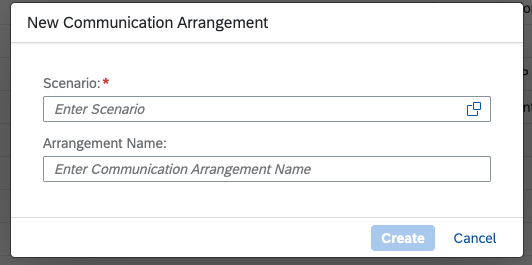

    2.  Choose *Create*.

    3.  In the next view, add the root URL from the SAP Cloud ALM API \(see step 1 of this guide\) in the*Host Name* field and the port \(443\) into the *Port* field in the *Technical Data - General* section.

        The relevant entry for the host name is like the following example: `{ “endpoints”: { “Api” . https://eu10.alm.cloud.sap/api }`. Enter the URL without the `/api` extension at the end, for example: eu10.alm.cloud.sap.

        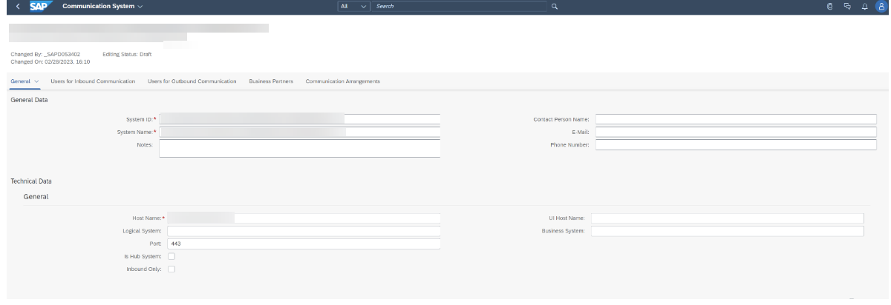

    4.  Add a token URL based on the UAA url from your SAP Cloud ALM API instance in the *Token Endpoint* field and add `/oauth/token` at the end of the URL.

        The token URL in the binding credential JSON file looks like the following example: `"url": "https://tenant-name.authentication.eu10.hana.ondemand.com"`

        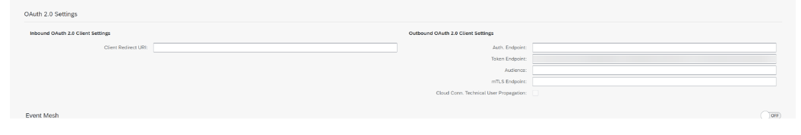


3.  Create a new inbound user.

    1.  Go to the *Users for Inbound Communication* section in the *Communications Systems* app and choose *\+*.

        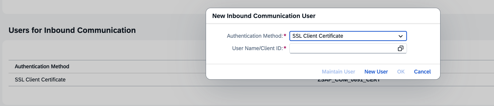

    2.  As *Authentication Method*, choose *SSL Client Certificate* and enter a User Name/Client ID.

    3.  Select *New User*.

    4.  In the next dialog, upload your certificate.

        > ### Note:  
        > For this, you need the certificate-only file. The certificate file can be generated from the x509 service key using the special JSON. The certificate file then has to be modified to *.pem* format. For more information, see [Create a Service Key for mTLS Authentication](https://help.sap.com/docs/cloud-alm/apis/creating-service-keys-mtls?ai=true).
        > 
        > You can use this script to generate the certificate-only file [SAP Cloud ALM APIs with mTLS](https://github.com/SAP-samples/cloud-alm-api-examples/tree/main/mtls-setup).

        > ### Note:  
        > We recommend to deactivate the password of the user.


4.  Create a new outbound user.

    1.  Go to the *Users for Outbound Communication* section in the *Communication Systems* app and choose *\+*.

        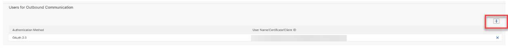

    2.  As *Authentication Method*, choose *OAuth 2.0*.

    3.  Enter your OAuth 2.0 Client ID based on the client ID from your SAP Cloud ALM API instance.

        > ### Note:  
        > You find the client ID in the UAA section of the binding credential JSON. The structure is the following: "clientid": "instance-name!b123456|sapcloudalm!b456789".

    4.  As *Client Authentication*, choose *mTLS*.

    5.  Upload your SSL Client Certificate.

        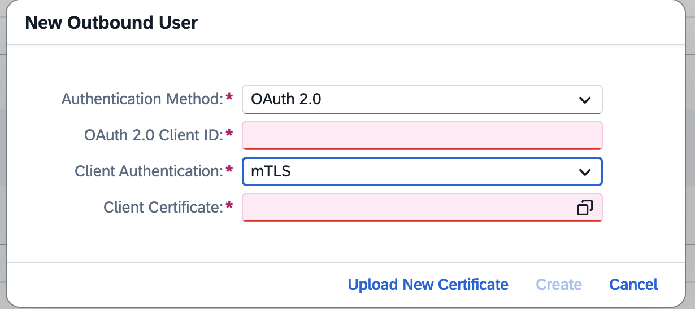

        > ### Note:  
        > The certificate file can be generated from the x509 service key using the special JSON. For more information, see [Create a Service Key for mTLS Authentication](https://help.sap.com/docs/cloud-alm/apis/creating-service-keys-mtls?ai=true).
        > 
        > The certificate has to be an SAP S/4HANA compatible format. For this, you need the combined certificate and key pfx file.
        > 
        > You can use this script to generate the combined certificate and key pfx file [SAP Cloud ALM APIs with mTLS](https://github.com/SAP-samples/cloud-alm-api-examples/tree/main/mtls-setup).
        > 
        > Alternatively, you can use the following OpenSSL command:
        > 
        > `openssl pkcs12 -export -out certificate.pfx -in certificate.pem -inkey key.pem -passin pass:root -passout pass:root`

    6.  After you uploaded the certificate, the dialog for the new outbound user is displayed again. Make sure that for the authentication method *OAuth 2.0* and for the client authentication *mTLS* are selected.

        > ### Tip:  
        > In the *Manage Client Certificates* app, you can check and manage your certificates.


5.  Create a communication arrangement in the *Communication Arrangement* app based on scenario SAP\_COM\_0690 and use the system that you created in step 1.

    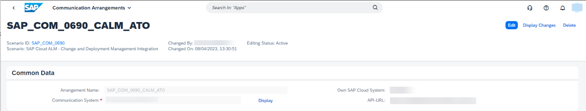

    1.  Assign the system that you created in step 1 of this guide.

        > ### Note:  
        > This automatically fills out the fields for Inbound Communication and Outbound Communication.

        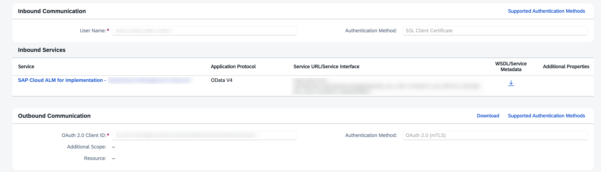

    2.  Go to the *Outbound Services* section in the *Communication Arrangement* app. In this section you can find the following four outbound services.

        -   SAP Cloud ALM for implementation - Deployment Management Export

        -   SAP Cloud ALM for implementation - Deployment Management Import

        -   SAP Cloud ALM for implementation - Deployment Management Retry

        -   SAP Cloud ALM for implementation - Deployment Management Status Change


        In each of this outbound services, the same entries have to be filled out by you.

        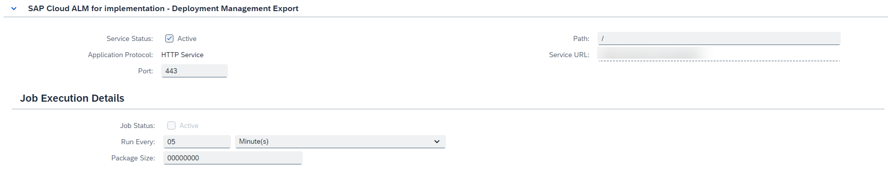

        Make sure that the *Service Status* is marked as *Active* and that the *Port* entry is filled out with 443.

        In the *Job Execution Details* section, the *Job Status* doesn't have to be checked as this will be scheduled automatically in the background.

    3.  In the *Run Every* field, enter 5 minutes.

        The *Package Size* entry can be ignored.

    4.  Choose *Save*.


6.  Create destinations in the SAP BTP Cockpit.

    1.  Go to the SAP BTP Cockpit and open the *Destination Certificates* tab.

    2.  Select *Import* and upload your *pfx* certificate file.

        > ### Note:  
        > You can ignore the error "Failed to display certificate content". After you entered your password in step h, the certificate can be used.

    3.  Open the *Destinations* tab.

    4.  Create a destination for each system, for example, DEV and PROD.

    5.  The destination *Name* has to start with `CALM_FTR_ATO_`. Then, you have to append your *Global Tenant ID* at the end of your destination name. For example, CALM\_FTR\_ATO\_74558820099.

        > ### Note:  
        > You can check the *System Number* which corresponds to the *Global Tenant ID* in the *Landscape Management* app.

    6.  For *Authentication*, choose *ClientCertificateAuthentication*.

    7.  For *Key Store Location*, choose the *pfx* certificate file you uploaded.

    8.  Enter your *Key Store Password*.

    9.  For *URL*, enter the *Service URL/Service Interface* URL from the *Communication Arrangements* app.

    10. In the *Description*, we recommend to add the system for which you're using the destination.


<a name="loioa4238a9e586046268a1de5ea03ec6930__section_sfl_qyk_gxb"/>

## Information About Available Outbound Services

The following list contains the currently available outbound services:

-   Export: This outbound scenario reacts to exported ATO collection versions

-   Import: This service notifies SAP Cloud ALM about imports that were performed by ATO

-   Retry: Retries failed communication between ATO and SAP Cloud ALM

-   Status Change: This service reacts to ATO status changes and sends these changes to SAP Cloud ALM


> ### Note:  
> The collector jobs can only react to future events once they are activated. Past actions before the activation are not collected.


## Information About Available Inbound Services

With the inbound scenario, transport actions can be triggered by SAP Cloud ALM from the ABAP Platform Cloud tenant towards the Adaptation Transport Organizer.

The following list contains the currently available inbound services:

-   Create transports


<a name="loioa4238a9e586046268a1de5ea03ec6930__section_zls_yfj_gvb"/>

## Reporting Incidents

If you encounter issues while using this app, open <span class="SAP-icons-V5"></span> \(Built-In Support\) to find helpful resources and context-sensitive information, and to chat with SAP experts. You can also book a live session with the [Schedule an Expert](https://me.sap.com/app/sae) function in SAP for Me.

Create incidents for the *Features* app in [SAP for Me](https://me.sap.com/app/casecreate), under component SV-CLM-IMP-FTR .

**Parent topic:**[Enabling Transport Management](enabling-transport-management-4b74b16.md "Learn how to enable the transport management of different transport environments for SAP Cloud ALM.")

**Related Information**  


[SAP S/4HANA Cloud Private Edition and On-Premise Systems](sap-s-4hana-cloud-private-edition-and-on-premise-systems-5aa24f0.md "Learn how to configure your SAP Cloud ALM deployment scenario for CTS integration.")

[SAP Cloud Transport Management Service](sap-cloud-transport-management-service-8b4af2f.md "Enable the transport management for the SAP Cloud Transport Management service for SAP Cloud ALM.")

[Tips and Troubleshooting for Your Setups](tips-and-troubleshooting-for-your-setups-0fb29d9.md "Find information on how to fix issues.")

