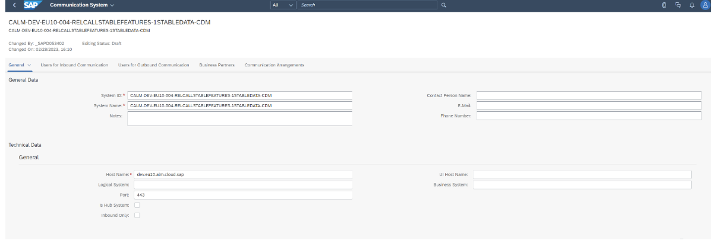
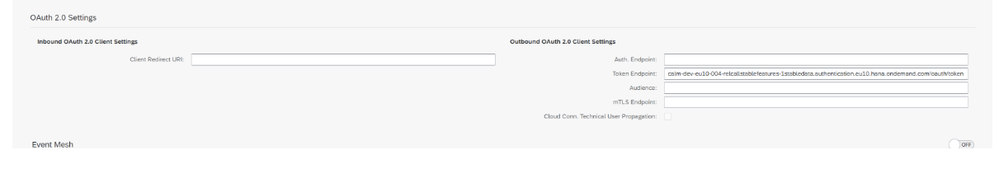
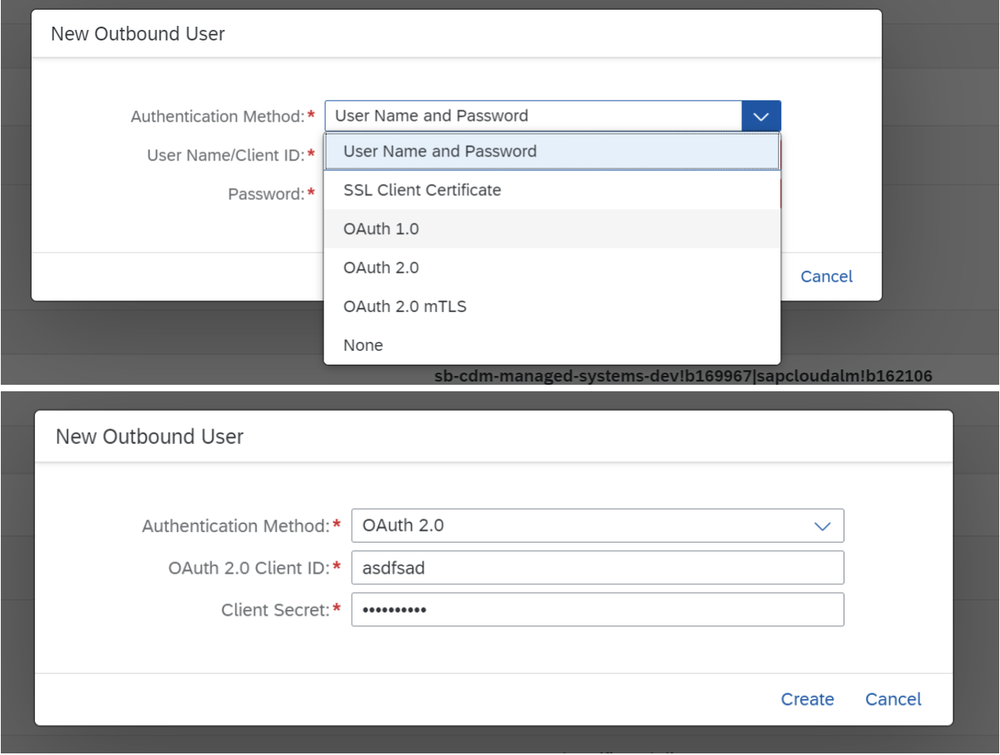
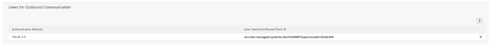
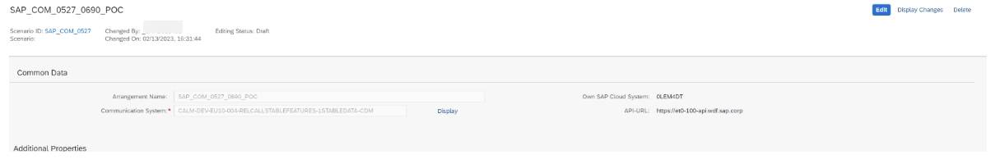
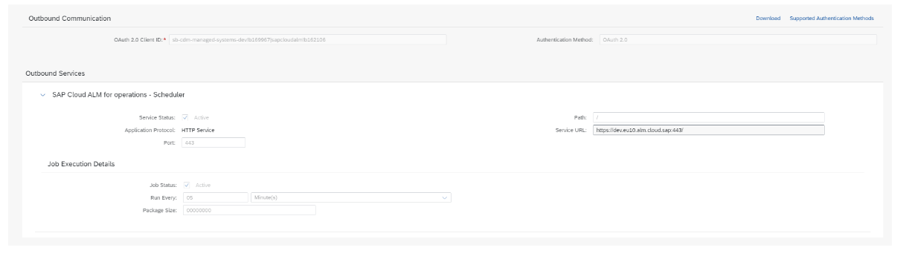

<!-- loioa4238a9e586046268a1de5ea03ec6930 -->

# SAP S/4HANA Cloud with Adaption Transport Organizer \(ATO\)

By enabling the transport management for SAP S/4HANA Cloud with the Adaption Transport Organizer \(ATO\), you can orchestrate the deployment of transport requests through your implementation landscape.

By enabling the transport management for SAP S/4HANA Cloud with the Adaption Transport Organizer \(ATO\), you can orchestrate the deployment of transport requests through your implementation landscape.

In order to use the `Adaption Transport Organizer (ATO)` for SAP S/4HANA Cloud in an SAP Cloud ALM environment, you have to establish a connection between SAP Cloud ALM and the `Adaption Transport Organizer (ATO)`. This guide explains all steps that are needed to set up this connection.

<a name="loioa4238a9e586046268a1de5ea03ec6930__section_i1h_2n3_wwb"/>

## Procedure

1.  *Target ALM Destination*

    1.  To create a new `SAP Cloud ALM Destination`, enter a name \(for example SAP Cloud ALM\) and confirm your input with the [Enter\] key.

    2.  To change an existing SAP Cloud ALM destination, select one from the [F4\] input help and press [Enter\].

    3.  Press [Enter\]. The subsequent fields are filled out automatically.

2.  *Maintain HTTP Destination*

    1.  Choose *Update Destination*.

    2.  Copy the content of the JSON file you've created in the **Create a Service Key** section.

        > ### Note:  
        > Alternatively, you can enter the required fields for SAP Cloud ALM manually:
        > 
        > 1.  *Token Endpoint*: Enter the SAP Cloud ALM `OAuth URL`, following the pattern `url + /oauth/token`.
        > 
        >     Example: `calm-tenant.authentication.eu10.hana.ondemand.com/oauth/token`
        > 
        > 2.  *Client ID*: Enter SAP Cloud ALM `client ID`.
        > 
        > 3.  *Client Secret*: Enter SAP Cloud ALM `client secret`.

    3.  Enter Registration Target

        If the *Target ALM Root URL* field isn't already prefilled, enter the target SAP Cloud ALM root URL depending on your region, for example ***https://eu20.alm.cloud.sap***.

        This is the URL that is shown in the JSON file during the creation of the service key. The URL is shown under *endpoints.API* or *uaa.url* respectively. The SAP Cloud ALM root URL depends on the region of the customer account was created under, for example `eu10.alm.cloud.sap` or `eu20.alm.cloud.sap`.

        Enter the background user that you created to perform the data collection.

        Choose *Register* to call SAP Cloud ALM and register the system.

    4.  Choose *Continue*. The destination should now be updated.

    5.  Choose *Continue*. A success message appears if the connection was established.

3.  Select the use cases that you want to collect and push data for. The push mechanism supports the following use cases:

    -   For development systems: `Feature Deployment: Manage Transports`

    -   For a domain controller system: `Feature Deployment: Read Landscape`

    -   All other systems \(test or production\): `Feature Deployment: Import Transports` 

    > ### Tip:  
    > Further information about activating use cases:
    > 
    > **Feature Deployment: Read Landscape**
    > 
    > -   Reports the `STMS` landscape configuration to SAP Cloud ALM.
    > 
    > -   It's only necessary to set up on one system per domain \(that is the domain controller\). A domain controller is mandatory for the TMS. Using the same domain controller to connect to SAP Cloud ALM is optional.
    > 
    > -   Currently supported landscapes:
    > 
    >     -   Landscapes with at least two systems per route \(also virtual systems\)
    > 
    >     -   Landscapes with basic consolidation and/or delivery targets, for example TMS quality assurance or transport workflow. These are optional workflows.
    > 
    >         For more information about these workflows, refer to [TMS Quality Assurance and Transport Workflow](https://help.sap.com/doc/saphelp_qim100/1.0/en-US/9c/a544c6c57111d2b438006094b9ea64/frameset.htm).
    > 
    >     -   Landscapes with client-specific transport routes or using the `Central Technical Configuration (CTC)`. Using CTC is optional.
    > 
    >     -   Support of several transport groups
    > 
    > 
    > **Feature Deployment: Manage Transports**
    > 
    > -   Reports transport requests to SAP Cloud ALM for assignment to features.
    > 
    > -   It's only necessary to set up on source systems, specifically DEV systems.
    > 
    > 
    > **Feature Deployment: Import Transports**
    > 
    > -   Queries to-be-imported requests from SAP Cloud ALM and triggers the import job.
    > 
    > -   It's only necessary to set up on consolidation and target systems for import \(that is, QA and PRD systems\)

    > ### Note:  
    > Commonly, authorization-checks are performed in the system in which a change happens. In case of the *Features* app, this app takes over the authorization check for importing transports in the SAP Cloud ALM environment instead of the managed system. In the managed system, the user you specified as background user for the data collection performs the transport actions. Since this background user has transport authorization by definition, the distinct check whether a specific end user is allowed to perform a transport operation is done in SAP Cloud ALM.

4.  Choose *Continue*.

5.  If everything is set up correctly, it looks like this:

      

> ### Caution:  
> If you want to change the transport configuration in the Transport Management system, make sure that all current changes are completed and deployed to the production system. Additionally, the transport buffers should be empty. Otherwise, you need to adjust the respective transport buffers manually.

<a name="loioa4238a9e586046268a1de5ea03ec6930__section_bwm_hbn_vwb"/>

## Setup the Communication System

### Create a Communication System

1.  Set up a communication system using any ID in the *System ID* field and with a reasonable name in the *System Name* field. Then enter the root URL from the CALM API in the *Host Name* field and the port \(443\) into the *Port* field in the *Technical Data - General* section.

      

2.  Add a token URL based on the UAA url from you CALM API instance in the *Token Endpoint* field and add `/oauth/token` at the end of the URL.

      

3.  Add Oauth 2 credentials based on client id and secret from your CALM API instance. Fill out the respective fields.

      

      

    > ### Note:  
    > Alternatively, add the OAuth 2 certificate from your CALM API instance instead.

4.  Choose *Save*.

### Communication Arrangement

1.  Create a communication arrangement based on scenario SAP\_COM\_0690 and use the previously created system.

      

2.  Then, activate all services.

      

3.  Add a 5 min schedule to retry the service job in the *Run Every* field.

      

4.  Choose the *Save* button.

