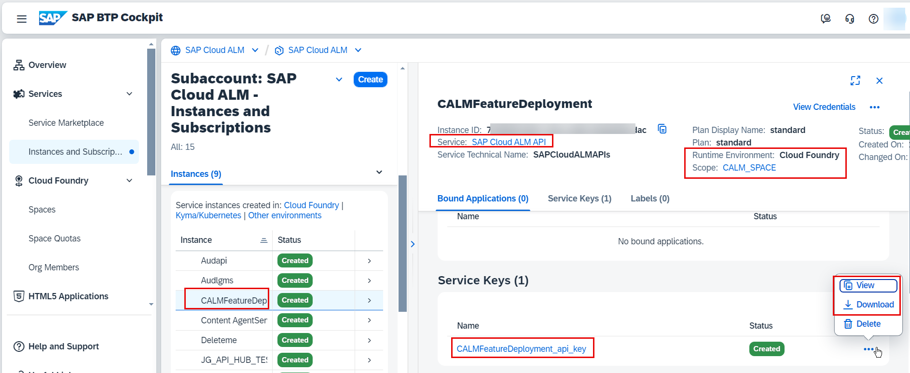

<!-- loio6c734bd086324ad5a035626bd7bea639 -->

# Service Key/Binding Credentials of the SAP Cloud ALM API Service Instance

Learn how to get your service key/binding credentials for the connection between the Change and Transport System \(CTS\) of your managed systems and the SAP Cloud ALM application.


<a name="loio6c734bd086324ad5a035626bd7bea639__section_kp4_lpz_bcc"/>

## Context

The whole communication between the SAP Cloud ALM tenant and the CTS of your managed systems transport track is done through the `ST_PI SW` component of your managed systems that calls the SAP Cloud ALM application through the SAP Cloud ALM API service instance credentials.

To set up the connection between your managed systems and the SAP Cloud ALM applications like Deployment, you have to retrieve your service key or binding credentials of the SAP Cloud ALM API service instance and then connect your SAP systems to your SAP Cloud ALM instance, by running `n/SDF/ALM_SETUP` on the managed systems and clients of your TMS transport track.

If you already have a service key, you can retrieve it in the *Landcape Management* app under *Settings*.


### SAP Business Technology Platform \(BTP\) and SAP Cloud ALM

To get a basic understanding of the SAP Business Technology Platform \(BTP\), you can watch this video [View Targeted Videos \(Quick Hit Videos\)](https://support.sap.com/en/product/onboarding-resource-center/business-technology-platform/btp-cockpit.html?anchorId=section_1988176777_c).

When you request the provisioning of SAP Cloud ALM, SAP automatically creates a global account with the name "SAP Cloud ALM" followed by your custom number after November 30th 2023. A global account is the realization of a contract you made with SAP. It's region-independent, and it's used to manage subaccounts, members, entitlements \(including your SAP Cloud ALM entitlement\), and quotas.

SAP also automatically creates a subaccount with the name “SAP Cloud ALM” that contains your SAP Cloud ALM subscription and subscriptions to the Cloud Integration Automation service and SAP Cloud Transport Management. Subaccounts let you structure a global account according to your organization's and project's requirements with regard to members, authorizations, and entitlements.

All the required actions at BTP level related to SAP Cloud ALM are done in your “SAP Cloud ALM” global account and subaccount.


<a name="loio6c734bd086324ad5a035626bd7bea639__section_iqv_ndc_ybc"/>

## Getting the Service Key/Binding Credentials of the SAP Cloud ALM API Service Instance

Depending on when you requested the SAP Cloud ALM tenant provisioning, there are differences in receiving the SAP Cloud ALM API service key/binding credentials.

The following sections show you what to do depending on when you requested SAP Cloud ALM. For more information, see also [Retrieving Service Credentials](retrieving-service-credentials-448f9f1.md).


### On or after October 16, 2023

The required service credentials have already been generated automatically as part of the provisioning of your SAP Cloud ALM tenant.

You can access your credentials in the SAP BTP cockpit or in the *Landscape Management* app, as described in [Managing Your Service Credentials](managing-your-service-credentials-87b7851.md).


### Between June 12, 2023 and October 16, 2023

You only need to create manually a new instance for the SAP Cloud ALM API if you want to use the Deployment scenario described here. For this, see section *Create or Update an Instance* in [Enabling SAP Cloud ALM API in Cloud Foundry](enabling-sap-cloud-alm-api-in-cloud-foundry-7d4c180.md).

Make sure to paste the following JSON code into the text editor as:

```
{

    "xs-security": {

        "xsappname": "<your-instance-name>",

        "authorities": [

                                             "$XSMASTERAPPNAME.imp-cdm-feature-display-ui",

                                             "$XSMASTERAPPNAME.imp-cdm-feature-manage-ui"

        ]

    }

}


```


### Before June 12, 2023

If you already activated the Cloud Foundry environment, follow the steps in [Enabling SAP Cloud ALM API in Cloud Foundry](enabling-sap-cloud-alm-api-in-cloud-foundry-7d4c180.md) to get your service credentials.

If you haven't created the SAP Cloud ALM API service instance, follow the steps in [Enabling SAP Cloud ALM API](enabling-sap-cloud-alm-api-704b5dc.md) to get the binding credentials.

Example of the service key in the SAP BTP cockpit for SAP Cloud ALM subaccount:



Example for the binding credential in the SAP BTP cockpit for SAP Cloud ALM subbacount where the Cloud Foundry environment hasn't been activated yet:


