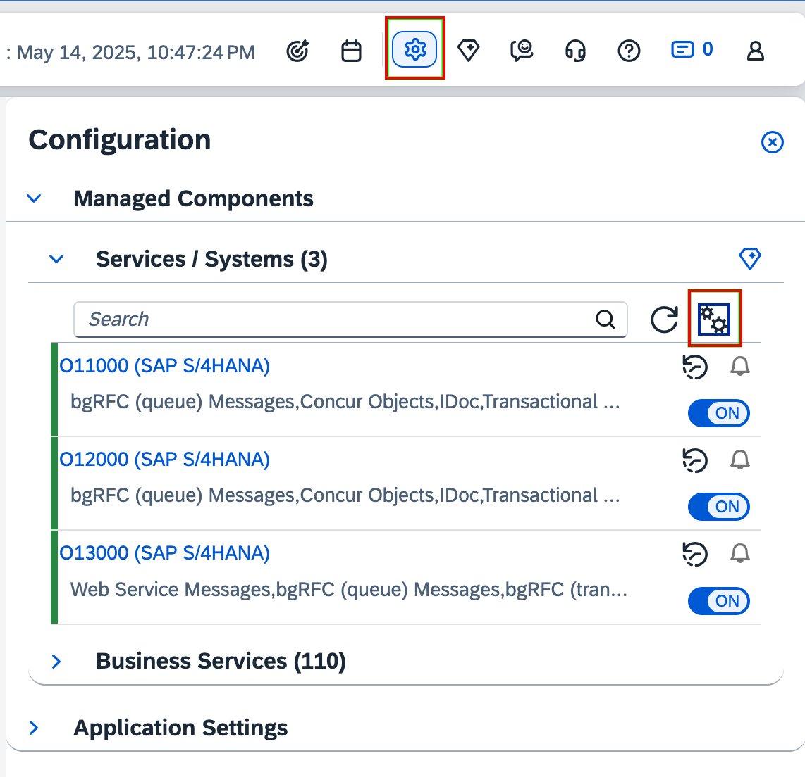

<!-- loio21e0843b2009480282487a08044f3f34 -->

# Setting Up the Managed Systems

Learn which prerequisites you have to fulfill for all systems you want to manage from SAP Cloud ALM that are part of the TMS defined transport track.

<a name="loio21e0843b2009480282487a08044f3f34__section_dpt_n3z_bcc"/>

## Context

After you've created your SAP Cloud ALM API key/binding, you have to prepare the managed systems included in the transport track.

SAP Cloud ALM doesn't directly perform actions on the ABAP system itself. Instead, actions such as create, release, and import are triggered from your feature. Such tasks are performed by TMS using the tp command to create, release, or import the TR, ToC. So, if you encounter any issues in the managed ABAP system related to the TR release or import, you should inspect this in the TMS.

<a name="loio21e0843b2009480282487a08044f3f34__section_zj1_fry_kdc"/>

## Prerequisites and Authorizations

The following sections show you the prerequisites and authorizations for the setup on your managed system.

### Technical Prerequisites

Set up your ABAP system in transaction */SDF/ALM\_SETUP*, with the following requirements:

-   SAP\_BASIS release:
    -   7.40 SP16 or higher \(accordingly 7.50 SP05\)
    -   Or 7.40 SP09 - SP15 \(7.50 SP00 - 7.50 SP04\) with SAP Note [2283880](https://me.sap.com/notes/2283880) - Logon Username not used in RFC API

-   SAP\_UI version: SAP\_UI 740 SP15 or higher
-   Implement ST-PI 7.40 support packages and keep them up to date, including the collective corrections suited for your ST-PI support package from the required SAP Notes listed after this.

    Operate your ABAP managed system with at least the latest or second latest support package that's available on the SAP Support Portal.

-   For Business Process Monitoring in SAP S/4HANA and SAP Business Suite 7, at least ST-A/PI version higher that 01U\_731 must be available. Always keep it up to date.

    If using ST-A/PI version 01W, implement the latest versions of SAP Notes listed here.

-   The profile parameter *icm/HTTPS/client\_sni\_enabled* is set to TRUE. See also SAP Note [510007](https://me.sap.com/notes/510007) \(Additional considerations for setting up SSL on Application Server ABAP\).
-   Profile parameter *ssl/client\_ciphersuites* is defined as described in section 7 of SAP Note [510007](https://me.sap.com/notes/510007).
-   [DigiCert Global Root G2](https://support.sap.com/en/alm/sap-cloud-alm/operations/expert-portal/setup-managed-services/setup-abap/setup-strust.html) has been imported in *STRUST* under *SSL Client \(Anonymous\)* and *SSL Client \(Standard\)*.
-   [DigiCert TLS RSA4096 Root G5](https://support.sap.com/en/alm/sap-cloud-alm/operations/expert-portal/setup-managed-services/setup-abap/setup-strust.html) has been imported in *STRUST* under *SSL Client \(Anonymous\)* and *SSL Client \(Standard\)*.
-   You've installed the latest version of the following SAP Notes for ST-PI:

    -   SAP Note [3639977](https://me.sap.com/notes/3639977) – Collective corrections as of ST-PI 7.40 **SP32** for SAP Cloud ALM
    -   SAP Note [3575903](https://me.sap.com/notes/3575903) – Collective corrections as of ST-PI 7.40 **SP30** for SAP Cloud ALM \(including SP31\)
    -   SAP Note [3502641](https://me.sap.com/notes/3502641) – Collective corrections as of ST-PI 7.40 **SP28** for SAP Cloud ALM \(including SP29\)
    -   SAP Note [3421256](https://me.sap.com/notes/3421256) – Collective corrections as of ST-PI 7.40 **SP26** for SAP Cloud ALM \(including SP27\)
    -   SAP Note [3374186](https://me.sap.com/notes/3374186) – Collective corrections as of ST-PI 7.40 **SP24** for SAP Cloud ALM \(including SP25\)
    -   SAP Note [3312428](https://me.sap.com/notes/3312428) – Collective corrections for Integration & Exception Monitoring in SAP Cloud ALM
    -   SAP Note [3281776](https://me.sap.com/notes/3281776) – Job & Automation Monitoring: ST-PI 740 SP21+ fixes for on-premise jobs \(ABAP jobs and BW process chains\)

### Network Prerequisites

The communication between your ABAP system and SAP Cloud ALM happens from the ABAP system towards SAP Cloud ALM. You don't need to install an SAP Cloud Connector if you only want to set up monitoring or transport management in SAP Cloud ALM.

You only need an SAP Cloud Connector if your use case requires an endpoint to be created from SAP Cloud ALM towards the ABAP system. Currently, this is only the case for ABAP systems of the type SAP Focused Run and SAP Solution Manager or if you want to use the use SAP Business Transformation Center.

To establish the connection from the ABAP system to SAP Cloud ALM:

-   You can obtain the SAP Cloud ALM service key to connect to the SAP Cloud ALM system. More under [Managing Your Service Credentials](https://help.sap.com/docs/cloud-alm/setup-administration/service-key).

-   Ensure the following URLs can be reached:
    -   The SAP Cloud ALM API URL, service key `endpoints:Api`, without `/api`.
    -   The SAP Cloud ALM OAuth URL, service key `uaa:url` followed by `/oauth/token`.
    -   If you want to activate mTLS-based authentication, you also need the SAP Cloud ALM OAuth cert URL, service key `uaa:certurl` extended by `/oauth/token`. You find this URL in the X.509-enabled service key, which is created after the mTLS-based authentication has been activated in the next section, where the PUSH Data Provider is configured.

-   If you use a proxy in your network, ensure it's configured to allow calls to these URLs. For more information, check the [Region-Specific IP Address Ranges](https://help.sap.com/docs/cloud-alm/setup-administration/region-specific-ip-address-ranges?locale=en-US&version=LATEST).
-   If your SAP ABAP system is hosted with SAP Enterprise Cloud Services \(ECS\), create a service request with SAP ECS to add the following URLs to the allowlist for your environment. This does not apply for SAP SuccessFactors Employee Central Payroll.
    -   Root URL: SAP Cloud ALM service key parameter `endpoints:api` without `/api`.
    -   OAuth URL: SAP Cloud ALM service key parameter `uaa:URL`.
    -   If you want to activate mTLS-based authentication, you also need the OAuth Cert URL: SAP Cloud ALM service key parameter `uaa:certurl`. You find this URL in the X.509-enabled service key, which is created in the next section, where the PUSH Data Provider is configured.

### Required Authorizations

For the setup, consider two users in the managed ABAP system:

-   The user performing the setup: To run transaction */SDF/ALM\_SETUP*, your personal user needs the PFCG role *SAP\_SDF\_ALM\_SETUP*.

    **Note**: In this role, maintain the authorization field *S\_BTCH\_NAM \> BTCUNAME* either with an asterisk \(\*\) or with the user name of the user that you plan to use for the background job for the data collection.

-   The user to run the background job for the data collection: Assign the roles as described in the following table:

    <table>
    <tr>
    <th valign="top">

    ST-PI Release
    
    </th>
    <th valign="top">

    Required Authorizations
    
    </th>
    </tr>
    <tr>
    <td valign="top">
    
    ST-PI 7.40 SP31 for DVM
    
    </td>
    <td valign="top">
    
    The Data Volume Efficiency \(also known as Data Volume Management\) KPIs featured on the RISE with SAP Methodology dashboard require data collection through the data collector available from **ST-PI 7.40 SP31**.

    To ensure data collection runs without errors, assign the following role to the existing batch user: `SAP_SDF_ALM_METRIC_PUSH_DVM`
    
    </td>
    </tr>
    <tr>
    <td valign="top">
    
    ST-PI 7.40 SP29 for certificate-based authentication
    
    </td>
    <td valign="top">
    
    If you want to use certificate-based authentication, you can either create a dedicated user for the certificate rotation or assign the following role to the existing background user:

    SAP\_SDF\_ALM\_MTLS. For systems with SAP\_BASIS below 7.51, you can ignore S\_PSE\_ADM.

    **Note**: With ST-PI 7.40 SP29, Exception Monitoring is no longer a standalone use case. Therefore, the PFCG role SAP\_SDF\_ALM\_METRIC\_PUSH\_EXMON has been removed and the Exception Monitoring permissions are now included in the respective PCFG roles for Integration Monitoring and Job and Automation Monitoring.
    
    </td>
    </tr>
    <tr>
    <td valign="top">
    
    ST-PI 7.40 **SP25 and higher**
    
    </td>
    <td valign="top">
    
    In addition to the authorizations for **ST-PI 7.40 SP24**, you need:

    -   SAP\_SDF\_ALM\_METRIC\_PUSH\_CSA
    -   SAP\_SDF\_ALM\_METRIC\_PUSH\_CSA\_S. This role allows the detection of special users \(such as SAP\*\) that use default passwords.

    In versions below ST-PI 7.40 SP25, you can either use the existing SAP Focused Run roles for Configuration and Security Analysis or the roles that are delivered with SAP Note [3372078](https://me.sap.com/notes/3372078) \(recommended\).
    
    </td>
    </tr>
    <tr>
    <td valign="top">
    
    ST-PI 7.40 SP18 and higher
    
    </td>
    <td valign="top">
    
    In addition to the authorizations for **ST-PI 7.40 SP16**, you need:

    -   SAP\_FRN\_SDAGENT\_CSA\_MS. This role contains authorization objects that are delivered by SAP without an authorization. To use *Configuration and Security Analysis* in SAP Cloud ALM, maintain the following authorization objects:
        -   S\_RFC\_ADM: ICF\_VALUE = '\*'
        -   S\_DATASET: FILENAME = '\*', PROGRAM = '\*'
        -   S\_LOG\_COM: HOST = '\*', OPSYSTEM = '\*'

    -   SAP\_FRN\_SDAGENT\_CSA\_SEC\_MS. This role allows the detection of special users \(such as SAP\*\) that use default passwords.

    
    </td>
    </tr>
    <tr>
    <td valign="top">
    
    ST-PI 7.40 SP16 and higher
    
    </td>
    <td valign="top">
    
    -   SAP\_SDF\_ALM\_METRIC\_PUSH\_FND\*

    Assign the following authorizations depending on the SAP Cloud ALM use cases that you plan to activate:

    -   SAP\_SDF\_ALM\_METRIC\_PUSH\_BPMON
    -   SAP\_SDF\_ALM\_METRIC\_PUSH\_EXMON \*
    -   SAP\_SDF\_ALM\_METRIC\_PUSH\_HEALTH \*
    -   SAP\_SDF\_ALM\_METRIC\_PUSH\_INTMON
    -   SAP\_SDF\_ALM\_METRIC\_PUSH\_JOBMON
    -   SAP\_SDF\_ALM\_METRIC\_PUSH\_PERF
    -   SAP\_BC\_TRANSPORT\_ADMINISTRATOR \(in client 000 and in the client of your development system where the target is created\)

    \* Download the latest version of the roles from SAP Note [3372078](https://me.sap.com/notes/3372078).
    
    </td>
    </tr>
    <tr>
    <td valign="top">
    
    ST-PI 7.40 SP15
    
    </td>
    <td valign="top">
    
    -   SAP\_SDF\_ALM\_METRIC\_PUSH\_FND \*
    -   SAP\_SDF\_ALM\_METRIC\_PUSH\_BPMON \*
    -   SAP\_SDF\_ALM\_METRIC\_PUSH\_EXMON \*

    \* Download the latest version of the roles from SAP Note [3054258](https://me.sap.com/notes/3054258).
    
    </td>
    </tr>
    </table>
    

> ### Note:  
> For SAP S/4HANA Cloud Private Edition:
> 
> -   You can request user `CUST_TC` for client 000. This user is authorized to run the setup transaction.
> 
> -   `BATCH_USER` is always available in the managed system and doesn't expire. You can also specify it as background user.

You can also check the prerequisites for each managed system on the [Expert Portal](https://support.sap.com/en/alm/sap-cloud-alm/operations/expert-portal.html):

-   [SAP NetWeaver Application Server for ABAP \(7.40 and higher\), including SAP BW/4HANA](../sap-netweaver-application-server-for-abap-7-40-and-higher-including-sap-bw-4hana-14001e1.md)

-   [SAP S/4HANA and SAP Business Suite 7](../sap-s-4hana-and-sap-business-suite-7-87ec319.md)

-   [SAP S/4HANA Cloud Private Edition](../sap-s-4hana-cloud-private-edition-20bb800.md)

## Required SAP Notes

The following list shows you the required SAP Notes. We recommend always installing the latest ST-PI version.

-   Install SAP\_BASIS 7.40 SP20 or higher \(accordingly 7.50 SP04\).

-   For ST-PI 740 SP 31 and SP 32, follow SAP Note [3425282](https://me.sap.com/notes/3425282).

-   For ST-PI 740 SP 30, install [3575903](https://me.sap.com/notes/3575903) and follow SAP Note [3425282](https://me.sap.com/notes/3425282).

-   For ST-PI 740 SP 26 and SP 27, install [3421256](https://me.sap.com/notes/3421256) and follow SAP Note [3425282](https://me.sap.com/notes/3425282) .

-   For ST-PI 740 SP 24 and 25, install [3374186](https://me.sap.com/notes/3374186) and follow SAP Note [3425282](https://me.sap.com/notes/3425282) .

-   For ST-PI 740 SP 23, install [3310406](https://me.sap.com/notes/3310406) and follow SAP Note [3425282](https://me.sap.com/notes/3425282) .

-   For ST-PI 740 SP 22, install [3310406](https://me.sap.com/notes/3310406) and follow SAP Note [3425282](https://me.sap.com/notes/3425282).

<a name="loio21e0843b2009480282487a08044f3f34__section_hbq_rzy_kdc"/>

## Configuring the PUSH Data Provider

After getting the system ready at ST-PI level, continue with establishing the connection from the managed system to SAP Cloud ALM.

SAP S/4HANA Cloud Private Edition, SAP S/4HANA and SAP Business Suite 7, and SAP NetWeaver Application Server for ABAP \(7.40 and higher\) use a PUSH mechanism to push transport management and monitoring data to SAP Cloud ALM.

### Use of Cloud Connector

Please note that it isn't possible to use the Cloud Connector from SAP to establish the connection between your SAP ABAP on-premise system and SAP Cloud ALM.

The Cloud Connector acts as a reverse invoke proxy between the on-premise network and SAP BTP. This means after connecting the subaccount to the Cloud Connector the tunnel between SAP BTP and the on-premise landscape is triggered by the BTP destination service in the connected subaccount. The Cloud Connector isn't designed to act in the opposite direction.

The connectivity from On-premise to Cloud is only possible for ABAP cloud systems, HANA Cloud databases, and specific SAP BTP services like K8s clusters. It cannot be used for SAP BTP services like SAP Cloud ALM.

For more information see [Cloud Connector FAQ](https://help.sap.com/docs/connectivity/sap-btp-connectivity-cf/cloud-connector-faq?version=Cloud) \> Features \> Can I use the Cloud Connector from on-premise to cloud for any protocol?

It is possible to use other proxy solutions between your ABAP on-premise system and SAP Cloud ALM. If you do this please make sure to add the relevant URLs to the allow list for the proxy as described under Prerequisites \> Network Prerequisites.

> ### Note:  
> If you have multiple SAP Cloud ALM tenants, you need to decide which SAP Cloud ALM instance the managed system connects to.
> 
> Here's what we recommend:
> 
> -   only connect your productive environments to your productive SAP Cloud ALM instance
> 
> -   don't connect your productive environment to both SAP Cloud ALM instances
> 
> -   only connect demo and sandbox environments to your test SAP Cloud ALM instance

> ### Note:  
> The setup must always be performed in client 000 and the source system and client where the transport request is created.
> 
> For example, in landscape *DEV:100* \> *QUA:200* \> *PRD:300*, run transaction `/SDF/ALM_SETUP` in PRD:000, DEV:000, QUA:000, and DEV:100.
> 
> For the test landscape, *S4H:100* \> *S4H:200* \> *S4H:300*, run transaction `/SDF/ALM_SETUP` in S4H:000 and S4H:100.

> ### Note:  
> If your system is hosted by SAP, remember to enter the proxy host and port when maintaining your HTTP destination.
> 
> -   Proxy Host: Enter value `proxy`
> 
> -   Proxy Port: Enter value `3128`

1.  Log on to the relevant client

    > ### Note:  
    > Transport Management: The setup must always be performed in client 000 and in the client where transport requests are created.
    > 
    > All other use-cases: The setup must be performed in the client, for which you want to collect monitoring data \(for example, the production client\). You can perform the setup in more than one client.

2.  Call transaction `/n/SDF/ALM_SETUP` 

3.  Enter "Target ALM Description"

    > ### Note:  
    > To create a new ALM destination, enter a name \(for example, CALM\) and press the "Enter" key.
    > 
    > To change an existing ALM destination, select one from the F4 input help and press the "Enter" key.
    > 
    > After pressing the "Enter" key the subsequent fields are filled.

4.  Maintain HTTP Destination

    1.  Choose *Update Destination*

    2.  You can copy & paste the content from the JSON file created during the [Enabling SAP Cloud ALM API](enabling-sap-cloud-alm-api-704b5dc.md) by choosing*Paste Service Keys*

    3.  Or you can enter the required fields for connecting Cloud ALM manually:

        1.  Token Endpoint: SAP Cloud ALM service key parameter "url" + /oauth/token

        2.  Client ID: SAP Cloud ALM service key parameter "clientid"

        3.  Client Secret: SAP Cloud ALM service key parameter "clientsecret"

        4.  Proxy User \(if required by your network infrastructure\)

        5.  Proxy Password \(if required by your network infrastructure\)

        6.  Proxy Host \(if required by your network infrastructure\)

            If your system is hosted by SAP please enter the value `proxy` 

        7.  Proxy Port \(if required by your network infrastructure\)

            If your system is hosted by SAP please enter the value `3128` 

        8.  Root URL: Enter the SAP Cloud ALM service key parameter "Api" without /api, for example, https://eu10.alm.cloud.sap

    4.  Choose *Ok* to close the pop-up

    5.  To delete a destination choose *Delete Destination* 

5.  Enter background user and register system

    1.  Enter the background user you created to perform the data collection

        Make sure that it has the authorizations as described in the *Required Authorizations* in *Prerequisites* section

    2.  Choose *Register* to call SAP Cloud ALM and register the system. If it's successful, a LMS ID is retrieved and is displayed.

    3.  To unregister a system, choose *Unregister*. Caution: This stops all data collection and heartbeat measurements

6.  Select the use cases you want to collect and push data for

After the successful setup, the SAP S/4HANA Cloud Private Edition, SAP S/4HANA and SAP Business Suite 7, and SAP NetWeaver Application Server for ABAP \(7.40 and higher\) system shows up as "Registered" service in the Landscape Management application of your SAP Cloud ALM tenant.

The data collection for the selected use-cases is activated automatically. In general it's recommended to use the standard collection interval. Only for specific requirements, you are able to change the “Collection interval” for the different use cases. Please be aware that Business Process Monitoring is using a separate scheduler, therefore, this specific value cannot be changed.

### Generated Jobs After the Initial Registration

After you've maintained the HTTP destination, in the system where you run `n/SDF/ALM_SETUP` in client 000 you get the following messages:

-   Scheduler job for \(entry name you chose in the Target ALM description field\) has been scheduled.

-   Auto Discovery job for \(entry name you chose in the Target ALM description field\) has been triggered.

You can check jobs in client 000 by choosing *System* \> *Jobs* \> *Job Overview*.

The following jobs should have run:

-   *CALM Auto Discovery* with status: Finished.

-   *CALM Heartbeat* with status: Finished and one job in status Released with 5 min frequency.

-   *CALM Scheduler* with status: Finished and one job in status Released with 1 min frequency.

> ### Note:  
> Make sure that the *CALM Scheduler* job has the status: Finished and one job in status released with 1 min frequency. This job triggers the subsequent deployment jobs that push the transport management data to SAP Cloud ALM.

After successful registration, you get an entry in *Landscape Management* for S4H:000 with the same LMS ID.

For example:

<a name="loio21e0843b2009480282487a08044f3f34__section_otj_mgq_mdc"/>

## Activating the Use Case Transports

To activate the use case *Transports* and the respective tasks, run transaction `/n/SDF/ALM_SETUP` and choose *Activate usescases*.

For each system you're using, you have to activate different tasks. For example, in landscape *DEV:100* \> *QUA:200* \> *PRD:300*, domain controller PRD, you have to activate the following tasks:

*DEV*

-   client 000: activate *Transports: Read*. You only have to activate this task on source systems as this reports transport requests to SAP Cloud ALM for assignment to features.

-   client 100: activate *Transports: Create & Export \(client-specific\)*. You have to activate this task on all development clients you're using for customizing activities. If you're using an additional client, for example 200, to create transports, you also need to activate this task in this client. This triggers the release job `/SDF/CALM_CDM_TR_PROC_CL_DEP-XXX` and enables the following transport-related functions:

    -   Create transports

    -   Create transport of copies

    -   Release transports

    -   Delete empty transports \(during release\)

-   activate *Transports: Export Checks \(client-specific\)* on all clients on which you want to perform ATC checks.

    To activate this task, you need to have installed ST-PI 740 SP 31 or ST-PI 740 SP 30 with SAP Note [3569187](https://me.sap.com/notes/3569187)and [3569295](https://me.sap.com/notes/3569295). For ST-PI 740 SP 31 you also need to install SAP Note [3621761](https://me.sap.com/notes/3621761).

    For more information, see [Transport Checks](https://help.sap.com/viewer/877c96cf971648b09ee0d0a64f7f4fef/latest/en-US/2ae5a1bf1b6f4d46a38b11f6c6792425.html "With the Transport Checks, you can check a CTS-managed transport set to evaluate the impact on your production system. Transport checks can be performed based on a feature which defines the set of CTS-managed transports.") :arrow_upper_right:.

-   activate *Transports: Retrofit \(client-specific\)* on your development system of your maintenance track if you want to perform retrofit.

*QUA*

client 000: activate *Transports: Import*. You have to activate this task in all systems you want to import to as this triggers the import job `/SDF/CALM_CDM_IMPORT_TRANSPORTS`. This queries to-be-imported transports from SAP Cloud ALM and imports them.

> ### Note:  
> Target systems include quality assurance, pre-production, and production systems from a system group, which are assigned to the project via the deployment plan. The deployment is performed using the landscape defined in TMS, not the one defined in the system groups. If your working client isn't available in LMS we recommend to activate the use case Health Monitoring in the needed working clients since they're part of the transport landscape and should be monitored. This is relevant for clients where you haven’t run transaction `/sdf/alm_setup` as these clients aren’t monitored and registered in Landscape Management.

*PRD*

client 000: activate the following tasks:

-   *Transports: Import*

-   *Transports: Read Landscape* This reports the STMS landscape configuration to SAP Cloud ALM. The following landscapes are supported:

    -   Any kind of consistent Transport Management System \(TMS\) landscape. The last system in a track is always treated as a production system

    -   Client-specific transport routes \(TMS option CTC\) are recommended

    -   TMS transport groups are supported

-   *Transports: Check* This enables the *Transport Check* functionality to check a transport set before import to evaluate the impact on your production system.

    To activate this task, you need to have installed at least ST-PI 740 SP 27 and implemented the latest versions of SAP Notes [3497169](https://me.sap.com/notes/3497169) and [3497168](https://me.sap.com/notes/3497168).

    For more information, see [Transport Checks](https://help.sap.com/viewer/877c96cf971648b09ee0d0a64f7f4fef/latest/en-US/2ae5a1bf1b6f4d46a38b11f6c6792425.html "With the Transport Checks, you can check a CTS-managed transport set to evaluate the impact on your production system. Transport checks can be performed based on a feature which defines the set of CTS-managed transports.") :arrow_upper_right:.

> ### Note:  
> Target systems include quality assurance, pre-production, and production systems from a system group, which are assigned to the project via the deployment plan. The deployment is performed using the landscape defined in TMS, not the one defined in the system groups. If your working client isn't available in LMS we recommend to activate the use case Health Monitoring in the needed working clients since they're part of the transport landscape and should be monitored. This is relevant for clients where you haven’t run transaction `/sdf/alm_setup` as these clients aren’t monitored and registered in Landscape Management.

> ### Note:  
> For your test or productive landscape, set the collection interval to 1 min for these tasks if you want a quicker reaction to your testing of creating transport request, transport of copies, and triggering the deploy in the features.

> ### Note:  
> Once you've activated any of the tasks, the diagnostic job `/SDF/CALM_CDM_DIAGNOSTIC` is started. This job runs daily in the background and sends diagnostic data. It's only necessary to set up on one system per domain \(preferably the domain controller system\).

> ### Note:  
> With ST-PI 740 SP 27, the names of the tasks have been changed.
> 
> -   *Read Transport Landscape* changed to *Transports: Read Landscape*
> 
> -   *Manage Transports* changed to *Transports: Read*
> 
> -   *Import Transports* changed to *Transports: Import*
> 
> -   *Manage Transport per Client* changed to *Transports: Create & Export \(client-specific\)*

It's only necessary to set up on one system per domain. In case you don't find these use cases in the list, try to rule out connection issues. For example, your service key could be outdated and has to be generated again, as described in [Enabling SAP Cloud ALM API](enabling-sap-cloud-alm-api-704b5dc.md). For more solutions about connection problems, see [Issues and Solutions](issues-and-solutions-240043a.md).

In case of issues, open the *Analyze Application Log* `SLG1`. This system log shows you details about the use cases and jobs. For example, a component version mismatch is detected. This blocks the import of all transports assigned to features if the mismatch situation isn't resolved manually at TMS level. For more information, see [Analyze Application Log](solutions-for-errors-in-the-managed-system-setup-check-93ae080.md#loio93ae080ec391461bb4d56579deaa0b00__section_uns_nj3_hdc).

In case of import issues, you can have a look at the job log. Sometimes a component version mismatch is detected. This blocks the import of all transports assigned to features if the mismatch situation isn't resolved manually at TMS level.

In case several features are deployed together, all assigned transports are imported as import subset. If one transport request of the subset leads to a component mismatch situation, the import of all transports is blocked.

In the import history of the target system, the *User* column shows you the user who initiated the */SDF/CALM\_CDM\_IMPORT\_TRANSPORTS* job. This is the background user you entered during the setup using transaction */SDF/ALM\_SETUP* in your target system in client 000 .

<a name="loio21e0843b2009480282487a08044f3f34__section_jwc_5f1_xgc"/>

## Recommended: Monitoring ABAP Application Log and ABAP Job Log

We recommend monitoring the ABAP Application Log and ABAP Job Log. This helps you to detect communication issues.

1.  You've configured the push data provider for Operations and activated the use case task *Integration Monitoring*. For more information, see [SAP NetWeaver Application Server for ABAP \(7.40 and higher\), including SAP BW/4HANA](../sap-netweaver-application-server-for-abap-7-40-and-higher-including-sap-bw-4hana-14001e1.md).

2.  Register all systems configured for Change and Deployment Management via the ST-PI setup and enable Change and Deployment Management and Exception Monitoring.

3.  Check if the system is registered in Landscape Management.

4.  Open the *Integration & Exception Monitoring* app.

5.  Select a scope by choosing your systems.

6.  Select *Configuration*.

    

    > ### Note:  
    > Make sure that the configuration is active for your systems.

7.  Enter the individual system configuration.

    

8.  Set the *ABAP Application Log* and *ABAP Job Log* to active.

9.  Enter the filter configuration menu.

10. For the ABAP Application Log, enter the following filters:

    -   *object*: /SDF/CALM
    -   *subobject*: BUILD\_CDM

11. For the ABAP Job Log, enter a *Batch-User* filter with the user you used for configuring the batch job.

12. You can also specify the filters in more detail if needed.

13. Ensure that the monitoring entry *Active* and overall system entry *Data Collection* switches are set *ON*.

For more general information about monitoring and creating alerts, see [Monitoring Configuration](https://support.sap.com/en/alm/sap-cloud-alm/operations/expert-portal/integration-monitoring/int-mon-setup-support.html?anchorId=section_1683886374_c).

<a name="loio21e0843b2009480282487a08044f3f34__section_a1d_qyp_rfc"/>

## Setting up Transport Checks for Import Checks

This section is only relevant if you want to use transport checks.

> ### Note:  
> You can only perform transport checks for production systems and ABAP systems with CTC = 1 configuration.

You have to create an RFC connection from your production system to your source system to use import checks. This is required as the transport checks are performed on your production system and read transport and object data from your source system.

1.  Create or update a system user to establish an RFC connection from your production system to your source system. You can add the required authorizations, mentioned in SAP Note [2475591](https://me.sap.com/notes/2475591), to your own role or use the `SAP_SDF_ALM_TRCHK.SAP` role template.

    1.  Download the `SAP_SDF_ALM_TRCHK.SAP` role template from the *Attachments* tab of SAP Note [2475591](https://me.sap.com/notes/2475591).

    2.  In your source system, run transaction `PFCG` to upload the role template. Select *Role* \> *Upload* and choose the `SAP_SDF_ALM_TRCHK.SAP` role template.

        > ### Note:  
        > If you receive a message that roles already exist in the system, select *Transport* \> *Change* \> *Authorizations* \> *Change Authorization Data* \> *Generate* to overwrite the existing data.

    3.  In your source system, run transaction `SU01` to assign the role template to a user. You can use an existing RFC communication user or create a new one.

2.  In your production system, run transaction `SM59` to create an RFC destination:

    1.  Choose *Create*.

    2.  Enter a destination name for the RFC and choose connection type *3 RFC Connection to ABAP System*.

    3.  On the *Technical Settings* tab, enter your source system host in *Target Host*.

    4.  On the *Logon & Security* tab, in the *User* field, enter the RFC communication user with the `SAP_SDF_ALM_TRCHK.SAP` role template. In the *Client* field, enter the client of your source system.

    5.  On the *Logon & Security* tab, select *Hide if logon error* for SAPGUI logon screen.

    6.  Perform a connection and authorization test via *Utilities* \> *Test*.

3.  In client 000 of your production system, maintain your RFC destination in customizing table `/SDF/CMO_TARGET`:

    1.  Run transaction `SM30`.

    2.  Enter table name `/SDF/CMO_TARGET` and choose *Edit*.

    3.  Select *New Entries*.

    4.  Enter your source system without client in the *Target* field and your RFC destination in the *RFC Destination* field.

4.  On your production system in client 000, activate the use case task *Transports: Check*. For more information, see [Activating the Use Case Transports](setting-up-the-managed-systems-21e0843.md#loio21e0843b2009480282487a08044f3f34__section_otj_mgq_mdc).

You can use the RFC destination for the same system across different clients as the RFC destination is client independent. If you’re using different clients of the same source system, creating just one entry for one client is enough in this case. Please remember that the transport check doesn’t support different source systems \(with clients\) pointing to the same target system.

<a name="loio21e0843b2009480282487a08044f3f34__section_wcc_5cq_chc"/>

## Setting up Retrofit

This section is only relevant if you want to use retrofit.

### Prerequisites

-   You've installed at least ST-PI 740 SP31 and implemented SAP Note [3688071](https://me.sap.com/notes/3688071) and [3639096](https://me.sap.com/notes/3639096) on your development systems of your implementation and maintenance track

-   Your development systems of your implementation and maintenance track have a domain link between their domain controllers or are in the same transport domain

### 1. Upload PFCG Roles on Your Development System and Client of Your Implementation Track

1.  Download the `SAP_SDF_CALM_CDM_RETROFIT_RFC.SAP` role template from the *Attachments* tab of SAP Note [3639096](https://me.sap.com/notes/3639096).

2.  Run transaction `PFCG`.

3.  Select *Role* \> *Upload*.

4.  Choose the `SAP_SDF_CALM_CDM_RETROFIT_RFC.SAP` role template and select *Open*.

5.  Select *Transfer*.

6.  Select the *Authorizations* tab and select *Continue*.

7.  Select *Change Authorization Data*.

8.  Make sure that all authorization objects are green and select *Generate*.

9.  Keep the default *Profile* name and Text, then select *Execute*.

10. Check if the *Authorizations* tab is green.

### 2. Create RFC User for Retrofit

1.  On your development system and client of your implementation track, run transaction `SU01`.

2.  Enter a user name and then select the *Technical User* or *User* button.

    

3.  Select the *Logon Data* tab. Select *User Type* for *System* and enter a password.

4.  Select the *Roles* tab and assign `SAP_SDF_CALM_CDM_RETROFIT_RFC` in the *Role* column.

5.  Save your changes.

### 3. Create RFC Destination

1.  On your development system of your maintenance track, run transaction `SM59.`

2.  Select *Create*.

3.  Enter a destination name for RFC and select connection type *3 RFC Connection to ABAP System*.

4.  On the *Technical Settings* tab, enter the target system host \(development system of your implementation track\) in *Target Host*.

5.  On the *Logon & Security* tab, enter the RFC user you created in *User*. In *Client*, enter the client of your target system.

6.  Perform a connection and authorization test via *Utilities* \> *Test*.

### 4. Maintain RFC Destination in Customizing Table for Retrofit

1.  On your development system of your maintenance track, run transaction `SM30`.

2.  Enter table name `/SDF/CMO_TARGET` and select *Edit*.

3.  Select *New Entries*.

4.  Enter the retrofit target system with client in the *Target* field and the RFC destination in the *RFC Destination* field.

### 5. Assign PFCG Role

In this step, you have to assign the PFCG role to the background user you used in the SAP Cloud ALM setup `/n/SDF/ALM_SETUP`.

1.  Download the `SAP_SDF_CALM_CDM_RETROFIT_UC.SAP` role template from the *Attachments* tab of SAP Note [3639096](https://me.sap.com/notes/3639096).

2.  On your development system of your maintenance track, run transaction `PFCG`.

3.  Upload the `SAP_SDF_CALM_CDM_RETROFIT_UC.SAP` role template on your development system of your maintenance track.

4.  Run transaction `SU01` and assign the `SAP_SDF_CALM_CDM_RETROFIT_UC.SAP` role to the background user of the SAP Cloud ALM setup.

### 6. Maintain Production Systems for Retrofit

1.  On the development system for your maintenance track, run transaction `SE16`.

2.  Enter table name `/SDF/CDM_PARAM`.

3.  Add a new entry for *PARAMETER\_ID* and assign value `RETROFIT_PROD_SYS_OF_XXX.XXX` \(the XXX.XXX represents the development system ID and client of your maintenance track\).

4.  For *PARAMETER\_VALUE*, assign value `XXX.XXX` \(this represents the production system ID and client of your maintenance track\). You can enter multiple production systems with delimiter “,”.

5.  Save your changes.

### 7. Maintain Analysis Period for Retrofit

1.  On the development system of your implementation track, run transaction `SE16`.

2.  Enter table name `/SDF/CMO_TR_CONF`.

3.  Choose *Create Entries*, then select *New Entries*.

4.  Select *Number of days in analysis period* for *Configuration Parameter*.

5.  Mark the checkbox for *Indicator*.

6.  Enter your preferred number of days for retrofit. The default is 180 days.

7.  Save your changes.

### 8. Activate Retrofit Use Case Task Transports: Retrofit \(client-specific\)

1.  On your development system of your maintenance track, run transaction `/SDF/ALM_SETUP`.

2.  Enter your *Target ALM Destination*.

3.  Select *Activate use-cases*.

4.  Activate the use case task *Transports: Retrofit \(client-specific\)*.

<a name="loio21e0843b2009480282487a08044f3f34__section_z4g_lfq_d1c"/>

## Configuration of the Transport Organizer Web UI

Before you can start navigating to the transport organizer for CTS-managed transports by using the transport ID in the *Features* app, you have to activate the Web service for transport organizer web UI.

For this, follow the steps in the [Activating the Web Service for Transport Organizer Web UI](https://help.sap.com/docs/SAP_NETWEAVER_700/109ce05a6c531014b4e8fe6b0570a984/45ec35a90fdc3481e10000000a1553f6.html).

> ### Note:  
> If the transport organizer web UI shows exceptions, check the following:
> 
> -   Make sure that you've configured the start authorization according to the following SAP Notes: [1413011](https://me.sap.com/notes/1413011) and/or [3064888](https://me.sap.com/notes/3064888) respectively.
> 
> -   Check the HTTP\_WHITELIST [0002578665](https://me.sap.com/notes/0002578665) and the UCON\_CHW allowlist [0003290787](https://me.sap.com/notes/0003290787).
> 
>     See also [**How to maintain the table HTTPURLLOC**](https://help.sap.com/docs/SUPPORT_CONTENT/abapconn/3354079499.html).
> 
> -   In case the standard URL \(Root URL\) doesn't fit your needs \(for example, because you use the allowlist mentioned above\), you can adjust the Logon URL in *Landscape Management* for the affected system, so that it reflects your URL on the allowlist. For more information, see [**Landscape Management**](https://help.sap.com/docs/cloud-alm/applicationhelp/landscape-management?locale=en-US).

