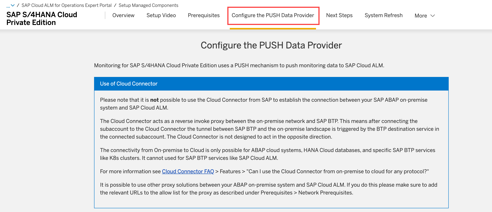

<!-- loio21e0843b2009480282487a08044f3f34 -->

# Setting up the Managed Systems

Learn which prerequisites you have to fulfill for all systems you want to manage from SAP Cloud ALM that are part of the TMS defined transport track.

<a name="loio21e0843b2009480282487a08044f3f34__section_dpt_n3z_bcc"/>

## Context

After you've created your SAP Cloud ALM API key/binding, you have to prepare the managed systems included in the transport track.

SAP Cloud ALM doesn't directly perform actions on the ABAP system itself. Instead, actions such as create, release, and import are triggered from your feature. Such tasks are executed by TMS using the tp command to create, release, or import the TR, ToC. So, if you encounter any issues in the managed ABAP system related to the TR release or import, you should inspect this in the TMS.

<a name="loio21e0843b2009480282487a08044f3f34__section_gpk_14r_zbc"/>

## Prerequisites and Authorizations

On the [Expert Portal](https://support.sap.com/en/alm/sap-cloud-alm/operations/expert-portal.html), you find the prerequisites for each managed system:

-   [SAP NetWeaver Application Server for ABAP \(7.40 or higher\)](https://support.sap.com/en/alm/sap-cloud-alm/operations/expert-portal/setup-managed-services/setup-abap-740.html)

-   [Setup for SAP S/4HANA and SAP Business Suite](https://support.sap.com/en/alm/sap-cloud-alm/operations/expert-portal/setup-managed-services/setup-abap-onprem.html)

-   [Setup for SAP S/4HANA Cloud Private Edition](https://support.sap.com/en/alm/sap-cloud-alm/operations/expert-portal/setup-managed-services/setup-abap-priv-cloud.html)

Each page includes a *Prerequisites* tab which shows you the required prerequisites and authorizations:

Make sure that you fulfill the *Technical Prerequisites*, *Network Prerequisites*, and *Required Authorizations*.

> ### Note:  
> For the profile parameter check, you can use transaction `RZ11` and `TU02` in the managed system.

> ### Note:  
> For a SAP S/4 HANA Cloud Private Edition:
> 
> -   You can request user `CUST_TC` for client 000. This user is authorized to run the setup transaction.
> 
> -   User `BATCH_USER` can be specified as background user.

## Required SAP Notes

Make sure that you've installed the latest version of the following SAP Notes:

-   Install SAP\_BASIS 7.40 SP20 or higher \(accordingly 7.50 SP04\).

-   For ST-PI 740 SP 26 and SP 27, install [3421256](https://me.sap.com/notes/3421256) and follow SAP Note [3425282](https://me.sap.com/notes/3425282) .

-   For ST-PI 740 SP 24 and 25, install [3374186](https://me.sap.com/notes/3374186) and follow SAP Note [3425282](https://me.sap.com/notes/3425282) .

-   For ST-PI 740 SP 23, install [3310406](https://me.sap.com/notes/3310406) and follow SAP Note [3425282](https://me.sap.com/notes/3425282) .

-   For ST-PI 740 SP 22, install [3310406](https://me.sap.com/notes/3310406) and follow SAP Note [3425282](https://me.sap.com/notes/3425282).

-   For ST-PI 740 SP 21, install correction [3240966](https://me.sap.com/notes/3240966) and follow SAP Note [3425282](https://me.sap.com/notes/3425282).

-   For ST-PI 740 SP 20, install corrections [3240966](https://me.sap.com/notes/3240966) and follow SAP Note [3425282](https://me.sap.com/notes/3425282).

-   For ST-PI 740 SP 19, install corrections [3196078](https://me.sap.com/notes/3196078) and follow SAP Note [3425282](https://me.sap.com/notes/3425282).

-   For ST-PI 740 SP 18, install corrections [3196078](https://me.sap.com/notes/3196078) and follow SAP Note [3425282](https://me.sap.com/notes/3425282).

    It's recommended to install the current version of collective corrections.

<a name="loio21e0843b2009480282487a08044f3f34__section_c3v_h4r_zbc"/>

## Configuring the PUSH Data Provider

After getting the system ready at ST-PI level, continue with establishing the connection from the managed sytem to SAP Cloud ALM.

SAP S/4HANA Cloud Private Edition, SAP S/4HANA and SAP Business Suite, and SAP NetWeaver Application Server for ABAP \(7.40 or higher\) use a PUSH mechanism to push transport management data to SAP Cloud ALM.

On the Export Portal, choose the tab *Configure the PUSH Data Provider*.

Then, follow the steps to configure the PUSH data provider.

> ### Note:  
> The setup must always be performed in client 000 and the source system and client where the transport request is created.
> 
> For example, in landscape *DEV:100* \> *QUA:200* \> *PRD:300*, run transaction `/SDF/ALM_SETUP` in PRD:000, DEV:000, QUA:000, and DEV:100.
> 
> For the test landscape, *S4H:100* \> *S4H:200* \> *S4H:300*, run transaction `/SDF/ALM_SETUP` in S4H:000 and S4H:100.

### Generated Jobs After the Initial Registration

In the system where you run `n/SDF/ALM_SETUP` in client 000 you get the following messages:

-   Scheduler job for \(entry name you chose in the Target ALM description field\) has been scheduled.

-   Auto Discovery job for \(entry name you chose in the Target ALM description field\) has been triggered.

Next, check the jobs in client 000.

> ### Note:  
> Make sure that the *CALM Scheduler CALM\_CONNECT* job has the status: Finished and one job in status released with 1 min frequency. This job triggers the subsequent deployment jobs that push the transport management data to SAP Cloud ALM.

After successful registration, you get an entry in *Landscape Management* for S4H:000 with the same LMS ID.

For example:

### Activation of Deployment Use Cases

To activate use cases, run transaction `n/SDF/ALM_SETUP` and choose *Activate usescases*.

For example, in landscape *DEV:100* \> *QUA:200* \> *PRD:300*, domain controller PRD, you have to activate the following use cases:

-   For the domain controller PRD:000: use case Feature Deployment: Read Transport Landscape/CALM\_CDM\_TMS\_LNDSCP

-   For development systems DEV:000: use case Feature Deployment: Manage Transports/CALM\_CDM\_TMS

-   All other systems \(test or production\) QUA:000 and PRD:000: use case Feature Deployment: Import Transports/CALM\_CDM\_TMS\_IMPORT

-   For all development clients DEV:100: use case Feature Deployment: Manage Transport per Client/CALM\_CDM\_TMS\_CLI\_DEP

> ### Note:  
> With the latest version of the CDM master note, the names of the use cases have been changed to:
> 
> -   Feature Deployment: Read Transport Landscape to Transports: Read Landscape
> 
> -   Feature Deployment: Manage Transports to Transports: Read
> 
> -   Feature Deployment: Import Transports to Transports: Import
> 
> -   Feature Deployment: Manage Transport per Client to Transports: Manage Transport per Client to Create & Export \(client specific\)

In case you don't find these use cases in the list, try to rule out connection issues.

For example, your service key is outdated and has to be generated again, as described in [Enabling SAP Cloud ALM API](enabling-sap-cloud-alm-api-704b5dc.md).

More solutions for connection problems can be found in the [**Issues and Solutions**](https://help.sap.com/docs/cloud-alm/setup-administration/issues-and-solutions-on-premise?locale=en-US) guide.

### Overview of Use Cases

The following sections explain the different use cases in more detail.

### Transports: Read Landscape

-   Reports the STMS landscape configuration to SAP Cloud ALM

-   Only necessary to set up on one system per domain \(that is preferably the domain controller system\)

-   Currently supported landscapes:

    -   Any kind of consistent Transport Management System \(TMS\) landscape. The last system in a track is always treated as a production system

    -   Client-specific transport routes \(TMS option CTC\) are recommended

    -   TMS transport groups are supported

### Transports: Read

-   Reports transport requests to SAP Cloud ALM for assignment to features

-   It’s only necessary to set up on source systems, specifically DEV systems

### Transports: Import

-   Queries to-be-imported transports from SAP Cloud ALM and imports them

-   It’s only necessary to set up on consolidation and target systems for import \(that is, QA and PRD\)

### Manage Transport per Client to Create & Export \(client specific\)

-   This use case enables the following transport-related functions:

    -   Create transports

    -   Create transport of copies

    -   Release transports

    -   Delete empty transports \(during release\)

-   It's necessary to execute this setup on all development clients you use for customizing activities

> ### Note:  
> For your test or productive landscape, set the collection interval to 1 min for these use cases if you want a quicker reaction to your testing of creating transport request, transport of copies, and triggering the deploy in the features.

In case of import issues, you can have a look at the job log. Sometimes a component version mismatch is detected. This blocks the import of all transports assigned to features if the mismatch situation is not resolved manually at TMS level.

In case several features are deployed together, all assigned transports are imported as import subset. If one transport request of the subset leads to a component mismatch situation, the import of all transports is blocked.

<a name="loio21e0843b2009480282487a08044f3f34__section_z4g_lfq_d1c"/>

## Configuration of the Transport Organizer Web UI

Before you can start navigating to the transport organizer for CTS-managed transports by using the transport ID in the *Features* app, you have to activate the Web service for transport organizer web UI.

For this, follow the steps in the [Activating the Web Service for Transport Organizer Web UI](https://help.sap.com/docs/SAP_NETWEAVER_700/109ce05a6c531014b4e8fe6b0570a984/45ec35a90fdc3481e10000000a1553f6.html).

> ### Note:  
> If the transport organizer web UI shows exceptions, check the following:
> 
> -   Make sure that you've configured the start authorization according to the following SAP notes: [1413011](https://me.sap.com/notes/1413011) and/or [3064888](https://me.sap.com/notes/3064888) respectively.
> 
> -   Check the HTTP\_WHITELIST [0002578665](https://me.sap.com/notes/0002578665) and the UCON\_CHW allowlist [0003290787](https://me.sap.com/notes/0003290787).
> 
>     See also [**How to maintain the table HTTPURLLOC**](https://help.sap.com/docs/SUPPORT_CONTENT/abapconn/3354079499.html).
> 
> -   In case the standard URL \(Root URL\) doesn't fit your needs \(for example, because you use the allowlist mentioned above\), you can adjust the Logon URL in *Landscape Management* for the affected system, so that it reflects your URL on the allowlist. For more information, see [**Landscape Management**](https://help.sap.com/docs/cloud-alm/applicationhelp/landscape-management?locale=en-US).

