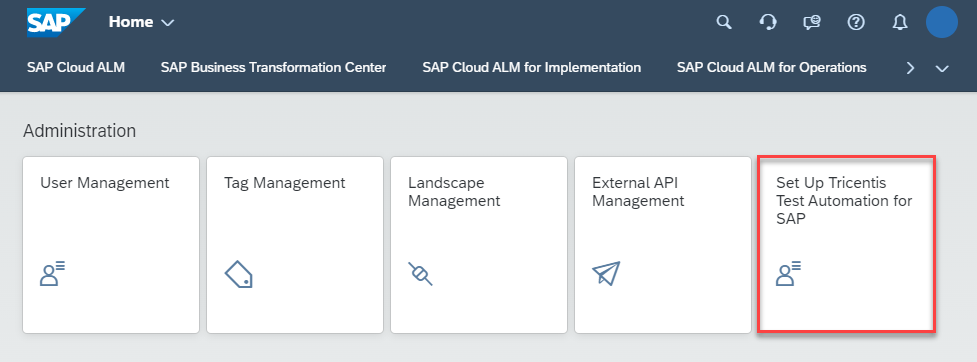
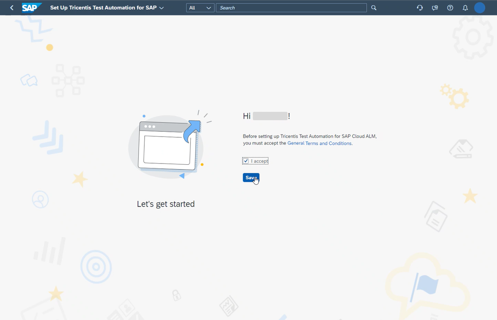

<!-- loio2bddb584d07d4833b7e33454c3c4a79d -->

# Setting Up Tricentis Test Automation for SAP Integrated with SAP Cloud ALM

Tricentis Test Automation for SAP integrated with SAP Cloud ALM is a continuous testing platform that allows you to design automated, functional, end-to-end software tests across all layers of your enterprise architecture.

By using this integration in your project, you can take advantage of the test orchestration, execution monitoring, and reporting capabilities of SAP Cloud ALM.

<a name="loio2bddb584d07d4833b7e33454c3c4a79d__section_wqn_kt5_4wb"/>

## Prerequisites

-   Your user in SAP Cloud ALM has the role *Global Administrator*.

-   You have an S-user with the role `Edit Cloud Data` and an email address that corresponds to the email address used in SAP Cloud ALM.

    You can evaluate valid S-users for your organization in SAP for Me, under [Important Contacts](https://me.sap.com/userscontacts/impcont).

If you requested SAP Cloud ALM, you've received the authorizations required to set up this integration.

<a name="loio2bddb584d07d4833b7e33454c3c4a79d__section_dvv_kt5_4wb"/>

## Procedure

1.  In the SAP Cloud ALM launchpad, open the app *Set Up Tricentis Test Automation for SAP*.

      

2.  Read and accept the terms and conditions.

    The terms and conditions are stored on SAP Support Portal. You can read or download them from there at any time.

      

3.  Choose *Set Up Tricentis Test Automation for SAP integrated with SAP Cloud ALM*.

4.  Automatically, the following setup steps are performed:

    -   Setup of the Tricentis application

    -   Provisioning of the Tricentis tenant

    -   Update of the Tricentis application

    -   Configuration of the endpoint for the test automation

5.  Set up Tricentis execution agents for remote execution, as described in [Tricentis Test Automation execution agents](https://documentation.tricentis.com/sap/tta_cloud_es/en/content/agents.htm).

You can now start using Tricentis Test Automation for SAP integrated with SAP Cloud ALM from the *Test Preparation* app in SAP Cloud ALM.

The test cases will then be authored in Tricentis Test Automation for SAP, as described in the Tricentis documentation.

**Related Information**  

[Tricentis Test Automation for SAP integrated with SAP Cloud ALM](https://help.sap.com/docs/CloudALM/2b4ce9f491d14691bc554446b57f6e2d/e66fb899e3f6432985061daba26936fc.html)

[Tricentis Test Automation for SAP online documentation](https://documentation.tricentis.com/sap/tta_cloud_es/en/content/calm_integration.htm)

[Tricentis Test Automation execution agents](https://documentation.tricentis.com/sap/tta_cloud_es/en/content/agents.htm)

[Tricentis test automation for SAP usage rights](https://support.sap.com/en/alm/usage-rights.html?anchorId=section_138430085)

