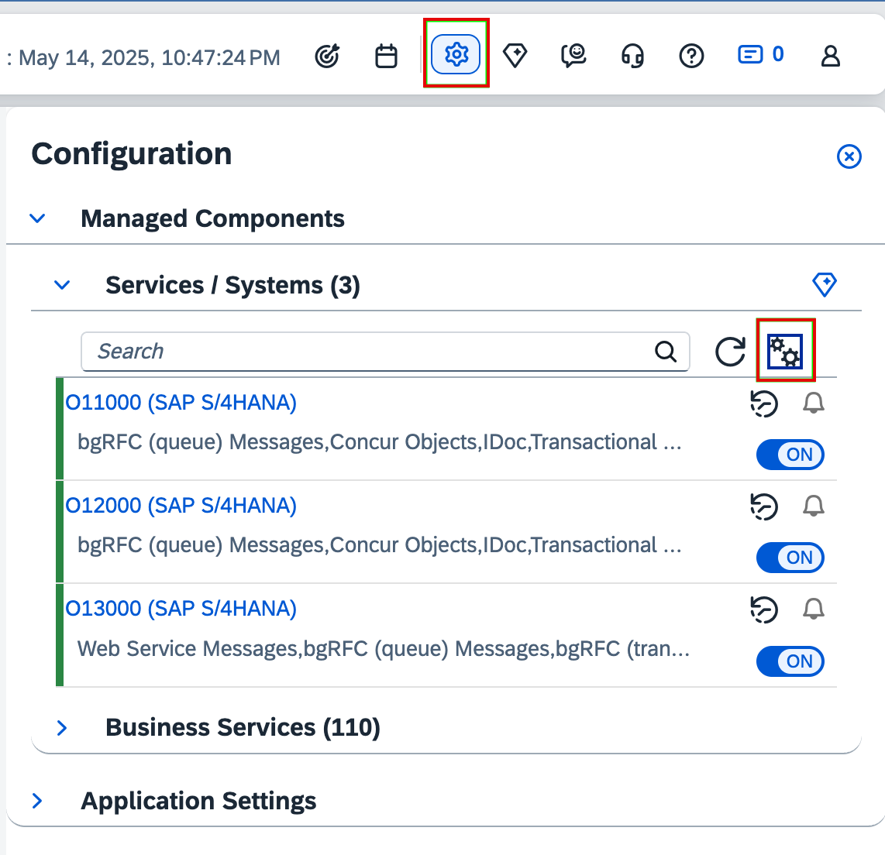
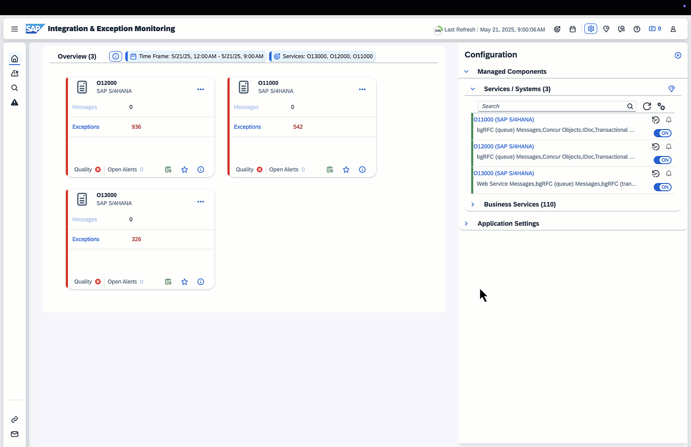

<!-- loio93ae080ec391461bb4d56579deaa0b00 -->

# Solutions for Errors in the Managed System Setup Check

**Managed System Setup Check Report**

To perform the Managed System Setup Check, run transaction `/SDF/ALM_DIAGNOSTIC` in client 000 in all the systems included in the transport track and working client that you want to connect to SAP Cloud ALM.

The following sections explain the checks and messages that can appear in the managed system during the Managed System Setup Check. This includes confirmation information and error messages.

<a name="loio93ae080ec391461bb4d56579deaa0b00__section_wgb_w1s_pdc"/>

## General System Information Check

This shows in which system and client the check has been performed.

****

<table>
<tr>
<th valign="top">

Message

</th>
<th valign="top">

Message Explanation

</th>
</tr>
<tr>
<td valign="top">

The check is running in &1/&2 for destination &3

</td>
<td valign="top">

Confirmation message. No action is needed.

</td>
</tr>
</table>

<a name="loio93ae080ec391461bb4d56579deaa0b00__section_dwn_23l_3fc"/>

## Monitor ABAP Application Log and ABAP Job Log

We recommend monitoring the ABAP Application Log and ABAP Job Log. This helps you to detect communication issues.

1.  You've configured the push data provider for Operations and activated the use case task *Integration Monitoring*. For more information, see [SAP NetWeaver Application Server for ABAP\(7.40 or higher\)](https://support.sap.com/en/alm/sap-cloud-alm/operations/expert-portal/setup-managed-services/setup-abap-740.html).

2.  Register all systems configured for Change and Deployment Management via the ST-PI setup and enable Change and Deployment Management and Exception Monitoring.

3.  Check if the system is registered in Landscape Management.

4.  Open the *Integration & Exception Monitoring* app.

5.  Select a scope by choosing your systems.

6.  Select *Configuration*.

    

    > ### Note:  
    > Make sure that the configuration is active for your systems.

7.  Enter the individual system configuration.

    

8.  Set the *ABAP Application Log* and *ABAP Job Log* to active.

9.  Enter the filter configuration menu.

10. For the ABAP Application Log, enter the following filters:

    -   *object*: /SDF/CALM
    -   *subobject*: BUILD\_CDM

11. For the ABAP Job Log, enter a *Batch-User* filter with the user you used for configuring the batch job.

12. You can also specify the filters in more detail if needed.

13. Ensure that the monitoring entry *Active* and overall system entry *Data Collection* switches are set *ON*.

For more general information about monitoring and creating alerts, see [Monitoring Configuration](https://support.sap.com/en/alm/sap-cloud-alm/operations/expert-portal/integration-monitoring/int-mon-setup-support.html?anchorId=section_1683886374_c).

<a name="loio93ae080ec391461bb4d56579deaa0b00__section_u1x_y1s_pdc"/>

## Active Tasks Check

This check displays which tasks are active in which systems and when they last ran. You can also see whether a system has an export/import route or not.

<table>
<tr>
<th valign="top">

Message

</th>
<th valign="top">

Message Explanation

</th>
</tr>
<tr>
<td valign="top">

Task "&1" is active in client &2 and last ran &3

</td>
<td valign="top">

Confirmation message. No action is needed.

</td>
</tr>
<tr>
<td valign="top">

System has an export route

</td>
<td valign="top">

Confirmation message. No action is needed.

</td>
</tr>
<tr>
<td valign="top">

System has no export route

</td>
<td valign="top">

Confirmation message. No action is needed.

</td>
</tr>
<tr>
<td valign="top">

Export Task is active in client &1

</td>
<td valign="top">

Confirmation message. No action is needed.

</td>
</tr>
<tr>
<td valign="top">

Export Task is inactive in client &1

</td>
<td valign="top">

If you want transports in this client to be managed by SAP Cloud ALM activate task *Transports: Create & Export \(client-specific\)*.

</td>
</tr>
<tr>
<td valign="top">

System has an import route

</td>
<td valign="top">

Confirmation message. No action is needed.

</td>
</tr>
<tr>
<td valign="top">

System has no import route

</td>
<td valign="top">

Confirmation message. No action is needed.

</td>
</tr>
<tr>
<td valign="top">

Import Task is active in client &1 and valid for all clients

</td>
<td valign="top">

Confirmation message. No action is needed.

</td>
</tr>
<tr>
<td valign="top">

Import Task is inactive in client &1 and no imports will be processed

</td>
<td valign="top">

If you want imports in this system to be managed by SAP Cloud ALM activate the task*Transports: Import*.

</td>
</tr>
</table>

<a name="loio93ae080ec391461bb4d56579deaa0b00__section_q5v_z1s_pdc"/>

## Timezone Check

This checks if your timezone settings are correct.

****

<table>
<tr>
<th valign="top">

Message

</th>
<th valign="top">

Message Explanation

</th>
</tr>
<tr>
<td valign="top">

Timezone settings ok. Current time: &1

</td>
<td valign="top">

Confirmation message. No action is needed.

</td>
</tr>
<tr>
<td valign="top">

System &2: multiple system time zones found in different clients \(&1\)

</td>
<td valign="top" rowspan="8">

Check your timezone settings. For more information, see SAP Note [481835](https://me.sap.com/notes/481835).

</td>
</tr>
<tr>
<td valign="top">

System &2: system time zone for client &1 not specified \(table TTZCU\)

</td>
</tr>
<tr>
<td valign="top">

System &3: no definition for time zone &2 in client &1 \(table TTZZ\)

</td>
</tr>
<tr>
<td valign="top">

System &3: definition for time zone &2 in client &1 inactive \(table TTZZ\)

</td>
</tr>
<tr>
<td valign="top">

System &2: system time zone or UTC time not correct \(client &1\)

</td>
</tr>
<tr>
<td valign="top">

System &3: user time zone or UTC time incorrect \(client &1, user &2\)

</td>
</tr>
<tr>
<td valign="top">

System &1: UTC timer is not correct \(difference = &2 s\)

</td>
</tr>
<tr>
<td valign="top">

No timezone check could be performed due to RFC failures

</td>
</tr>
<tr>
<td valign="top">

No issue detected for time zone and UTC timer in any managed system

</td>
<td valign="top">

Confirmation message. No action is needed.

</td>
</tr>
</table>

<a name="loio93ae080ec391461bb4d56579deaa0b00__section_uns_nj3_hdc"/>

## Analyze Application Log

The *Analyze Application Log* is an extended system log which shows you more details about use case tasks and jobs. For example, you can check if a job has already been scheduled.

To open the *Analyze Application Log*, run transaction `SLG1` in the system where you activated the use case task you want to check. `SLG1` is client independent.

In the *Object* field, enter `/SDF/CALM`. In the *Subobject* field, enter `Build_CDM`.

The following table shows you which External IDs you can use for filtering:

****

<table>
<tr>
<th valign="top">

External ID

</th>
<th valign="top">

Task

</th>
<th valign="top">

Description

</th>
</tr>
<tr>
<td valign="top">

READ

</td>
<td valign="top">

Transports: Read

</td>
<td valign="top">

Read of all transport in system

</td>
</tr>
<tr>
<td valign="top">

READ LANDSCAPE

</td>
<td valign="top">

Transports: Read Landscape

</td>
<td valign="top">

Read transport landscape in domain controller

</td>
</tr>
<tr>
<td valign="top">

IMPORT

</td>
<td valign="top" rowspan="2">

Transports: Import

</td>
<td valign="top">

Perform import

</td>
</tr>
<tr>
<td valign="top">

IMPORT FEEDBACK

</td>
<td valign="top">

Process import result

</td>
</tr>
<tr>
<td valign="top">

CLIENT DEPENDENT

</td>
<td valign="top" rowspan="5">

Transports: Create & Export \(client-specific\)

</td>
<td valign="top">

Perform client dependent tasks

</td>
</tr>
<tr>
<td valign="top">

CREATE

</td>
<td valign="top">

Create transport request

</td>
</tr>
<tr>
<td valign="top">

RELEASE

</td>
<td valign="top">

Release transport request

</td>
</tr>
<tr>
<td valign="top">

EXPORT FEEDBACK

</td>
<td valign="top">

Process release result

</td>
</tr>
<tr>
<td valign="top">

TOC

</td>
<td valign="top">

Create transport of copies

</td>
</tr>
<tr>
<td valign="top">

TR CHECK

</td>
<td valign="top">

Transports: Check

</td>
<td valign="top">

Perform transport checks

</td>
</tr>
<tr>
<td valign="top">

RETRO

</td>
<td valign="top">

Transports: Retrofit

</td>
<td valign="top">

Perform retrofit

</td>
</tr>
<tr>
<td valign="top">

RETRO\_CATE

</td>
<td valign="top">

Transports: Retrofit

</td>
<td valign="top">

Perform retrofit categorization

</td>
</tr>
<tr>
<td valign="top">

RETRO\_AUTO

</td>
<td valign="top">

Transports: Retrofit

</td>
<td valign="top">

Perform automatic retrofit

</td>
</tr>
</table>

<a name="loio93ae080ec391461bb4d56579deaa0b00__section_j3d_qfj_31c"/>

## Batch Job Check

The batch job check, checks if a job for the program `/SDF/CALM_SCHEDULER` is scheduled.

The `/SDF/CALM_SCHEDULER` program is the central scheduling mechanism for all active use cases. The frequency of the scheduling determines the overall interval between the use-case executions.

The batch job check, checks if a job for the program `/SDF/CALM_CDM_DIAGNOSTICS` is scheduled and did run today.

-   This program informs SAP Cloud ALM about the capabilities of the system according to the installed ST-PI service level and certain notes \(For example: Transport creation, release, ToC, and so on\).
-   It runs once after the use-case activation and then once daily. Check transaction `/SDF/ALM_SETUP` that at least one transport-related use-case is active.

**Batch Job Check**

<table>
<tr>
<th valign="top">

Message

</th>
<th valign="top">

Message Explanation

</th>
</tr>
<tr>
<td valign="top">

Job `&1` is scheduled. Next run: `&2 &3`

</td>
<td valign="top">

Confirmation message. No action is needed.

</td>
</tr>
<tr>
<td valign="top">

Job `&1` isn't scheduled

</td>
<td valign="top">

Procedure: Check transaction `/SDF/ALM_SETUP` whether the background user is configured, and the system is registered.

If this isn't the case, select *Register* again.

</td>
</tr>
<tr>
<td valign="top">

Error in configuration: `&1&2&3&4`

</td>
<td valign="top">

No immediate solution is available. Search for similar issues with the SAP4Me help search or open a ticket at [SAP For Me](https://me.sap.com/getassistance/overview).

</td>
</tr>
<tr>
<td valign="top">

Job `/SDF/CALM_CDM_DIAGNOSTICS` did run today

</td>
<td valign="top">

Confirmation message. No action is needed.

</td>
</tr>
<tr>
<td valign="top">

Job `/SDF/CALM_CDM_DIAGNOSTICS` hasn't \(yet\) run today

</td>
<td valign="top">

-   Check that no obsolete jobs for this program exist in SM37 \(for example, after suspending all jobs\).
-   Check transaction `/SDF/ALM_SETUP` that at least one transport-related use-case is active.

</td>
</tr>
</table>

For more information about the basic setup and use cases refer to the following documentation:

[SAP S/4HANA Cloud Private Edition and On-Premise Systems](https://help.sap.com/docs/cloud-alm/setup-administration/change-transport-system?locale=en-US#procedure).

<a name="loio93ae080ec391461bb4d56579deaa0b00__section_k3d_qfj_31c"/>

## Background Work Processes \(BTC\) Workers

Free batch processes are necessary to start use-case processing. If all worker processes are blocked by other tasks no information from Cloud ALM is transferred and no Cloud ALM tasks processed.

**Background Work Processes \(BTC\) Workers**

<table>
<tr>
<th valign="top">

Error Message

</th>
<th valign="top">

Message Explanation

</th>
</tr>
<tr>
<td valign="top">

There are currently no free batch processes

</td>
<td valign="top">

Follow the instructions in [39412](https://me.sap.com/notes/39412).

</td>
</tr>
<tr>
<td valign="top">

There's only one free batch process

</td>
<td valign="top">

Follow the instructions in [39412](https://me.sap.com/notes/39412).

</td>
</tr>
<tr>
<td valign="top">

There are currently `&1` free batch processes

</td>
<td valign="top">

Confirmation message. No action is needed.

</td>
</tr>
<tr>
<td valign="top">

Error reading batch process data: `&1`

</td>
<td valign="top">

No immediate solution is available. Search for similar issues with the SAP4Me help search or open a ticket at [SAP For Me](https://me.sap.com/getassistance/overview).

</td>
</tr>
</table>

<a name="loio93ae080ec391461bb4d56579deaa0b00__section_l3d_qfj_31c"/>

## Certificate Check

For the connection to SAP Cloud ALM, the certificates must be installed on the system. See [Setup S-Trust](https://support.sap.com/en/alm/sap-cloud-alm/operations/expert-portal/setup-managed-services/setup-abap/setup-strust.html).

**Certificate Check**

<table>
<tr>
<th valign="top">

Error Message

</th>
<th valign="top">

Message Explanation

</th>
</tr>
<tr>
<td valign="top">

Certificate exists: `&1`

</td>
<td valign="top">

Confirmation message. No action is needed.

</td>
</tr>
<tr>
<td valign="top">

Certificate missing: `&1`

</td>
<td valign="top">

Follow the instructions in [**Setup STRUST**.](https://support.sap.com/en/alm/sap-cloud-alm/operations/expert-portal/setup-managed-services/setup-abap/setup-strust.html)

</td>
</tr>
<tr>
<td valign="top">

Certificate recommended: `&1`

</td>
<td valign="top">

Follow the instructions in [**Setup STRUST**.](https://support.sap.com/en/alm/sap-cloud-alm/operations/expert-portal/setup-managed-services/setup-abap/setup-strust.html)

</td>
</tr>
</table>

<a name="loio93ae080ec391461bb4d56579deaa0b00__section_m3d_qfj_31c"/>

## Connection Check

In case of connection issues check if you followed all the steps from the [**SAP S/4HANA Cloud Private Edition and On-Premise Systems**](https://help.sap.com/docs/cloud-alm/setup-administration/change-transport-system?locale=en-US) guide.

Common connection problems that occur are for example `HTTP Code 403`:

-   Cloud API Key or Binding wasn't set up with the necessary scopes. For more information, see [Token Scopes Check](https://help.sap.com/docs/cloud-alm/setup-administration/solutions-setup-check?locale=en-US#token-scopes-check) 
-   Necessary certificates are missing. For more information, see [Certificate Check](https://help.sap.com/docs/cloud-alm/setup-administration/solutions-setup-check?locale=en-US#certificate-check).

**Connection Check**

<table>
<tr>
<th valign="top">

Error Message

</th>
<th valign="top">

Message Explanation

</th>
</tr>
<tr>
<td valign="top">

Connection successful

</td>
<td valign="top">

Confirmation message. No action is needed.

</td>
</tr>
<tr>
<td valign="top">

Connection failed: `&1`

</td>
<td valign="top">

See common connection problems above the table.

</td>
</tr>
</table>

<a name="loio93ae080ec391461bb4d56579deaa0b00__section_n3d_qfj_31c"/>

## Lock Check \(SM12\)

Some locks might prevent use-case processing. For example, a lock is still present even though use-case execution is paused.

For more information, see SAP Note [43614](https://me.sap.com/notes/43614).

**Lock Check \(SM12\)**

<table>
<tr>
<th valign="top">

Error Message

</th>
<th valign="top">

Message Explanation

</th>
</tr>
<tr>
<td valign="top">

No locks are blocking use-case execution

</td>
<td valign="top">

Confirmation message. No action is needed.

</td>
</tr>
<tr>
<td valign="top">

At least one `SM12` lock found for `/SDF/CALM_SCHED`

</td>
<td valign="top">

For more information, see [43614](https://me.sap.com/notes/43614).

</td>
</tr>
<tr>
<td valign="top">

At least one `SM12` lock for `/SDF/CALM_SCHED` older than 10 minutes found

</td>
<td valign="top">

For more information, see [43614](https://me.sap.com/notes/43614).

</td>
</tr>
<tr>
<td valign="top">

Error during lock retrieval: `&1&2&3&4`

</td>
<td valign="top">

No immediate solution is available. Search for similar issues with the SAP4Me help search or open a ticket at [SAP For Me](https://me.sap.com/getassistance/overview).

</td>
</tr>
</table>

<a name="loio93ae080ec391461bb4d56579deaa0b00__section_o3d_qfj_31c"/>

## Note Implementation

Check if the latest version of the SAP Cloud ALM CDM master note [3425282](https://me.sap.com/notes/3425282) is implemented.

**Note Implementation**

<table>
<tr>
<th valign="top">

Error Message

</th>
<th valign="top">

Message Explanation

</th>
</tr>
<tr>
<td valign="top">

Error during note download: `&1&2&3&4`

</td>
<td valign="top">

No immediate solution is available. Search for similar issues with the SAP4Me help search or open a ticket at [SAP For Me](https://me.sap.com/getassistance/overview).

</td>
</tr>
<tr>
<td valign="top">

The latest version of SAP Note [3322679](https://me.sap.com/notes/3322679) is implemented

</td>
<td valign="top">

Confirmation message. No action is needed.

</td>
</tr>
<tr>
<td valign="top">

An older note version is implemented: `&1`

</td>
<td valign="top">

It's recommended to update the master note and/or ST-PI regularly to receive new functions and bugfixes.

</td>
</tr>
<tr>
<td valign="top">

Error during note check: `&1&2&3&4`

</td>
<td valign="top">

No immediate solution is available. Search for similar issues with the SAP4Me help search or open a ticket at [SAP For Me](https://me.sap.com/getassistance/overview).

</td>
</tr>
</table>

<a name="loio93ae080ec391461bb4d56579deaa0b00__section_p3d_qfj_31c"/>

## Token Scopes Check

The Cloud API Key or binding wasn't set up with the necessary scopes. If you're unsure about if you performed these steps correctly, create a new dedicated API instance according to the documentation you can find in [**Enabling SAP Cloud ALM API**](https://help.sap.com/docs/cloud-alm/setup-administration/enabling-sap-cloud-alm-api?locale=en-US).

After you've performed the setup correctly, repeat the setup with the new API key.

**Token Scopes Check**

<table>
<tr>
<th valign="top">

Error Message

</th>
<th valign="top">

Message Explanation

</th>
</tr>
<tr>
<td valign="top">

Token Connection failed: `&1&2&3&4`

</td>
<td valign="top">

No immediate solution is available. Search for similar issues with the SAP4Me help search or open a ticket at [SAP For Me](https://me.sap.com/getassistance/overview).

</td>
</tr>
<tr>
<td valign="top">

Token scope `imp-cdm-feature-display-ui` missing

</td>
<td valign="top">

Check if you followed the steps in [**Enabling SAP Cloud ALM API**](https://help.sap.com/docs/cloud-alm/setup-administration/enabling-sap-cloud-alm-api?locale=en-US).

</td>
</tr>
<tr>
<td valign="top">

Token scope `imp-cdm-feature-manage-ui` missing

</td>
<td valign="top">

Check if you followed the steps in [**Enabling SAP Cloud ALM API**](https://help.sap.com/docs/cloud-alm/setup-administration/enabling-sap-cloud-alm-api?locale=en-US).

</td>
</tr>
<tr>
<td valign="top">

Token scopes valid

</td>
<td valign="top">

Confirmation message. No action is needed.

</td>
</tr>
</table>

<a name="loio93ae080ec391461bb4d56579deaa0b00__section_q3d_qfj_31c"/>

## Solution Tools Plug-In \(ST-PI\)

We recommend to regularly install a recent version of the ST-PI plugin instead of various master page notes. See also SAP Note [539977](https://me.sap.com/notes/539977). Also, see the following guide [**Technical Prerequisites**.](https://help.sap.com/docs/cloud-alm/setup-administration/change-transport-system?locale=en-US#technical-prerequisites)

**Solution Tools Plug-In \(ST-PI\)**

<table>
<tr>
<th valign="top">

Error Message

</th>
<th valign="top">

Message Explanation

</th>
</tr>
<tr>
<td valign="top">

A recent version of ST-PI is implemented: `&1`

</td>
<td valign="top">

Confirmation message. No action is needed.

</td>
</tr>
<tr>
<td valign="top">

An older version of ST-PI is implemented: `&1`

</td>
<td valign="top">

Upgrade your ST-PI version to a more recent version.

</td>
</tr>
<tr>
<td valign="top">

The installed version of ST-PI is outdated: `&1`

</td>
<td valign="top">

It's highly recommended to update the ST-PI version.

</td>
</tr>
<tr>
<td valign="top">

Error during component check: `&1&2&3&4`

</td>
<td valign="top">

No immediate solution is available. Search for similar issues with the SAP4Me help search or open a ticket at [SAP For Me](https://me.sap.com/getassistance/overview).

</td>
</tr>
</table>

<a name="loio93ae080ec391461bb4d56579deaa0b00__section_r3d_qfj_31c"/>

## Web Dynpro Check

This checks whether the new `S_START` check is active for the `CTS_ORGANIZER` *Web Dynpro* app.

To display transports `S_TRANSPRT` display authorization must be assigned to the users.

**Web Dynpro Check**

<table>
<tr>
<th valign="top">

Error Message

</th>
<th valign="top">

Message Explanation

</th>
</tr>
<tr>
<td valign="top">

`S_START` check is active for CTS\_ORGANIZER

</td>
<td valign="top">

Information message. For background information, see SAP Note [1413011](https://me.sap.com/notes/1413011).

</td>
</tr>
<tr>
<td valign="top">

`S_START` authorization is assigned to current user

</td>
<td valign="top">

Information message. For background information, see SAP Note [1413011](https://me.sap.com/notes/1413011) .

</td>
</tr>
<tr>
<td valign="top">

`S_START` authorization missing for `CTS_ORGANIZER` for current user

</td>
<td valign="top">

Ensure that every user who wants to navigate from CALM to a transport request has the necessary authorization in the respective client of the managed system. Usually, this is not necessary for client 000, as it is not recommended to create transports in this client.

For more information, see SAP Note [1413011](https://me.sap.com/notes/1413011).

</td>
</tr>
<tr>
<td valign="top">

`S_START` check is inactive for `CTS_ORGANIZER`

</td>
<td valign="top">

Information message. For background information, see SAP Note [1413011](https://me.sap.com/notes/1413011).

</td>
</tr>
<tr>
<td valign="top">

`S_TRANSPRT` display authorization is assigned to current user

</td>
<td valign="top">

Confirmation message. No action is needed.

</td>
</tr>
<tr>
<td valign="top">

`S_TRANSPRT` display authorization missing for current user

</td>
<td valign="top">

Follow the information in [**Authorizations for Transport Organizer Web UI \(CTS\_ORGANIZER\)**](https://help.sap.com/doc/saphelp_nw73ehp1/7.31.19/en-US/0d/fc42c2a8ef499b8f8bc74bbd2df01a/content.htm?no_cache=true) to resolve the issue.

</td>
</tr>
</table>

<a name="loio93ae080ec391461bb4d56579deaa0b00__section_s3d_qfj_31c"/>

## Change and Transport System \(CTS\) Check

SAP Cloud ALM checks the Change and Transport System for basic functionality.

> ### Note:  
> Make sure that you've setup CTC=1. For more information, see [Configuring your Transport Management System \(TMS\) on the Managed Systems](configuring-your-transport-management-system-tms-on-the-managed-systems-a9ae2e3.md).

For more information, see [Transport Management System \(BC-CTS-TMS\)](https://help.sap.com/docs/ABAP_PLATFORM_NEW/4a368c163b08418890a406d413933ba7/44b4a0137acc11d1899e0000e829fbbd.html?version=202110.latest)

**Change and Transport System \(CTS\) System Check**

<table>
<tr>
<th valign="top">

Error Message

</th>
<th valign="top">

Message Explanation

</th>
</tr>
<tr>
<td valign="top">

`&1`: CTC is enabled

</td>
<td valign="top">

Confirmation message. No action is needed.

</td>
</tr>
<tr>
<td valign="top">

`&1`: CTC is disabled

</td>
<td valign="top">

It's recommended to enable CTC. Follow the instructions in [Extended Transport Control](https://help.sap.com/docs/ABAP_PLATFORM_NEW/4a368c163b08418890a406d413933ba7/1b9dc2d6e59911d184810000e8a57770.html?locale=en-US).

</td>
</tr>
<tr>
<td valign="top">

`&1`: &2&3

</td>
<td valign="top">

No immediate solution is available. Search for similar issues with the SAP4Me help search or open a ticket at [SAP For Me](https://me.sap.com/getassistance/overview).

</td>
</tr>
<tr>
<td valign="top">

`&1`: System Profile couldn't be read

</td>
<td valign="top">

No immediate solution is available. Search for similar issues with the SAP4Me help search or open a ticket at [SAP For Me](https://me.sap.com/getassistance/overview).

</td>
</tr>
<tr>
<td valign="top">

RFC configuration in view &1 has been validated successfully

</td>
<td valign="top">

Confirmation message. All configured RFC work fine. No action is needed.

</td>
</tr>
<tr>
<td valign="top">

RFC configuration is missing in view &1 for transport checks

</td>
<td valign="top" rowspan="6">

Configured RFC isn't working properly, see [Setting up Transport Checks for Import Checks](setting-up-the-managed-systems-21e0843.md#loio21e0843b2009480282487a08044f3f34__section_a1d_qyp_rfc) to solve the error.

</td>
</tr>
<tr>
<td valign="top">

The configured RFC &1 in the table view &2 has no user assigned

</td>
</tr>
<tr>
<td valign="top">

The configured RFC &1 in the table view &2 doesn't work

</td>
</tr>
<tr>
<td valign="top">

The configured RFC &1 in the table view &2 doesn't exist

</td>
</tr>
<tr>
<td valign="top">

Not authorized to logon with configured RFC &1

</td>
</tr>
<tr>
<td valign="top">

Trusted RFC &1 isn't allowed

</td>
</tr>
</table>

## Retrofit Configuration Checks

The following table shows error messages that can occur during the retrofit configuration and how to resolve them:

****

<table>
<tr>
<th valign="top">

Error Message

</th>
<th valign="top">

Message Explanation

</th>
</tr>
<tr>
<td valign="top">

Production system information isn't configured for retrofit in table `/SDF/CDM_PARAM` 

</td>
<td valign="top">

See *6. Maintain Production Systems for Retrofit* in [Setting up Retrofit](setting-up-the-managed-systems-21e0843.md#loio21e0843b2009480282487a08044f3f34__section_wcc_5cq_chc) on how to configure the production systems for retrofit.

</td>
</tr>
<tr>
<td valign="top">

Retrofit production system configuration in table `/SDF/CDM_PARAM`has been validated

</td>
<td valign="top">

Confirmation message. No action is needed.

</td>
</tr>
<tr>
<td valign="top">

Invalid production system is configured for Retrofit in table `/SDF/CDM_PARAM` 

</td>
<td valign="top">

See *6. Maintain Production Systems for Retrofit* in [Setting up Retrofit](setting-up-the-managed-systems-21e0843.md#loio21e0843b2009480282487a08044f3f34__section_wcc_5cq_chc) on how to configure the production systems for retrofit.

</td>
</tr>
<tr>
<td valign="top">

RFC configuration is missing in view `/SDF/CMO_TARGET` for retrofit

</td>
<td valign="top">

See *3. Create RFC Destination* and *4. Maintain RFC Destination in Customizing Table for Retrofit* in [Setting up Retrofit](setting-up-the-managed-systems-21e0843.md#loio21e0843b2009480282487a08044f3f34__section_wcc_5cq_chc) on how to configure the RFC destination.

</td>
</tr>
<tr>
<td valign="top">

RFC destination is missing in view `/SDF/CMO_TARGET` for target &1

</td>
<td valign="top">

See *3. Create RFC Destination* and *4. Maintain RFC Destination in Customizing Table for Retrofit* in [Setting up Retrofit](setting-up-the-managed-systems-21e0843.md#loio21e0843b2009480282487a08044f3f34__section_wcc_5cq_chc) on how to configure the RFC destination.

</td>
</tr>
<tr>
<td valign="top">

The configured RFC &1 in the table view `/SDF/CMO_TARGET` has no user assigned.

</td>
<td valign="top">

See *2. Create RFC User for Retrofit* and *3. Create RFC Destination* in [Setting up Retrofit](setting-up-the-managed-systems-21e0843.md#loio21e0843b2009480282487a08044f3f34__section_wcc_5cq_chc) on how to configure the RFC destination.

</td>
</tr>
<tr>
<td valign="top">

Trusted RFC &1 isn't allowed

</td>
<td valign="top">

See *3. Create RFC Destination* in [Setting up Retrofit](setting-up-the-managed-systems-21e0843.md#loio21e0843b2009480282487a08044f3f34__section_wcc_5cq_chc) on how to configure the RFC destination.

On the tab *Logon and Security*, navigate to *Logon Procedure*. In the field *Trust Relationship*, set *No* for *Trust Relationship* of RFC &1.

</td>
</tr>
<tr>
<td valign="top">

The configured RFC &1 in the table view `/SDF/CMO_TARGET` doesn’t exist.

</td>
<td valign="top">

See *3. Create RFC Destination* and *4. Maintain RFC Destination in Customizing Table for Retrofit* in [Setting up Retrofit](setting-up-the-managed-systems-21e0843.md#loio21e0843b2009480282487a08044f3f34__section_wcc_5cq_chc) on how to configure the RFC destination.

</td>
</tr>
<tr>
<td valign="top">

Other errors returned from RFC\_READ\_R3\_DESTINATION that we can't predict

</td>
<td valign="top">

No immediate solution is available. Search for similar issues with the SAP4Me help search or open a ticket at [SAP For Me](https://help.sap.com/docs/link-disclaimer?site=https%3A%2F%2Fme.sap.com%2Fgetassistance%2Foverview)

with component *SV-CLM-IMP-FTR*.

</td>
</tr>
<tr>
<td valign="top">

-   Not authorized to call `TMW_ADJUST_ORIGINAL_SYSTEM` with configured RFC &1

-   Not authorized to call `TMW_COPY_TO_TARGET_REQUEST` with configured RFC &1

-   Not authorized to call `/SDF/CALM_CDM_RETRO_DELTOC` with configured RFC &1

-   Not authorized to call `/SDF/CALM_CDM_CSOL_FOR_RETRO` with configured RFC &1

-   Not authorized to call `/SDF/CALM_CDM_RETRO_GETLAYER` with configured RFC &1

-   Not authorized to call `SDF/CALM_CDM_RETRO_SETTRATTR` with configured RFC &1

-   Not authorized to call `TMW_IMPORT_REQUESTS` with configured RFC &1

</td>
<td valign="top">

The authorization for retrofit is missing, or function code for retrofit is not ready.

Check the *Prerequisites* and *1. Upload PFCG Roles on Your Development System and Clkient of Your Implementation Track* in [Setting up Retrofit](setting-up-the-managed-systems-21e0843.md#loio21e0843b2009480282487a08044f3f34__section_wcc_5cq_chc).

</td>
</tr>
<tr>
<td valign="top">

Retrofit RFC configuration in view &1 has been validated successfully.

</td>
<td valign="top">

Confirmation message. No action is needed.

</td>
</tr>
</table>

