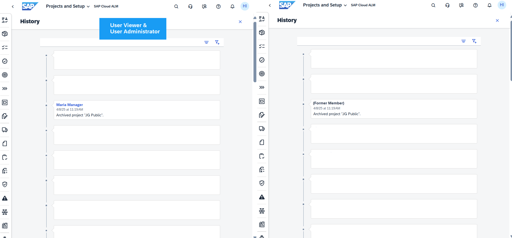

<!-- loioeaa4cab46776453caf998cd26484fe18 -->

<link rel="stylesheet" type="text/css" href="css/sap-icons.css"/>

# Adding, Deactivating, and Deleting Users

To manage users in the user management of SAP Cloud ALM, the identity of the user has to exist in the identity provider.

In SAP Cloud ALM, the Identity Authentication service assumes the role of the identity provider. This means that business users log on to SAP Cloud ALM with the mechanisms and credentials defined in the Identity Authentication tenant. For more information, see [Step 1: Onboard Users in Your Identity Authentication Service](https://help.sap.com/docs/cloud-alm/setup-administration/user-onboarding). From this follows:

-   Before you can add a user to SAP Cloud ALM, the identity of the user has to exist in the identity provider.

-   Deactivating or deleting a user in SAP Cloud ALM does not affect the user in your identity provider.

For the actions below, the status of the user in SAP Cloud ALM is also important. These are displayed in the table column \(*Table View*\), on the user card \(*Card View*\), and in the user details.

****

<table>
<tr>
<th valign="top">

User Status

</th>
<th valign="top">

Description

</th>
</tr>
<tr>
<td valign="top">

*New* 

</td>
<td valign="top">

The user has never logged into SAP Cloud ALM. If a role assignment request is pending for this user, then only *Waiting for Approval* is displayed as status.

</td>
</tr>
<tr>
<td valign="top">

*Waiting for Approval* 

</td>
<td valign="top">

There is at least one role assignment request pending for this user. To process the request, select *Approve* or *Reject* in the *Role Assignment Requests* section of the user details \(see [Processing Role Assignment Requests](processing-role-assignment-requests-3a0cad5.md)\).

</td>
</tr>
<tr>
<td valign="top">

*Active* 

</td>
<td valign="top">

The user has logged into SAP Cloud ALM, is not deactivated, and there are no open role assignment requests for this user.

</td>
</tr>
<tr>
<td valign="top">

*Expiring soon* 

</td>
<td valign="top">

In SAP Cloud ALM, the Identity Authentication service \(IAS\) assumes the role of an identity provider. When changing IAS settings in the SAP Business Technology Platform, a grace period prevents users from being automatically deactivated in SAP Cloud ALM and therefore losing personal settings and project assignments. The number of days specified in this status indicates the end of the grace period after which the user will be deactivated. A user with this status is not authorized to use SAP Cloud ALM, but after changing the IAS within the grace period personal settings and project assignments will still be valid.

If you do not want to wait until the end of the period, you can deactivate or delete the user as usual.

</td>
</tr>
<tr>
<td valign="top">

*Deactivated* 

</td>
<td valign="top">

The user has been deactivated due to an administrator action. A deactivated user can still log on, but is blocked for all applications. A user administrator can reactivate the user, but the role assignments are not restored.

</td>
</tr>
</table>

You perform all the following tasks in the user list of the *User Management* app. To display the list in the app, choose  \(Users\).

<a name="loioeaa4cab46776453caf998cd26484fe18__section_lsq_y3n_4wb"/>

## Add User

Create a new SAP Cloud ALM user and assign roles to the user. Besides the email address, the user ID \(if different\), and the associated roles it is not necessary to provide any master data since this is synchronized when the user logs on.

1.  In the user list, choose *Add User*

2.  Enter the *User ID* or *Email* as you've defined them in the settings of your identity provider. If, as per our recommendations, you've selected your email address as your user ID in your identity provider, you only need to enter the email address.

    > ### Caution:  
    > The *User ID* and *Email* fields are case-sensitive. Ensure they match exactly with the value of the attribute used as the subject name identifier in your identity provider, even if it's an email address.

3.  Select a type for your user. Possible types are:

    ****

    <table>
    <tr>
    <th valign="top">

    Type
    
    </th>
    <th valign="top">

    Description
    
    </th>
    </tr>
    <tr>
    <td valign="top">
    
    *Not Assigned* 
    
    </td>
    <td valign="top">
    
    No user type \(default value\)
    
    </td>
    </tr>
    <tr>
    <td valign="top">
    
    *Employee* 
    
    </td>
    <td valign="top">
    
    Employee of your company
    
    </td>
    </tr>
    <tr>
    <td valign="top">
    
    *SAP* 
    
    </td>
    <td valign="top">
    
    Consultant from SAP
    
    </td>
    </tr>
    <tr>
    <td valign="top">
    
    *Partner* 
    
    </td>
    <td valign="top">
    
    Consultant from official SAP partner
    
    </td>
    </tr>
    <tr>
    <td valign="top">
    
    *Other* 
    
    </td>
    <td valign="top">
    
    Person from a company other than SAP or official SAP partner
    
    </td>
    </tr>
    </table>
    
4.  Usually, you now assign one or multiple roles to the user. For detailed information, see [Changing the Role Assignment of a User](https://help.sap.com/viewer/877c96cf971648b09ee0d0a64f7f4fef/latest/en-US/63c3a1399cff436db56bbd4b709b0610.html "As a user manager, you can assign roles of different SAP Cloud ALM capabilities to specific users.") :arrow_upper_right:.

5.  Save your settings. The user is given the status *New*, and a welcome email is sent to this user containing introductory information for SAP Cloud ALM.

    > ### Remember:  
    > If your SAP Cloud ALM tenant is hosted in the region `eu11` \(EU Access\), no email service is provided by the data center. Your users do not automatically receive a welcome email. You need to use your own email server that you are operating under your responsibility.
    > 
    > Set up an SMTP mail destination named **SAP\_Business\_Notifications\_Mail** in your SAP BTP subaccount for SAP Cloud ALM, as described in [Configuring an SMTP Mail Destination](https://help.sap.com/docs/build-work-zone-standard-edition/sap-build-work-zone-standard-edition/configuring-smtp-mail-destination).

<a name="loioeaa4cab46776453caf998cd26484fe18__section_odz_y3n_4wb"/>

## Deactivate User

A deactivated user is blocked for all applications of SAP Cloud ALM. The corresponding user still exists, but is marked as *Deactivated*. Also, personal settings are deleted and the user is displayed anonymized.

For auditability reasons, you can still correlate the user to the performed actions if you have the role *User Administrator* or *User Viewer*.

> ### Note:  
> The user status *Deactivated* is needed for traceability; it does not make sense for users who have not logged onto SAP Cloud ALM before. Therefore, you can only deactivate users, who have logged into SAP Cloud ALM before, meaning their status was *Active*\).

<table>
<tr>
<td valign="top">

</td>
<td valign="top">

1.  In the user list, click the user you want to deactivate. If you don’t see the user because the list is too long, use the search or filter functions of the list.
2.  You can see the user details now. Choose *Deactivate* and confirm the control query.

You can activate a deactivated user again by choosing the *Reactivate* button. They will then, however, be treated like a new user, so role assignments are not restored. This action can only be performed by *User Administrators*.

> ### Remember:  
> In other apps, users with the *User Administrator* or *User Viewer* roles can view a deactivated user's history and actions, including full name and email. Users without these roles will only see the deactivated user as a *Former Member*.
> 
> 

</td>
</tr>
</table>

<a name="loioeaa4cab46776453caf998cd26484fe18__section_e2d_z3n_4wb"/>

## Delete User

You can delete a user if the user has never logged into SAP Cloud ALM \(status *New*\).

If you want to delete a user who has logged into SAP Cloud ALM before, you have to deactivate the user first, and subsequently delete the *Deactivated* user.

<table>
<tr>
<td valign="top">

</td>
<td valign="top">

1.  In the user list, click the user you want to delete. If you don’t see the user because the list is too long, use the search or filter functions of the list.
2.  You can see the user details now. Choose *Delete* and confirm the control query.

> ### Remember:  
> In other apps, users with the *User Administrator* or *User Viewer* roles can view a deleted user's history and actions, including user ID. Users without these roles will only see the deleted user as a *Former Member*.
> 
> 

</td>
</tr>
</table>

