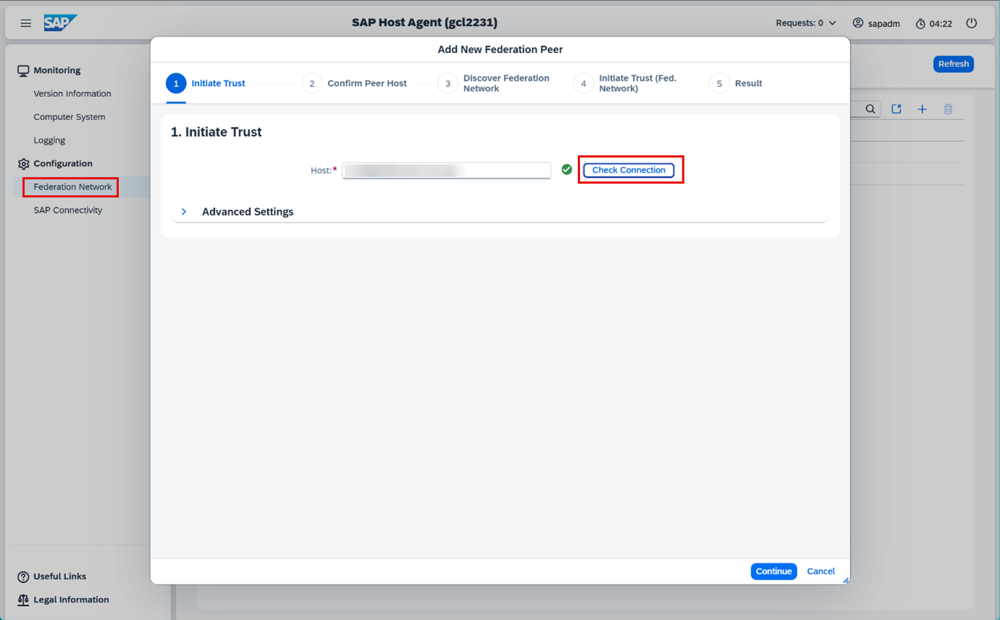

<!-- copy338a806878ff4070bddd8f472ee200cd -->

# Additional SAP HANA Database Health Monitoring Metrics for SAP S/4HANA

Learn how to get additional metrics for the health monitoring metrics of SAP HANA.

The following steps are only necessary if the database host isn't running directly on the application host.

<a name="copy338a806878ff4070bddd8f472ee200cd__section_gcx_rw3_hhc"/>

## Prerequisites

-   You're using the latest host agent version with at least patch level \(67\). The versions on the database and on the application server must match.
-   ST-PI 7.4 version 32 is installed and the packages are up to date.
-   You've implemented the steps from SAP Note [2023587](https://me.sap.com/notes/2023587) \(*Maintaining SAP HANA user store using SetDatabaseProperty for SAP Host Agent*\).
-   

<a name="copy338a806878ff4070bddd8f472ee200cd__section_s1w_vw3_hhc"/>

## Adding the Metrics

1.  Before starting, disable the health monitoring on SAP HANA:
    1.  Start transaction `/n/SDF/ALM_SETUP`.
    2.  Choose *Activate use-cases*.
    3.  Deactivate *Health Monitoring* and select continue.

2.  Select at least one application server. You can view the entries in transaction `SM51`.
3.  From this application server, find the host agent name with the appropriate transaction.
4.  To continue the configuration, access the *Host Agent Login*.
5.  Navigate to *Configuration* \> *Federation Network*:
    1.  Select *Add New Federation Peer*.
    2.  Enter the host name. It should include the application server with the IP address.
    3.  Choose *Check Connection*. The check needs to be successful.
    4.  Select *Continue* to go to *Confirm Peer Host*.
    5.  Choose *Continue* to go to *Confirm Peer Host*.

        

    6.  Verify the fully qualified domain name.
    7.  Check if the username is correct and enter the password.
    8.  Choose *Continue* to go to *Discover Federation Network*.
    9.  Ensure that the created host is added to the federation network.
    10. Choose *Finish*.

        

6.  Enable the health monitoring again:
    1.  Start transaction */n/SDF/ALM\_SETUP*.
    2.  Choose *Activate Use-Cases*.
    3.  Activate *Health Monitoring* and select continue.
    4.  Verify in *Health Monitoring* that the metrics are now visible.

