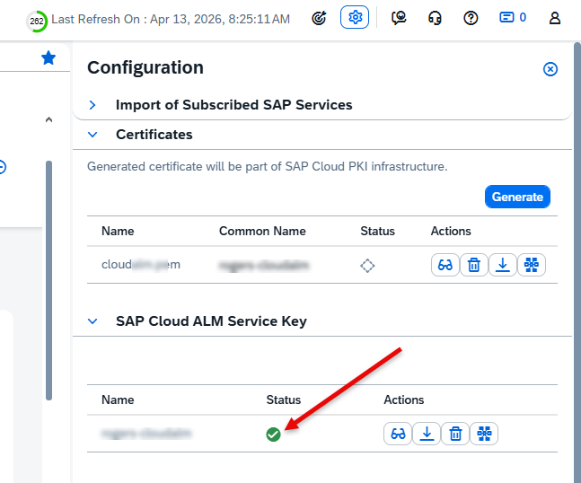
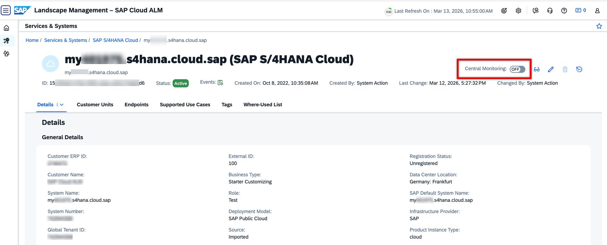
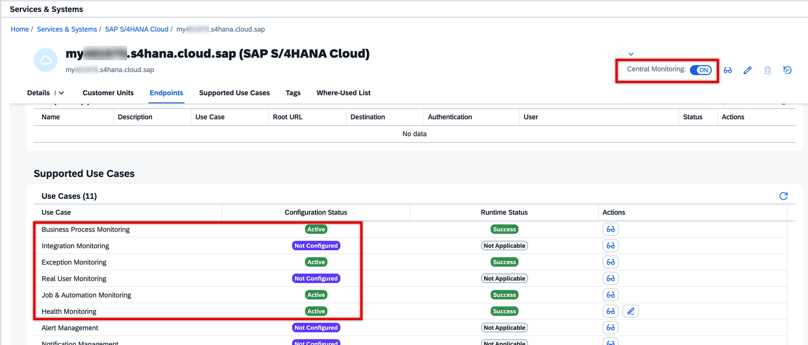

<!-- loio785d61b92dc64f768dbb219fb6c0ce57 -->

# Automated Setup in SAP Cloud ALM

An automated standard setup is available for SAP S/4HANA Cloud public edition systems.

## Prerequisites

The fully automated setup for SAP S/4HANA Cloud public edition can be applied if your implementation meets all of the following prerequisites:

-   The system information is automatically imported from the SAP backend \(SLIS\) to the *Landscape Management* app of SAP Cloud ALM.
-   In the *Landscape Management* app, the service has the status *New*.
-   In the *Landscape Management* app, the service key is valid and active:

    

-   The customer number for SAP S/4HANA Cloud public edition matches the customer number for the SAP Cloud ALM tenant.
-   SAP Cloud ALM is not located in `eu10-004`.

## Procedure

To activate monitoring in SAP Cloud ALM, follow these steps:

1.  In the *Landscape Management* app in SAP Cloud ALM, open SAP S/4HANA Cloud public edition, and choose *Central Monitoring*.

    

2.  In the dialog that opens, confirm consent and start the activation process.

3.  These steps occur automatically:
    1.  In the SAP BTP cockpit, the system sets up formations between SAP Cloud ALM and SAP S/4HANA Cloud public edition.
    2.  The formation calls back to the *Landscape Management* service in SAP Cloud ALM. It retrieves the monitoring use cases and API key. It then forwards them to the *Communication Systems* management function in SAP S/4HANA Cloud public edition.
    3.  *Communication Systems* management creates the communication arrangements in SAP S/4HANA Cloud.

4.  **Result**: Supported use cases become active in the *Landscape Management* service in SAP Cloud ALM.

    

Adjust the monitoring setup within the monitoring apps in SAP Cloud ALM as needed. For more details about configuration, see [SAP Cloud ALM for Operations](https://help.sap.com/docs/cloud-alm/applicationhelp/operations).

**Deactivation**: Deactivate the connection in the *Landscape Management* app by toggling off central monitoring.

