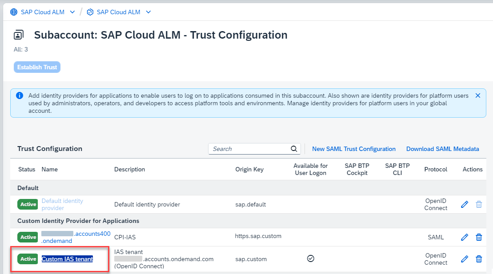
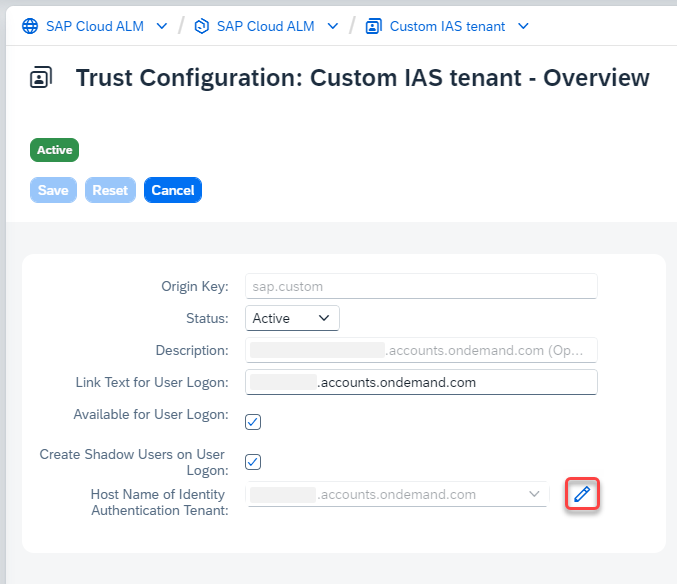

<!-- loio7869cbcd86a24c79b496f0ffcbab76f3 -->

<link rel="stylesheet" type="text/css" href="css/sap-icons.css"/>

# Changing Your Connected Identity Authentication Tenant

If necessary, you can change the Identity Authentication tenant that is connected to SAP Cloud ALM.

<a name="loio7869cbcd86a24c79b496f0ffcbab76f3__section_v3p_bvk_gfc"/>

## Note

Please note that the migration of user account and other data from one Identity Authentication tenant to another is currently not supported for SAP Cloud ALM.

Each Identity Authentication tenant is an individual repository of user accounts, which is separated from other Identity Authentication tenants, regardless of their role \(Test/Production\). This means that even if the same user accounts with the same identity information exist in multiple Identity Authentication tenants, each one is still an individual and separate user account. Because of this, users from different Identity Authentication tenants are considered as separate users by SAP Cloud ALM, even if their identity information is the same.

> ### Caution:  
> Therefore, changing the Identity Authentication tenant that is linked to SAP Cloud ALM after application users have already been created and have worked in SAP Cloud ALM productively, can have unwanted consequences:
> 
> -   Duplicate users \(one for each Identity Authentication tenant that has been connected to SAP Cloud ALM\) will appear in the *User Management* app, causing potential confusion when assigning role collections.
> 
> -   Duplicate users may appear in the context of business objects \(like projects, tasks, or features\) if the user accounts of both the previous and the new Identity Authentication tenants are assigned.
> 
> -   User access to business objects may be lost if only the user account of the previous Identity Authentication tenant is assigned.
> 
> -   Users may no longer be able to sign in to integrated solutions like Tricentis Test Automation for SAP.

<a name="loio7869cbcd86a24c79b496f0ffcbab76f3__section_sc5_bvk_gfc"/>

## Prerequisites

-   Your identity provider configuration is set up according to **State A**, as outlined in [Connected Identity Provider](https://help.sap.com/docs/cloud-alm/applicationhelp/connected-identity-provider#nicely-done).

-   The Identity Authentication tenant is associated with the customer ID of the SAP Cloud ALM global account.

-   The Identity Authentication tenant that you want to connect to SAP Cloud ALM is a **productive** tenant.

    We don't recommend using *Quality* or *Test* Identity Authentication tenants with SAP Cloud ALM.

-   You have the role *Subaccount Administrator* in the subaccount containing the SAP Cloud ALM subscription.

<a name="loio7869cbcd86a24c79b496f0ffcbab76f3__section_tyc_cvk_gfc"/>

## Procedure

1.  Open the [SAP BTP cockpit](https://cockpit.btp.cloud.sap).

2.  Select the global account that contains your SAP Cloud ALM entitlement and open the subaccount that contains your SAP Cloud ALM subscription.

3.  Navigate to *Security* \> *Trust Configuration*.

4.  Open the *Custom IAS tenant*.

    

5.  Choose *Edit*.

6.  Next to *Host Name of Identity Authentication Tenant*, choose :pencil2:.

    

7.  Select the desired Identity Authentication tenant.

8.  Save.

<a name="loio7869cbcd86a24c79b496f0ffcbab76f3__section_f5s_2wk_gfc"/>

## Result and Next Steps

The selected Identity Authentication tenant is now used as an identity provider for your SAP Cloud ALM tenant.

You can now start creating users and assigning role collections, as described in [Step 2: Assign Roles to Users in SAP Cloud ALM](01_required_setup/step-2-assign-roles-to-users-in-sap-cloud-alm-7304b17.md).

