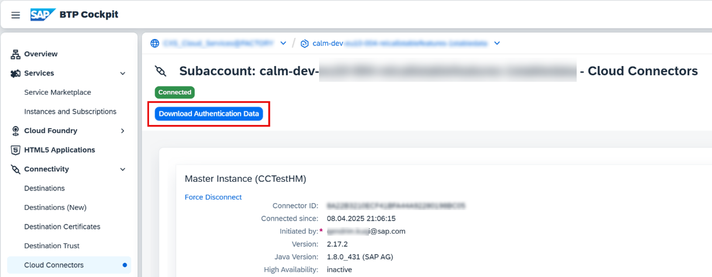
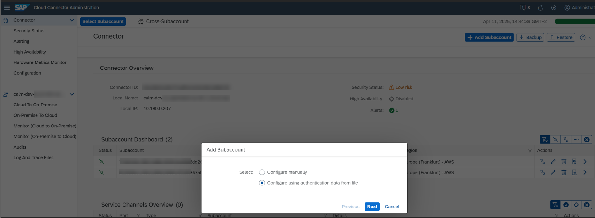
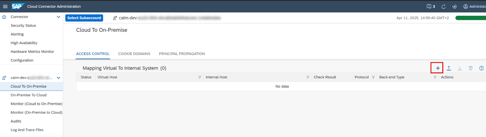
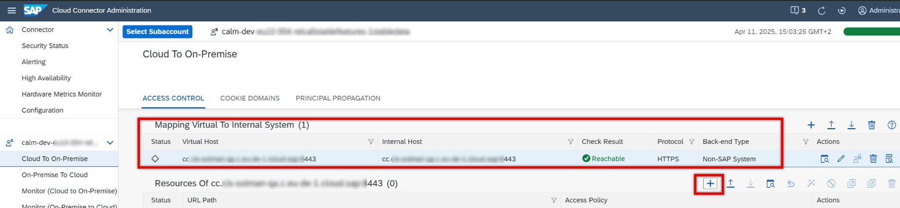
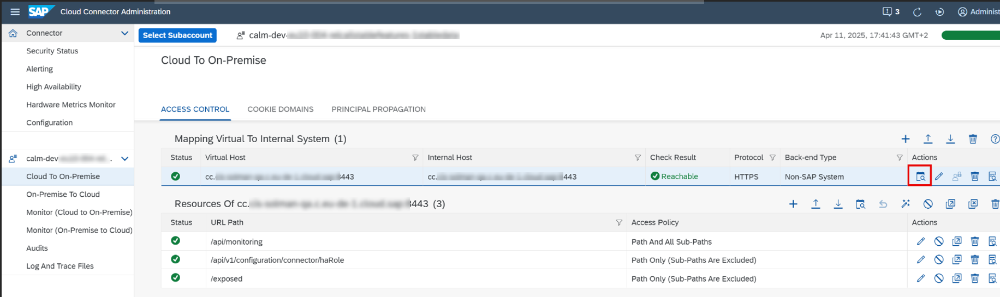

<!-- loio44b06600374f4e4b9bd6569ddc3403eb -->

<link rel="stylesheet" type="text/css" href="css/sap-icons.css"/>

# Cloud Connector

This document provides guidance on connecting a Cloud Connector to SAP Cloud ALM for monitoring purposes.

Currently, the following monitoring applications support the monitoring of Cloud Connector:

-   [Health Monitoring](https://support.sap.com/en/alm/sap-cloud-alm/operations/expert-portal/health-monitoring.html)

<a name="loio44b06600374f4e4b9bd6569ddc3403eb__section_hfm_vqp_1fc"/>

## Preparing the Cloud Connector

Cloud Connector APIs are only accessible by SSL-enabled HTTP \(https://...\). This means that you can't connect `localhost`.

To use a common naming convention within Cloud Connector, use a custom `hostname` as an alias for the `localhost`. It must be defined as Subject Alternative Name \(SAN\) in the SSL Certificate of the Cloud Connector and it must be identical across both main and shadow servers.

The following steps must be performed on both master and shadow servers.

### Create an Alias for localhost

1.  Create a local alias in the `/etc/hosts` file. In this example, we create the local alias `monitoring.local`.

    `127.0.0.1 localhost monitoring.local::1 localhost monitoring.local`

2.  Verify that the alias works:

    `ping monitoring.local`

### Create the Certificate Signing Request in Cloud Connector with SAN

1.  Log on to Cloud Connector with the administrator user.
2.  Go to *Configuration* \> *User Interface* \> *UI Certificate*.
3.  Choose *Generate Certificate Signing Request*.
4.  Under *Common Name \(CN\)*, enter the host name of the host on which the Cloud Connector is installed.

    Fill the other fields as required.

5.  Under *Subject Alternative Names*, choose *Add* \(`+`\).
    1.  Select type *DNS*.
    2.  Enter your local alias, for example `monitoring.local`.

6.  Choose *Generate*.
7.  The signing request is downloaded as a PEM file.
8.  The signing request must be provided to a certificate authority \(CA\), either one within your company or another one you trust. The certificate authority signs the request. Store the response that is returned in a file.
9.  Choose *Import a certificate*.
10. Select the certificate that you received in response to your signing request.
11. Choose *Import*.

<a name="loio44b06600374f4e4b9bd6569ddc3403eb__section_lqr_psp_1fc"/>

## Setup of Cloud Connector

### Connecting the SAP Cloud ALM Subaccount

1.  Go to your SAP BTP subaccount where SAP Cloud ALM is enabled.
2.  Under *Connectivity*, choose *Cloud Connectors*.
3.  Choose *Download Authentication Data*.

    

4.  Go to *Cloud Connector Administration*.
5.  Under *Connector*, choose *Add Subaccount*.
6.  Select *Configure using authentication data from file*:

    

7.  Select the authentication data file that you downloaded previously.
8.  Choose *Next* and enter any location ID.
9.  Choose *Finish*.

### Adding the Connection to the Cloud Connector Itself

1.  Go to *Cloud Connector Administration* \> *<*SAP Cloud ALM*tenant\>* \> *Cloud To On-Premise*.
2.  Choose *Add* \(`+`\) to add a new entry:

    

    Define the following information:

    1.      2.  *Back-end Type*: *Other SAP System*.
    3.  *Protocol*: HTTPS
    4.  *Internal Host*: Enter the alias that you created for Cloud Connector.
    5.  *Internal Port*: Enter the port on which Cloud Connector is running.
    6.  *Virtual Host*: Enter a hostname.
    7.  *Virtual Port*: Enter a port.
    8.  *Allow Principal Propagation*: *No*.
    9.  *Host In Request Header*: Use virtual host.

    

3.  Choose *Finish*.
4.  Select the entry for your Cloud Connector.
5.  Note down the value in the *Virtual Host* column for later use.
6.  Under *Resources Of <Cloud Connector\>*, choose *Add* \(`+`\). Enter the following values:
    -   *URL Path*: `/api/monitoring with Access Policy: Path And All Sub-Paths`
    -   *URL Path*: `/api/v1/configuration/connector/haRole with Access Policy: Path Only`
    -   *URL Path*: `/exposed with Access Policy: Path Only`

7.  Choose *Save*.
8.  For verification, choose *Check availability of internal host*.

    

### Creating a Monitoring User

Create a user for the data collection and assign the following role to the user: <code><code>sccmonitoring</code></code> or `sccadmin`.

More information under [Configure Named Cloud Connector Users](https://help.sap.com/docs/connectivity/sap-btp-connectivity-cf/configure-named-cloud-connector-users).

<a name="loio44b06600374f4e4b9bd6569ddc3403eb__section_ipx_3mq_1fc"/>

## Setup in SAP Cloud ALM

### Adding Cloud Connector to Landscape Management

1.  In SAP Cloud ALM, go to *Administration* \> *Landscape Management* \> *Systems*
2.  Choose *Add* and enter the following:
    1.  *Product*: Select *Cloud Connector*.
    2.  *System Name*: Enter a name for the Cloud Connector.
    3.  *Role*: Select the correct system role.
    4.  *Location ID*: You find the location ID in your Cloud Connector, in the view for your SAP Cloud ALMsubaccount, in the *Subaccount Overview* group. If there no location ID is maintained, leave this field empty.
    5.  *Connector ID*: You find the connector ID in your Cloud Connector, in the *Connector* view

3.  Save.

### Creating an HTTP Endpoint

Now, you need to create the endpoint in your SAP Cloud ALM tenant, to enable data collection.

1.  Open the *Landscape Management* app from the launchpad and select your service under *Services & Systems*.
2.  Choose the service name or choose  \(Navigation\) at the end of the row.
3.  On the *Endpoints* tab, choose *Add* to create a new endpoint.
4.  Fill the fields as follows:
    -   Enter a description.
    -   Choose the use-case *Health Monitoring*.

    -   *Virtual Host and Port*: Enter the value from the *Virtual Host* field that you maintained during the Cloud Connector setup
    -   Under *Authentication* enter the following:
        1.  *Authentication Type*: Basic authentication
        2.  *User*: The monitoring user that you created in Cloud Connector.
        3.  *Password*: The password for the user.

5.  Save your endpoint.

<a name="loio44b06600374f4e4b9bd6569ddc3403eb__section_wpx_vnq_1fc"/>

## Next Steps

After creating the endpoint in SAP Cloud ALM, you can activate the monitoring use cases.

-   [Activate data collection for Health Monitoring](https://help.sap.com/docs/cloud-alm/applicationhelp/configuring-health-monitoring)

<a name="loio44b06600374f4e4b9bd6569ddc3403eb__section_ad1_d4q_1fc"/>

## Troubleshooting and Support

Problems during the Cloud Connector setup:

### I can't save the endpoint I created for Cloud Connector.

You've configured a system of type Cloud Connector in the *Landscape Management* app and now want to add an endpoint for the data collection, but when you try to save the endpoint, you get an error.

You can only save an endpoint if the implicit connection check for the endpoint is successful. There can be different reasons why a connection check fails:

-   400 Bad Request, with the message *Bad Request - This combination of host and port requires TLS*: When you add the entry for the Cloud Connector in the Cloud Connector setup "Cloud to On-Premise", choose the HTTPS protocol. HTTP communication isn't allowed for Cloud Connector.
-   Error *401 Unauthorized*: Check whether the credentials for the Cloud Connector are correct. Try to log on to the Cloud Connector UI with this user, and check the authorization of the user.
-   Error *404 Not Found*: Ensure that you've maintained the correct internal host and internal port when you added the Cloud Connector during the Cloud Connector setup under "Cloud to On-Premise", in the Cloud Connector UI. You can verify this by checking the URL that you used to log on to the Cloud Connector UI.

    If no port is mentioned in the URL of the Cloud Connector UI, find this port in the logs of the `ljs_trace.log` in the *Log And Trace Files* section of the Cloud Connector UI.

### Where can I find further information for the Cloud Connector setup?

Please check [SAP Help Portal - Cloud Connector](https://help.sap.com/docs/connectivity/sap-btp-connectivity-cf/cloud-connector) for detailed documentation.

### I have a main and a shadow instance configured. How can I keep monitoring the Cloud Connector after a role switch between the two?

This is possible through the following configuration:

1.  Make sure that the alias is the same in the `/etc/hosts` file for both master and shadow instance.
2.  Use this alias as internal host \(preceding the port\) for a "Cloud to On-Premise" entry for each of the instances \(once they have the master role\).
3.  Use the same virtual host in each of the entries, in point 2.
4.  Finally, in the *Landscape Management* app of SAP Cloud ALM, maintain this virtual host for the endpoint in the Cloud Connector system. This way, only one endpoint needs to be maintained in the configuration.

