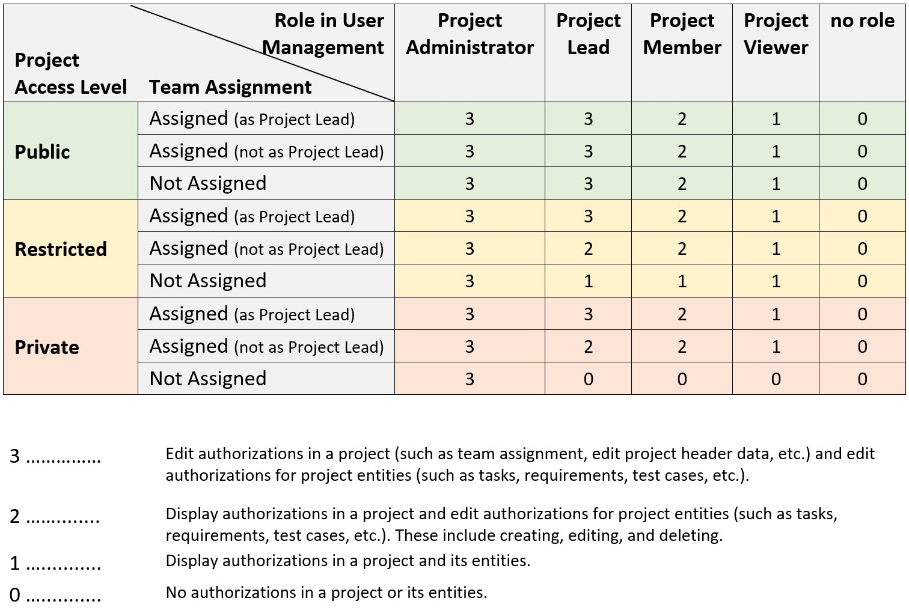

<!-- loioa2c0029b94784563898f797138068f0b -->

# Configuring Project User Permissions

Assign project access levels and project roles in the *Projects and Setup* app to control the access to and ability to display or change application objects in SAP Cloud ALM for implementation apps.

<a name="loioa2c0029b94784563898f797138068f0b__section_onm_rsv_xgc"/>

## Access Levels

Project user authorizations are defined by a combination of the project access levels, the roles users are assigned to in the user management, and the roles users are assigned to in project management.

In the *Projects and Setup* app, you can set one of the following access levels for your project:

-   *Public*: This project is publicly accessible by all users with project management authorizations.

-   *Restricted*: This project is restricted and only project members can make changes within the project \(display for non-project-members allowed\).

-   *Private*: This project is private and can only be accessed by project members \(display for non-project-members not allowed\).

> ### Note:  
> The default access level is *Restricted*. You can change this later.

<a name="loioa2c0029b94784563898f797138068f0b__section_qvw_ssv_xgc"/>

## Authorization Roles and Project Roles

Within each access level, the project permissions for a user are defined by a combination of their authorization role assignment and their project role assignment.

In the *Projects and Setup* app, you can assign users to teams in numerous project roles, such as *Project Lead*, *Analytics Expert*, or *Business Process Expert*.

By assigning a user to a project role, you trigger a request to assign the respective authorization role in the *User Management* app. The *User Administrator* can approve or reject this request. If you have the *User Administrator* role yourself, your request is automatically approved.

Any authorization changes to projects or to project or team assignments only apply after the next logon of the user.

<a name="loioa2c0029b94784563898f797138068f0b__section_xrw_ftv_xgc"/>

## Authorizations in Restricted and Private Projects

In the following table, you can see how the combination of team assignment and the role assignment result in different authorizations depending on the project access level.

The first column of the table shows the three access levels that can be determined during project setup in the *Projects and Setup* app. The second column shows the team assignment type. The rest of the columns shows the different roles a user can be assigned to in the *User Management* app. In the table legend, the different authorizations are defined that result from the user assignments and project access level settings in the different apps.

When you set the access level for a project to *Public*, user authorizations are only affected by the roles that are assigned in *User Management*. This is not the case for the access levels *Restricted* and *Private*. Here, user authorizations are both affected by the roles that are assigned in *User Management* and the team assignments made in the *Projects and Setup* app.

**Related Information**  

[Roles](01_required_setup/roles-e1915af.md "Roles in SAP Cloud ALM are delivered predefined and ready to use.")

[Roles – Implementation](01_required_setup/implementation-782a563.md "In the following sections, you can find detailed breakdowns of all roles related to SAP Cloud ALM for implementation, mapped to the individual actions they allow users to perform.")

