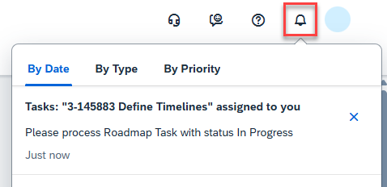
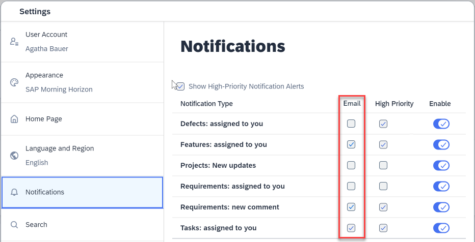
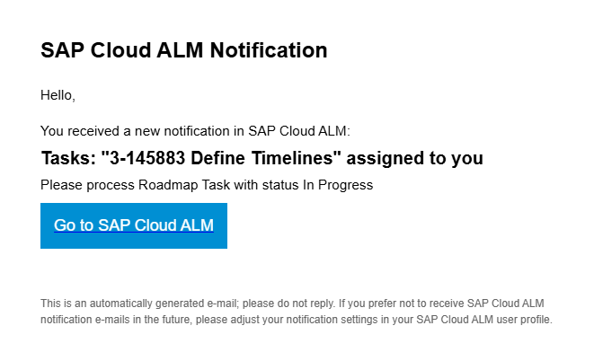

<!-- loiofbd50d1ee4694e4eb1e94e387a28ec7f -->

# Enabling Email Channel for In-App Notifications

You can enable the email channel for the in-app notifications that are sent by SAP Cloud ALM.

<a name="loiofbd50d1ee4694e4eb1e94e387a28ec7f__section_zmf_cfd_kfc"/>

## Notification Types

You can find a full list of all available notification types under *Settings* \> *Notifications*.

<a name="loiofbd50d1ee4694e4eb1e94e387a28ec7f__section_sxg_srj_5bc"/>

## Procedure

You have two options for sending email notifications:

-   You can use the email service provided by the data center hosting your SAP Cloud ALM tenant. This option doesn't require any admin-level configuration. The email notifications go out under the sender name `SAP Cloud ALM Notifications` and the address `sapcloudalm@notifications.sap.com`.

    > ### Note:  
    > If your SAP Cloud ALM tenant is hosted in the region `eu11` \(EU Access\), no email service is provided by the data center. Please use your own email server as described below.

-   If you want to use your own infrastructure and determine the sender address yourself, you can use your own email server that you are operating under your responsibility.

    For this case, you need to set up an SMTP mail destination in your SAP BTP subaccount for SAP Cloud ALM, as described in [Configuring an SMTP Mail Destination](https://help.sap.com/docs/build-work-zone-standard-edition/sap-build-work-zone-standard-edition/configuring-smtp-mail-destination). If that destination is configured, then the notification emails will only be sent via your own email server.

    > ### Note:  
    > You need to set up the Custom SMTP Destination Name as **SAP\_Business\_Notifications\_Mail**to receive the notifications emails from your custom SMTP destination server.

### Activating Email Notifications \(User Action\)

No matter how the emails are sent, users can turn on email notifications for different types of notifications individually.

Whereas the in-app notifications are active by default, the email notifications work on an opt-in basis. Each user can choose which notifications should trigger an email notification. Administrators can't mass-activate these settings for multiple or all users in the SAP Cloud ALM tenant.

To enable email notifications for your account, click on your user profile in the top-right corner of the SAP Cloud ALM launchpad and choose *Settings* \> *Notifications*. Here, check the *Email* flags for the notification types you want to receive emails for.

<a name="loiofbd50d1ee4694e4eb1e94e387a28ec7f__section_tyw_d5b_kbc"/>

## Result

After the configuration, you receive email notifications according to your selection.

The emails contain all relevant information for the notification, and a link to the corresponding application in SAP Cloud ALM to process the issue.

