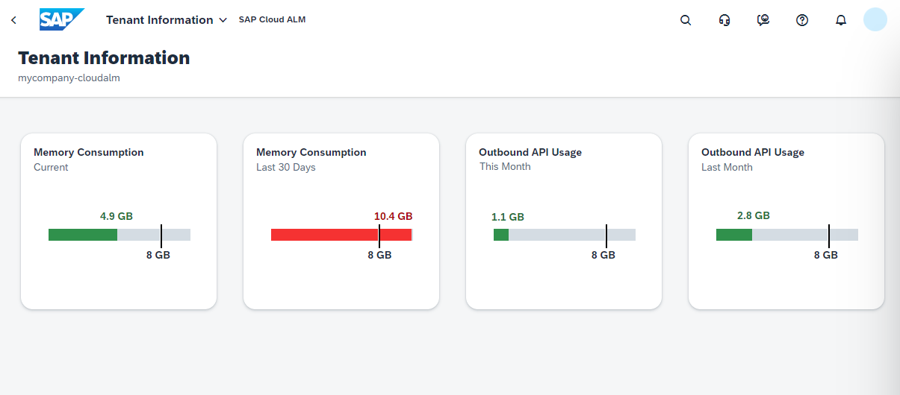

<!-- loio94cd95e1b8454b5180d6a3daeccb1500 -->

# Fair Use

SAP Cloud ALM is included in cloud subscriptions with SAP Enterprise Support as described in the SAP [usage rights](https://support.sap.com/en/alm/usage-rights.html).

Sufficient resources for standard use are included, per default:

-   SAP HANA memory: 8 GB

-   API usage: 8 GB outbound data transfer per month

-   Cloud operations at SAP

-   Administration and monitoring

You can monitor usage metrics related to your SAP Cloud ALM tenant, such as your memory consumption and your outbound API usage, in the *Tenant Information* app.

To reduce your memory usage, you can change your housekeeping settings in SAP Cloud ALM for operations apps. For more information, see [Housekeeping](https://support.sap.com/en/alm/sap-cloud-alm/operations/expert-portal/housekeeping.html) on SAP Support Portal.

To cover extended use scenarios, you can subscribe to additional services.

<a name="loio94cd95e1b8454b5180d6a3daeccb1500__section_oy4_cj1_ppb"/>

## SAP Cloud ALM, Tenant Extension

For additional memory usage, beyond the standard, you can subscribe to the microservice *SAP Cloud ALM, tenant extension*. This service provides you with an additional SAP Cloud ALM tenant, which comes with 8 GB of SAP HANA memory and 8 GB of monthly outbound API data transfer.

For more information, see [Getting Additional SAP Cloud ALM Tenants](getting-additional-sap-cloud-alm-tenants-29b6a05.md).

-   **[Getting Additional SAP Cloud ALM Tenants](getting-additional-sap-cloud-alm-tenants-29b6a05.md "By subscribing to SAP Cloud ALM, tenant extension, you can get additional
		SAP Cloud ALM tenants for your customer number.")**  
By subscribing to *SAP Cloud ALM, tenant extension*, you can get additional SAP Cloud ALM tenants for your customer number.

**Related Information**  

[What Is the Consumption-Based Commercial Model?](https://help.sap.com/viewer/65de2977205c403bbc107264b8eccf4b/Cloud/en-US/7047eb4a15a84ac7be3c8612179e6d1f.html)

[FAQ Consumption-based commercial model CPEA & Cloud Credits](https://www.sap.com/documents/2021/02/668ae6f5-cd7d-0010-87a3-c30de2ffd8ff.html)

