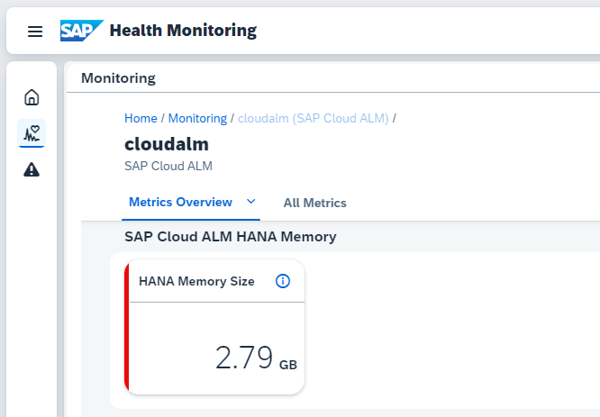

<!-- loio94cd95e1b8454b5180d6a3daeccb1500 -->

# Fair Use

SAP Cloud ALM is included in cloud subscriptions with SAP Enterprise Support as described in the SAP [usage rights](https://support.sap.com/en/alm/usage-rights.html).

Sufficient resources for standard use are included, per default:

-   SAP HANA memory: 8 GB

-   API usage: 8 GB outbound data transfer per month

-   Cloud operations at SAP

-   Administration and monitoring

You can monitor the SAP HANA memory consumption in SAP Cloud ALM in the *Health Monitoring* app by selecting your SAP Cloud ALM service and checking the *SAP Cloud ALM HANA Memory* metric.

To reduce your memory usage, you can change your housekeeping settings in SAP Cloud ALM for operations apps. For more information, see [Housekeeping](https://support.sap.com/en/alm/sap-cloud-alm/operations/expert-portal/housekeeping.html) on SAP Support Portal.

To cover extended use scenarios, you can subscribe to additional services.

<a name="loio94cd95e1b8454b5180d6a3daeccb1500__section_oy4_cj1_ppb"/>

## Extension of Fair Use

Additional memory usage, beyond the standard, requires the subscription of the microservice *SAP Cloud ALM, memory extension*.

This service is available in blocks of 4 GB, with a fixed price per month.

The following requirements can cause an extended SAP Cloud ALM usage, above the average usage:

-   Extensive storing of data from monitoring activities on the SAP HANA database

-   Storing large amounts of monitoring data for a large system landscape for a longer time period \(performance, business process monitoring, or integration monitoring\)

-   Building own UIs or dashboards

-   Programming own enhancements

-   Using additional monitoring platforms outside the SAP landscape and uploading monitoring data daily, from a third-party system.

Be aware that any document uploads aren't stored in the SAP HANA memory. They require that you connect an SAP or external DMS service and therefore do not affect the 8 GB limitation.

> ### Tip:  
> The *SAP Cloud ALM, memory extension* service is available via a service subscription on CPEA: see [SAP Discovery Center](https://discovery-center.cloud.sap/#/serviceCatalog/sap-cloud-alm-memory-extension).
> 
> There's no need to subscribe to the service before the limit reached. SAP also actively approaches you if your memory usage is beyond the baseline memory \(see also the [usage rights](https://support.sap.com/en/alm/usage-rights.html)\).

-   The activation of the memory extension service is required after SAP has reviewed the status together with customer and suggested how a decrease of memory could be achieved.

-   You're informed when the overusage has been recognized and requested to start a CPEA agreement during the next month and activate the service *SAP Cloud ALM, memory extension*.

-   If you continue to extend the 8 GB memory over the next months, without an extension, SAP reserves the right to take legal action.

Charging of costs:

-   When the service is activated, you're automatically charged for every month where you extend the memory at least once.

-   In months without a memory consumption beyond 8 GB, there's no charging.

-   Metering starts at first day of the month and rests on the latest day of the month.

-   The service is available in packages of 4 GB memory. If, for example, you need an extra of 6 GB in a month, you're charged for two packages.

<a name="loio94cd95e1b8454b5180d6a3daeccb1500__section_rvx_2st_1qb"/>

## More

-   [What Is the Consumption-Based Commercial Model?](https://help.sap.com/viewer/65de2977205c403bbc107264b8eccf4b/Cloud/en-US/7047eb4a15a84ac7be3c8612179e6d1f.html)

-   [FAQ: Consumption-based commercial model CPEA & Cloud Credits](https://www.sap.com/products/extension-suite/pricing.html?pdf-asset=668ae6f5-cd7d-0010-87a3-c30de2ffd8ff&page=1#cpea)

<a name="loio94cd95e1b8454b5180d6a3daeccb1500__section_ijz_ggx_dwb"/>

## SAP Cloud ALM, API Outbound Volume

You can't extend the given limitation of 8 GB API outbound volume, until further notice. Check this document for updates.

SAP actively approaches you if your API outbound volume is beyond the baseline memory \(see also the SAP [usage rights](https://support.sap.com/en/alm/usage-rights.html)\).

