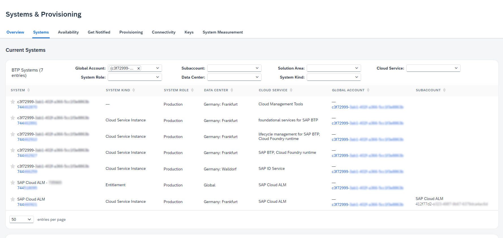

<!-- loio9d4aa2ad1b304dd2a1046f6ebba11612 -->

# Finding Your Systems on SAP for Me

The *Systems & Provisioning* dashboard on SAP for Me is your one-stop place for all your active public cloud systems on SAP BTP.

When SAP Cloud ALM was provisioned, several entities were created in addition to your SAP Cloud ALM tenant. All of these entities are listed on the [Systems](https://me.sap.com/systemsprovisioning/systems) page when you filter by your global account ID.

From the *Systems* page, you can also navigate to your global account on SAP BTP and to your SAP Cloud ALM tenant:

1.  Under *BTP Systems*, search for *SAP Cloud ALM*.

2.  You can now see two entries for SAP Cloud ALM:

    -   Data Center Region: Global

    -   Data Center Region: <Region of the subaccount\>

    > ### Note:  
    > If your company has multiple customer numbers, the entries related to SAP Cloud ALM may occur for several of these customer numbers. Each customer number can have its own SAP Cloud ALM installation.

    

3.  To open SAP Cloud ALM, click on the system number of the entry with the data center region <Region of the subaccount\>. Then choose *Launch System*.

4.  To open your global account on SAP BTP, click on the GUID in the *Global Account* column. Then choose *Launch System*.

<a name="loio9d4aa2ad1b304dd2a1046f6ebba11612__section_gll_mh3_42c"/>

## Subscribing to Cloud Email Notifications

If you want to be informed and receive timely updates regarding SAP Cloud ALM and your other SAP cloud services, for example, about planned and unplanned downtimes and other customer communications, you can subscribe to cloud availability notifications.

For more information, see KBA [2900069](https://me.sap.com/notes/2900069).

**Related Information**  

[Systems Tab – SAP Support Portal](https://support.sap.com/content/s4m/help/systems/systems.html)

[System Details – SAP Support Portal](https://support.sap.com/content/s4m/help/systems/systems/details.html)

