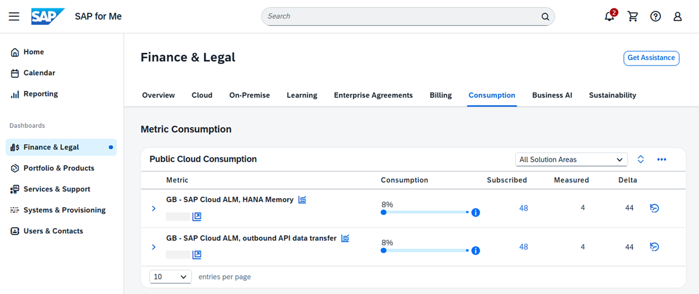

<!-- loio29b6a05182e94e64be2e31862962b9e1 -->

# Getting Additional SAP Cloud ALM Tenants

By subscribing to *SAP Cloud ALM, tenant extension*, you can get additional SAP Cloud ALM tenants for your customer number.

Here's what you get by purchasing a tenant extension:

-   An entitlement for one additional SAP Cloud ALM tenant

-   An additional 24 GB of SAP HANA memory

-   An additional 24 GB of monthly outbound API data transfer

-   An entitlement for an additional Tricentis test automation for SAP tenant that is integrated with your additional tenant

> ### Note:  
> You don't have to request the provisioning of your additional SAP Cloud ALM tenant. Instead, you can also use the additional resources on your existing SAP Cloud ALM tenant.
> 
> Each additional SAP Cloud ALM tenant will be provisioned in its own dedicated SAP BTP global account.

Each extension can be used either for a new SAP Cloud ALM tenant \(with 24 GB of SAP HANA memory usage, and 24 GB of outbound API data transfer per calendar month\), or as extension of these limits for an existing tenant. If you have multiple SAP Cloud ALM tenants, you are free to distribute your memory and outbound API data transfer limits across them to your own choice.

> ### Example:  
> If you are under a qualifying enterprise support agreement, you are entitled to one SAP Cloud ALM tenant, and in addition you have procured 2 tenant extension products. This means that you are granted:
> 
> -   The rights to provision 2 additional SAP Cloud ALM tenants
> -   A total 72 GB of SAP HANA memory usage: 24 GB for the standard SAP Cloud ALM tenant and 2x24 GB for the extensions
> -   72 GB of outbound API data transfer per calendar month
> 
> So, you can use one tenant with up to 72 GB of SAP HANA memory and outbound API data transfer, or use three tenants and distribute up to 72 GB across them.

There's no restriction on the number of tenant extensions which you can subscribe to. You can get as many as you need for your organization and purposes.

From a functional and technical point of view, the additional tenants are identical to your original SAP Cloud ALM tenant. Here's how you can benefit from requesting additional tenants:

-   Use multiple productive tenants, for example, to provide SAP Cloud ALM to different organizational units in large enterprises or to separate SAP Cloud ALM for implementation and SAP Cloud ALM for operations.

-   Add a development or test tenant to the existing productive tenant, for example, to build and test extensions.

-   Separate systems from different landscapes, for example, for systems containing sensitive information.

-   Create training or playground environments.

For recommendations on how to leverage multiple SAP Cloud ALM tenants in your landscape, see [Using Multiple SAP Cloud ALM Tenants](https://support.sap.com/content/dam/support/en_us/library/ssp/alm/sap-cloud-alm/Using%20Multiple%20SAP%20Cloud%20ALM%20Tenants.pdf).

<a name="loio29b6a05182e94e64be2e31862962b9e1__section_gwx_lrf_xcc"/>

## Procedure

You can purchase the *SAP Cloud ALM, tenant extension* by getting in touch with your account executive or your sales representative.

Then, you have the following options on how to use the additional quota:

-   If you want an additional SAP Cloud ALM tenant, start the provisioning on SAP for Me, as described in [Requesting SAP Cloud ALM](requesting-sap-cloud-alm-2ba35e6.md).

-   If you want to use the additional memory and data transfer volume on your existing SAP Cloud ALM tenant, no further action is required. They're automatically applied to your SAP Cloud ALM tenant.

    To get an overview of your current consumption, visit the [Finance & Legal](https://me.sap.com/financelegal) dashboard on SAP for Me. In the *Consumption* tab, you can find both the subscribed value and your current consumption.

    

