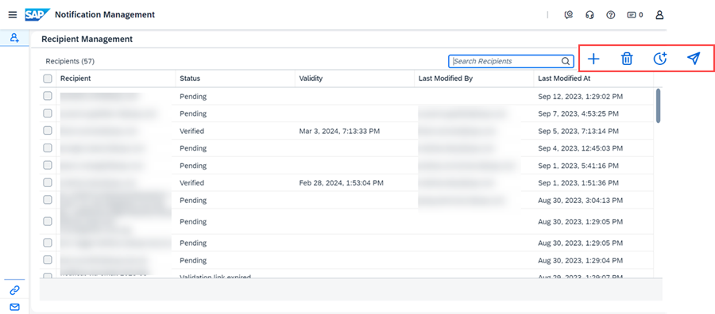

<!-- loio0046f124fe434b94a4a64c635d230a8a -->

<link rel="stylesheet" type="text/css" href="css/sap-icons.css"/>

# Managing Notification Recipients

You can manage the recipients of email notifications relating to SAP Cloud ALM for operations apps in the *Notification Management* app.

Notifications are sent, for example, as part of an event action created in the *Intelligent Event Processing* app or in other monitoring apps.

> ### Note:  
> The *Notification Management* in SAP Cloud ALM for operations is a different and separate mechanism from the in-app notifications described in [Enabling Email Channel for In-App Notifications](enabling-email-channel-for-in-app-notifications-fbd50d1.md).

<a name="loio0046f124fe434b94a4a64c635d230a8a__section_afq_k4x_hdc"/>

## Prerequisites

You have an *Administrator* or *Architect* role in a monitoring app in SAP Cloud ALM for operations.

<a name="loio0046f124fe434b94a4a64c635d230a8a__section_xx1_wnx_hdc"/>

## Procedure

1.  Choose :heavy_plus_sign:.

    

2.  Enter the email address of the recipient.

    You can add both named users \(that is, users that are maintained in the Identity Authentication tenant\) and unnamed users.

3.  The user then receives an email and can give consent to the notifications. You can track their verification status in the app.

4.  When the recipient clicks on the verification link, they are added to the recipient list and can then receive notifications from SAP Cloud ALM.

<a name="loio0046f124fe434b94a4a64c635d230a8a__section_bth_drx_hdc"/>

## Result and Next Steps

Once given, the consent is valid for 6 months. Shortly before their consent expires, recipients can renew their own subscription.

Recipients can unsubscribe from notifications at any time by choosing *Unsubscribe* in the footer of any email sent by the *Notification Management* app.

<a name="loio0046f124fe434b94a4a64c635d230a8a__section_gls_4nx_hdc"/>

## Related Information

For more detailed information about the capabilities of the *Notification Management* app, refer to the in-app help \(\) and [Notification Management](https://help.sap.com/docs/cloud-alm/applicationhelp/notification-management) in the SAP Cloud ALM Application Help.

