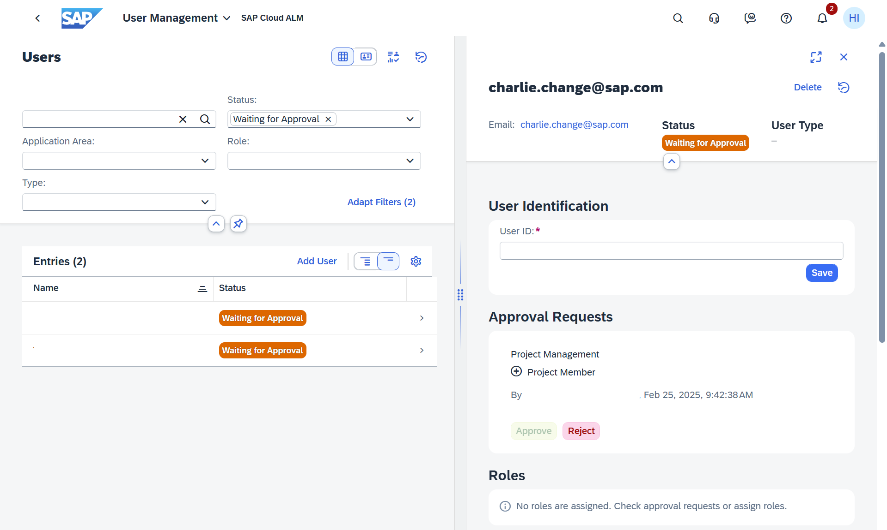
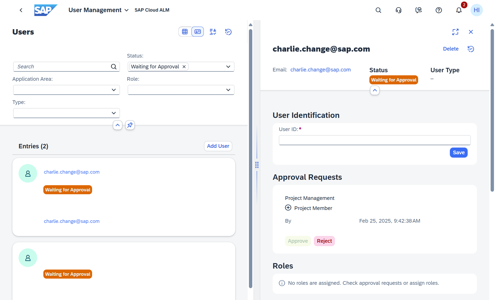

<!-- loio3a0cad574216483bb9d80e3a9cf72867 -->

<link rel="stylesheet" type="text/css" href="css/sap-icons.css"/>

# Processing Approval Requests

Approval requests are tasks for user administrators generated from a user, without user administrator authorizations, to change the role assignment of a user.

As a user administrator, you can assign roles to users directly. The process is described here: [Changing the Role Assignment of a User](https://help.sap.com/viewer/877c96cf971648b09ee0d0a64f7f4fef/latest/en-US/63c3a1399cff436db56bbd4b709b0610.html "As a user manager, you can assign roles of different application areas to specific users.") :arrow_upper_right:.

In addition, approval requests can be generated when an application owner, without user administration authorizations, assigns a role to a user. This role assignment then generates an approval request.

> ### Example:  
> In the app *Projects and Setup*, the project lead assigns team members to project tasks, which are then assigned to roles. If the project lead does not have permission to assign roles in user management, a corresponding approval request is created automatically.

Open approval requests are displayed in the card *Approval Requests* of the user management *Overview*. Also, the status *Waiting for Approval* is displayed for the corresponding user in the user list.

If an approval request is created, all users with authorization to approve this request are also notified via the SAP Cloud ALM launchpad. To process the approval request, you can click the corresponding notification.

The approval request contains the following information:

-   Name of the user whose role assignment is to be changed

-   Application area of the affected roles

-   Role titles:

    -   Roles that are to be assigned to the user are indicated by a plus icon \(\).

    -   Roles that are to be removed from the user are indicated by a minus icon \(\).

-   Name of the requestor and time of the request

The requests form a task list that the user administrator processes by approving or rejecting them.

You can also navigate directly from this card to a list of users with pending approval requests without processing a request:

-   Select the title area to display all users with pending approval requests. This is especially useful if there are too many approval requests to display all of them in the card at once.

-   Select any approval request from the list to display the complete details of the affected user including the roles already assigned to the user. You can also process the approval request in this user details screen.

<table>
<tr>
<td valign="top">

</td>
<td valign="top">

</td>
</tr>
</table>

> ### Note:  
> If your identity provider does not use the email address as the user ID, you have to specify the user ID to approve the request.

Additional information:

-   Processed requests are displayed in the history \(see [Displaying the History of User Administration Actions](https://help.sap.com/viewer/877c96cf971648b09ee0d0a64f7f4fef/latest/en-US/e495d970a3b244aa82a83e0553f03b3d.html "You can display a history of user administration actions, globally or user-specific, in chronological order.") :arrow_upper_right:\).

-   When you approve the request, the changes are valid as of the user's next logon.

-   When you approve a request for a new or previously deactivated user, a welcome email is sent to this user containing introductory information for SAP Cloud ALM.

