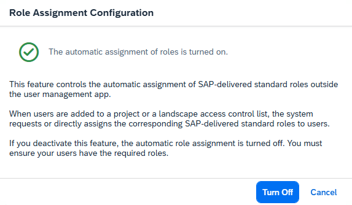
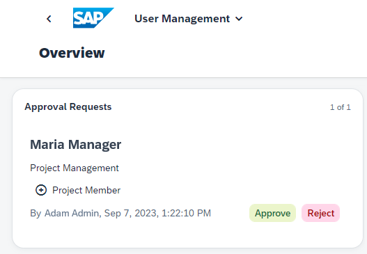
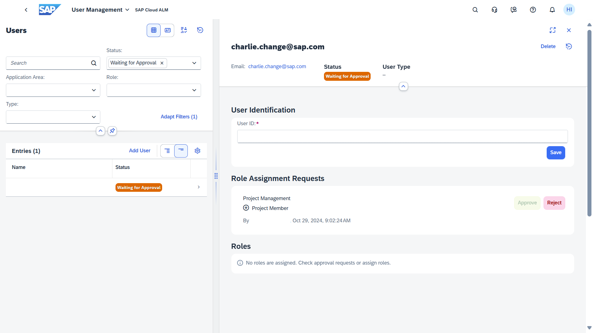

<!-- loio3a0cad574216483bb9d80e3a9cf72867 -->

<link rel="stylesheet" type="text/css" href="css/sap-icons.css"/>

# Processing Role Assignment Requests

Role assignment requests are tasks for user administrators generated from a user, without user administrator authorizations, to change the role assignment of a user.

<a name="loio3a0cad574216483bb9d80e3a9cf72867__section_djb_bpf_qfc"/>

## Context

As a user administrator, you can assign roles to users directly. The process is described here: [Changing the Role Assignment of a User](https://help.sap.com/viewer/877c96cf971648b09ee0d0a64f7f4fef/latest/en-US/63c3a1399cff436db56bbd4b709b0610.html "As a user manager, you can assign roles of different SAP Cloud ALM capabilities to specific users.") :arrow_upper_right:.

In addition, role assignment requests can be generated when an application owner, without user administration authorizations, assigns a role to a user directly from an application. This role assignment then generates a role assignment request.

The following actions generate such a role assignment request:

****

<table>
<tr>
<th valign="top">

App

</th>
<th valign="top">

Action

</th>
</tr>
<tr>
<td valign="top">

*Projects and Setup*

</td>
<td valign="top">

A user with the role *Project Administrator* or *Project Lead* assigns team members to project tasks, which are then assigned to project roles.

</td>
</tr>
<tr>
<td valign="top">

*Landscape Management*

</td>
<td valign="top">

A user with the role *Landscape Access Controller* adds users to an access control list and/or checks the box *Grant added users change access to Landscape Objects on Access Control List in Landscape Management*.

</td>
</tr>
</table>

If the application owner has the *User Administrator* role, no role assignment request is generated. The role is assigned to the user without further approval.

> ### Note:  
> If you don't want to allow the automatic assignment of roles, you can deactivate this feature on the *Role Assignment Configuration* card.
> 
> 

<a name="loio3a0cad574216483bb9d80e3a9cf72867__section_yl1_4pf_qfc"/>

## Working with Role Assignment Requests

Open role assignment requests are displayed in the card *Role Assignment Requests*. Also, the status *Waiting for Approval* is displayed for the corresponding user in the user list.

If a role assignment request is created, all users with authorization to approve this request are also notified via the SAP Cloud ALM launchpad. To process the role assignment request, you can click the corresponding notification.

The role assignment request contains the following information:

-   Name of the user whose role assignment is to be changed

-   SAP Cloud ALM Capability of the affected roles

-   Role titles:

    -   Roles that are to be assigned to the user are indicated by a plus icon \(\).

    -   Roles that are to be removed from the user are indicated by a minus icon \(\).

-   Name of the requester and time of the request

The requests form a task list that the user administrator processes by approving or rejecting them.

You can also navigate directly from this card to a list of users with pending role assignment requests without processing a request:

-   Select the title area to display all users with pending role assignment requests. This is especially useful if there are too many role assignment requests to display all of them in the card at once.

-   Select any role assignment request from the list to display the complete details of the affected user including the roles already assigned to the user. You can also process the role assignment request in this user details screen.

> ### Note:  
> If your identity provider does not use the email address as the user ID, you have to specify the user ID to approve the request.

<a name="loio3a0cad574216483bb9d80e3a9cf72867__section_rvd_1qf_qfc"/>

## Additional Information

-   Processed requests are displayed in the history \(see [Displaying the History of User Administration Actions](https://help.sap.com/viewer/877c96cf971648b09ee0d0a64f7f4fef/latest/en-US/e495d970a3b244aa82a83e0553f03b3d.html "You can display a history of user administration actions, globally or user-specific, in chronological order.") :arrow_upper_right:\).

-   When you approve the request, the changes are valid as of the user's next logon.

-   When you approve a request for a new or previously deactivated user, a welcome email is sent to this user containing introductory information for SAP Cloud ALM.

    > ### Remember:  
    > If your SAP Cloud ALM tenant is hosted in the region `eu11` \(EU Access\), no email service is provided by the data center. Your users do not automatically receive a welcome email. You need to use your own email server that you are operating under your responsibility.
    > 
    > Set up an SMTP mail destination named **SAP\_Business\_Notifications\_Mail** in your SAP BTP subaccount for SAP Cloud ALM, as described in [Configuring an SMTP Mail Destination](https://help.sap.com/docs/build-work-zone-standard-edition/sap-build-work-zone-standard-edition/configuring-smtp-mail-destination).

