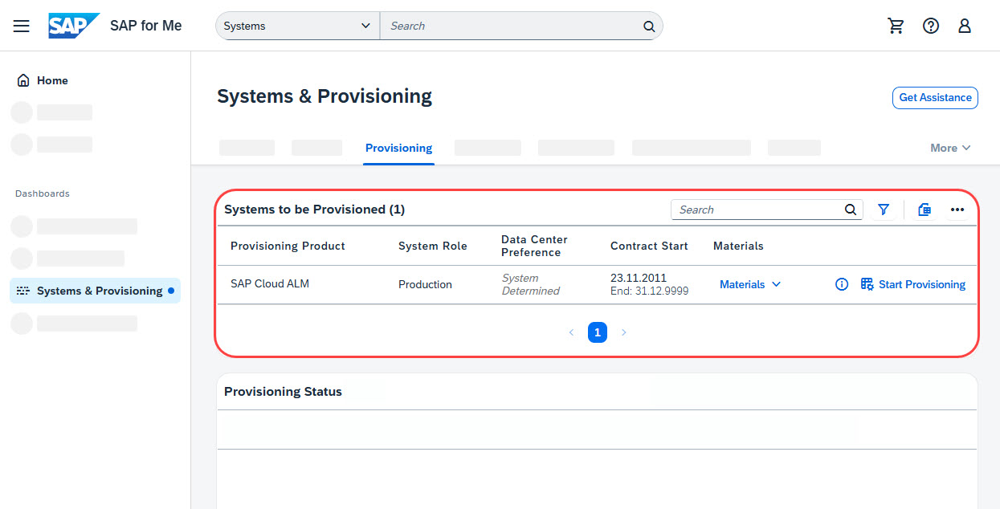
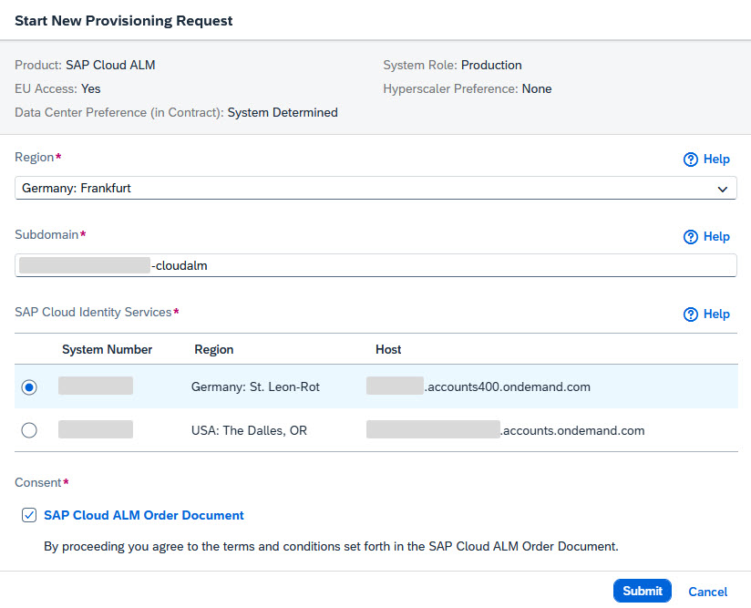
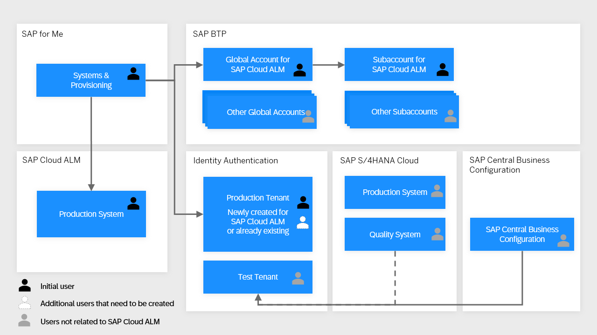

<!-- loio2ba35e64569342f097b825275248f744 -->

# Requesting SAP Cloud ALM

You can request SAP Cloud ALM on SAP for Me for yourself or for all entitled customers for whom you have sufficient permissions.

<a name="loio2ba35e64569342f097b825275248f744__section_wmw_l2n_dtb"/>

## Prerequisites

-   You have an S-user with the role `Edit Cloud Data` on SAP for Me.

    You can manage your users and authorizations by following the steps described in [Manage User Authorizations](https://help.sap.com/docs/SAP_FOR_ME/758e7c8a7c5b4782bb78b17f8c7fbbda/d39d0e5f8478403c85e483b9493a7bd2.html).

-   You're assigned to the customer number.

> ### Caution:  
> The S-user who requests SAP Cloud ALM receives permissions that are required for administrative tasks in the SAP BTP cockpit and in SAP Cloud ALM. In addition, the S-user is added to the Identity Authentication service \(IAS\) tenant.
> 
> Therefore, to avoid authorization issues during the configuration of SAP Cloud ALM, only carry out the following steps if you will later perform the configuration described in [Required Setup for SAP Cloud ALM](01_required_setup/required-setup-for-sap-cloud-alm-80b2c30.md).
> 
> If you request SAP Cloud ALM and then want to assign additional administrators who can perform the initial setup, see KBA [3248116](https://me.sap.com/notes/3248116).

<a name="loio2ba35e64569342f097b825275248f744__section_cxn_yp4_ytb"/>

## Procedure

1.  Open the [Systems & Provisioning](https://me.sap.com/systemsprovisioning/provisioning) dashboard on SAP for Me.

2.  Under *Products Available for Provisioning*, find your entitlement for SAP Cloud ALM.

    

3.  Choose *Start Provisioning*.

4.  Select the geographical region in which you would like to have SAP Cloud ALM provisioned. The region that you select here corresponds to the location of the data center where your SAP Cloud ALM tenant will be operated.

    The *Region* drop-down menu offers a complete list of all data center locations that are currently available for SAP Cloud ALM. To find out which data center locations are planned in the future, see [SAP Cloud ALM Data Centers](https://support.sap.com/en/alm/sap-cloud-alm.html?anchorId=section_1424572767_c) on SAP Support Portal.

    **EU Access**: If you have a valid EU Access contract, your SAP Cloud ALM entitlement is flagged accordingly in SAP for Me, enabling you to request the provisioning of your SAP Cloud ALM tenant in an EU Access data center. The region that allows for EU Access is labeled as such in the drop-down menu. Please note that to comply with EU Access requirements, you need to select an Identity Authentication tenant that is also located in Europe in step 6.

    After the system has been provisioned, **the region can't be changed**.

5.  Enter a unique subdomain name.

    The subdomain name is used for the creation of an SAP Cloud ALM-specific subaccount on SAP BTP. It's also part of the URL that is used to access SAP Cloud ALM, as in `https://<subdomain>.<region>.alm.cloud.sap`.

    After the tenant has been provisioned, **the subdomain can't be changed**.

    > ### Note:  
    > -   Don't use a pre-existing subdomain. Choose a new subdomain name specifically for SAP Cloud ALM.
    > 
    > -   Companies with multiple international subsidiaries or working in multiple industries should use different subdomains for each unit.
    > 
    > -   We strongly recommend using the suffix `-cloudalm` at the end of the subdomain name, for example, `company-cloudalm`.
    > 
    > -   Allowed characters for the name are lowercase letters, digits, and hyphens. The length of the name mustn't exceed 56 characters.

6.  Under *SAP Cloud Identity Services*, select an Identity Authentication tenant:

    -   If you don’t have an existing productive Identity Authentication tenant, a new one will be created for you in the region you've selected above.

        We recommend reusing this newly created productive Identity Authentication tenant for other productive SAP cloud offerings \(such as SAP S/4HANA Cloud\) that you may want to use in the future.

    -   If you already have a productive Identity Authentication tenant, select it from the list.

    > ### Tip:  
    > If you have multiple Identity Authentication tenants and you're unsure about which one to select, look up the administrators of the Identity Authentication tenants that are assigned to your customer ID at [https://iamtenants.accounts.cloud.sap](https://iamtenants.accounts.cloud.sap). The administrators can give you more guidance. Also, to simplify the maintenance of administrators in your Identity Authentication tenant, consider selecting an Identity Authentication tenant whose administrators will also govern the identity information for SAP Cloud ALM.
    > 
    > To ensure the best performance, we generally recommend selecting an Identity Authentication tenant in a region that is close to the region of your SAP Cloud ALM tenant. If you've selected the EU Access region, select an Identity Authentication tenant that is also located in Europe.
    > 
    > If none of the tenants are in your desired region, you can request to migrate a specific tenant by opening a case on the `BC-IAM-IDS` component. If you don't want to use any of the listed Identity Authentication tenants, you can request a new one as described in [Get Additional Tenant](https://help.sap.com/docs/cloud-identity-services/cloud-identity-services/get-your-tenant?version=Cloud#get-additional-tenant).
    > 
    > If you've already been working with an Identity Authentication tenant but it isn't listed here, it may not be a **productive** tenant or it may be assigned to a different customer ID.

    

7.  If you agree to the terms and conditions stated in the linked order document, mark the checkbox.

8.  Choose *Submit*.

<a name="loio2ba35e64569342f097b825275248f744__section_unp_kgc_kbc"/>

## Result

You've requested the provisioning of an SAP Cloud ALM tenant. Under *Provisioning Status*, you can track the progress of your request.

When the status is *Provisioning Triggered*, SAP automatically prepares your SAP Cloud ALM tenant:

-   The following SAP BTP entities are created:

    -   A new global account with the name “SAP Cloud ALM” followed by your customer number.

        A global account is the realization of a contract you made with SAP. It's region-independent, and it's used to manage subaccounts, members, entitlements, and quotas.

        In the case of SAP Cloud ALM, your entitlement is based on the existence of other contracts or purchased solutions that are connected to your customer number. The entitlement also comes with other parameters, such as fair use rights for memory, which are provided free of charge. These unique factors require a separate "contract" to be established specifically for SAP Cloud ALM, which is separated from the other contracts that you pay for. This is achieved by creating a separate global account for SAP Cloud ALM as part of the provisioning process.

    -   In the new global account, a subaccount with the name “SAP Cloud ALM” that contains your SAP Cloud ALM subscription and a subscription to the Cloud Integration Automation service.

        Subaccounts let you structure a global account according to your organization's and project's requirements with regard to members, authorizations, and entitlements.

    > ### Caution:  
    > You can't subscribe to any additional products or applications or to services that aren't related to SAP Cloud ALM in the subaccount containing your SAP Cloud ALM subscription. The global account and the subaccount are set up exclusively for SAP Cloud ALM.
    > 
    > Don't delete this subaccount or your SAP Cloud ALM subscription if you've already started using SAP Cloud ALM. Deleting your SAP Cloud ALM subscription causes **all created artifacts, stored data, and current configurations to be deleted** as well.

-   A mutual trust relationship between SAP Cloud ALM and the selected Identity Authentication tenant is established.

    

    If you want to know more about the role of SAP Cloud ALM and your Identity Authentication tenant in the context of SAP S/4HANA Cloud, see [Identity and Access Management](https://help.sap.com/docs/SAP_S4HANA_CLOUD/53e36b5493804bcdb3f6f14de8b487dd/c643b8e94c1e4d5ba675ce167d2926b1).

-   You receive emails containing sign in information, configuration guidance, and links to support resources.

-   You're automatically signed up for cloud email notifications. This way, you can stay informed and receive timely updates for SAP Cloud ALM. You can manage your notification settings in SAP for Me, as described in KBA [2900069](https://me.sap.com/notes/2900069).

<a name="loio2ba35e64569342f097b825275248f744__section_y3p_blh_kbc"/>

## Next Steps

A few more setup steps are required to set up and configure SAP Cloud ALM before it can be used productively.

To get started, follow the three steps described in [Required Setup for SAP Cloud ALM](01_required_setup/required-setup-for-sap-cloud-alm-80b2c30.md).

**Related Information**  

[SAP for Me Online Help](https://support.sap.com/content/s4m/help.html)

[Cloud Integration Automation Service](https://help.sap.com/docs/Cloud%20Integration%20Automation%20Service)

