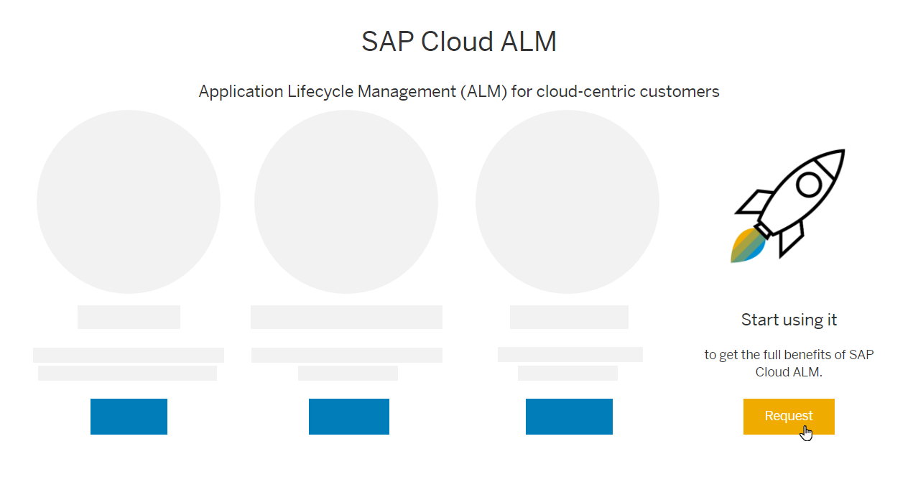
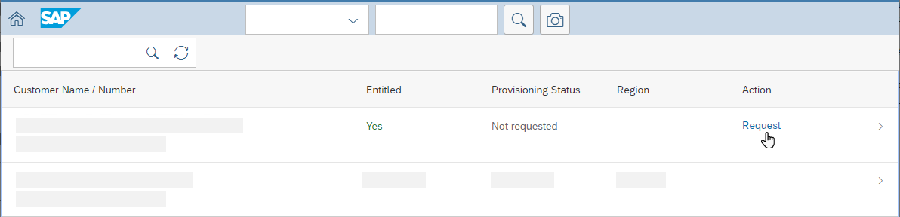
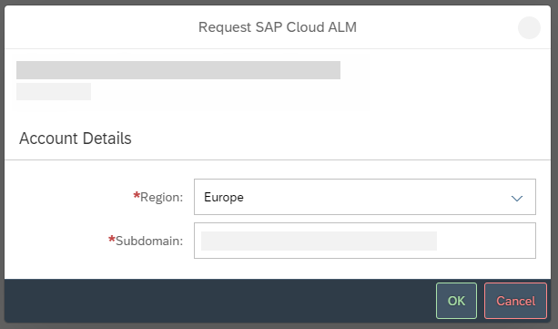
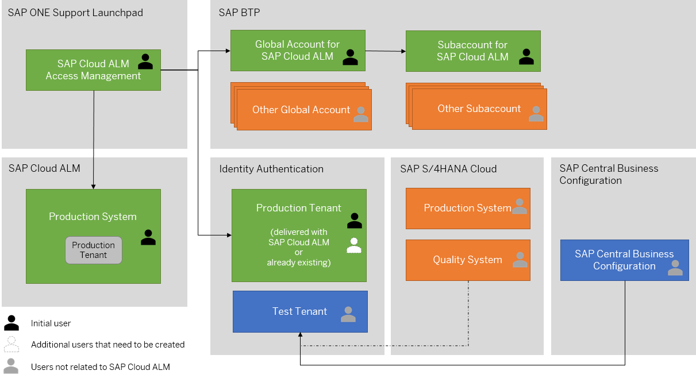

<!-- loio2ba35e64569342f097b825275248f744 -->

# Requesting SAP Cloud ALM

You can request SAP Cloud ALM in the *SAP Cloud ALM Access Management* app in SAP ONE Support Launchpad for all entitled customers you have sufficient permissions for.

> ### Caution:  
> The S-user who requests SAP Cloud ALM receives permissions that are required for administrative tasks in the SAP BTP cockpit and in SAP Cloud ALM. In addition, the S-user is added to the Identity Authentication service \(IAS\) tenant.
> 
> Therefore, to avoid authorization issues during the configuration of SAP Cloud ALM, only carry out the following steps if you will later perform the configuration described in [Required Setup for SAP Cloud ALM](01_required_setup/required-setup-for-sap-cloud-alm-80b2c30.md).

<a name="loio2ba35e64569342f097b825275248f744__section_pt2_2zh_gmb"/>

## Prerequisites

-   You have an S-user with at least one of the following authorizations:

    -   *Edit Authorizations* in the *User Data* section

    -   *Edit Cloud Data* in the *Cloud* section, for one or more installations

    You can verify that you have the required roles under [My Authorizations and Functions](https://launchpad.support.sap.com/#/user/authorizations).

-   You're assigned to the respective customer.

<a name="loio2ba35e64569342f097b825275248f744__section_pfx_fzh_gmb"/>

## Procedure

1.  Open [SAP Cloud ALM](https://support.sap.com/en/alm/sap-cloud-alm.html) on SAP Support Portal.

2.  Choose *Request*.

      

    This leads you directly to the *SAP Cloud ALM Access Management* app on SAP ONE Support Launchpad.

3.  Verify that your customer name and number are correct and that you're entitled to request SAP Cloud ALM.

    If you can't see your entitlement information here, you may be missing the required authorizations.

    To solve this issue, get in touch with your administrator. You can find the right contact under *My Important Contacts* in the message displayed above.

4.  Choose *Request*.

      

5.  If you agree to the terms and conditions, choose *Agree*.

6.  Select a region and enter a unique subdomain name.

      

    The subdomain name is used for the creation of an SAP Cloud ALM-specific subaccount in the SAP Cloud ALM-specific global account on SAP BTP. It's also part of the URL that is used to access SAP Cloud ALM, as in`https://<subdomain>.<region>.alm.cloud.sap`. Therefore, the subdomain name needs to be unique.

    **Don't use a pre-existing subdomain. Choose a new subdomain name specifically for SAP Cloud ALM.** 

    Please also keep the following recommendations and restrictions in mind when choosing a subdomain name:

    -   Companies with multiple international subsidiaries or working in multiple industries should use different subdomains for each unit.

    -   We strongly recommend using the suffix ***-cloudalm*** at the end of the subdomain name, for example, `company-cloudalm`.

    -   Allowed characters for the name are lowercase letters, digits, and hyphens.

    -   The length of the selected name must not exceed 65 characters.

    > ### Caution:  
    > The subdomain name can't be changed after the system has been provisioned.

    For more detailed information about how to choose a subdomain and about the onboarding process in the *SAP Cloud ALM Access Management* app in general, refer to the in-app help.

7.  When you choose *OK*, the app automatically prepares SAP Cloud ALM and creates the following entities \(see also graphic below\):

    -   A global account that contains your SAP Cloud ALM entitlement, with the name “SAP Cloud ALM”

        A global account is the realization of a contract you made with SAP. It's region-independent, and it's used to manage subaccounts, members, entitlements, and quotas.

    -   A subaccount that contains your SAP Cloud ALM subscription, with the name “SAP Cloud ALM”

        Subaccounts let you structure a global account according to your organization's and project's requirements with regard to members, authorizations, and entitlements.

        > ### Note:  
        > You can't subscribe to any additional applications in the subaccount containing your SAP Cloud ALM subscription. The subaccount is set up exclusively for SAP Cloud ALM.

    -   An organization

        An organization is an additional hierarchical level in the Cloud Foundry environment.

        The name of the organization is identical to the subdomain name. If the specified subdomain name doesn't contain the suffix ***-cloudalm***, this suffix is added to the organization name.

    -   An Identity Authentication tenant, serving as your identity provider \(if you don't already have one\)

        If you already have an Identity Authentication tenant from the SAP cloud service that you want to manage, it's automatically used as your identity provider for SAP Cloud ALM. For more information, refer to [Step 1: Onboard Users in Your Identity Authentication Service](01_required_setup/step-1-onboard-users-in-your-identity-authentication-service-f2a8a8c.md).

          

8.  You receive the following emails containing logon information, configuration instructions, and links to support resources:

    -   *Access Information for SAP Cloud ALM* from *SAP No Reply Provisioning*

    -   *Activate Your Account for Identity Authentication Service* from *notification@sapnetworkmail.com*

        \(This email is only sent to you if a new Identity Authentication tenant has been created for you. If you already had an Identity Authentication when you requested SAP Cloud ALM, you will not receive a new email.\)

