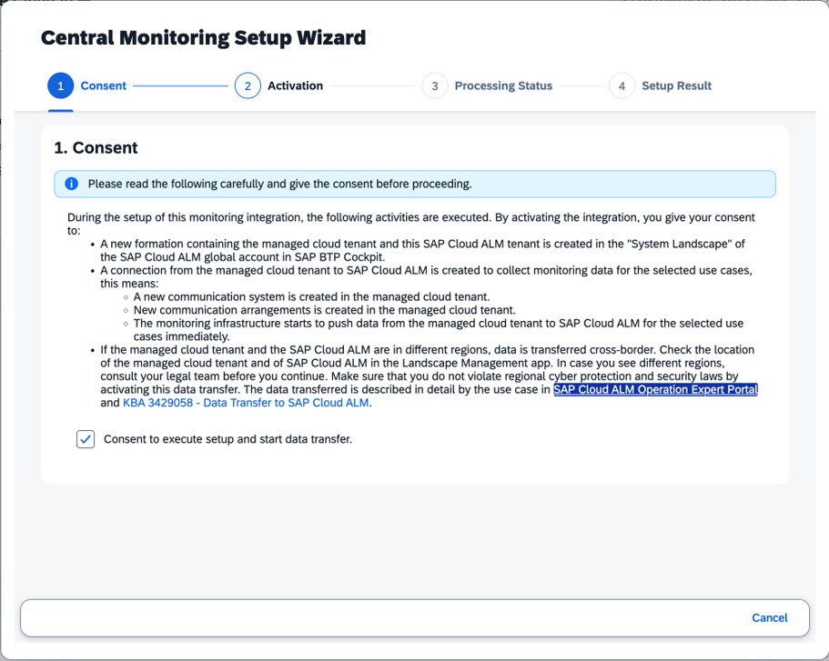

<!-- loio84602a521c5946f88a409b39587dd70e -->

# SAP S/4HANA Cloud Public Edition

This page explains how to connect SAP S/4HANA Cloud Public Edition to SAP Cloud ALM to enable monitoring.

Currently, SAP S/4HANA Cloud Public Edition supports the following monitoring applications:

-   [Business Process Monitoring](https://help.sap.com/docs/cloud-alm/applicationhelp/business-process-monitoring)
-   [Integration and Exception Monitoring](https://help.sap.com/docs/cloud-alm/applicationhelp/integration-exception-monitoring)
-   [Real User Monitoring](https://help.sap.com/docs/cloud-alm/applicationhelp/real-user-monitoring)
-   [Job and Automation Monitoring](https://help.sap.com/docs/cloud-alm/applicationhelp/job-automation-monitoring)
-   [Health Monitoring](https://help.sap.com/docs/cloud-alm/applicationhelp/health-monitoring)

<a name="loio84602a521c5946f88a409b39587dd70e__section_mzk_yn5_bhc"/>

## Standard Setup in SAP Cloud ALM

An automated standard setup is available for SAP S/4HANA Cloud public edition systems. must be imported from the backend; it will not work for manually created ones

**Prerequisite**: The system information has been imported from the SAP backend \(system landscape information\). In this case, the source is displayed as `SLIS` or `XSLIS`. The automatic setup doesn't work for system information that has been created manually in the *Landscape Management* app of SAP Cloud ALM.

To activate monitoring in SAP Cloud ALM, follow these steps:

1.  Open SAP S/4HANA Cloud public edition in the *Landscape Management* app in SAP Cloud ALM. Enable *Central Monitoring*. \(The toggle is only visible if the system information source is `SLIS` or `XSLIS`.

    

2.  In the dialog that opens, confirm consent and start the activation process.

    

3.  In the background, the following steps occur automatically:
    1.  In the SAP BTP cockpit, the system sets up formations between SAP Cloud ALM and SAP S/4HANA Cloud public edition.
    2.  The formation calls back to the *Landscape Management* service in SAP Cloud ALM. It retrieves the monitoring use cases and API key and forwards them to the *Communication Systems* management function in SAP S/4HANA Cloud public edition.
    3.  *Communication Systems* management creates the communication arrangements in SAP S/4HANA Cloud.

4.  In the *Landscape Management* service in SAP Cloud ALM, the supported use cases become active.

    

Adjust the monitoring setup within the monitoring apps in SAP Cloud ALM as needed. For more details on configuration, see [SAP Cloud ALM for Operations](https://help.sap.com/docs/cloud-alm/applicationhelp/operations).

**Deactivation**: Deactivate the connection in the Landscape Management service by toggling off central monitoring.

## Special Setup of SAP S/4HANA Cloud with a Different Customer Number

If your SAP S/4HANA Cloud system uses a different customer number than your SAP Cloud ALM system, register and activate it through central monitoring.

This scenario occurs, for example, if customers have a global CCC/ultimate setup where an S-user has access to several customer numbers.

In such cases, the SAP S/4HANA Cloud system doesn't appear automatically in the *System Landscape* application in the SAP BTP global account. The automatic central monitoring setup can't be used.

### Prerequisites

-   You have access to the SAP Cloud ALM global account in SAP BTP for your company.
-   You know details of the SAP S/4HANA Cloud system, such as the system name and URL.
-   You have the necessary authorizations in both SAP Cloud ALM and the SAP S/4HANA Cloud tenant to maintain system landscape, extensions, and integrations.

### 1. Manually add SAP S/4HANA Cloud to the System Landscape

1.  On SAP BTP, log in to your SAP Cloud ALM global account.
2.  Navigate to *System Landscape* and open *Systems*.
3.  Select *Add* to create a new system entry.
4.  For *System Type*, select *S/4HANA Cloud*.
5.  Enter a system name:
    -   You can use the system URL as the name.
    -   Alternatively, copy the system name from your landscape or documentation and paste it into the name field.

6.  Save the new system entry.

### 2. Generate a registration token for the system

1.  In the same system entry in *System Landscape*, go to the *Communication Scenario Group* section.
2.  Select *Get Token* to generate a registration token for SAP S/4HANA Cloud.
3.  Copy the generated registration token for later use.

### 3. Register SAP S/4HANA Cloud using the token

1.  Log on to the SAP S/4HANA Cloud target tenant you want to connect to SAP Cloud ALM.
2.  In the SAP S/4HANA Cloud Fiori launchpad, search for the app used to maintain integrations and extensions for SAP BTP.
3.  Open the app. Create a new entry for the extension or integration.
4.  Paste the registration token in the appropriate field.
5.  Enter a meaningful name and description. For example: “Cloud ALM integration for S/4HANA Cloud.”
6.  Save and create the extension. This establishes the registration and connection.
7.  Approve or activate the connection if prompted. The integration becomes active.

### 4. Verify that the system is registered in SAP Cloud ALM

1.  Return to your SAP Cloud ALM global account in SAP BTP.
2.  In the *Landscape Management* app of SAP Cloud ALM, under *System Landscape*, refresh the system list.
3.  Locate the system you created. It should now show as *Registered* and appear as a valid system in the list.
4.  Confirm that the system isn't yet included in any formations. This is expected before central monitoring activation.

### 5. Activate central monitoring setup

Now you can proceed with the standard setup that's described above, under [Standard Setup in SAP Cloud ALM](https://help.sap.com/docs/cloud-alm/setup-administration/sap-s4hana-cloud-public-edition#standard-setup-in-sap-cloud-alm).

<a name="loio84602a521c5946f88a409b39587dd70e__section_xlw_145_bhc"/>

## Troubleshooting

To resolve setup or data collection issues for SAP BTP, ABAP environment, see [Troubleshooting for ABAP Cloud-Based Systems](troubleshooting-for-abap-cloud-based-systems-85d30d1.md).

