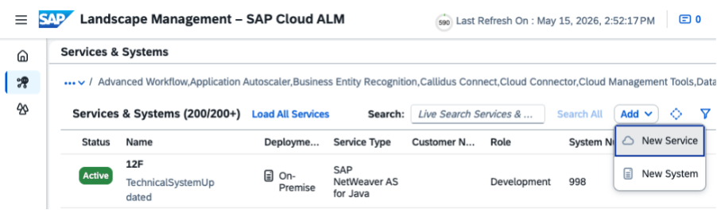
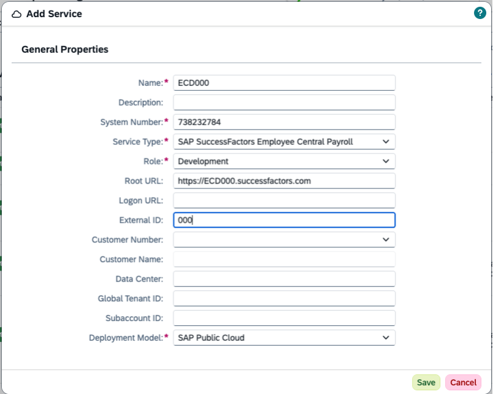

<!-- loiobd23fb3d11ca409d853623faed118c80 -->

# Transport Management Setup for Employee Central Payroll

How to enable SAP Cloud ALM as the transport management tool for your Employee Central Payroll \(ECP\) landscape.

## Raising a Request

Create a support ticket for component LOD-EC-ECP-OPS stating that you want to use SAP Cloud ALM for transport management on your ECP landscape.

Once the ticket is processed, you receive the system IDs for the 000 clients of your three ECP environments \(development, quality, production\).

## Configuring SAP Cloud ALM

Create the Landscape Management Service \(LMS\) entries in SAP Cloud ALM for all three 000 tenants \(DEV, QUA, PROD\) by using the provided system IDs.

For this configuration, you need to have the *Landscape Administrator* role.

1.  Open the *Landscape Management* app and select *Services & Systems*.

2.  Select *Add* \> *New Service*.

    

3.  Fill the following fields:

    ****

    <table>
    <tr>
    <th valign="top">

    Field
    
    </th>
    <th valign="top">

    Description
    
    </th>
    </tr>
    <tr>
    <td valign="top">
    
    Name
    
    </td>
    <td valign="top">
    
    <SID\><CLIENT\>, in our example SID: ECD and Client: 000
    
    </td>
    </tr>
    <tr>
    <td valign="top">
    
    System Number
    
    </td>
    <td valign="top">
    
    System ID shared by ECP Operations team
    
    </td>
    </tr>
    <tr>
    <td valign="top">
    
    Service Type
    
    </td>
    <td valign="top">
    
    SAP SuccessFactors Employee Central Payroll
    
    </td>
    </tr>
    <tr>
    <td valign="top">
    
    Role
    
    </td>
    <td valign="top">
    
    Role of the system \(development, test or production\)
    
    </td>
    </tr>
    <tr>
    <td valign="top">
    
    Root URL
    
    </td>
    <td valign="top">
    
    Root URL of the system
    
    </td>
    </tr>
    <tr>
    <td valign="top">
    
    External ID
    
    </td>
    <td valign="top">
    
    Client, in this case 000
    
    </td>
    </tr>
    <tr>
    <td valign="top">
    
    Deployment Model
    
    </td>
    <td valign="top">
    
    SAP Public Cloud
    
    </td>
    </tr>
    </table>
    
    

4.  Repeat the steps for your test and production system.

The LMS entries are a prerequisite for registering your ECP systems for the transport management use case in Cloud ALM. Without them, the registration cannot be performed.

Once the entries are created, provide the service key information \(client ID and credentials\) for your SAP Cloud ALM API instance to the ECP Operations team via the support ticket. The ECP Operations team requires these credentials to complete the technical setup on their side.

## Registering Working Tenants

After the ECP Operations team confirms the setup is complete, you need to perform the registration on your working ECP tenants \(DEV, QUA, PROD\) in SAP Cloud ALM.

During registration, enable the following transport management use case task:

-   Transports: Create & Export \(client-specific\): this allows you to create and release transports as well as create transport of copies directly from SAP Cloud ALM.

> ### Note:  
> *Downgrade Protection*and *Cross-reference Checks* are not supported for ECP systems.

