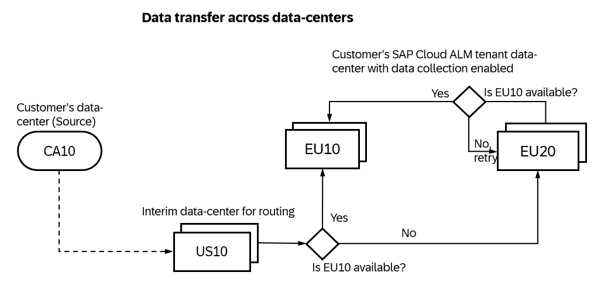

<!-- loio934c2a11ed5e417d85bc3bc4a2db9079 -->

# Using SAP-Managed Connectivity

The integration between SAP Cloud ALM and several SAP cloud services is orchestrated by SAP-Managed Connectivity.

This uses the [OpenTelemetry](https://support.sap.com/en/alm/sap-cloud-alm/operations/expert-portal/data-collection-infrastructure.html?anchorId=section)\(OTEL\)-based Data collection infrastructure to report monitoring data to SAP Cloud ALM. It is mandatory for you to give consent for the data exchange by activating monitoring in the respective monitoring application.

<a name="loio934c2a11ed5e417d85bc3bc4a2db9079__section_phx_1xz_qcc"/>

## SAP-Managed Connectivity

SAP-Managed Connectivity provides an automated connectivity setup and minimizes the latency. Data collection instrumentation takes care to implicitly connect the managed cloud data center to the nearest SAP Cloud ALM data center when routing the data to your customer SAP Cloud ALM tenant. The data is only routed through and not stored in the transit data centers. This sort of data transfer from one managed cloud data center to the target SAP Cloud ALM data center is a data transfer across data-centers and might cross regional borders.

> ### Note:  
> The data transfer from the managed cloud is enabled once you provide consent by turning on the data collection for that tenant in the SAP Cloud ALM tenant.

> ### Caution:  
> Cyber security laws are different for each region. Even if your data is transient in nature, the local laws and regulations of the regional data center must be obliged. Before you give your consent, please consult with your legal advisor.

*For example:* If the customer’s data center is in CA10 and data collection is enabled in EU10, the data is first routed to US10 \(nearest to CA10\) and then routed to EU10. If EU10 is temporarily not available, then the data is routed to an alternate data center and rerouted back when it is available. In this case it is EU20.

The below table provides an index of the managed cloud service data centers, the connected SAP Cloud ALM data center for data routing, and the alternative data centers for a fallback option. The alternative data center for resilience fallback option is for scenarios in which the connected SAP Cloud ALM data center for data routing is temporarily not available. Please note that this list is subjected to changes as data-centers are added.

<table>
<tr>
<td valign="top">

Managed Cloud Service Data Center \(Source\)\*

</td>
<td valign="top">

Connected SAP Cloud ALM Data Center for Data Routing

</td>
<td valign="top">

Alternative Data Center for Resilience Fallback Option

</td>
</tr>
<tr>
<td valign="top">

AP11

</td>
<td valign="top">

AP10

</td>
<td valign="top">

JP10

</td>
</tr>
<tr>
<td valign="top">

AP12

</td>
<td valign="top">

AP10

</td>
<td valign="top">

JP10

</td>
</tr>
<tr>
<td valign="top">

AP20

</td>
<td valign="top">

AP10

</td>
<td valign="top">

JP10

</td>
</tr>
<tr>
<td valign="top">

AP21

</td>
<td valign="top">

AP10

</td>
<td valign="top">

JP10

</td>
</tr>
<tr>
<td valign="top">

BR10

</td>
<td valign="top">

US10

</td>
<td valign="top">

EU20

</td>
</tr>
<tr>
<td valign="top">

CA10

</td>
<td valign="top">

US10

</td>
<td valign="top">

EU20

</td>
</tr>
<tr>
<td valign="top">

CH20

</td>
<td valign="top">

EU10

</td>
<td valign="top">

EU20

</td>
</tr>
<tr>
<td valign="top">

EU10

</td>
<td valign="top">

EU10

</td>
<td valign="top">

EU20

</td>
</tr>
<tr>
<td valign="top">

EU11

</td>
<td valign="top">

EU10

</td>
<td valign="top">

EU20

</td>
</tr>
<tr>
<td valign="top">

EU20

</td>
<td valign="top">

EU20

</td>
<td valign="top">

EU10

</td>
</tr>
<tr>
<td valign="top">

EU30

</td>
<td valign="top">

EU20

</td>
<td valign="top">

EU10

</td>
</tr>
<tr>
<td valign="top">

IN30

</td>
<td valign="top">

EU10

</td>
<td valign="top">

EU20

</td>
</tr>
<tr>
<td valign="top">

JP10

</td>
<td valign="top">

JP10

</td>
<td valign="top">

AP10

</td>
</tr>
<tr>
<td valign="top">

JP20

</td>
<td valign="top">

JP10

</td>
<td valign="top">

AP10

</td>
</tr>
<tr>
<td valign="top">

US10

</td>
<td valign="top">

US10

</td>
<td valign="top">

EU20

</td>
</tr>
<tr>
<td valign="top">

US20

</td>
<td valign="top">

US10

</td>
<td valign="top">

EU20

</td>
</tr>
<tr>
<td valign="top">

US21

</td>
<td valign="top">

US10

</td>
<td valign="top">

EU20

</td>
</tr>
<tr>
<td valign="top">

US30

</td>
<td valign="top">

US10

</td>
<td valign="top">

EU20

</td>
</tr>
</table>

\* The list of supported managed cloud services is increasing and so is the list of data centers where the supported service is rolled out. Please check the location of the managed cloud service in *Landscape Management* app.

