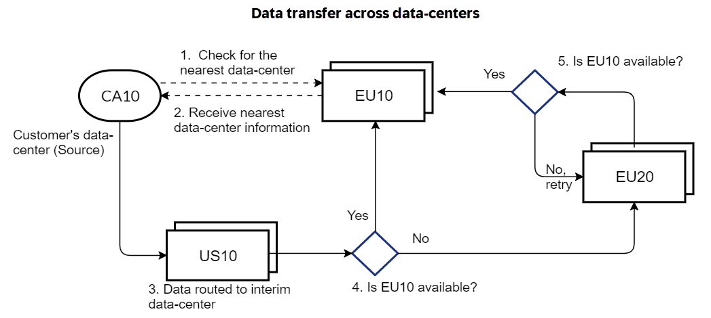

<!-- loio934c2a11ed5e417d85bc3bc4a2db9079 -->

# Using SAP-Managed Connectivity

The integration between SAP Cloud ALM and several SAP cloud services is orchestrated by SAP-Managed Connectivity.

This uses [OpenTelemetry](https://support.sap.com/en/alm/sap-cloud-alm/operations/expert-portal/data-collection-infrastructure.html?anchorId=section)\(OTEL\). Next Generation-based Data Collection Infrastructure \(NG-DCI\) to report monitoring data to SAP Cloud ALM. It is mandatory for you to give consent for the data exchange by activating monitoring in the respective monitoring application.

<a name="loio934c2a11ed5e417d85bc3bc4a2db9079__section_phx_1xz_qcc"/>

## SAP-Managed Connectivity

SAP-Managed Connectivity provides an automated connectivity setup and minimizes latency.

Data Collection Instrumentation connects the managed cloud data-center to the nearest SAP Cloud ALM data-center using the information in **Next Generation - Data Collection Infrastructure \(NG-DCI\)** to route the data to your customer SAP Cloud ALM tenant. To fetch this information, an initial communication is made to data collection infrastructure in SAP Cloud ALM **EU10** data-center.

Once the nearest SAP Cloud ALM data-center information is fetched, actual data routing calls are performed as mentioned in the table below. The data is only routed through and not stored in the transit data-centers. This sort of data transfer from one managed cloud data-center to the target SAP Cloud ALM data-center is a data transfer across data-centers and might cross regional borders.

> ### Note:  
> The data transfer from the managed cloud is enabled once you provide consent, that is, when you turn on the data collection for that tenant in the SAP Cloud ALM tenant.

> ### Caution:  
> Cyber security laws are different for each region. Even if your data is transient in nature, the local laws and regulations of the regional data-center must be obliged. Before you give your consent, please consult with your legal advisory.

*For example:* If the customer’s data-center is in CA10 and data collection is enabled in EU10, the following occurs:

1.  CA10 sends a request to EU10 for the information on the nearest data-center
2.  CA10 receives the information that US10 is the nearest data center.
3.  CA10 routes the data to its interim data-center, US10.
4.  US10 checks if EU10 is available to send the data, if not data is routed to EU20.
5.  EU20 checks if EU10 is available to send the data, else it retains the data and performs the check again after an interval.

The below table provides an index of the managed cloud service data-centers, the connected SAP Cloud ALM data-center for data routing, and the alternative data-centers for a fallback option. The alternative data-center for resilience fallback option is for scenarios in which the connected SAP Cloud ALM data-center for data routing is temporarily not available. Please note that this list is subjected to changes as data-centers are added.

> ### Note:  
> The data-centers in the following table are supported. The list is regularly updated to accommodate the supported data-centers.

<table>
<tr>
<td valign="top">

Managed Cloud Service Data-Center \(Source\)\*

</td>
<td valign="top">

Connected SAP Cloud ALM Data-Center for Data Routing

</td>
<td valign="top">

Alternative Data-Center for Resilience Fallback Option

</td>
</tr>
<tr>
<td valign="top">

AB3

</td>
<td valign="top">

US10-001

</td>
<td valign="top">

EU20

</td>
</tr>
<tr>
<td valign="top">

AM7

</td>
<td valign="top">

EU10

</td>
<td valign="top">

EU20

</td>
</tr>
<tr>
<td valign="top">

AP10

</td>
<td valign="top">

AP10

</td>
<td valign="top">

EU20

</td>
</tr>
<tr>
<td valign="top">

AP11

</td>
<td valign="top">

AP10

</td>
<td valign="top">

EU20

</td>
</tr>
<tr>
<td valign="top">

AP12

</td>
<td valign="top">

AP10

</td>
<td valign="top">

EU20

</td>
</tr>
<tr>
<td valign="top">

AP20

</td>
<td valign="top">

AP10

</td>
<td valign="top">

EU20

</td>
</tr>
<tr>
<td valign="top">

AP21

</td>
<td valign="top">

AP10

</td>
<td valign="top">

EU20

</td>
</tr>
<tr>
<td valign="top">

AP30

</td>
<td valign="top">

JP10

</td>
<td valign="top">

EU20

</td>
</tr>
<tr>
<td valign="top">

BR10

</td>
<td valign="top">

US10

</td>
<td valign="top">

EU20

</td>
</tr>
<tr>
<td valign="top">

CA10

</td>
<td valign="top">

CA10

</td>
<td valign="top">

EU20

</td>
</tr>
<tr>
<td valign="top">

CCC

</td>
<td valign="top">

CN20

</td>
<td valign="top">

CN20

</td>
</tr>
<tr>
<td valign="top">

CCE

</td>
<td valign="top">

EU20

</td>
<td valign="top">

EU10

</td>
</tr>
<tr>
<td valign="top">

CH20

</td>
<td valign="top">

EU10

</td>
<td valign="top">

EU20

</td>
</tr>
<tr>
<td valign="top">

CN20

</td>
<td valign="top">

CN20

</td>
<td valign="top">

CN20

</td>
</tr>
<tr>
<td valign="top">

CN40

</td>
<td valign="top">

CN20

</td>
<td valign="top">

CN20

</td>
</tr>
<tr>
<td valign="top">

CS1

</td>
<td valign="top">

US10-001

</td>
<td valign="top">

EU20

</td>
</tr>
<tr>
<td valign="top">

D10

</td>
<td valign="top">

AP10

</td>
<td valign="top">

EU20

</td>
</tr>
<tr>
<td valign="top">

D11

</td>
<td valign="top">

AP10

</td>
<td valign="top">

EU20

</td>
</tr>
<tr>
<td valign="top">

D17

</td>
<td valign="top">

CA10

</td>
<td valign="top">

EU20

</td>
</tr>
<tr>
<td valign="top">

DB1

</td>
<td valign="top">

EU20

</td>
<td valign="top">

EU10

</td>
</tr>
<tr>
<td valign="top">

DC4

</td>
<td valign="top">

US10-001

</td>
<td valign="top">

EU20

</td>
</tr>
<tr>
<td valign="top">

EU1

</td>
<td valign="top">

EU20

</td>
<td valign="top">

EU10

</td>
</tr>
<tr>
<td valign="top">

EU10

</td>
<td valign="top">

EU10

</td>
<td valign="top">

EU20

</td>
</tr>
<tr>
<td valign="top">

EU10-001

</td>
<td valign="top">

EU10

</td>
<td valign="top">

EU20

</td>
</tr>
<tr>
<td valign="top">

EU10-002

</td>
<td valign="top">

EU10

</td>
<td valign="top">

EU20

</td>
</tr>
<tr>
<td valign="top">

EU10-003

</td>
<td valign="top">

EU10

</td>
<td valign="top">

EU20

</td>
</tr>
<tr>
<td valign="top">

EU10-004

</td>
<td valign="top">

EU10-004

</td>
<td valign="top">

EU20

</td>
</tr>
<tr>
<td valign="top">

EU10-005

</td>
<td valign="top">

EU10

</td>
<td valign="top">

EU20

</td>
</tr>
<tr>
<td valign="top">

EU11

</td>
<td valign="top">

EU10

</td>
<td valign="top">

EU20

</td>
</tr>
<tr>
<td valign="top">

EU12

</td>
<td valign="top">

EU12

</td>
<td valign="top">

EU20

</td>
</tr>
<tr>
<td valign="top">

EU12-001

</td>
<td valign="top">

EU12

</td>
<td valign="top">

EU20

</td>
</tr>
<tr>
<td valign="top">

EU12-002

</td>
<td valign="top">

EU12

</td>
<td valign="top">

EU20

</td>
</tr>
<tr>
<td valign="top">

EU20

</td>
<td valign="top">

EU20

</td>
<td valign="top">

EU10

</td>
</tr>
<tr>
<td valign="top">

EU20-001

</td>
<td valign="top">

EU20

</td>
<td valign="top">

EU10

</td>
</tr>
<tr>
<td valign="top">

EU21

</td>
<td valign="top">

EU20

</td>
<td valign="top">

EU10

</td>
</tr>
<tr>
<td valign="top">

EU30

</td>
<td valign="top">

EU20

</td>
<td valign="top">

EU10

</td>
</tr>
<tr>
<td valign="top">

FR4

</td>
<td valign="top">

EU10

</td>
<td valign="top">

EU20

</td>
</tr>
<tr>
<td valign="top">

IL30

</td>
<td valign="top">

EU10

</td>
<td valign="top">

EU20

</td>
</tr>
<tr>
<td valign="top">

IN30

</td>
<td valign="top">

EU10

</td>
<td valign="top">

EU20

</td>
</tr>
<tr>
<td valign="top">

JP10

</td>
<td valign="top">

JP10

</td>
<td valign="top">

EU20

</td>
</tr>
<tr>
<td valign="top">

JP20

</td>
<td valign="top">

JP10

</td>
<td valign="top">

EU20

</td>
</tr>
<tr>
<td valign="top">

JP30

</td>
<td valign="top">

JP10

</td>
<td valign="top">

EU20

</td>
</tr>
<tr>
<td valign="top">

RI1

</td>
<td valign="top">

EU20

</td>
<td valign="top">

EU10

</td>
</tr>
<tr>
<td valign="top">

SA30

</td>
<td valign="top">

EU20

</td>
<td valign="top">

EU10

</td>
</tr>
<tr>
<td valign="top">

SA31

</td>
<td valign="top">

EU10

</td>
<td valign="top">

EU20

</td>
</tr>
<tr>
<td valign="top">

SH6

</td>
<td valign="top">

CN20

</td>
<td valign="top">

CN20

</td>
</tr>
<tr>
<td valign="top">

SP3

</td>
<td valign="top">

US10-001

</td>
<td valign="top">

EU20

</td>
</tr>
<tr>
<td valign="top">

STL

</td>
<td valign="top">

US10-001

</td>
<td valign="top">

EU20

</td>
</tr>
<tr>
<td valign="top">

TO2

</td>
<td valign="top">

CA10

</td>
<td valign="top">

EU20

</td>
</tr>
<tr>
<td valign="top">

TYO

</td>
<td valign="top">

JP10

</td>
<td valign="top">

EU20

</td>
</tr>
<tr>
<td valign="top">

US10

</td>
<td valign="top">

US10-001

</td>
<td valign="top">

EU20

</td>
</tr>
<tr>
<td valign="top">

US10-001

</td>
<td valign="top">

US10-001

</td>
<td valign="top">

EU20

</td>
</tr>
<tr>
<td valign="top">

US10-002

</td>
<td valign="top">

US10-001

</td>
<td valign="top">

EU20

</td>
</tr>
<tr>
<td valign="top">

US20

</td>
<td valign="top">

US10

</td>
<td valign="top">

EU20

</td>
</tr>
<tr>
<td valign="top">

US11

</td>
<td valign="top">

US10-001

</td>
<td valign="top">

EU20

</td>
</tr>
<tr>
<td valign="top">

US20

</td>
<td valign="top">

US10-001

</td>
<td valign="top">

EU20

</td>
</tr>
<tr>
<td valign="top">

US21

</td>
<td valign="top">

US10-001

</td>
<td valign="top">

EU20

</td>
</tr>
<tr>
<td valign="top">

US30

</td>
<td valign="top">

US10-001

</td>
<td valign="top">

EU20

</td>
</tr>
<tr>
<td valign="top">

WD4

</td>
<td valign="top">

EU10

</td>
<td valign="top">

EU20

</td>
</tr>
</table>

\* The list of supported managed cloud services is increasing and so is the list of data-centers where the supported service is rolled out. Please check the location of the managed cloud service in *Landscape Management* app.

